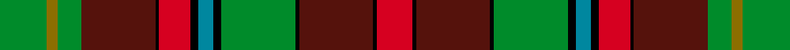
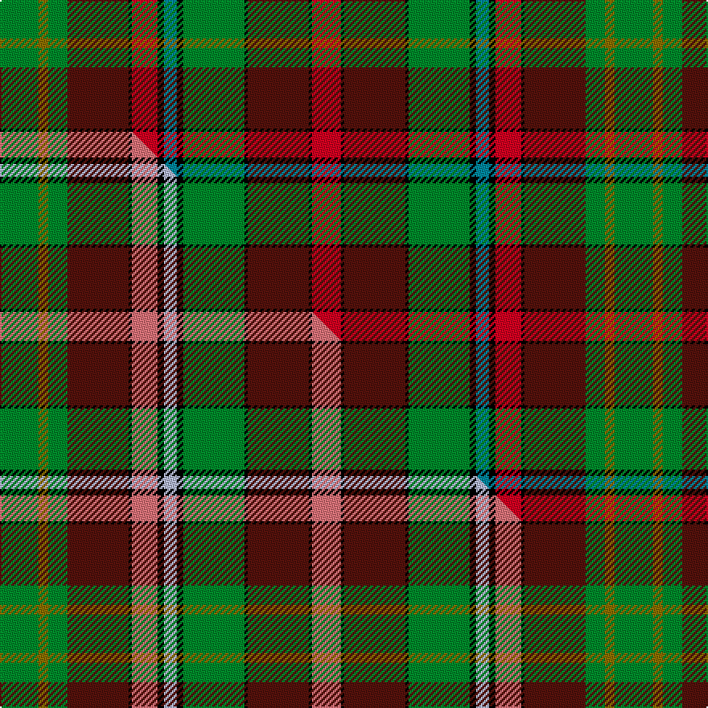

This page is one **sett** — a single exact thread-count. It belongs to the [tartan](/setts/g12y3g6dr19k1r8k2t4k2g19k1dr19k1r9/)
(the same proportion at any scale), whose colour order is pattern [GGGBKRKBKGKBKR](/stripes/gggbkrkbkgkbkr/).

Part of the [Golden Broom](/tartans/golden-broom/) tartan — the named design grouping this sett with its other cloths.

Sourced from register-of-tartans.  It is a [14 stripe tartan](/stripes/stripes14/).

Original link https://www.tartanregister.gov.uk/tartanDetails.aspx?ref=5845

## Register references

External register numbers recorded for this tartan.

- Scottish Register of Tartans: [5845](https://www.tartanregister.gov.uk/tartanDetails.aspx?ref=5845)
- Scottish Tartans World Register: 3125

## Thread count
G/24 Y6 G12 DR38 K2 R16 K4 T8 K4 G38 K2 DR38 K2 R/18

One full sett is **382 threads**.

## Palette
<table><thead><tr><th>Colour</th><th>Shade</th><th>OKLCh</th></tr></thead><tbody><tr><td>T</td><td><code style="background-color:#00879F;">#00879F</code> <small style="color:#888">#00879F</small></td><td><small style="color:#888">oklch(57.4% 0.102 216.1)</small></td></tr><tr><td>DR</td><td><code style="background-color:#55120C;">#55120C</code> <small style="color:#888">#55120C</small></td><td><small style="color:#888">oklch(30.0% 0.099 29.3)</small></td></tr><tr><td>G</td><td><code style="background-color:#008B2A;">#008B2A</code> <small style="color:#888">#008B2A</small></td><td><small style="color:#888">oklch(55.4% 0.170 145.9)</small></td></tr><tr><td>K</td><td><code style="background-color:#000000;">#000000</code> <small style="color:#888">#000000</small></td><td><small style="color:#888">oklch(0.0% 0.000 0.0)</small></td></tr><tr><td>R</td><td><code style="background-color:#D60020;">#D60020</code> <small style="color:#888">#D60020</small></td><td><small style="color:#888">oklch(55.2% 0.224 25.5)</small></td></tr><tr><td>Y</td><td><code style="background-color:#8B6E00;">#8B6E00</code> <small style="color:#888">#8B6E00</small></td><td><small style="color:#888">oklch(55.1% 0.113 90.4)</small></td></tr></tbody></table>

# Sample pattern

## Compared to the master

This cloth is one sett of its design; the master sett (the exemplar the design is anchored on) is below for comparison.

Its **ΔTartan distance** from the master is **0.08** — the same measure the nearest-tartans table ranks by (0 is identical; a re-scale of the same cloth is near 0, a recolour or a different proportion further).

<figure class="master-compare" style="margin:0">

this sett
master sett ★

<figcaption style="color:#888;font-size:smaller">One weave of this sett against the <a href="/setts/g12y3g6dr19k1r8k2lb4k2g19k1dr19k1r9/">master sett ★</a>, split on the diagonal: a shared proportion runs seamlessly across it with only the shades shifting; a different proportion breaks on it.</figcaption>
</figure>

## Nearest tartan variants

The nearest existing variants by ΔTartan distance, with this cloth at the top so the swatches line up against it.

ΔTartan

Threads

Variant

Sett

—

382

<a href="/variants/s14/g12y3g6dr19k1r8k2t4k2g19k1dr19k1r9~x2/">Golden Broom #2</a>

<a href="/ttd/edit/#slug=g12y3g6dr19k1r8k2lb4k2g19k1dr19k1r9~x2&amp;base=g12y3g6dr19k1r8k2t4k2g19k1dr19k1r9~x2" title="compare in the TTD">0.02</a>

382

<a href="/variants/s14/g12y3g6dr19k1r8k2lb4k2g19k1dr19k1r9~x2/">Golden Broom (Corporate)</a>

<a href="/ttd/edit/#slug=g12y3g6dr19k1r8k2lb4k2g19k1dr19k1r9~x2~r2806019&amp;base=g12y3g6dr19k1r8k2t4k2g19k1dr19k1r9~x2" title="compare in the TTD">0.08</a>

382

<a href="/variants/s14/g12y3g6dr19k1r8k2lb4k2g19k1dr19k1r9~x2~r2806019/">Golden Broom</a>

<a href="/ttd/edit/#slug=y2r15y2dr2y2k14y2g10w1g6w1g10y2r7g10w1~x2&amp;base=g12y3g6dr19k1r8k2t4k2g19k1dr19k1r9~x2" title="compare in the TTD">2.52</a>

342

<a href="/variants/s16/y2r15y2dr2y2k14y2g10w1g6w1g10y2r7g10w1~x2/">Dalrymple of Castleton #2</a>

<a href="/ttd/edit/#slug=r2lb6r1dy14r1dy14r1k6dg10ly1dg2ly2~x2~dg1403152-ly2705081&amp;base=g12y3g6dr19k1r8k2t4k2g19k1dr19k1r9~x2" title="compare in the TTD">2.71</a>

232

<a href="/variants/s12/r2lb6r1dy14r1dy14r1k6dg10ly1dg2ly2~x2~dg1403152-ly2705081/">Ogg of Tarragann Hunting</a>

<a href="/ttd/edit/#slug=do18k2do2k2do9g10dy2g10dp11k9dp2k2dp1r3~x2&amp;base=g12y3g6dr19k1r8k2t4k2g19k1dr19k1r9~x2" title="compare in the TTD">2.72</a>

290

<a href="/variants/s14/do18k2do2k2do9g10dy2g10dp11k9dp2k2dp1r3~x2/">Hay Gray (Personal)</a>

<a href="/ttd/edit/#slug=k10r26k2r4k2r26k3dg36k3g30k3y2~y2400000&amp;base=g12y3g6dr19k1r8k2t4k2g19k1dr19k1r9~x2" title="compare in the TTD">2.74</a>

282

<a href="/variants/s12/k10r26k2r4k2r26k3dg36k3g30k3y2~y2400000/">Pope Welsh Name Tartan</a>

<a href="/ttd/edit/#slug=dr27g20k7w3dy3dr2dy3w3dy6dp6k2dr3dy4dp3~x2&amp;base=g12y3g6dr19k1r8k2t4k2g19k1dr19k1r9~x2" title="compare in the TTD">2.75</a>

308

<a href="/variants/s14/dr27g20k7w3dy3dr2dy3w3dy6dp6k2dr3dy4dp3~x2/">Roman Family Tribute (Personal)</a>

<a href="/ttd/edit/#slug=r2lb6r1dy14r1dy14r1k6g10ly1g2ly2~x2&amp;base=g12y3g6dr19k1r8k2t4k2g19k1dr19k1r9~x2" title="compare in the TTD">2.75</a>

232

<a href="/variants/s12/r2lb6r1dy14r1dy14r1k6g10ly1g2ly2~x2/">Ogg of Tarragann Hunting (Personal)</a>

<a href="/ttd/edit/#slug=o5k3w2r20db10g2w1r1g20k4o3~x2&amp;base=g12y3g6dr19k1r8k2t4k2g19k1dr19k1r9~x2" title="compare in the TTD">2.80</a>

268

<a href="/variants/s11/o5k3w2r20db10g2w1r1g20k4o3~x2/">MacCullough Family Tartan</a>

<a href="/ttd/edit/#slug=r5k3g22k3y3dp7r7k2dp4w2dp4r7k2r7y3k3g22k2~x2&amp;base=g12y3g6dr19k1r8k2t4k2g19k1dr19k1r9~x2" title="compare in the TTD">2.87</a>

418

<a href="/variants/s18/r5k3g22k3y3dp7r7k2dp4w2dp4r7k2r7y3k3g22k2~x2/">Derbyshire</a>

## Neighbour map

Every grey dot is one of 13620 variants placed by the first two principal components of the ΔTartan feature space (42% of its variance). Red is this tartan; blue dots are its nearest — click one to open its page.

<svg viewBox="0 0 640 380" role="img" style="max-width:100%;height:auto;border:1px solid #e0e0e0;border-radius:4px;display:block" xmlns="http://www.w3.org/2000/svg"><image href="/nn/cloud.v1.png" width="640" height="380"/><a href="/variants/s14/g12y3g6dr19k1r8k2lb4k2g19k1dr19k1r9~x2/"><circle cx="146.3" cy="110.6" r="4" fill="#3465a4"><title>Golden Broom (Corporate)</title></circle></a><a href="/variants/s14/g12y3g6dr19k1r8k2lb4k2g19k1dr19k1r9~x2~r2806019/"><circle cx="138.7" cy="109.8" r="4" fill="#3465a4"><title>Golden Broom</title></circle></a><a href="/variants/s16/y2r15y2dr2y2k14y2g10w1g6w1g10y2r7g10w1~x2/"><circle cx="129.1" cy="112.4" r="4" fill="#3465a4"><title>Dalrymple of Castleton #2</title></circle></a><a href="/variants/s12/r2lb6r1dy14r1dy14r1k6dg10ly1dg2ly2~x2~dg1403152-ly2705081/"><circle cx="185.4" cy="122.9" r="4" fill="#3465a4"><title>Ogg of Tarragann Hunting</title></circle></a><a href="/variants/s14/do18k2do2k2do9g10dy2g10dp11k9dp2k2dp1r3~x2/"><circle cx="140.7" cy="125.6" r="4" fill="#3465a4"><title>Hay Gray (Personal)</title></circle></a><a href="/variants/s12/k10r26k2r4k2r26k3dg36k3g30k3y2~y2400000/"><circle cx="160.3" cy="113.6" r="4" fill="#3465a4"><title>Pope Welsh Name Tartan</title></circle></a><a href="/variants/s14/dr27g20k7w3dy3dr2dy3w3dy6dp6k2dr3dy4dp3~x2/"><circle cx="124.0" cy="111.3" r="4" fill="#3465a4"><title>Roman Family Tribute (Personal)</title></circle></a><a href="/variants/s12/r2lb6r1dy14r1dy14r1k6g10ly1g2ly2~x2/"><circle cx="163.0" cy="117.1" r="4" fill="#3465a4"><title>Ogg of Tarragann Hunting (Personal)</title></circle></a><a href="/variants/s11/o5k3w2r20db10g2w1r1g20k4o3~x2/"><circle cx="111.7" cy="101.0" r="4" fill="#3465a4"><title>MacCullough Family Tartan</title></circle></a><a href="/variants/s18/r5k3g22k3y3dp7r7k2dp4w2dp4r7k2r7y3k3g22k2~x2/"><circle cx="117.0" cy="106.5" r="4" fill="#3465a4"><title>Derbyshire</title></circle></a><circle cx="152.5" cy="113.0" r="5" fill="#c00000"/><text x="320" y="376" text-anchor="middle" font-size="11" fill="#999">ground</text><text x="11" y="190" text-anchor="middle" font-size="11" fill="#999" transform="rotate(-90 11 190)">complexity</text></svg>

ID: /variants/s14/g12y3g6dr19k1r8k2t4k2g19k1dr19k1r9~x2/
