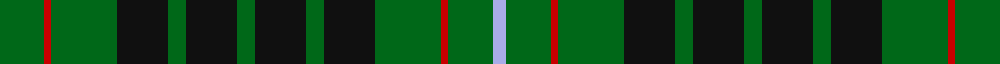

This page is one **sett** — a single exact thread-count. It belongs to the [tartan](/setts/g13r2g19k15g5k15g5k15g5k15g19r2g13lb4/)
(the same proportion at any scale), whose colour order is pattern [GRGKGKGKGKGRGW](/stripes/grgkgkgkgkgrgw/).

Part of the [Strath Hallidale](/tartans/strath-hallidale/) tartan — the named design grouping this sett with its other cloths.

Sourced from register-of-tartans.  It is a [14 stripe tartan](/stripes/stripes14/).

Original link https://www.tartanregister.gov.uk/tartanDetails.aspx?ref=3977

## Register references

External register numbers recorded for this tartan.

- Scottish Register of Tartans: [3977](https://www.tartanregister.gov.uk/tartanDetails.aspx?ref=3977)
- Scottish Tartans Authority (ITI): 2570
- Scottish Tartans World Register: 2570

## Thread count
Ga/26 R4 Ga38 K30 Ga10 K30 Ga10 K30 Ga10 K30 Ga38 R4 Ga26 LP/8

One full sett is **554 threads**.

## Palette

Palette: <strong>Tartan Register</strong>
<table><thead><tr><th>Colour</th><th>Threads</th><th>Shade</th><th>Base</th><th>OKLCh</th></tr></thead><tbody><tr><td>Ga/</td><td style="text-align:right;font-variant-numeric:tabular-nums">26</td><td><code style="background-color:#006818;">#006818</code> <small style="color:#888">#006818</small></td><td>G <code style="background-color:#006100;">#006100</code></td><td><small style="color:#888">oklch(45.0% 0.142 145.0)</small></td></tr><tr><td>R</td><td style="text-align:right;font-variant-numeric:tabular-nums">4</td><td><code style="background-color:#C80000;">#C80000</code> <small style="color:#888">#C80000</small></td><td>R <code style="background-color:#CC0000;">#CC0000</code></td><td><small style="color:#888">oklch(52.3% 0.215 29.2)</small></td></tr><tr><td>Ga</td><td style="text-align:right;font-variant-numeric:tabular-nums">38</td><td><code style="background-color:#006818;">#006818</code> <small style="color:#888">#006818</small></td><td>G <code style="background-color:#006100;">#006100</code></td><td><small style="color:#888">oklch(45.0% 0.142 145.0)</small></td></tr><tr><td>K</td><td style="text-align:right;font-variant-numeric:tabular-nums">30</td><td><code style="background-color:#101010;">#101010</code> <small style="color:#888">#101010</small></td><td>K <code style="background-color:#000000;">#000000</code></td><td><small style="color:#888">oklch(17.3% 0.000 89.9)</small></td></tr><tr><td>Ga</td><td style="text-align:right;font-variant-numeric:tabular-nums">10</td><td><code style="background-color:#006818;">#006818</code> <small style="color:#888">#006818</small></td><td>G <code style="background-color:#006100;">#006100</code></td><td><small style="color:#888">oklch(45.0% 0.142 145.0)</small></td></tr><tr><td>K</td><td style="text-align:right;font-variant-numeric:tabular-nums">30</td><td><code style="background-color:#101010;">#101010</code> <small style="color:#888">#101010</small></td><td>K <code style="background-color:#000000;">#000000</code></td><td><small style="color:#888">oklch(17.3% 0.000 89.9)</small></td></tr><tr><td>Ga</td><td style="text-align:right;font-variant-numeric:tabular-nums">10</td><td><code style="background-color:#006818;">#006818</code> <small style="color:#888">#006818</small></td><td>G <code style="background-color:#006100;">#006100</code></td><td><small style="color:#888">oklch(45.0% 0.142 145.0)</small></td></tr><tr><td>K</td><td style="text-align:right;font-variant-numeric:tabular-nums">30</td><td><code style="background-color:#101010;">#101010</code> <small style="color:#888">#101010</small></td><td>K <code style="background-color:#000000;">#000000</code></td><td><small style="color:#888">oklch(17.3% 0.000 89.9)</small></td></tr><tr><td>Ga</td><td style="text-align:right;font-variant-numeric:tabular-nums">10</td><td><code style="background-color:#006818;">#006818</code> <small style="color:#888">#006818</small></td><td>G <code style="background-color:#006100;">#006100</code></td><td><small style="color:#888">oklch(45.0% 0.142 145.0)</small></td></tr><tr><td>K</td><td style="text-align:right;font-variant-numeric:tabular-nums">30</td><td><code style="background-color:#101010;">#101010</code> <small style="color:#888">#101010</small></td><td>K <code style="background-color:#000000;">#000000</code></td><td><small style="color:#888">oklch(17.3% 0.000 89.9)</small></td></tr><tr><td>Ga</td><td style="text-align:right;font-variant-numeric:tabular-nums">38</td><td><code style="background-color:#006818;">#006818</code> <small style="color:#888">#006818</small></td><td>G <code style="background-color:#006100;">#006100</code></td><td><small style="color:#888">oklch(45.0% 0.142 145.0)</small></td></tr><tr><td>R</td><td style="text-align:right;font-variant-numeric:tabular-nums">4</td><td><code style="background-color:#C80000;">#C80000</code> <small style="color:#888">#C80000</small></td><td>R <code style="background-color:#CC0000;">#CC0000</code></td><td><small style="color:#888">oklch(52.3% 0.215 29.2)</small></td></tr><tr><td>Ga</td><td style="text-align:right;font-variant-numeric:tabular-nums">26</td><td><code style="background-color:#006818;">#006818</code> <small style="color:#888">#006818</small></td><td>G <code style="background-color:#006100;">#006100</code></td><td><small style="color:#888">oklch(45.0% 0.142 145.0)</small></td></tr><tr><td>LP/</td><td style="text-align:right;font-variant-numeric:tabular-nums">8</td><td><code style="background-color:#A8ACE8;">#A8ACE8</code> <small style="color:#888">#A8ACE8</small></td><td>W <code style="background-color:#F7F7F7;">#F7F7F7</code></td><td><small style="color:#888">oklch(76.3% 0.086 281.2)</small></td></tr></tbody></table>

## Nearest tartans

The nearest existing variants by ΔTartan distance, with this tartan at the top so the swatches line up against it.

ΔTartan

Tartan

Sett

—

<a href="/ttd/edit/#slug=g13r2g19k15g5k15g5k15g5k15g19r2g13lb4~x2">Strath Hallidale (Sutherland)</a> <a class="nn-out" href="/variants/s14/g13r2g19k15g5k15g5k15g5k15g19r2g13lb4~x2/" title="open its dictionary page">↗</a>

1.13

<a href="/ttd/edit/#slug=g7k12g12k9r3k9g20k16g7b3~x2&amp;base=g13r2g19k15g5k15g5k15g5k15g19r2g13lb4~x2">Holman (Personal)</a> <a class="nn-out" href="/variants/s10/g7k12g12k9r3k9g20k16g7b3~x2/" title="open its dictionary page">↗</a>

1.18

<a href="/ttd/edit/#slug=g5k15g5k15g19r2g13lb4~x2&amp;base=g13r2g19k15g5k15g5k15g5k15g19r2g13lb4~x2">Strath Hallidale (Fashion)</a> <a class="nn-out" href="/variants/s8/g5k15g5k15g19r2g13lb4~x2/" title="open its dictionary page">↗</a>

1.21

<a href="/ttd/edit/#slug=g9k1g2k2g2db7g9r2g9db9g7k1r3~x4&amp;base=g13r2g19k15g5k15g5k15g5k15g19r2g13lb4~x2">Moncrieff of Atholl</a> <a class="nn-out" href="/variants/s13/g9k1g2k2g2db7g9r2g9db9g7k1r3~x4/" title="open its dictionary page">↗</a>

1.22

<a href="/ttd/edit/#slug=g25k4g4k4g4k26g25r9g25k26g25k2r9~x2&amp;base=g13r2g19k15g5k15g5k15g5k15g19r2g13lb4~x2">Moncrieffe (1998)</a> <a class="nn-out" href="/variants/s13/g25k4g4k4g4k26g25r9g25k26g25k2r9~x2/" title="open its dictionary page">↗</a>

1.39

<a href="/ttd/edit/#slug=dg8k1ly2k1dg8db4dg8k1ly2k1dg8db5~x4&amp;base=g13r2g19k15g5k15g5k15g5k15g19r2g13lb4~x2">Salvation Army Hunting</a> <a class="nn-out" href="/variants/s12/dg8k1ly2k1dg8db4dg8k1ly2k1dg8db5~x4/" title="open its dictionary page">↗</a>

1.39

<a href="/ttd/edit/#slug=k8ly1k4dg1k4w1k4dg1k1dg6k1dg6k1dg1~x4&amp;base=g13r2g19k15g5k15g5k15g5k15g19r2g13lb4~x2">MacAlpine</a> <a class="nn-out" href="/variants/s14/k8ly1k4dg1k4w1k4dg1k1dg6k1dg6k1dg1~x4/" title="open its dictionary page">↗</a>

1.44

<a href="/ttd/edit/#slug=g6k16r3k16g28k4g12w3~x2&amp;base=g13r2g19k15g5k15g5k15g5k15g19r2g13lb4~x2">MacAulay of Lewis</a> <a class="nn-out" href="/variants/s8/g6k16r3k16g28k4g12w3~x2/" title="open its dictionary page">↗</a>

1.47

<a href="/variants/s10/k20t2k6g16dp4k9~x2/">Wilson's No.167</a>

1.48

<a href="/variants/s18/db12w2db7g15k2g4k2g15db2k7~x2/">Smeaton (Wedding) #2</a>

1.49

<a href="/ttd/edit/#slug=k3dg10ly2dg10k9dg2k9dg10r2dg10k3dg2k5dg2k5dg2~x2&amp;base=g13r2g19k15g5k15g5k15g5k15g19r2g13lb4~x2">Stuart/Stewart Hunting #4</a> <a class="nn-out" href="/variants/s16/k3dg10ly2dg10k9dg2k9dg10r2dg10k3dg2k5dg2k5dg2~x2/" title="open its dictionary page">↗</a>

## Neighbour map

Every grey dot is one of 14360 variants placed by the first two principal components of the ΔTartan feature space (44% of its variance). Red is this tartan; blue dots are its nearest — click one to open its page.

<svg viewBox="0 0 640 380" role="img" style="max-width:100%;height:auto;border:1px solid #e0e0e0;border-radius:4px;display:block" xmlns="http://www.w3.org/2000/svg"><image href="/nn/cloud.v1.png" width="640" height="380"/><a href="/variants/s10/g7k12g12k9r3k9g20k16g7b3~x2/"><circle cx="245.5" cy="262.2" r="4" fill="#3465a4"><title>Holman (Personal)</title></circle></a><a href="/variants/s8/g5k15g5k15g19r2g13lb4~x2/"><circle cx="279.2" cy="239.1" r="4" fill="#3465a4"><title>Strath Hallidale (Fashion)</title></circle></a><a href="/variants/s13/g9k1g2k2g2db7g9r2g9db9g7k1r3~x4/"><circle cx="316.2" cy="222.5" r="4" fill="#3465a4"><title>Moncrieff of Atholl</title></circle></a><a href="/variants/s13/g25k4g4k4g4k26g25r9g25k26g25k2r9~x2/"><circle cx="332.0" cy="216.9" r="4" fill="#3465a4"><title>Moncrieffe (1998)</title></circle></a><a href="/variants/s12/dg8k1ly2k1dg8db4dg8k1ly2k1dg8db5~x4/"><circle cx="346.5" cy="226.2" r="4" fill="#3465a4"><title>Salvation Army Hunting</title></circle></a><a href="/variants/s14/k8ly1k4dg1k4w1k4dg1k1dg6k1dg6k1dg1~x4/"><circle cx="321.4" cy="212.3" r="4" fill="#3465a4"><title>MacAlpine</title></circle></a><a href="/variants/s8/g6k16r3k16g28k4g12w3~x2/"><circle cx="279.7" cy="222.7" r="4" fill="#3465a4"><title>MacAulay of Lewis</title></circle></a><a href="/variants/s10/k20t2k6g16dp4k9~x2/"><circle cx="267.7" cy="224.3" r="4" fill="#3465a4"><title>Wilson's No.167</title></circle></a><a href="/variants/s18/db12w2db7g15k2g4k2g15db2k7~x2/"><circle cx="284.7" cy="199.1" r="4" fill="#3465a4"><title>Smeaton (Wedding) #2</title></circle></a><a href="/variants/s16/k3dg10ly2dg10k9dg2k9dg10r2dg10k3dg2k5dg2k5dg2~x2/"><circle cx="297.5" cy="250.3" r="4" fill="#3465a4"><title>Stuart/Stewart Hunting #4</title></circle></a><circle cx="276.4" cy="224.7" r="5" fill="#c00000"/></svg>

ID: /variants/s14/g13r2g19k15g5k15g5k15g5k15g19r2g13lb4~x2/
