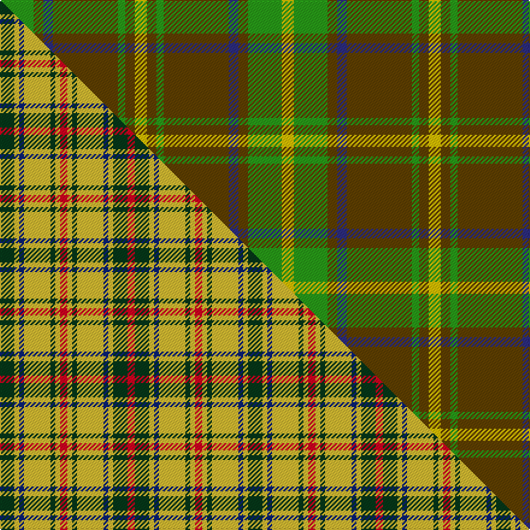

This page is one **sett** — a single exact thread-count. It belongs to the [tartan](/setts/g14dy4db4dy27g3dy4ly5dy4g3dy27db4dy4g14ly5/)
(the same proportion at any scale), whose colour order is pattern [GGBGGGYGGGBGGY](/stripes/ggbgggygggbggy/).

Part of the [Invertere](/tartans/invertere-2/) tartan — the named design grouping this sett with its other cloths.

Sourced from register-of-tartans.  It is a [14 stripe tartan](/stripes/stripes14/).

Original link [https://www.tartanregister.gov.uk/tartanDetails.aspx?ref=1848](https://www.tartanregister.gov.uk/tartanDetails.aspx?ref=1848)

Dataset <small>— provenance for this record, inherited from the source manifest</small>

<dl class="dataset-prov">
<dt>source</dt><dd><a href="/sources/register-of-tartans/">Scottish Register of Tartans</a></dd>
<dt>data captured from</dt><dd><a href="https://github.com/thetartan/tartan-database/blob/master/data/register-of-tartans/data.csv">https://github.com/thetartan/tartan-database/blob/master/data/register-of-tartans/data.csv</a></dd>
<dt>data date</dt><dd>2002 <small>(this record)</small></dd>
<dt>licence</dt><dd><a href="https://www.tartanregister.gov.uk/copyright">Crown copyright</a></dd>
</dl>

Capture chain <small>— the hands this data passed through, oldest first; each capture carries its own licence</small>

<ol class="capture-chain">
<li><a href="https://www.tartanregister.gov.uk/">Scottish Register of Tartans</a> · <a href="https://www.tartanregister.gov.uk/copyright">Crown copyright</a> <small>the living register — still published by National Records of Scotland</small></li>
<li><a href="https://github.com/thetartan/tartan-database">thetartan/tartan-database</a> <small>2016-2017</small> · <a href="https://creativecommons.org/licenses/by-nc-nd/4.0/">CC BY-NC-ND 4.0</a> <small>Levko Kravets's frozen compilation — the capture we vendored, and where its CC licence text came from</small></li>
<li>this dictionary <small>captured 2026-06-10 · commit 5bf86c7566</small> <small>each re-capture is a git commit to data/sources</small></li>
</ol>

## Register references

External register numbers recorded for this tartan.

- Scottish Register of Tartans: [1848](https://www.tartanregister.gov.uk/tartanDetails.aspx?ref=1848)
- Scottish Tartans Authority (ITI): 1882
- Scottish Tartans World Register: 1882

## Thread count
G/28 DY8 DB8 DY54 G6 DY8 LY10 DY8 G6 DY54 DB8 DY8 G28 LY/10

One full sett is **450 threads**.

## Palette
<table><thead><tr><th>Colour</th><th>Shade</th><th>OKLCh</th></tr></thead><tbody><tr><td>DB</td><td><code style="background-color:#202060;">#202060</code> <small style="color:#888">#202060</small></td><td><small style="color:#888">oklch(28.9% 0.111 276.9)</small></td></tr><tr><td>DB</td><td><code style="background-color:#2C2C80;">#2C2C80</code> <small style="color:#888">#2C2C80</small></td><td><small style="color:#888">oklch(35.0% 0.138 276.6)</small></td></tr><tr><td>DG</td><td><code style="background-color:#053819;">#053819</code> <small style="color:#888">#053819</small></td><td><small style="color:#888">oklch(30.0% 0.075 151.3)</small></td></tr><tr><td>DG</td><td><code style="background-color:#006818;">#006818</code> <small style="color:#888">#006818</small></td><td><small style="color:#888">oklch(45.0% 0.142 145.0)</small></td></tr><tr><td>G</td><td><code style="background-color:#289C18;">#289C18</code> <small style="color:#888">#289C18</small></td><td><small style="color:#888">oklch(60.6% 0.191 141.6)</small></td></tr><tr><td>DY</td><td><code style="background-color:#604000;">#604000</code> <small style="color:#888">#604000</small></td><td><small style="color:#888">oklch(39.8% 0.083 76.8)</small></td></tr><tr><td>LY</td><td><code style="background-color:#E8C000;">#E8C000</code> <small style="color:#888">#E8C000</small></td><td><small style="color:#888">oklch(81.9% 0.168 93.7)</small></td></tr></tbody></table>

# Sample pattern

## Compared to the master

This cloth is one sett of its design; the master sett (the exemplar the design is anchored on) is below for comparison.

Its **ΔTartan distance** from the master is **5.40** — the same measure the nearest-tartans table ranks by (0 is identical; a re-scale of the same cloth is near 0, a recolour or a different proportion further).

<figure class="master-compare" style="margin:0">

this sett
master sett ★

<figcaption style="color:#888;font-size:smaller">One weave of this sett against the <a href="/setts/dg6ly2db2ly11dg2ly2r3ly2dg2ly11db2ly2dg6r3/">master sett ★</a>, split on the diagonal: a shared proportion runs seamlessly across it with only the shades shifting; a different proportion breaks on it.</figcaption>
</figure>

## Nearest tartan variants

The nearest existing variants by ΔTartan distance, with this cloth at the top so the swatches line up against it.

ΔTartan

Threads

Variant

Sett

—

450

<a href="/variants/s14/g14dy4db4dy27g3dy4ly5dy4g3dy27db4dy4g14ly5~x2~g2408144-dy1603076-db1406275-ly3307090/">Invertere (Daks #2)</a>

<a href="/ttd/edit/#slug=ly5g14dy4db4dy27g3dy4ly5~x2~ly3307090-dy1603076&amp;base=g14dy4db4dy27g3dy4ly5dy4g3dy27db4dy4g14ly5~x2~g2408144-dy1603076-db1406275-ly3307090" title="compare in the TTD">2.76</a>

244

<a href="/variants/s8/ly5g14dy4db4dy27g3dy4ly5~x2~ly3307090-dy1603076/">Invertere (Daks #2) (Fashion)</a>

<a href="/ttd/edit/#slug=dp2g25dg8g2dg2g25dp2g2dp6g2w2g4dg16g2~x2~g2505139-dg1504144&amp;base=g14dy4db4dy27g3dy4ly5dy4g3dy27db4dy4g14ly5~x2~g2408144-dy1603076-db1406275-ly3307090" title="compare in the TTD">2.87</a>

392

<a href="/variants/s14/dp2y25dg8y2dg2y25dp2y2dp6y2w2y4dg16y2~x2~y2505139-dg1504144/">Beechgrove Garden, The</a>

<a href="/ttd/edit/#slug=r3g8r2g18dr5g3do3g3do16g3do3g3~x2&amp;base=g14dy4db4dy27g3dy4ly5dy4g3dy27db4dy4g14ly5~x2~g2408144-dy1603076-db1406275-ly3307090" title="compare in the TTD">2.90</a>

268

<a href="/variants/s12/r3g8r2g18dr5g3do3g3do16g3do3g3~x2/">Dublin</a>

<a href="/ttd/edit/#slug=lb2r19lb2r5lb2g13lb2g12lb2r5lb2g14lb2g12lb2~x2&amp;base=g14dy4db4dy27g3dy4ly5dy4g3dy27db4dy4g14ly5~x2~g2408144-dy1603076-db1406275-ly3307090" title="compare in the TTD">3.29</a>

376

<a href="/variants/s15/lb2r19lb2r5lb2g13lb2g12lb2r5lb2g14lb2g12lb2~x2/">Fraser of Castle Leathers, Major James</a>

<a href="/ttd/edit/#slug=g19dy3g19r3g19dy3g19r3g3r21lb3r21g3r3~x2&amp;base=g14dy4db4dy27g3dy4ly5dy4g3dy27db4dy4g14ly5~x2~g2408144-dy1603076-db1406275-ly3307090" title="compare in the TTD">3.41</a>

524

<a href="/variants/s14/g19dy3g19r3g19dy3g19r3g3r21lb3r21g3r3~x2/">Burnett of Powis (Modern) (Personal)</a>

<a href="/ttd/edit/#slug=g4dy2g2dy2g2dy3db1dy1g4dy1db1dy12db2dy3~x2&amp;base=g14dy4db4dy27g3dy4ly5dy4g3dy27db4dy4g14ly5~x2~g2408144-dy1603076-db1406275-ly3307090" title="compare in the TTD">3.58</a>

146

<a href="/variants/s14/g4dy2g2dy2g2dy3db1dy1g4dy1db1dy12db2dy3~x2/">MacAlister of Glenbarr Clan Tartan</a>

<a href="/ttd/edit/#slug=g4dr4g2dr2g2dr18db4g4dr2g2dr2g3dr4g2dr2g2dr2db4g4dr2g4~x2&amp;base=g14dy4db4dy27g3dy4ly5dy4g3dy27db4dy4g14ly5~x2~g2408144-dy1603076-db1406275-ly3307090" title="compare in the TTD">3.68</a>

284

<a href="/variants/s21/g4dr4g2dr2g2dr18db4g4dr2g2dr2g3dr4g2dr2g2dr2db4g4dr2g4~x2/">Matheson (WCWM)</a>

<a href="/ttd/edit/#slug=dr12db1dr1g8dr2db1dr1db3dr1db1dr12g1dr1g8~x4&amp;base=g14dy4db4dy27g3dy4ly5dy4g3dy27db4dy4g14ly5~x2~g2408144-dy1603076-db1406275-ly3307090" title="compare in the TTD">3.69</a>

344

<a href="/variants/s14/dr12db1dr1g8dr2db1dr1db3dr1db1dr12g1dr1g8~x4/">MacDonald of Aird &amp; Valley (Clan?)</a>

<a href="/ttd/edit/#slug=n57w5g20n5lo10~x2&amp;base=g14dy4db4dy27g3dy4ly5dy4g3dy27db4dy4g14ly5~x2~g2408144-dy1603076-db1406275-ly3307090" title="compare in the TTD">3.82</a>

254

<a href="/variants/s5/n57w5g20n5lo10~x2/">Johore</a>

<a href="/ttd/edit/#slug=lr1do12g2dr2g16dr2g2do12lo1~x4&amp;base=g14dy4db4dy27g3dy4ly5dy4g3dy27db4dy4g14ly5~x2~g2408144-dy1603076-db1406275-ly3307090" title="compare in the TTD">3.87</a>

392

<a href="/variants/s9/lr1do12g2dr2g16dr2g2do12lo1~x4/">MacFie Hunting (Clan?)</a>

## Neighbour map

Every grey dot is one of 13621 variants placed by the first two principal components of the ΔTartan feature space (42% of its variance). Red is this tartan; blue dots are its nearest — click one to open its page.

<svg viewBox="0 0 640 380" role="img" style="max-width:100%;height:auto;border:1px solid #e0e0e0;border-radius:4px;display:block" xmlns="http://www.w3.org/2000/svg"><image href="/nn/cloud.v1.png" width="640" height="380"/><a href="/variants/s8/ly5g14dy4db4dy27g3dy4ly5~x2~ly3307090-dy1603076/"><circle cx="326.9" cy="223.0" r="4" fill="#3465a4"><title>Invertere (Daks #2) (Fashion)</title></circle></a><a href="/variants/s14/dp2y25dg8y2dg2y25dp2y2dp6y2w2y4dg16y2~x2~y2505139-dg1504144/"><circle cx="404.1" cy="182.3" r="4" fill="#3465a4"><title>Beechgrove Garden, The</title></circle></a><a href="/variants/s12/r3g8r2g18dr5g3do3g3do16g3do3g3~x2/"><circle cx="318.2" cy="202.5" r="4" fill="#3465a4"><title>Dublin</title></circle></a><a href="/variants/s15/lb2r19lb2r5lb2g13lb2g12lb2r5lb2g14lb2g12lb2~x2/"><circle cx="319.2" cy="204.7" r="4" fill="#3465a4"><title>Fraser of Castle Leathers, Major James</title></circle></a><a href="/variants/s14/g19dy3g19r3g19dy3g19r3g3r21lb3r21g3r3~x2/"><circle cx="323.0" cy="204.2" r="4" fill="#3465a4"><title>Burnett of Powis (Modern) (Personal)</title></circle></a><a href="/variants/s14/g4dy2g2dy2g2dy3db1dy1g4dy1db1dy12db2dy3~x2/"><circle cx="420.6" cy="212.2" r="4" fill="#3465a4"><title>MacAlister of Glenbarr Clan Tartan</title></circle></a><a href="/variants/s21/g4dr4g2dr2g2dr18db4g4dr2g2dr2g3dr4g2dr2g2dr2db4g4dr2g4~x2/"><circle cx="330.0" cy="197.6" r="4" fill="#3465a4"><title>Matheson (WCWM)</title></circle></a><a href="/variants/s14/dr12db1dr1g8dr2db1dr1db3dr1db1dr12g1dr1g8~x4/"><circle cx="389.9" cy="192.9" r="4" fill="#3465a4"><title>MacDonald of Aird &amp; Valley (Clan?)</title></circle></a><a href="/variants/s5/n57w5g20n5lo10~x2/"><circle cx="370.8" cy="219.7" r="4" fill="#3465a4"><title>Johore</title></circle></a><a href="/variants/s9/lr1do12g2dr2g16dr2g2do12lo1~x4/"><circle cx="336.3" cy="185.9" r="4" fill="#3465a4"><title>MacFie Hunting (Clan?)</title></circle></a><circle cx="352.3" cy="203.8" r="5" fill="#c00000"/><text x="320" y="376" text-anchor="middle" font-size="11" fill="#999">ground</text><text x="11" y="190" text-anchor="middle" font-size="11" fill="#999" transform="rotate(-90 11 190)">complexity</text></svg>

ID: /variants/s14/g14dy4db4dy27g3dy4ly5dy4g3dy27db4dy4g14ly5~x2~g2408144-dy1603076-db1406275-ly3307090/
