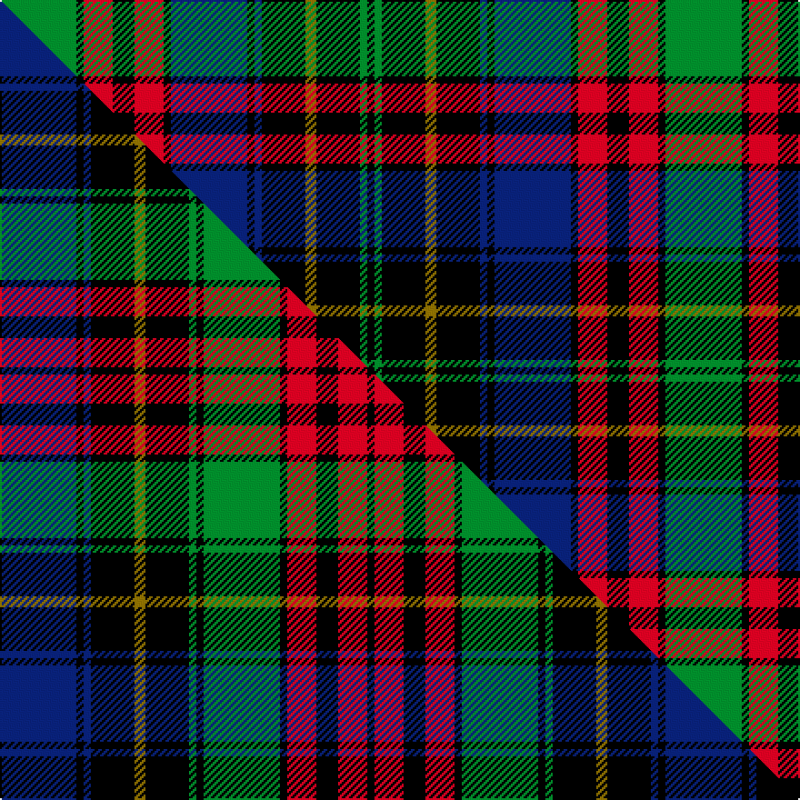

This is one **variant** — a specific cloth: this exact thread count and colourway, with its own
provenance below. It is one weaving of the [sett](/setts/g21k2r8k6r8k2db21k2db2k12y3k12g2k2/) (the scale-free proportion — the
same cloth at any scale or shade), whose colour order is pattern [GKRKRKBKBKGKGK](/stripes/gkrkrkbkbkgkgk/).

Part of the [Deas](/tartans/d/de/deas/) tartan — the named design grouping this sett with its other cloths.

Sourced from house-of-tartan.  It is a [14 stripe tartan](/stripes/stripes14/).

Original link [http://www.house-of-tartan.scotland.net/house/TartanViewjs.asp?colr=Def&tnam=2139](http://www.house-of-tartan.scotland.net/house/TartanViewjs.asp?colr=Def&tnam=2139)

## Provenance

Earliest known date: pre 2003 The name Deas is described as an 'alias' for Davidson in historic records, and is a recognised sept of Clan Dhai (Davidson).

2 attestations — the source records this cloth was collapsed from (oldest owns this page)

<ul>
<li>pre 2003 — Deas Clan Tartan (house-of-tartan, <a href="http://www.house-of-tartan.scotland.net/house/TartanViewjs.asp?colr=Def&tnam=2139">record</a>) </li>
<li>undated — Deas (weddslist, <a href="http://www.weddslist.com/cgi-bin/tartans/pg.pl?source=sts">record</a>) </li>
</ul>

Dataset <small>— provenance for this record, inherited from the source manifest</small>

<dl class="dataset-prov">
<dt>source</dt><dd><a href="/sources/house-of-tartan/">House of Tartan</a></dd>
<dt>data captured from</dt><dd><a href="https://github.com/thetartan/tartan-database/blob/master/data/house-of-tartan/data.csv">https://github.com/thetartan/tartan-database/blob/master/data/house-of-tartan/data.csv</a></dd>
<dt>data date</dt><dd>pre 2003 <small>(this record)</small></dd>
<dt>licence</dt><dd><a href="https://creativecommons.org/licenses/by-nc-nd/4.0/">CC BY-NC-ND 4.0</a></dd>
</dl>

Capture chain <small>— the hands this data passed through, oldest first; each capture carries its own licence</small>

<ol class="capture-chain">
<li><a href="http://www.house-of-tartan.scotland.net/">House of Tartan</a> <small>the weaver/retailer's database — the site is now offline; the URL is kept as the ultimate source's identity</small></li>
<li><a href="https://github.com/thetartan/tartan-database">thetartan/tartan-database</a> <small>2016-2017</small> · <a href="https://creativecommons.org/licenses/by-nc-nd/4.0/">CC BY-NC-ND 4.0</a> <small>Levko Kravets's frozen compilation — the capture we vendored, and where its CC licence text came from</small></li>
<li>this dictionary <small>captured 2026-06-10 · commit 5bf86c7566</small> <small>each re-capture is a git commit to data/sources</small></li>
</ol>

## Thread count
G/42 K4 R16 K12 R16 K4 DB42 K4 DB4 K24 Y6 K24 G4 K/4

One full sett is **366 threads**.

## Palette
<table><thead><tr><th>Colour</th><th>Shade</th><th>OKLCh</th></tr></thead><tbody><tr><td>DB</td><td><code style="background-color:#082077;">#082077</code> <small style="color:#888">#082077</small></td><td><small style="color:#888">oklch(30.0% 0.149 265.1)</small></td></tr><tr><td>G</td><td><code style="background-color:#008B2A;">#008B2A</code> <small style="color:#888">#008B2A</small></td><td><small style="color:#888">oklch(55.4% 0.170 145.9)</small></td></tr><tr><td>K</td><td><code style="background-color:#000000;">#000000</code> <small style="color:#888">#000000</small></td><td><small style="color:#888">oklch(0.0% 0.000 0.0)</small></td></tr><tr><td>R</td><td><code style="background-color:#D60020;">#D60020</code> <small style="color:#888">#D60020</small></td><td><small style="color:#888">oklch(55.2% 0.224 25.5)</small></td></tr><tr><td>Y</td><td><code style="background-color:#8B6E00;">#8B6E00</code> <small style="color:#888">#8B6E00</small></td><td><small style="color:#888">oklch(55.1% 0.113 90.4)</small></td></tr></tbody></table>

# Sample pattern

## Compared to the master

This cloth is one sett of its design; the master sett (the exemplar the design is anchored on) is below for comparison.

Its **ΔTartan distance** from the master is **0.00** — the same measure the nearest-tartans table ranks by (0 is identical; a re-scale of the same cloth is near 0, a recolour or a different proportion further).

<figure class="master-compare" style="margin:0">

this sett
master sett ★

<figcaption style="color:#888;font-size:smaller">One weave of this sett against the <a href="/setts/db21k2db2k12y3k12g2k2g21k2r8k6r8k2/">master sett ★</a>, split on the diagonal: a shared proportion runs seamlessly across it with only the shades shifting; a different proportion breaks on it.</figcaption>
</figure>

## Nearest tartan variants

The nearest existing variants by ΔTartan distance, with this cloth at the top so the swatches line up against it.

ΔTartan

Threads

Variant

Sett

—

366

<a href="/variants/s14/g21k2r8k6r8k2db21k2db2k12y3k12g2k2~x2/">Deas Clan Tartan</a>

<a href="/ttd/edit/#slug=db21k2db2k12y3k12g2k2g21k2r8k6r8k2~x2&amp;base=g21k2r8k6r8k2db21k2db2k12y3k12g2k2~x2" title="compare in the TTD">0.00</a>

366

<a href="/variants/s14/db21k2db2k12y3k12g2k2g21k2r8k6r8k2~x2/">Deas</a>

<a href="/ttd/edit/#slug=dp11k1dr1k1dr1k7g8k1g8k7dp8k1r1~x4&amp;base=g21k2r8k6r8k2db21k2db2k12y3k12g2k2~x2" title="compare in the TTD">1.30</a>

400

<a href="/variants/s13/dp11k1dr1k1dr1k7g8k1g8k7dp8k1r1~x4/">Red Hackle (Military)</a>

<a href="/ttd/edit/#slug=k4b1k12w1b4w1dg4w1dr4dg12k1w2~x2&amp;base=g21k2r8k6r8k2db21k2db2k12y3k12g2k2~x2" title="compare in the TTD">1.43</a>

176

<a href="/variants/s12/k4b1k12w1b4w1dg4w1dr4dg12k1w2~x2/">Glenfalloch</a>

<a href="/ttd/edit/#slug=db8r1db2r3db12r1k12g12r3g2r1g4w1~x2&amp;base=g21k2r8k6r8k2db21k2db2k12y3k12g2k2~x2" title="compare in the TTD">1.61</a>

230

<a href="/variants/s13/db8r1db2r3db12r1k12g12r3g2r1g4w1~x2/">MacDonell of Glengarry Clan Tartan</a>

<a href="/ttd/edit/#slug=db8r1db2r3db12r1k12g12r3g2r1g4w1&amp;base=g21k2r8k6r8k2db21k2db2k12y3k12g2k2~x2" title="compare in the TTD">1.61</a>

115

<a href="/variants/s13/db8r1db2r3db12r1k12g12r3g2r1g4w1/">MacDonell of Glengarry D</a>

<a href="/ttd/edit/#slug=db18k5g3r3g6k2y2k2g6r3g3k10db5k10&amp;base=g21k2r8k6r8k2db21k2db2k12y3k12g2k2~x2" title="compare in the TTD">1.68</a>

128

<a href="/variants/s14/db18k5g3r3g6k2y2k2g6r3g3k10db5k10/">MacClellan Clan Tartan</a>

<a href="/ttd/edit/#slug=r2db4k1db1k1db1k8g8y2g8k8db8k1r2&amp;base=g21k2r8k6r8k2db21k2db2k12y3k12g2k2~x2" title="compare in the TTD">1.71</a>

106

<a href="/variants/s14/r2db4k1db1k1db1k8g8y2g8k8db8k1r2/">Farquharson</a>

<a href="/ttd/edit/#slug=r2db4k1db1k1db1k8g8y2g8k8db8k1r2~x2&amp;base=g21k2r8k6r8k2db21k2db2k12y3k12g2k2~x2" title="compare in the TTD">1.71</a>

212

<a href="/variants/s14/r2db4k1db1k1db1k8g8y2g8k8db8k1r2~x2/">Farquharson Clan Tartan</a>

<a href="/ttd/edit/#slug=db28k4db4k4db4k28g27k3ly5k3g27k28db27k3r5~x2~db1406275&amp;base=g21k2r8k6r8k2db21k2db2k12y3k12g2k2~x2" title="compare in the TTD">1.72</a>

734

<a href="/variants/s15/db28k4db4k4db4k28g27k3ly5k3g27k28db27k3r5~x2~db1406275/">Baillie (William Wilson)</a>

<a href="/ttd/edit/#slug=db16r2db3r4db18r2k16dg16r4dg3r2k2ly10~x2&amp;base=g21k2r8k6r8k2db21k2db2k12y3k12g2k2~x2" title="compare in the TTD">1.73</a>

340

<a href="/variants/s13/db16r2db3r4db18r2k16dg16r4dg3r2k2ly10~x2/">MacSporran</a>

## Neighbour map

Every grey dot is one of 13621 variants placed by the first two principal components of the ΔTartan feature space (42% of its variance). Red is this tartan; blue dots are its nearest — click one to open its page.

<svg viewBox="0 0 640 380" role="img" style="max-width:100%;height:auto;border:1px solid #e0e0e0;border-radius:4px;display:block" xmlns="http://www.w3.org/2000/svg"><image href="/nn/cloud.v1.png" width="640" height="380"/><a href="/variants/s14/db21k2db2k12y3k12g2k2g21k2r8k6r8k2~x2/"><circle cx="110.2" cy="136.1" r="4" fill="#3465a4"><title>Deas</title></circle></a><a href="/variants/s13/dp11k1dr1k1dr1k7g8k1g8k7dp8k1r1~x4/"><circle cx="130.0" cy="146.0" r="4" fill="#3465a4"><title>Red Hackle (Military)</title></circle></a><a href="/variants/s12/k4b1k12w1b4w1dg4w1dr4dg12k1w2~x2/"><circle cx="125.5" cy="134.4" r="4" fill="#3465a4"><title>Glenfalloch</title></circle></a><a href="/variants/s13/db8r1db2r3db12r1k12g12r3g2r1g4w1~x2/"><circle cx="120.6" cy="137.8" r="4" fill="#3465a4"><title>MacDonell of Glengarry Clan Tartan</title></circle></a><a href="/variants/s13/db8r1db2r3db12r1k12g12r3g2r1g4w1/"><circle cx="120.6" cy="137.8" r="4" fill="#3465a4"><title>MacDonell of Glengarry D</title></circle></a><a href="/variants/s14/db18k5g3r3g6k2y2k2g6r3g3k10db5k10/"><circle cx="113.3" cy="158.0" r="4" fill="#3465a4"><title>MacClellan Clan Tartan</title></circle></a><a href="/variants/s14/r2db4k1db1k1db1k8g8y2g8k8db8k1r2/"><circle cx="94.6" cy="159.4" r="4" fill="#3465a4"><title>Farquharson</title></circle></a><a href="/variants/s14/r2db4k1db1k1db1k8g8y2g8k8db8k1r2~x2/"><circle cx="94.6" cy="159.4" r="4" fill="#3465a4"><title>Farquharson Clan Tartan</title></circle></a><a href="/variants/s15/db28k4db4k4db4k28g27k3ly5k3g27k28db27k3r5~x2~db1406275/"><circle cx="120.3" cy="144.8" r="4" fill="#3465a4"><title>Baillie (William Wilson)</title></circle></a><a href="/variants/s13/db16r2db3r4db18r2k16dg16r4dg3r2k2ly10~x2/"><circle cx="111.4" cy="152.6" r="4" fill="#3465a4"><title>MacSporran</title></circle></a><circle cx="110.2" cy="136.1" r="5" fill="#c00000"/><text x="320" y="376" text-anchor="middle" font-size="11" fill="#999">ground</text><text x="11" y="190" text-anchor="middle" font-size="11" fill="#999" transform="rotate(-90 11 190)">complexity</text></svg>

ID: /variants/s14/g21k2r8k6r8k2db21k2db2k12y3k12g2k2~x2/
