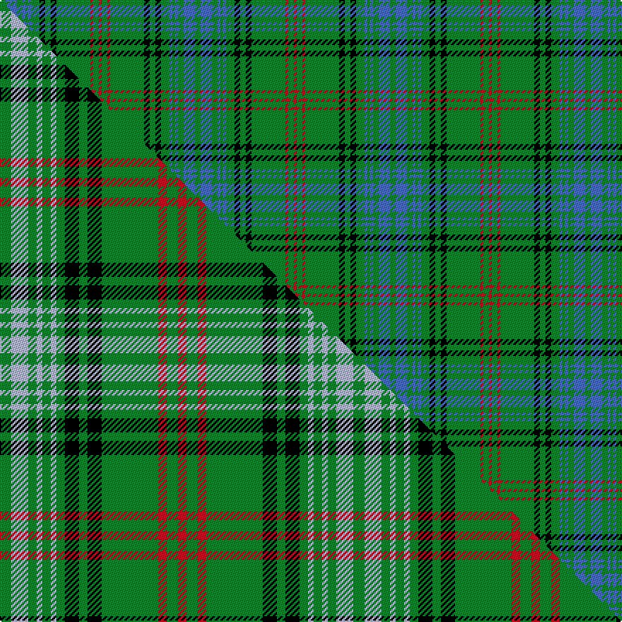

This page is one **sett** — a single exact thread-count. It belongs to the [tartan](/setts/g2b4g2b1g1b1g3k2g2k2g12r1g2r1/)
(the same proportion at any scale), whose colour order is pattern [GBGBGBGKGKGRGR](/stripes/gbgbgbgkgkgrgr/).

Part of the [Ross Hunting](/tartans/ross-hunting/) tartan — the named design grouping this sett with its other cloths.

Sourced from weddslist.  It is a [14 stripe tartan](/stripes/stripes14/).

Original link [http://www.weddslist.com/cgi-bin/tartans/pg.pl?source=sts](http://www.weddslist.com/cgi-bin/tartans/pg.pl?source=sts)

Dataset <small>— provenance for this record, inherited from the source manifest</small>

<dl class="dataset-prov">
<dt>source</dt><dd><a href="/sources/weddslist/">Weddslist</a></dd>
<dt>data captured from</dt><dd><a href="https://github.com/thetartan/tartan-database/blob/master/data/weddslist/data.csv">https://github.com/thetartan/tartan-database/blob/master/data/weddslist/data.csv</a></dd>
<dt>data date</dt><dd>2016-11-17 <small>(dataset default)</small></dd>
<dt>licence</dt><dd><a href="https://creativecommons.org/licenses/by-nc-nd/4.0/">CC BY-NC-ND 4.0</a></dd>
</dl>

Capture chain <small>— the hands this data passed through, oldest first; each capture carries its own licence</small>

<ol class="capture-chain">
<li><a href="https://www.weddslist.com/tartans/">Weddslist</a> <small>the living privately compiled reference</small></li>
<li><a href="https://github.com/thetartan/tartan-database">thetartan/tartan-database</a> <small>2016-2017</small> · <a href="https://creativecommons.org/licenses/by-nc-nd/4.0/">CC BY-NC-ND 4.0</a> <small>Levko Kravets's frozen compilation — the capture we vendored, and where its CC licence text came from</small></li>
<li>this dictionary <small>captured 2026-06-10 · commit 5bf86c7566</small> <small>each re-capture is a git commit to data/sources</small></li>
</ol>

## Thread count
G/4 B8 G4 B2 G2 B2 G6 K4 G4 K4 G24 R2 G4 R/2

One full sett is **138 threads**.

## Palette
<table><thead><tr><th>Colour</th><th>Shade</th><th>OKLCh</th></tr></thead><tbody><tr><td>B</td><td><code style="background-color:#466CC8;">#466CC8</code> <small style="color:#888">#466CC8</small></td><td><small style="color:#888">oklch(55.1% 0.149 265.0)</small></td></tr><tr><td>G</td><td><code style="background-color:#008B2A;">#008B2A</code> <small style="color:#888">#008B2A</small></td><td><small style="color:#888">oklch(55.4% 0.170 145.9)</small></td></tr><tr><td>K</td><td><code style="background-color:#000000;">#000000</code> <small style="color:#888">#000000</small></td><td><small style="color:#888">oklch(0.0% 0.000 0.0)</small></td></tr><tr><td>R</td><td><code style="background-color:#D60020;">#D60020</code> <small style="color:#888">#D60020</small></td><td><small style="color:#888">oklch(55.2% 0.224 25.5)</small></td></tr></tbody></table>

# Sample pattern

## Compared to the master

This cloth is one sett of its design; the master sett (the exemplar the design is anchored on) is below for comparison.

Its **ΔTartan distance** from the master is **0.33** — the same measure the nearest-tartans table ranks by (0 is identical; a re-scale of the same cloth is near 0, a recolour or a different proportion further).

<figure class="master-compare" style="margin:0">

this sett
master sett ★

<figcaption style="color:#888;font-size:smaller">One weave of this sett against the <a href="/setts/g4lb6g3lb2g3lb2g3k5g3k5g20r3g4r3/">master sett ★</a>, split on the diagonal: a shared proportion runs seamlessly across it with only the shades shifting; a different proportion breaks on it.</figcaption>
</figure>

## Nearest tartan variants

The nearest existing variants by ΔTartan distance, with this cloth at the top so the swatches line up against it.

ΔTartan

Threads

Variant

Sett

—

138

<a href="/variants/s14/g2b4g2b1g1b1g3k2g2k2g12r1g2r1~x2/">Ross, hunting</a>

<a href="/ttd/edit/#slug=g4lb6g3lb2g3lb2g3k5g3k5g20r3g4r3~x2&amp;base=g2b4g2b1g1b1g3k2g2k2g12r1g2r1~x2" title="compare in the TTD">0.33</a>

250

<a href="/variants/s14/g4lb6g3lb2g3lb2g3k5g3k5g20r3g4r3~x2/">Ross Hunting</a>

<a href="/ttd/edit/#slug=g3y1g3r1g14k2g3k1g3b1g2b1g2b3~x4&amp;base=g2b4g2b1g1b1g3k2g2k2g12r1g2r1~x2" title="compare in the TTD">0.65</a>

296

<a href="/variants/s14/g3y1g3r1g14k2g3k1g3b1g2b1g2b3~x4/">New South Wales</a>

<a href="/ttd/edit/#slug=g2dg4g2dg1g1dg1g3k2g2k2g12r1g2r1~x2&amp;base=g2b4g2b1g1b1g3k2g2k2g12r1g2r1~x2" title="compare in the TTD">1.59</a>

138

<a href="/variants/s14/g2dg4g2dg1g1dg1g3k2g2k2g12r1g2r1~x2/">Ross Hunting</a>

<a href="/ttd/edit/#slug=k3g3y2g4k2g3k2g24db10y2db10g30r3~x2&amp;base=g2b4g2b1g1b1g3k2g2k2g12r1g2r1~x2" title="compare in the TTD">2.17</a>

380

<a href="/variants/s13/k3g3y2g4k2g3k2g24db10y2db10g30r3~x2/">Bartlett from Winnetka, Illinois</a>

<a href="/ttd/edit/#slug=dg6g3dg3g4dg4k5dg3k5dg28r2dg4r2~x2~dg1806142-g2408144&amp;base=g2b4g2b1g1b1g3k2g2k2g12r1g2r1~x2" title="compare in the TTD">2.43</a>

260

<a href="/variants/s12/dg6g3dg3g4dg4k5dg3k5dg28r2dg4r2~x2~dg1806142-g2408144/">Ross Hunting Clan Tartan</a>

<a href="/ttd/edit/#slug=lb3k1g12k1g1k2g1k6g12k1lo1~x4&amp;base=g2b4g2b1g1b1g3k2g2k2g12r1g2r1~x2" title="compare in the TTD">2.49</a>

312

<a href="/variants/s11/lb3k1g12k1g1k2g1k6g12k1lo1~x4/">MacCandlish Hunting Green</a>

<a href="/ttd/edit/#slug=dr4g40db12lo2db12g30k2g4k2g4lo2g3k3~x2&amp;base=g2b4g2b1g1b1g3k2g2k2g12r1g2r1~x2" title="compare in the TTD">2.73</a>

466

<a href="/variants/s13/dr4g40db12lo2db12g30k2g4k2g4lo2g3k3~x2/">Bartlett from Winnetka, Illinois</a>

<a href="/ttd/edit/#slug=k3g32k2g4y4g2y4g4k6w3~x2&amp;base=g2b4g2b1g1b1g3k2g2k2g12r1g2r1~x2" title="compare in the TTD">2.83</a>

244

<a href="/variants/s10/k3g32k2g4y4g2y4g4k6w3~x2/">University of Alberta (Corporate)</a>

<a href="/ttd/edit/#slug=dg5g7dg4g2dg2g3dg4k6dg3k6dg34r2dg4r2~x2~dg1806142-g2408144&amp;base=g2b4g2b1g1b1g3k2g2k2g12r1g2r1~x2" title="compare in the TTD">2.83</a>

322

<a href="/variants/s14/dg5g7dg4g2dg2g3dg4k6dg3k6dg34r2dg4r2~x2~dg1806142-g2408144/">Ross Hunting #3</a>

<a href="/ttd/edit/#slug=dg2g4dg2g2dg1g2dg3k2dg2k2dg12r1dg2r1~x2~dg1806142-g2408144&amp;base=g2b4g2b1g1b1g3k2g2k2g12r1g2r1~x2" title="compare in the TTD">2.95</a>

146

<a href="/variants/s14/dg2g4dg2g2dg1g2dg3k2dg2k2dg12r1dg2r1~x2~dg1806142-g2408144/">Ross Hunting Clan Tartan</a>

## Neighbour map

Every grey dot is one of 13621 variants placed by the first two principal components of the ΔTartan feature space (42% of its variance). Red is this tartan; blue dots are its nearest — click one to open its page.

<svg viewBox="0 0 640 380" role="img" style="max-width:100%;height:auto;border:1px solid #e0e0e0;border-radius:4px;display:block" xmlns="http://www.w3.org/2000/svg"><image href="/nn/cloud.v1.png" width="640" height="380"/><a href="/variants/s14/g4lb6g3lb2g3lb2g3k5g3k5g20r3g4r3~x2/"><circle cx="255.2" cy="154.8" r="4" fill="#3465a4"><title>Ross Hunting</title></circle></a><a href="/variants/s14/g3y1g3r1g14k2g3k1g3b1g2b1g2b3~x4/"><circle cx="399.7" cy="129.2" r="4" fill="#3465a4"><title>New South Wales</title></circle></a><a href="/variants/s14/g2dg4g2dg1g1dg1g3k2g2k2g12r1g2r1~x2/"><circle cx="334.9" cy="147.3" r="4" fill="#3465a4"><title>Ross Hunting</title></circle></a><a href="/variants/s13/k3g3y2g4k2g3k2g24db10y2db10g30r3~x2/"><circle cx="322.2" cy="120.7" r="4" fill="#3465a4"><title>Bartlett from Winnetka, Illinois</title></circle></a><a href="/variants/s12/dg6g3dg3g4dg4k5dg3k5dg28r2dg4r2~x2~dg1806142-g2408144/"><circle cx="377.1" cy="140.6" r="4" fill="#3465a4"><title>Ross Hunting Clan Tartan</title></circle></a><a href="/variants/s11/lb3k1g12k1g1k2g1k6g12k1lo1~x4/"><circle cx="295.6" cy="142.0" r="4" fill="#3465a4"><title>MacCandlish Hunting Green</title></circle></a><a href="/variants/s13/dr4g40db12lo2db12g30k2g4k2g4lo2g3k3~x2/"><circle cx="351.5" cy="105.4" r="4" fill="#3465a4"><title>Bartlett from Winnetka, Illinois</title></circle></a><a href="/variants/s10/k3g32k2g4y4g2y4g4k6w3~x2/"><circle cx="336.6" cy="126.7" r="4" fill="#3465a4"><title>University of Alberta (Corporate)</title></circle></a><a href="/variants/s14/dg5g7dg4g2dg2g3dg4k6dg3k6dg34r2dg4r2~x2~dg1806142-g2408144/"><circle cx="367.3" cy="121.6" r="4" fill="#3465a4"><title>Ross Hunting #3</title></circle></a><a href="/variants/s14/dg2g4dg2g2dg1g2dg3k2dg2k2dg12r1dg2r1~x2~dg1806142-g2408144/"><circle cx="332.3" cy="161.8" r="4" fill="#3465a4"><title>Ross Hunting Clan Tartan</title></circle></a><circle cx="329.0" cy="145.0" r="5" fill="#c00000"/><text x="320" y="376" text-anchor="middle" font-size="11" fill="#999">ground</text><text x="11" y="190" text-anchor="middle" font-size="11" fill="#999" transform="rotate(-90 11 190)">complexity</text></svg>

ID: /variants/s14/g2b4g2b1g1b1g3k2g2k2g12r1g2r1~x2/
