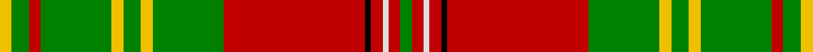

This page is one **sett** — a single exact thread-count. It belongs to the [tartan](/setts/g2r2w1r2k1r24g12ly2g3ly2g12r2g3ly2/)
(the same proportion at any scale), whose colour order is pattern [GRWRKRGYGYGRGY](/stripes/grwrkrgygygrgy/).

Part of the [Leask](/tartans/leask/) tartan — the named design grouping this sett with its other cloths.

Sourced from weddslist.  It is a [14 stripe tartan](/stripes/stripes14/).

Original link http://www.weddslist.com/cgi-bin/tartans/pg.pl?source=sts

## Provenance

Earliest known date: 1981 Designed by Madam Leask and the Scottish Tartans Society Accredited in 1981.

2 attestations — the source records this cloth was collapsed from (oldest owns this page)

<ul>
<li>undated — Leask (weddslist, <a href="http://www.weddslist.com/cgi-bin/tartans/pg.pl?source=sts">record</a>)</li>
<li>undated — Leask Family Tartan (house-of-tartan, <a href="http://www.house-of-tartan.scotland.net/house/TartanViewjs.asp?colr=Def&tnam=905">record</a>)</li>
</ul>

## Thread count
Y/4 G6 R4 G24 Y4 G6 Y4 G24 R48 K2 R4 LN2 R4 G/4

One full sett is **272 threads**.

## Palette

Palette: <strong>Tartan Register</strong> <small style="color:#888">(2 of 5 colours)</small>
<table><thead><tr><th>Colour</th><th>Threads</th><th>Shade</th><th>Base</th><th>OKLCh</th></tr></thead><tbody><tr><td>Y/</td><td style="text-align:right;font-variant-numeric:tabular-nums">4</td><td><code style="background-color:#F0C000;">#F0C000</code> <small style="color:#888">#F0C000</small></td><td>Y <code style="background-color:#F2BF00;">#F2BF00</code></td><td><small style="color:#888">oklch(82.7% 0.169 90.5)</small></td></tr><tr><td>G</td><td style="text-align:right;font-variant-numeric:tabular-nums">6</td><td><code style="background-color:#008000;">#008000</code> <small style="color:#888">#008000</small></td><td>G <code style="background-color:#006100;">#006100</code></td><td><small style="color:#888">oklch(52.0% 0.177 142.5)</small></td></tr><tr><td>R</td><td style="text-align:right;font-variant-numeric:tabular-nums">4</td><td><code style="background-color:#C00000;">#C00000</code> <small style="color:#888">#C00000</small></td><td>R <code style="background-color:#CC0000;">#CC0000</code></td><td><small style="color:#888">oklch(50.7% 0.208 29.2)</small></td></tr><tr><td>G</td><td style="text-align:right;font-variant-numeric:tabular-nums">24</td><td><code style="background-color:#008000;">#008000</code> <small style="color:#888">#008000</small></td><td>G <code style="background-color:#006100;">#006100</code></td><td><small style="color:#888">oklch(52.0% 0.177 142.5)</small></td></tr><tr><td>Y</td><td style="text-align:right;font-variant-numeric:tabular-nums">4</td><td><code style="background-color:#F0C000;">#F0C000</code> <small style="color:#888">#F0C000</small></td><td>Y <code style="background-color:#F2BF00;">#F2BF00</code></td><td><small style="color:#888">oklch(82.7% 0.169 90.5)</small></td></tr><tr><td>G</td><td style="text-align:right;font-variant-numeric:tabular-nums">6</td><td><code style="background-color:#008000;">#008000</code> <small style="color:#888">#008000</small></td><td>G <code style="background-color:#006100;">#006100</code></td><td><small style="color:#888">oklch(52.0% 0.177 142.5)</small></td></tr><tr><td>Y</td><td style="text-align:right;font-variant-numeric:tabular-nums">4</td><td><code style="background-color:#F0C000;">#F0C000</code> <small style="color:#888">#F0C000</small></td><td>Y <code style="background-color:#F2BF00;">#F2BF00</code></td><td><small style="color:#888">oklch(82.7% 0.169 90.5)</small></td></tr><tr><td>G</td><td style="text-align:right;font-variant-numeric:tabular-nums">24</td><td><code style="background-color:#008000;">#008000</code> <small style="color:#888">#008000</small></td><td>G <code style="background-color:#006100;">#006100</code></td><td><small style="color:#888">oklch(52.0% 0.177 142.5)</small></td></tr><tr><td>R</td><td style="text-align:right;font-variant-numeric:tabular-nums">48</td><td><code style="background-color:#C00000;">#C00000</code> <small style="color:#888">#C00000</small></td><td>R <code style="background-color:#CC0000;">#CC0000</code></td><td><small style="color:#888">oklch(50.7% 0.208 29.2)</small></td></tr><tr><td>K</td><td style="text-align:right;font-variant-numeric:tabular-nums">2</td><td><code style="background-color:#000000;">#000000</code> <small style="color:#888">#000000</small></td><td>K <code style="background-color:#000000;">#000000</code></td><td><small style="color:#888">oklch(0.0% 0.000 0.0)</small></td></tr><tr><td>R</td><td style="text-align:right;font-variant-numeric:tabular-nums">4</td><td><code style="background-color:#C00000;">#C00000</code> <small style="color:#888">#C00000</small></td><td>R <code style="background-color:#CC0000;">#CC0000</code></td><td><small style="color:#888">oklch(50.7% 0.208 29.2)</small></td></tr><tr><td>LN</td><td style="text-align:right;font-variant-numeric:tabular-nums">2</td><td><code style="background-color:#E0E0E0;">#E0E0E0</code> <small style="color:#888">#E0E0E0</small></td><td>W <code style="background-color:#F7F7F7;">#F7F7F7</code></td><td><small style="color:#888">oklch(90.7% 0.000 89.9)</small></td></tr><tr><td>R</td><td style="text-align:right;font-variant-numeric:tabular-nums">4</td><td><code style="background-color:#C00000;">#C00000</code> <small style="color:#888">#C00000</small></td><td>R <code style="background-color:#CC0000;">#CC0000</code></td><td><small style="color:#888">oklch(50.7% 0.208 29.2)</small></td></tr><tr><td>G/</td><td style="text-align:right;font-variant-numeric:tabular-nums">4</td><td><code style="background-color:#008000;">#008000</code> <small style="color:#888">#008000</small></td><td>G <code style="background-color:#006100;">#006100</code></td><td><small style="color:#888">oklch(52.0% 0.177 142.5)</small></td></tr></tbody></table>

## Compared to the master

This cloth is one sett of its design; the master sett (the exemplar the design is anchored on) is below for comparison.

<figure style="margin:0"><figcaption style="color:#888;font-size:smaller">this sett</figcaption></figure>
<figure style="margin:0"><figcaption style="color:#888;font-size:smaller"><a href="/setts/g4r2w1r2k1r24g12ly2g3ly2g12r2g3ly4/">master sett →</a></figcaption></figure>

## Nearest tartans

The nearest existing variants by ΔTartan distance, with this tartan at the top so the swatches line up against it.

ΔTartan

Tartan

Sett

—

<a href="/ttd/edit/#slug=g2r2w1r2k1r24g12ly2g3ly2g12r2g3ly2~x2">Leask</a> <a class="nn-out" href="/variants/s14/g2r2w1r2k1r24g12ly2g3ly2g12r2g3ly2~x2/" title="open its dictionary page">↗</a>

0.86

<a href="/ttd/edit/#slug=r9g6ly4g54r4g4r4g18r72g6r4k2r4w9&amp;base=g2r2w1r2k1r24g12ly2g3ly2g12r2g3ly2~x2">Hay</a> <a class="nn-out" href="/variants/s14/r9g6ly4g54r4g4r4g18r72g6r4k2r4w9/" title="open its dictionary page">↗</a>

0.91

<a href="/ttd/edit/#slug=o15r3o3r1o35dg5w2db2dg35r1dg3r3dg15o5w2db2~x2&amp;base=g2r2w1r2k1r24g12ly2g3ly2g12r2g3ly2~x2">Keilar (2013)</a> <a class="nn-out" href="/variants/s16/o15r3o3r1o35dg5w2db2dg35r1dg3r3dg15o5w2db2~x2/" title="open its dictionary page">↗</a>

0.98

<a href="/ttd/edit/#slug=t4ly1g1r30g18g3g1k3g1g3g18r30g1ly1t4g2~x2&amp;base=g2r2w1r2k1r24g12ly2g3ly2g12r2g3ly2~x2">Connemarra Irish District Tartan</a> <a class="nn-out" href="/variants/s16/t4ly1g1r30g18g3g1k3g1g3g18r30g1ly1t4g2~x2/" title="open its dictionary page">↗</a>

1.09

<a href="/ttd/edit/#slug=g4r2w1r2k1r24g12ly2g3ly2g12r2g3ly4~x2&amp;base=g2r2w1r2k1r24g12ly2g3ly2g12r2g3ly2~x2">Leask</a> <a class="nn-out" href="/variants/s14/g4r2w1r2k1r24g12ly2g3ly2g12r2g3ly4~x2/" title="open its dictionary page">↗</a>

1.15

<a href="/ttd/edit/#slug=r3dg2ly1dg18r1dg1r1dg6r24dg2r1k1r1w3~x2&amp;base=g2r2w1r2k1r24g12ly2g3ly2g12r2g3ly2~x2">Hay - 1842 (Clan)</a> <a class="nn-out" href="/variants/s14/r3dg2ly1dg18r1dg1r1dg6r24dg2r1k1r1w3~x2/" title="open its dictionary page">↗</a>

1.15

<a href="/ttd/edit/#slug=g21r2w1y3r2g5r21y1ly1y1r1g8~x2&amp;base=g2r2w1r2k1r24g12ly2g3ly2g12r2g3ly2~x2">Glendronach</a> <a class="nn-out" href="/variants/s12/g21r2w1y3r2g5r21y1ly1y1r1g8~x2/" title="open its dictionary page">↗</a>

1.26

<a href="/ttd/edit/#slug=r3ri4g3p3ri11g30ri3p7g3r2ri4w2~x2&amp;base=g2r2w1r2k1r24g12ly2g3ly2g12r2g3ly2~x2">MacKinnon 1</a> <a class="nn-out" href="/variants/s12/r3ri4g3p3ri11g30ri3p7g3r2ri4w2~x2/" title="open its dictionary page">↗</a>

1.29

<a href="/ttd/edit/#slug=r3g3ly1r18w1g21ly1g1ly3~x2&amp;base=g2r2w1r2k1r24g12ly2g3ly2g12r2g3ly2~x2">MacDonald of Kingsburgh</a> <a class="nn-out" href="/variants/s9/r3g3ly1r18w1g21ly1g1ly3~x2/" title="open its dictionary page">↗</a>

1.31

<a href="/ttd/edit/#slug=r4ri10g7ri70g7ri4p21ri4g85ri4g7ri10r4&amp;base=g2r2w1r2k1r24g12ly2g3ly2g12r2g3ly2~x2">Crieff</a> <a class="nn-out" href="/variants/s13/r4ri10g7ri70g7ri4p21ri4g85ri4g7ri10r4/" title="open its dictionary page">↗</a>

1.34

<a href="/ttd/edit/#slug=g15ly3g27r2g2r33b2w1b4~x2&amp;base=g2r2w1r2k1r24g12ly2g3ly2g12r2g3ly2~x2">Longmore (Name)</a> <a class="nn-out" href="/variants/s9/g15ly3g27r2g2r33b2w1b4~x2/" title="open its dictionary page">↗</a>

## Neighbour map

Every grey dot is one of 14360 variants placed by the first two principal components of the ΔTartan feature space (44% of its variance). Red is this tartan; blue dots are its nearest — click one to open its page.

<svg viewBox="0 0 640 380" role="img" style="max-width:100%;height:auto;border:1px solid #e0e0e0;border-radius:4px;display:block" xmlns="http://www.w3.org/2000/svg"><image href="/nn/cloud.v1.png" width="640" height="380"/><a href="/variants/s14/r9g6ly4g54r4g4r4g18r72g6r4k2r4w9/"><circle cx="338.3" cy="69.3" r="4" fill="#3465a4"><title>Hay</title></circle></a><a href="/variants/s16/o15r3o3r1o35dg5w2db2dg35r1dg3r3dg15o5w2db2~x2/"><circle cx="295.0" cy="73.6" r="4" fill="#3465a4"><title>Keilar (2013)</title></circle></a><a href="/variants/s16/t4ly1g1r30g18g3g1k3g1g3g18r30g1ly1t4g2~x2/"><circle cx="308.5" cy="77.8" r="4" fill="#3465a4"><title>Connemarra Irish District Tartan</title></circle></a><a href="/variants/s14/g4r2w1r2k1r24g12ly2g3ly2g12r2g3ly4~x2/"><circle cx="299.0" cy="100.4" r="4" fill="#3465a4"><title>Leask</title></circle></a><a href="/variants/s14/r3dg2ly1dg18r1dg1r1dg6r24dg2r1k1r1w3~x2/"><circle cx="333.9" cy="85.0" r="4" fill="#3465a4"><title>Hay - 1842 (Clan)</title></circle></a><a href="/variants/s12/g21r2w1y3r2g5r21y1ly1y1r1g8~x2/"><circle cx="325.9" cy="117.1" r="4" fill="#3465a4"><title>Glendronach</title></circle></a><a href="/variants/s12/r3ri4g3p3ri11g30ri3p7g3r2ri4w2~x2/"><circle cx="265.2" cy="121.0" r="4" fill="#3465a4"><title>MacKinnon 1</title></circle></a><a href="/variants/s9/r3g3ly1r18w1g21ly1g1ly3~x2/"><circle cx="324.7" cy="131.2" r="4" fill="#3465a4"><title>MacDonald of Kingsburgh</title></circle></a><a href="/variants/s13/r4ri10g7ri70g7ri4p21ri4g85ri4g7ri10r4/"><circle cx="327.0" cy="114.6" r="4" fill="#3465a4"><title>Crieff</title></circle></a><a href="/variants/s9/g15ly3g27r2g2r33b2w1b4~x2/"><circle cx="333.0" cy="114.5" r="4" fill="#3465a4"><title>Longmore (Name)</title></circle></a><circle cx="290.8" cy="91.3" r="5" fill="#c00000"/></svg>

ID: /variants/s14/g2r2w1r2k1r24g12ly2g3ly2g12r2g3ly2~x2/
