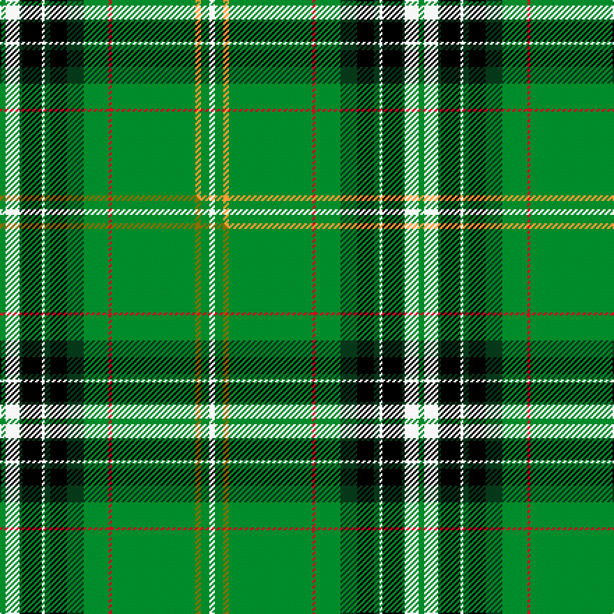

This is one **variant** — a specific cloth: this exact thread count and colourway, with its own
provenance below. It is one weaving of the [sett](/tartans/r/re/reilly-fae-the-mearns/) (the scale-free proportion — the
same cloth at any scale or shade), whose colour order is pattern [GWGKWGKGGRGYGW](/stripes/gwgkwgkggrgygw/).

Part of the [Reilly fae the Mearns](/tartans/r/re/reilly-fae-the-mearns/) tartan — the named design grouping this sett with its other cloths.

Sourced from tartans-authority.  It is a [14 stripe tartan](/stripes/stripes14/).

Original link <code>http://www.tartansauthority.com/tartan-ferret/display/10692/</code> — retired · [Internet Archive copy](https://web.archive.org/web/*/http://www.tartansauthority.com/tartan-ferret/display/10692/*)

Dataset <small>— provenance for this record, inherited from the source manifest</small>

<dl class="dataset-prov">
<dt>source</dt><dd><a href="/sources/tartans-authority/">Scottish Tartans Authority</a></dd>
<dt>data captured from</dt><dd><a href="https://github.com/thetartan/tartan-database/blob/master/data/tartans-authority/data.csv">https://github.com/thetartan/tartan-database/blob/master/data/tartans-authority/data.csv</a></dd>
<dt>data date</dt><dd>13/9/2012 <small>(this record)</small></dd>
<dt>licence</dt><dd><a href="https://creativecommons.org/licenses/by-nc-nd/4.0/">CC BY-NC-ND 4.0</a></dd>
</dl>

Capture chain <small>— the hands this data passed through, oldest first; each capture carries its own licence</small>

<ol class="capture-chain">
<li><a href="https://www.tartansauthority.com/">Scottish Tartans Authority</a> <small>the heritage body’s archive — its tartan-ferret record browser is retired; dead record links are shown unlinked, with an Internet Archive copy (ITI numbers are not SRT references)</small></li>
<li><a href="https://github.com/thetartan/tartan-database">thetartan/tartan-database</a> <small>2016-2017</small> · <a href="https://creativecommons.org/licenses/by-nc-nd/4.0/">CC BY-NC-ND 4.0</a> <small>Levko Kravets's frozen compilation — the capture we vendored, and where its CC licence text came from</small></li>
<li>this dictionary <small>captured 2026-06-10 · commit 5bf86c7566</small> <small>each re-capture is a git commit to data/sources</small></li>
</ol>

## Register references

External register numbers recorded for this tartan.

- Scottish Register of Tartans: [10692](https://www.tartanregister.gov.uk/tartanDetails?ref=10692)
- Scottish Tartans Authority (ITI): 10692

## Thread count
G/4 W10 DG2 K14 W2 DG4 K12 DG12 G18 R2 G60 LO4 G6 W/4

One full sett is **300 threads**.

## Palette
<table><thead><tr><th>Colour</th><th>Shade</th><th>OKLCh</th></tr></thead><tbody><tr><td>DG</td><td><code style="background-color:#053819;">#053819</code> <small style="color:#888">#053819</small></td><td><small style="color:#888">oklch(30.0% 0.075 151.3)</small></td></tr><tr><td>R</td><td><code style="background-color:#D60020;">#D60020</code> <small style="color:#888">#D60020</small></td><td><small style="color:#888">oklch(55.2% 0.224 25.5)</small></td></tr><tr><td>G</td><td><code style="background-color:#008B2A;">#008B2A</code> <small style="color:#888">#008B2A</small></td><td><small style="color:#888">oklch(55.4% 0.170 145.9)</small></td></tr><tr><td>K</td><td><code style="background-color:#000000;">#000000</code> <small style="color:#888">#000000</small></td><td><small style="color:#888">oklch(0.0% 0.000 0.0)</small></td></tr><tr><td>LO</td><td><code style="background-color:#FF9C34;">#FF9C34</code> <small style="color:#888">#FF9C34</small></td><td><small style="color:#888">oklch(77.9% 0.161 61.8)</small></td></tr><tr><td>W</td><td><code style="background-color:#F7F7F7;">#F7F7F7</code> <small style="color:#888">#F7F7F7</small></td><td><small style="color:#888">oklch(97.6% 0.000 89.9)</small></td></tr></tbody></table>

# Sample pattern

[Sample sheet (PDF)](swatch.pdf) — the woven sample, thread count and palette on one printable A4, rendered on demand (the same sheet the TTD print page downloads).

## Compared to the master

This cloth is one sett of its design; the master sett (the exemplar the design is anchored on) is below for comparison.

Its **ΔTartan distance** from the master is **0.30** — the same measure the nearest-tartans table ranks by (0 is identical; a re-scale of the same cloth is near 0, a recolour or a different proportion further).

<figure class="master-compare" style="margin:0">

this sett
master sett ★

<figcaption style="color:#888;font-size:smaller">One weave of this sett against the <a href="/setts/g2w5dg1k7w1dg2k6dg6g9r1g30y2g3w2/">master sett ★</a>, split on the diagonal: a shared proportion runs seamlessly across it with only the shades shifting; a different proportion breaks on it.</figcaption>
</figure>

## Nearest tartan variants

The nearest existing variants by ΔTartan distance, with this cloth at the top so the swatches line up against it.

ΔTartan

Threads

Variant

Sett

—

300

<a href="/variants/s14/g2w5dg1k7w1dg2k6dg6g9r1g30lo2g3w2~x2/">Reilly fae the Mearns (Personal)</a>

<a href="/ttd/edit/#slug=g2w5dg1k7w1dg2k6dg6g9r1g30y2g3w2~x2&amp;base=g2w5dg1k7w1dg2k6dg6g9r1g30lo2g3w2~x2" title="compare in the TTD">0.30</a>

300

<a href="/variants/s14/g2w5dg1k7w1dg2k6dg6g9r1g30y2g3w2~x2/">Reilly fae the Mearns</a>

<a href="/ttd/edit/#slug=g9lo1g2r3g28k16lb1g8lb1db8r1~x2&amp;base=g2w5dg1k7w1dg2k6dg6g9r1g30lo2g3w2~x2" title="compare in the TTD">2.09</a>

292

<a href="/variants/s11/g9lo1g2r3g28k16lb1g8lb1db8r1~x2/">New York Caledonian Club Day</a>

<a href="/ttd/edit/#slug=y24k8r4k6g76k8w14g4k9g12dy10&amp;base=g2w5dg1k7w1dg2k6dg6g9r1g30lo2g3w2~x2" title="compare in the TTD">2.37</a>

316

<a href="/variants/s11/y24k8r4k6g76k8w14g4k9g12dy10/">Offaly County, Crest Range</a>

<a href="/ttd/edit/#slug=g32lb2k7y1k1w1k2r7g5k1g3w1~x2&amp;base=g2w5dg1k7w1dg2k6dg6g9r1g30lo2g3w2~x2" title="compare in the TTD">2.38</a>

186

<a href="/variants/s12/g32lb2k7y1k1w1k2r7g5k1g3w1~x2/">Stuart/Stewart (Variant)</a>

<a href="/ttd/edit/#slug=k2g2y1g3r1g2r1g12db4k3db3k3db3k3db4g24ri2~x2~r4217018-ri5221024&amp;base=g2w5dg1k7w1dg2k6dg6g9r1g30lo2g3w2~x2" title="compare in the TTD">2.40</a>

284

<a href="/variants/s17/k2g2y1g3r1g2r1g12db4k3db3k3db3k3db4g24ri2~x2~r4217018-ri5221024/">Kennedy</a>

<a href="/ttd/edit/#slug=y24k8r4k6g76k8w14g4k9g12ly10&amp;base=g2w5dg1k7w1dg2k6dg6g9r1g30lo2g3w2~x2" title="compare in the TTD">2.41</a>

316

<a href="/variants/s11/y24k8r4k6g76k8w14g4k9g12ly10/">Offally County Crest (Fashion)</a>

<a href="/ttd/edit/#slug=k2g2y1g3r1g2r1g12db4k3db3k3db3k3db4g24ri2~x2~r4116015-ri5020024&amp;base=g2w5dg1k7w1dg2k6dg6g9r1g30lo2g3w2~x2" title="compare in the TTD">2.41</a>

284

<a href="/variants/s17/k2g2y1g3r1g2r1g12db4k3db3k3db3k3db4g24ri2~x2~r4116015-ri5020024/">Kennedy</a>

<a href="/ttd/edit/#slug=k2g2y1g3r1g2r1g12db4k3db3k3db3k3db4g24ri2~x2~r4518006-ri5221021&amp;base=g2w5dg1k7w1dg2k6dg6g9r1g30lo2g3w2~x2" title="compare in the TTD">2.41</a>

284

<a href="/variants/s17/k2g2y1g3r1g2r1g12db4k3db3k3db3k3db4g24ri2~x2~r4518006-ri5221021/">Kennedy Clan Tartan</a>

<a href="/ttd/edit/#slug=k2g2y1g3dr1g2dr1g12db4k3db3k3db3k3db4g24r2~x2~dr3010027-r4619030&amp;base=g2w5dg1k7w1dg2k6dg6g9r1g30lo2g3w2~x2" title="compare in the TTD">2.44</a>

284

<a href="/variants/s17/k2g2y1g3dr1g2dr1g12db4k3db3k3db3k3db4g24r2~x2~dr3010027-r4619030/">Kennedy</a>

<a href="/ttd/edit/#slug=t14k3t14k10dg40k1g3k1w3k1o3k1dg40k10~x2~dg4514144-g6019141&amp;base=g2w5dg1k7w1dg2k6dg6g9r1g30lo2g3w2~x2" title="compare in the TTD">2.56</a>

528

<a href="/variants/s14/t14k3t14k10dg40k1g3k1w3k1o3k1dg40k10~x2~dg4514144-g6019141/">Irish Diaspora (Fashion)</a>

## Neighbour map

Every grey dot is one of 13662 variants placed by the first two principal components of the ΔTartan feature space (42% of its variance). Red is this tartan; blue dots are its nearest — click one to open its page. The map is a flat projection of a many-dimensional space — [how to read it](/posts/neighbourhood-maps/).

<svg viewBox="0 0 640 380" role="img" style="max-width:100%;height:auto;border:1px solid #e0e0e0;border-radius:4px;display:block" xmlns="http://www.w3.org/2000/svg"><image href="/nn/cloud.v1.png" width="640" height="380"/><a href="/variants/s14/g2w5dg1k7w1dg2k6dg6g9r1g30y2g3w2~x2/"><circle cx="244.8" cy="63.4" r="4" fill="#3465a4"><title>Reilly fae the Mearns</title></circle></a><a href="/variants/s11/g9lo1g2r3g28k16lb1g8lb1db8r1~x2/"><circle cx="267.9" cy="84.5" r="4" fill="#3465a4"><title>New York Caledonian Club Day</title></circle></a><a href="/variants/s11/y24k8r4k6g76k8w14g4k9g12dy10/"><circle cx="205.5" cy="91.4" r="4" fill="#3465a4"><title>Offaly County, Crest Range</title></circle></a><a href="/variants/s12/g32lb2k7y1k1w1k2r7g5k1g3w1~x2/"><circle cx="305.6" cy="49.0" r="4" fill="#3465a4"><title>Stuart/Stewart (Variant)</title></circle></a><a href="/variants/s17/k2g2y1g3r1g2r1g12db4k3db3k3db3k3db4g24ri2~x2~r4217018-ri5221024/"><circle cx="259.8" cy="67.2" r="4" fill="#3465a4"><title>Kennedy</title></circle></a><a href="/variants/s11/y24k8r4k6g76k8w14g4k9g12ly10/"><circle cx="203.1" cy="91.0" r="4" fill="#3465a4"><title>Offally County Crest (Fashion)</title></circle></a><a href="/variants/s17/k2g2y1g3r1g2r1g12db4k3db3k3db3k3db4g24ri2~x2~r4116015-ri5020024/"><circle cx="260.1" cy="67.3" r="4" fill="#3465a4"><title>Kennedy</title></circle></a><a href="/variants/s17/k2g2y1g3r1g2r1g12db4k3db3k3db3k3db4g24ri2~x2~r4518006-ri5221021/"><circle cx="259.6" cy="67.0" r="4" fill="#3465a4"><title>Kennedy Clan Tartan</title></circle></a><a href="/variants/s17/k2g2y1g3dr1g2dr1g12db4k3db3k3db3k3db4g24r2~x2~dr3010027-r4619030/"><circle cx="260.9" cy="67.8" r="4" fill="#3465a4"><title>Kennedy</title></circle></a><a href="/variants/s14/t14k3t14k10dg40k1g3k1w3k1o3k1dg40k10~x2~dg4514144-g6019141/"><circle cx="268.8" cy="61.2" r="4" fill="#3465a4"><title>Irish Diaspora (Fashion)</title></circle></a><circle cx="243.2" cy="62.6" r="5" fill="#c00000"/><text x="320" y="376" text-anchor="middle" font-size="11" fill="#999">ground</text><text x="11" y="190" text-anchor="middle" font-size="11" fill="#999" transform="rotate(-90 11 190)">complexity</text></svg>

ID: /variants/s14/g2w5dg1k7w1dg2k6dg6g9r1g30lo2g3w2~x2/
