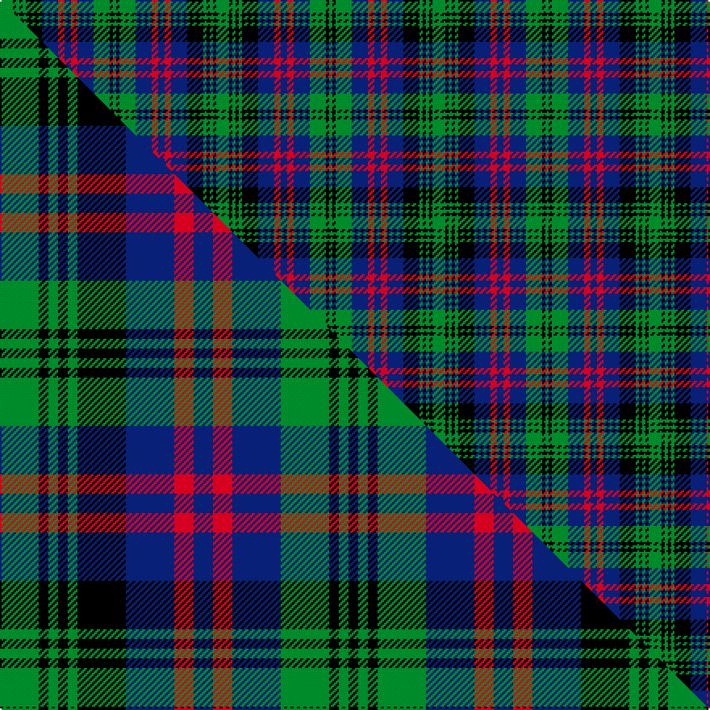

This page is one **sett** — a single exact thread-count. It belongs to the [tartan](/setts/g4k1g1k1g1k5db5r2db2r2db5g5k1g1/)
(the same proportion at any scale), whose colour order is pattern [GKGBRBRBKGKGKG](/stripes/gkgbrbrbkgkgkg/).

Part of the [MacLachlan Hunting](/tartans/maclachlan-hunting/) tartan — the named design grouping this sett with its other cloths.

Sourced from weddslist.  It is a [14 stripe tartan](/stripes/stripes14/).

Original link [http://www.weddslist.com/cgi-bin/tartans/pg.pl?source=sts](http://www.weddslist.com/cgi-bin/tartans/pg.pl?source=sts)

Dataset <small>— provenance for this record, inherited from the source manifest</small>

<dl class="dataset-prov">
<dt>source</dt><dd><a href="/sources/weddslist/">Weddslist</a></dd>
<dt>data captured from</dt><dd><a href="https://github.com/thetartan/tartan-database/blob/master/data/weddslist/data.csv">https://github.com/thetartan/tartan-database/blob/master/data/weddslist/data.csv</a></dd>
<dt>data date</dt><dd>2016-11-17 <small>(dataset default)</small></dd>
<dt>licence</dt><dd><a href="https://creativecommons.org/licenses/by-nc-nd/4.0/">CC BY-NC-ND 4.0</a></dd>
</dl>

Capture chain <small>— the hands this data passed through, oldest first; each capture carries its own licence</small>

<ol class="capture-chain">
<li><a href="https://www.weddslist.com/tartans/">Weddslist</a> <small>the living privately compiled reference</small></li>
<li><a href="https://github.com/thetartan/tartan-database">thetartan/tartan-database</a> <small>2016-2017</small> · <a href="https://creativecommons.org/licenses/by-nc-nd/4.0/">CC BY-NC-ND 4.0</a> <small>Levko Kravets's frozen compilation — the capture we vendored, and where its CC licence text came from</small></li>
<li>this dictionary <small>captured 2026-06-10 · commit 5bf86c7566</small> <small>each re-capture is a git commit to data/sources</small></li>
</ol>

## Thread count
G/8 K2 G2 K2 G2 K10 DB10 R4 DB4 R4 DB10 G10 K2 G/2

One full sett is **134 threads**.

## Palette
<table><thead><tr><th>Colour</th><th>Shade</th><th>OKLCh</th></tr></thead><tbody><tr><td>DB</td><td><code style="background-color:#082077;">#082077</code> <small style="color:#888">#082077</small></td><td><small style="color:#888">oklch(30.0% 0.149 265.1)</small></td></tr><tr><td>G</td><td><code style="background-color:#008B2A;">#008B2A</code> <small style="color:#888">#008B2A</small></td><td><small style="color:#888">oklch(55.4% 0.170 145.9)</small></td></tr><tr><td>K</td><td><code style="background-color:#000000;">#000000</code> <small style="color:#888">#000000</small></td><td><small style="color:#888">oklch(0.0% 0.000 0.0)</small></td></tr><tr><td>R</td><td><code style="background-color:#D60020;">#D60020</code> <small style="color:#888">#D60020</small></td><td><small style="color:#888">oklch(55.2% 0.224 25.5)</small></td></tr></tbody></table>

# Sample pattern

## Compared to the master

This cloth is one sett of its design; the master sett (the exemplar the design is anchored on) is below for comparison.

Its **ΔTartan distance** from the master is **1.00** — the same measure the nearest-tartans table ranks by (0 is identical; a re-scale of the same cloth is near 0, a recolour or a different proportion further).

<figure class="master-compare" style="margin:0">

this sett
master sett ★

<figcaption style="color:#888;font-size:smaller">One weave of this sett against the <a href="/setts/g4k1g1k1g1k5db5r2db2r2db5g5k1g1k1/">master sett ★</a>, split on the diagonal: a shared proportion runs seamlessly across it with only the shades shifting; a different proportion breaks on it.</figcaption>
</figure>

## Nearest tartan variants

The nearest existing variants by ΔTartan distance, with this cloth at the top so the swatches line up against it.

ΔTartan

Threads

Variant

Sett

—

134

<a href="/variants/s14/g4k1g1k1g1k5db5r2db2r2db5g5k1g1~x2/">MacLachlan, Hunting</a>

<a href="/ttd/edit/#slug=g4k1g1k1g1k5db5r2db2r2db5g5k1g1k1~x6&amp;base=g4k1g1k1g1k5db5r2db2r2db5g5k1g1~x2" title="compare in the TTD">1.00</a>

414

<a href="/variants/s15/g4k1g1k1g1k5db5r2db2r2db5g5k1g1k1~x6/">MacLachlan Hunting</a>

<a href="/ttd/edit/#slug=db12k2db2k2db2k12g12r3g12k12db12r3~x2&amp;base=g4k1g1k1g1k5db5r2db2r2db5g5k1g1~x2" title="compare in the TTD">1.31</a>

314

<a href="/variants/s12/db12k2db2k2db2k12g12r3g12k12db12r3~x2/">Glenalmond College</a>

<a href="/ttd/edit/#slug=db11k3db3k3db3k11r3g13k3g13r3k11db11k3db3~x2&amp;base=g4k1g1k1g1k5db5r2db2r2db5g5k1g1~x2" title="compare in the TTD">1.36</a>

360

<a href="/variants/s15/db11k3db3k3db3k11r3g13k3g13r3k11db11k3db3~x2/">Fletcher</a>

<a href="/ttd/edit/#slug=db8r2db2r3db12r2k12g12r3g2r2g8&amp;base=g4k1g1k1g1k5db5r2db2r2db5g5k1g1~x2" title="compare in the TTD">1.41</a>

120

<a href="/variants/s12/db8r2db2r3db12r2k12g12r3g2r2g8/">MacDonald MINI Design Tartan</a>

<a href="/ttd/edit/#slug=db6k1db1k1db1k6g6lb2g6k6db6k1g2~x4&amp;base=g4k1g1k1g1k5db5r2db2r2db5g5k1g1~x2" title="compare in the TTD">1.48</a>

328

<a href="/variants/s13/db6k1db1k1db1k6g6lb2g6k6db6k1g2~x4/">Cheape of Torosay #2 (Personal)</a>

<a href="/ttd/edit/#slug=db6k1db1k1db1k6g6r2g6k6db6k1db2~x4&amp;base=g4k1g1k1g1k5db5r2db2r2db5g5k1g1~x2" title="compare in the TTD">1.58</a>

328

<a href="/variants/s13/db6k1db1k1db1k6g6r2g6k6db6k1db2~x4/">Murray #2</a>

<a href="/ttd/edit/#slug=db6k1db1k1db1k6g6r2g6k6db6k1db2~x2&amp;base=g4k1g1k1g1k5db5r2db2r2db5g5k1g1~x2" title="compare in the TTD">1.58</a>

164

<a href="/variants/s13/db6k1db1k1db1k6g6r2g6k6db6k1db2~x2/">New South Wales Scottish Rifles</a>

<a href="/ttd/edit/#slug=db6k1db1k1db1k6g6r2g6k6db6k1db2&amp;base=g4k1g1k1g1k5db5r2db2r2db5g5k1g1~x2" title="compare in the TTD">1.58</a>

82

<a href="/variants/s13/db6k1db1k1db1k6g6r2g6k6db6k1db2/">Murray</a>

<a href="/ttd/edit/#slug=db8r2db2r4db10r2k11g10r4g2r2g8~x2&amp;base=g4k1g1k1g1k5db5r2db2r2db5g5k1g1~x2" title="compare in the TTD">1.64</a>

228

<a href="/variants/s12/db8r2db2r4db10r2k11g10r4g2r2g8~x2/">MacDonald #6</a>

<a href="/ttd/edit/#slug=r3t10k10g10r3g10k10t2k2t2k2t5k2~x4&amp;base=g4k1g1k1g1k5db5r2db2r2db5g5k1g1~x2" title="compare in the TTD">1.64</a>

548

<a href="/variants/s13/r3t10k10g10r3g10k10t2k2t2k2t5k2~x4/">Blairgowrie High School (SA)</a>

## Neighbour map

Every grey dot is one of 13621 variants placed by the first two principal components of the ΔTartan feature space (42% of its variance). Red is this tartan; blue dots are its nearest — click one to open its page.

<svg viewBox="0 0 640 380" role="img" style="max-width:100%;height:auto;border:1px solid #e0e0e0;border-radius:4px;display:block" xmlns="http://www.w3.org/2000/svg"><image href="/nn/cloud.v1.png" width="640" height="380"/><a href="/variants/s15/g4k1g1k1g1k5db5r2db2r2db5g5k1g1k1~x6/"><circle cx="88.7" cy="201.1" r="4" fill="#3465a4"><title>MacLachlan Hunting</title></circle></a><a href="/variants/s12/db12k2db2k2db2k12g12r3g12k12db12r3~x2/"><circle cx="104.0" cy="204.8" r="4" fill="#3465a4"><title>Glenalmond College</title></circle></a><a href="/variants/s15/db11k3db3k3db3k11r3g13k3g13r3k11db11k3db3~x2/"><circle cx="94.2" cy="206.8" r="4" fill="#3465a4"><title>Fletcher</title></circle></a><a href="/variants/s12/db8r2db2r3db12r2k12g12r3g2r2g8/"><circle cx="100.8" cy="196.4" r="4" fill="#3465a4"><title>MacDonald MINI Design Tartan</title></circle></a><a href="/variants/s13/db6k1db1k1db1k6g6lb2g6k6db6k1g2~x4/"><circle cx="105.1" cy="201.9" r="4" fill="#3465a4"><title>Cheape of Torosay #2 (Personal)</title></circle></a><a href="/variants/s13/db6k1db1k1db1k6g6r2g6k6db6k1db2~x4/"><circle cx="119.6" cy="201.1" r="4" fill="#3465a4"><title>Murray #2</title></circle></a><a href="/variants/s13/db6k1db1k1db1k6g6r2g6k6db6k1db2~x2/"><circle cx="119.6" cy="201.1" r="4" fill="#3465a4"><title>New South Wales Scottish Rifles</title></circle></a><a href="/variants/s13/db6k1db1k1db1k6g6r2g6k6db6k1db2/"><circle cx="119.6" cy="201.1" r="4" fill="#3465a4"><title>Murray</title></circle></a><a href="/variants/s12/db8r2db2r4db10r2k11g10r4g2r2g8~x2/"><circle cx="83.9" cy="208.3" r="4" fill="#3465a4"><title>MacDonald #6</title></circle></a><a href="/variants/s13/r3t10k10g10r3g10k10t2k2t2k2t5k2~x4/"><circle cx="93.5" cy="204.9" r="4" fill="#3465a4"><title>Blairgowrie High School (SA)</title></circle></a><circle cx="93.0" cy="206.4" r="5" fill="#c00000"/><text x="320" y="376" text-anchor="middle" font-size="11" fill="#999">ground</text><text x="11" y="190" text-anchor="middle" font-size="11" fill="#999" transform="rotate(-90 11 190)">complexity</text></svg>

ID: /variants/s14/g4k1g1k1g1k5db5r2db2r2db5g5k1g1~x2/
