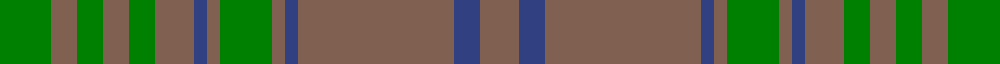
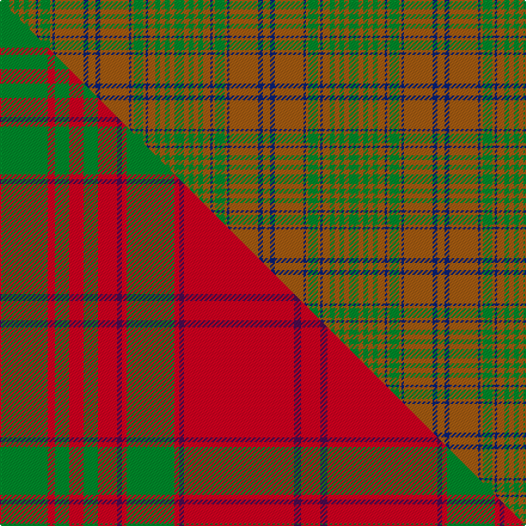

This is one **variant** — a specific cloth: this exact thread count and colourway, with its own
provenance below. It is one weaving of the [sett](/tartans/m/ma/macalister-of-glenbarr-2/) (the scale-free proportion — the
same cloth at any scale or shade), whose colour order is pattern [GRGRGRBRGRBRBR](/stripes/grgrgrbrgrbrbr/).

Part of the [MacAlister of Glenbarr](/tartans/m/ma/macalister-of-glenbarr-2/) tartan — the named design grouping this sett with its other cloths.

Sourced from weddslist.  It is a [14 stripe tartan](/stripes/stripes14/).

Original link [http://www.weddslist.com/cgi-bin/tartans/pg.pl?source=sts](http://www.weddslist.com/cgi-bin/tartans/pg.pl?source=sts)

Dataset <small>— provenance for this record, inherited from the source manifest</small>

<dl class="dataset-prov">
<dt>source</dt><dd><a href="/sources/weddslist/">Weddslist</a></dd>
<dt>data captured from</dt><dd><a href="https://github.com/thetartan/tartan-database/blob/master/data/weddslist/data.csv">https://github.com/thetartan/tartan-database/blob/master/data/weddslist/data.csv</a></dd>
<dt>data date</dt><dd>2016-11-17 <small>(dataset default)</small></dd>
<dt>licence</dt><dd><a href="https://creativecommons.org/licenses/by-nc-nd/4.0/">CC BY-NC-ND 4.0</a></dd>
</dl>

Capture chain <small>— the hands this data passed through, oldest first; each capture carries its own licence</small>

<ol class="capture-chain">
<li><a href="https://www.weddslist.com/tartans/">Weddslist</a> <small>the living privately compiled reference</small></li>
<li><a href="https://github.com/thetartan/tartan-database">thetartan/tartan-database</a> <small>2016-2017</small> · <a href="https://creativecommons.org/licenses/by-nc-nd/4.0/">CC BY-NC-ND 4.0</a> <small>Levko Kravets's frozen compilation — the capture we vendored, and where its CC licence text came from</small></li>
<li>this dictionary <small>captured 2026-06-10 · commit 5bf86c7566</small> <small>each re-capture is a git commit to data/sources</small></li>
</ol>

## Thread count
G/8 O4 G4 O4 G4 O6 DB2 O2 G8 O2 DB2 O24 DB4 O/6

One full sett is **146 threads**.

## Palette
<table><thead><tr><th>Colour</th><th>Shade</th><th>OKLCh</th></tr></thead><tbody><tr><td>DB</td><td><code style="background-color:#082077;">#082077</code> <small style="color:#888">#082077</small></td><td><small style="color:#888">oklch(30.0% 0.149 265.1)</small></td></tr><tr><td>G</td><td><code style="background-color:#008B2A;">#008B2A</code> <small style="color:#888">#008B2A</small></td><td><small style="color:#888">oklch(55.4% 0.170 145.9)</small></td></tr><tr><td>O</td><td><code style="background-color:#A65C11;">#A65C11</code> <small style="color:#888">#A65C11</small></td><td><small style="color:#888">oklch(55.0% 0.125 58.3)</small></td></tr></tbody></table>

# Sample pattern

## Compared to the master

This cloth is one sett of its design; the master sett (the exemplar the design is anchored on) is below for comparison.

Its **ΔTartan distance** from the master is **5.18** — the same measure the nearest-tartans table ranks by (0 is identical; a re-scale of the same cloth is near 0, a recolour or a different proportion further).

<figure class="master-compare" style="margin:0">

this sett
master sett ★

<figcaption style="color:#888;font-size:smaller">One weave of this sett against the <a href="/setts/g20r3g6r6g6r8dp2r2g20r2dp2r46dp3r8/">master sett ★</a>, split on the diagonal: a shared proportion runs seamlessly across it with only the shades shifting; a different proportion breaks on it.</figcaption>
</figure>

## Nearest tartan variants

The nearest existing variants by ΔTartan distance, with this cloth at the top so the swatches line up against it.

ΔTartan

Threads

Variant

Sett

—

146

<a href="/variants/s14/g4o2g2o2g2o3db1o1g4o1db1o12db2o3~x2/">MacAlister of Glenbarr</a>

<a href="/ttd/edit/#slug=g8o5g5o5g5o6db1o2g8o2db1o24db4o6~x2&amp;base=g4o2g2o2g2o3db1o1g4o1db1o12db2o3~x2" title="compare in the TTD">0.52</a>

300

<a href="/variants/s14/g8o5g5o5g5o6db1o2g8o2db1o24db4o6~x2/">MacGillivray Htg (Clan)</a>

<a href="/ttd/edit/#slug=dg8o5dg5o5dg5o6db1o2dg8o2db1o24db4o6~x2~dg4514144-o4912045&amp;base=g4o2g2o2g2o3db1o1g4o1db1o12db2o3~x2" title="compare in the TTD">0.58</a>

300

<a href="/variants/s14/dg8o5dg5o5dg5o6db1o2dg8o2db1o24db4o6~x2~dg4514144-o4912045/">MacGillivray Hunting</a>

<a href="/ttd/edit/#slug=n33g10r3g3r3g3r8n10r3n10r8g3r3g3r3g10n33r3~x2&amp;base=g4o2g2o2g2o3db1o1g4o1db1o12db2o3~x2" title="compare in the TTD">3.24</a>

536

<a href="/variants/s18/n33g10r3g3r3g3r8n10r3n10r8g3r3g3r3g10n33r3~x2/">Gray (Personal)</a>

<a href="/ttd/edit/#slug=g22r4g22r22g2r3g2r3g2r3y2~x2&amp;base=g4o2g2o2g2o3db1o1g4o1db1o12db2o3~x2" title="compare in the TTD">3.24</a>

300

<a href="/variants/s11/g22r4g22r22g2r3g2r3g2r3y2~x2/">MacRea / MacRae</a>

<a href="/ttd/edit/#slug=dr4y34do20y4do8y6r2y5do2y3dr4&amp;base=g4o2g2o2g2o3db1o1g4o1db1o12db2o3~x2" title="compare in the TTD">3.32</a>

176

<a href="/variants/s11/dr4y34do20y4do8y6r2y5do2y3dr4/">Morgan of Wales</a>

<a href="/ttd/edit/#slug=r4y34do20y4do8y6ri2y5do2y3r4~r4315012-ri5221030&amp;base=g4o2g2o2g2o3db1o1g4o1db1o12db2o3~x2" title="compare in the TTD">3.46</a>

176

<a href="/variants/s11/r4y34do20y4do8y6ri2y5do2y3r4~r4315012-ri5221030/">Morgan Welsh Name Tartan</a>

<a href="/ttd/edit/#slug=r3n33g10r3g3r3g3r8n10r3~x2&amp;base=g4o2g2o2g2o3db1o1g4o1db1o12db2o3~x2" title="compare in the TTD">3.48</a>

304

<a href="/variants/s10/r3n33g10r3g3r3g3r8n10r3~x2/">Gray (Name)</a>

<a href="/ttd/edit/#slug=dy13r1dy2r2dy2r1dy2r5dy11r1dy2g2dy2r1dy2g7~x2&amp;base=g4o2g2o2g2o3db1o1g4o1db1o12db2o3~x2" title="compare in the TTD">3.51</a>

184

<a href="/variants/s16/dy13r1dy2r2dy2r1dy2r5dy11r1dy2g2dy2r1dy2g7~x2/">Särna District Tartan</a>

<a href="/ttd/edit/#slug=dr3o28do5o5do33o5do5o28ly3~x2&amp;base=g4o2g2o2g2o3db1o1g4o1db1o12db2o3~x2" title="compare in the TTD">3.76</a>

448

<a href="/variants/s9/dr3o28do5o5do33o5do5o28ly3~x2/">MacIver of Strathendry Htg (Personal</a>

<a href="/ttd/edit/#slug=g14dy4db4dy27g3dy4ly5dy4g3dy27db4dy4g14ly5~x2~g6019141-dy3908078-db3514276-ly8117093&amp;base=g4o2g2o2g2o3db1o1g4o1db1o12db2o3~x2" title="compare in the TTD">3.88</a>

450

<a href="/variants/s14/g14dy4db4dy27g3dy4ly5dy4g3dy27db4dy4g14ly5~x2~g6019141-dy3908078-db3514276-ly8117093/">Invertere (Daks #2)</a>

## Neighbour map

Every grey dot is one of 13662 variants placed by the first two principal components of the ΔTartan feature space (42% of its variance). Red is this tartan; blue dots are its nearest — click one to open its page. The map is a flat projection of a many-dimensional space — [how to read it](/posts/neighbourhood-maps/).

<svg viewBox="0 0 640 380" role="img" style="max-width:100%;height:auto;border:1px solid #e0e0e0;border-radius:4px;display:block" xmlns="http://www.w3.org/2000/svg"><image href="/nn/cloud.v1.png" width="640" height="380"/><a href="/variants/s14/g8o5g5o5g5o6db1o2g8o2db1o24db4o6~x2/"><circle cx="462.2" cy="182.8" r="4" fill="#3465a4"><title>MacGillivray Htg (Clan)</title></circle></a><a href="/variants/s14/dg8o5dg5o5dg5o6db1o2dg8o2db1o24db4o6~x2~dg4514144-o4912045/"><circle cx="483.8" cy="187.4" r="4" fill="#3465a4"><title>MacGillivray Hunting</title></circle></a><a href="/variants/s18/n33g10r3g3r3g3r8n10r3n10r8g3r3g3r3g10n33r3~x2/"><circle cx="424.1" cy="196.6" r="4" fill="#3465a4"><title>Gray (Personal)</title></circle></a><a href="/variants/s11/g22r4g22r22g2r3g2r3g2r3y2~x2/"><circle cx="393.6" cy="190.2" r="4" fill="#3465a4"><title>MacRea / MacRae</title></circle></a><a href="/variants/s11/dr4y34do20y4do8y6r2y5do2y3dr4/"><circle cx="428.3" cy="177.3" r="4" fill="#3465a4"><title>Morgan of Wales</title></circle></a><a href="/variants/s11/r4y34do20y4do8y6ri2y5do2y3r4~r4315012-ri5221030/"><circle cx="430.7" cy="176.3" r="4" fill="#3465a4"><title>Morgan Welsh Name Tartan</title></circle></a><a href="/variants/s10/r3n33g10r3g3r3g3r8n10r3~x2/"><circle cx="421.9" cy="213.4" r="4" fill="#3465a4"><title>Gray (Name)</title></circle></a><a href="/variants/s16/dy13r1dy2r2dy2r1dy2r5dy11r1dy2g2dy2r1dy2g7~x2/"><circle cx="409.7" cy="171.9" r="4" fill="#3465a4"><title>Särna District Tartan</title></circle></a><a href="/variants/s9/dr3o28do5o5do33o5do5o28ly3~x2/"><circle cx="415.4" cy="207.1" r="4" fill="#3465a4"><title>MacIver of Strathendry Htg (Personal</title></circle></a><a href="/variants/s14/g14dy4db4dy27g3dy4ly5dy4g3dy27db4dy4g14ly5~x2~g6019141-dy3908078-db3514276-ly8117093/"><circle cx="352.4" cy="203.4" r="4" fill="#3465a4"><title>Invertere (Daks #2)</title></circle></a><circle cx="418.9" cy="202.1" r="5" fill="#c00000"/><text x="320" y="376" text-anchor="middle" font-size="11" fill="#999">ground</text><text x="11" y="190" text-anchor="middle" font-size="11" fill="#999" transform="rotate(-90 11 190)">complexity</text></svg>

ID: /variants/s14/g4o2g2o2g2o3db1o1g4o1db1o12db2o3~x2/
