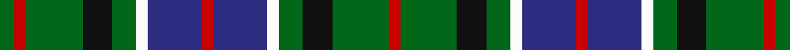

This page is one **sett** — a single exact thread-count. It belongs to the [tartan](/setts/g5r4g19k10g8w4db18r4/)
(the same proportion at any scale), whose colour order is pattern [GRGKGWBRBWGKGR](/stripes/grgkgwbrbwgkgr/).

Sourced from register-of-tartans.  It is a [14 stripe tartan](/stripes/stripes14/).

Original link https://www.tartanregister.gov.uk/tartanDetails.aspx?ref=818

## Register references

External register numbers recorded for this tartan.

- Scottish Register of Tartans: [818](https://www.tartanregister.gov.uk/tartanDetails.aspx?ref=818)
- Scottish Tartans Authority (ITI): 6050

## Thread count
G/10 R8 G38 K20 G16 W8 DB36 R8 DB36 W8 G16 K20 G38 R/8

One full sett is **522 threads**.

## Palette

Palette: <strong>Tartan Register</strong>
<table><thead><tr><th>Colour</th><th>Threads</th><th>Shade</th><th>Base</th><th>OKLCh</th></tr></thead><tbody><tr><td>G/</td><td style="text-align:right;font-variant-numeric:tabular-nums">10</td><td><code style="background-color:#006818;">#006818</code> <small style="color:#888">#006818</small></td><td>G <code style="background-color:#006100;">#006100</code></td><td><small style="color:#888">oklch(45.0% 0.142 145.0)</small></td></tr><tr><td>R</td><td style="text-align:right;font-variant-numeric:tabular-nums">8</td><td><code style="background-color:#C80000;">#C80000</code> <small style="color:#888">#C80000</small></td><td>R <code style="background-color:#CC0000;">#CC0000</code></td><td><small style="color:#888">oklch(52.3% 0.215 29.2)</small></td></tr><tr><td>G</td><td style="text-align:right;font-variant-numeric:tabular-nums">38</td><td><code style="background-color:#006818;">#006818</code> <small style="color:#888">#006818</small></td><td>G <code style="background-color:#006100;">#006100</code></td><td><small style="color:#888">oklch(45.0% 0.142 145.0)</small></td></tr><tr><td>K</td><td style="text-align:right;font-variant-numeric:tabular-nums">20</td><td><code style="background-color:#101010;">#101010</code> <small style="color:#888">#101010</small></td><td>K <code style="background-color:#000000;">#000000</code></td><td><small style="color:#888">oklch(17.3% 0.000 89.9)</small></td></tr><tr><td>G</td><td style="text-align:right;font-variant-numeric:tabular-nums">16</td><td><code style="background-color:#006818;">#006818</code> <small style="color:#888">#006818</small></td><td>G <code style="background-color:#006100;">#006100</code></td><td><small style="color:#888">oklch(45.0% 0.142 145.0)</small></td></tr><tr><td>W</td><td style="text-align:right;font-variant-numeric:tabular-nums">8</td><td><code style="background-color:#FCFCFC;">#FCFCFC</code> <small style="color:#888">#FCFCFC</small></td><td>W <code style="background-color:#F7F7F7;">#F7F7F7</code></td><td><small style="color:#888">oklch(99.1% 0.000 89.9)</small></td></tr><tr><td>DB</td><td style="text-align:right;font-variant-numeric:tabular-nums">36</td><td><code style="background-color:#2C2C80;">#2C2C80</code> <small style="color:#888">#2C2C80</small></td><td>B <code style="background-color:#2A418A;">#2A418A</code></td><td><small style="color:#888">oklch(35.0% 0.138 276.6)</small></td></tr><tr><td>R</td><td style="text-align:right;font-variant-numeric:tabular-nums">8</td><td><code style="background-color:#C80000;">#C80000</code> <small style="color:#888">#C80000</small></td><td>R <code style="background-color:#CC0000;">#CC0000</code></td><td><small style="color:#888">oklch(52.3% 0.215 29.2)</small></td></tr><tr><td>DB</td><td style="text-align:right;font-variant-numeric:tabular-nums">36</td><td><code style="background-color:#2C2C80;">#2C2C80</code> <small style="color:#888">#2C2C80</small></td><td>B <code style="background-color:#2A418A;">#2A418A</code></td><td><small style="color:#888">oklch(35.0% 0.138 276.6)</small></td></tr><tr><td>W</td><td style="text-align:right;font-variant-numeric:tabular-nums">8</td><td><code style="background-color:#FCFCFC;">#FCFCFC</code> <small style="color:#888">#FCFCFC</small></td><td>W <code style="background-color:#F7F7F7;">#F7F7F7</code></td><td><small style="color:#888">oklch(99.1% 0.000 89.9)</small></td></tr><tr><td>G</td><td style="text-align:right;font-variant-numeric:tabular-nums">16</td><td><code style="background-color:#006818;">#006818</code> <small style="color:#888">#006818</small></td><td>G <code style="background-color:#006100;">#006100</code></td><td><small style="color:#888">oklch(45.0% 0.142 145.0)</small></td></tr><tr><td>K</td><td style="text-align:right;font-variant-numeric:tabular-nums">20</td><td><code style="background-color:#101010;">#101010</code> <small style="color:#888">#101010</small></td><td>K <code style="background-color:#000000;">#000000</code></td><td><small style="color:#888">oklch(17.3% 0.000 89.9)</small></td></tr><tr><td>G</td><td style="text-align:right;font-variant-numeric:tabular-nums">38</td><td><code style="background-color:#006818;">#006818</code> <small style="color:#888">#006818</small></td><td>G <code style="background-color:#006100;">#006100</code></td><td><small style="color:#888">oklch(45.0% 0.142 145.0)</small></td></tr><tr><td>R/</td><td style="text-align:right;font-variant-numeric:tabular-nums">8</td><td><code style="background-color:#C80000;">#C80000</code> <small style="color:#888">#C80000</small></td><td>R <code style="background-color:#CC0000;">#CC0000</code></td><td><small style="color:#888">oklch(52.3% 0.215 29.2)</small></td></tr></tbody></table>

## Nearest tartans

The nearest existing variants by ΔTartan distance, with this tartan at the top so the swatches line up against it.

ΔTartan

Tartan

Sett

—

<a href="/ttd/edit/#slug=g5r4g19k10g8w4db18r4~x2">CSCA</a> <a class="nn-out" href="/variants/s14/g5r4g19k10g8w4db18r4~x2/" title="open its dictionary page">↗</a>

0.98

<a href="/ttd/edit/#slug=g8ly2k6g11r2dt12k12r2k6ly2k4r3~x2&amp;base=g5r4g19k10g8w4db18r4~x2">Mandela Commemorative</a> <a class="nn-out" href="/variants/s12/g8ly2k6g11r2dt12k12r2k6ly2k4r3~x2/" title="open its dictionary page">↗</a>

1.01

<a href="/ttd/edit/#slug=db6r2db6ly3g6k1g2lb2g2k1g6k1g2lb2~x2&amp;base=g5r4g19k10g8w4db18r4~x2">Presbyterian Synod of Living Waters (USA)</a> <a class="nn-out" href="/variants/s14/db6r2db6ly3g6k1g2lb2g2k1g6k1g2lb2~x2/" title="open its dictionary page">↗</a>

1.01

<a href="/ttd/edit/#slug=b18r5b3r5b3k20g18ly4g18k20b20k6b6&amp;base=g5r4g19k10g8w4db18r4~x2">Keith (District)</a> <a class="nn-out" href="/variants/s13/b18r5b3r5b3k20g18ly4g18k20b20k6b6/" title="open its dictionary page">↗</a>

1.01

<a href="/ttd/edit/#slug=k2g4k1g1k2db3k1w1k1db3k2g1k1g4k2r1~x6&amp;base=g5r4g19k10g8w4db18r4~x2">MacKean dress Family/Clan Tartan</a> <a class="nn-out" href="/variants/s16/k2g4k1g1k2db3k1w1k1db3k2g1k1g4k2r1~x6/" title="open its dictionary page">↗</a>

1.03

<a href="/ttd/edit/#slug=db4g1db1g6k1g6db1g1db4w1k4g1k4ly1~x4&amp;base=g5r4g19k10g8w4db18r4~x2">MacAlpine (1906)</a> <a class="nn-out" href="/variants/s14/db4g1db1g6k1g6db1g1db4w1k4g1k4ly1~x4/" title="open its dictionary page">↗</a>

1.07

<a href="/ttd/edit/#slug=dg11t3dg4ly3dg3ly4dg3dy13g3t3g4dg3~x2&amp;base=g5r4g19k10g8w4db18r4~x2">Harmony 2 &amp; 3</a> <a class="nn-out" href="/variants/s12/dg11t3dg4ly3dg3ly4dg3dy13g3t3g4dg3~x2/" title="open its dictionary page">↗</a>

1.08

<a href="/ttd/edit/#slug=b12k2b2k2b2k10g5r3w2r3g5k10b11k2b2~x2&amp;base=g5r4g19k10g8w4db18r4~x2">Blanton (Dress)</a> <a class="nn-out" href="/variants/s15/b12k2b2k2b2k10g5r3w2r3g5k10b11k2b2~x2/" title="open its dictionary page">↗</a>

1.08

<a href="/variants/s10/k3r1g5k3w1dp3~x2/">Wilson's No.194</a>

1.09

<a href="/ttd/edit/#slug=db6r2db6ly3g6k1g2lb2g2k1g6~x2&amp;base=g5r4g19k10g8w4db18r4~x2">Presbyterian Synod (US) (Corporate)</a> <a class="nn-out" href="/variants/s11/db6r2db6ly3g6k1g2lb2g2k1g6~x2/" title="open its dictionary page">↗</a>

1.11

<a href="/ttd/edit/#slug=t4k1t1k1t1k4g2w1g2t2g2w1g2k4t5k1t1~x2&amp;base=g5r4g19k10g8w4db18r4~x2">Arbuthnott</a> <a class="nn-out" href="/variants/s17/t4k1t1k1t1k4g2w1g2t2g2w1g2k4t5k1t1~x2/" title="open its dictionary page">↗</a>

## Neighbour map

Every grey dot is one of 14360 variants placed by the first two principal components of the ΔTartan feature space (44% of its variance). Red is this tartan; blue dots are its nearest — click one to open its page.

<svg viewBox="0 0 640 380" role="img" style="max-width:100%;height:auto;border:1px solid #e0e0e0;border-radius:4px;display:block" xmlns="http://www.w3.org/2000/svg"><image href="/nn/cloud.v1.png" width="640" height="380"/><a href="/variants/s12/g8ly2k6g11r2dt12k12r2k6ly2k4r3~x2/"><circle cx="111.1" cy="194.7" r="4" fill="#3465a4"><title>Mandela Commemorative</title></circle></a><a href="/variants/s14/db6r2db6ly3g6k1g2lb2g2k1g6k1g2lb2~x2/"><circle cx="109.4" cy="177.6" r="4" fill="#3465a4"><title>Presbyterian Synod of Living Waters (USA)</title></circle></a><a href="/variants/s13/b18r5b3r5b3k20g18ly4g18k20b20k6b6/"><circle cx="110.6" cy="199.2" r="4" fill="#3465a4"><title>Keith (District)</title></circle></a><a href="/variants/s16/k2g4k1g1k2db3k1w1k1db3k2g1k1g4k2r1~x6/"><circle cx="119.5" cy="226.4" r="4" fill="#3465a4"><title>MacKean dress Family/Clan Tartan</title></circle></a><a href="/variants/s14/db4g1db1g6k1g6db1g1db4w1k4g1k4ly1~x4/"><circle cx="159.6" cy="199.7" r="4" fill="#3465a4"><title>MacAlpine (1906)</title></circle></a><a href="/variants/s12/dg11t3dg4ly3dg3ly4dg3dy13g3t3g4dg3~x2/"><circle cx="117.3" cy="209.3" r="4" fill="#3465a4"><title>Harmony 2 &amp; 3</title></circle></a><a href="/variants/s15/b12k2b2k2b2k10g5r3w2r3g5k10b11k2b2~x2/"><circle cx="135.1" cy="181.5" r="4" fill="#3465a4"><title>Blanton (Dress)</title></circle></a><a href="/variants/s10/k3r1g5k3w1dp3~x2/"><circle cx="108.9" cy="221.8" r="4" fill="#3465a4"><title>Wilson's No.194</title></circle></a><a href="/variants/s11/db6r2db6ly3g6k1g2lb2g2k1g6~x2/"><circle cx="123.1" cy="195.6" r="4" fill="#3465a4"><title>Presbyterian Synod (US) (Corporate)</title></circle></a><a href="/variants/s17/t4k1t1k1t1k4g2w1g2t2g2w1g2k4t5k1t1~x2/"><circle cx="126.6" cy="208.1" r="4" fill="#3465a4"><title>Arbuthnott</title></circle></a><circle cx="123.2" cy="206.4" r="5" fill="#c00000"/></svg>

ID: /variants/s14/g5r4g19k10g8w4db18r4~x2/
