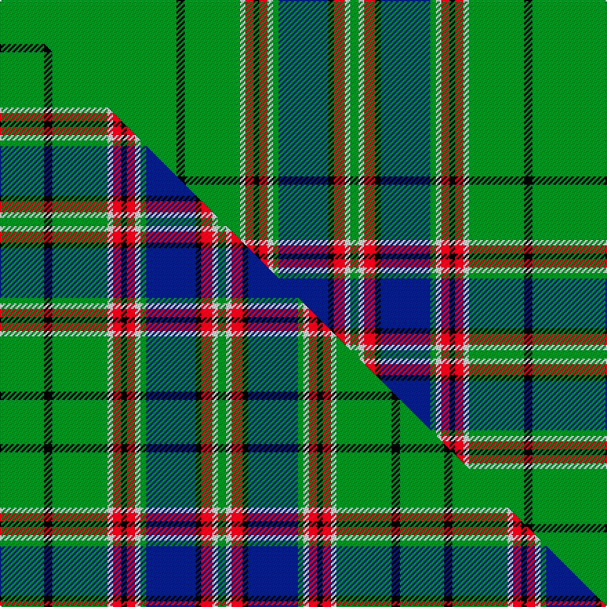

This is one **variant** — a specific cloth: this exact thread count and colourway, with its own
provenance below. It is one weaving of the [sett](/tartans/m/ma/macfarlane-hunting/) (the scale-free proportion — the
same cloth at any scale or shade), whose colour order is pattern [GKGWRKRWGBKRWG](/stripes/gkgwrkrwgbkrwg/).

Part of the [MacFarlane Hunting](/tartans/m/ma/macfarlane-hunting/) tartan — the named design grouping this sett with its other cloths.

Sourced from weddslist.  It is a [14 stripe tartan](/stripes/stripes14/).

Original link [http://www.weddslist.com/cgi-bin/tartans/pg.pl?source=sts](http://www.weddslist.com/cgi-bin/tartans/pg.pl?source=sts)

Dataset <small>— provenance for this record, inherited from the source manifest</small>

<dl class="dataset-prov">
<dt>source</dt><dd><a href="/sources/weddslist/">Weddslist</a></dd>
<dt>data captured from</dt><dd><a href="https://github.com/thetartan/tartan-database/blob/master/data/weddslist/data.csv">https://github.com/thetartan/tartan-database/blob/master/data/weddslist/data.csv</a></dd>
<dt>data date</dt><dd>2016-11-17 <small>(dataset default)</small></dd>
<dt>licence</dt><dd><a href="https://creativecommons.org/licenses/by-nc-nd/4.0/">CC BY-NC-ND 4.0</a></dd>
</dl>

Capture chain <small>— the hands this data passed through, oldest first; each capture carries its own licence</small>

<ol class="capture-chain">
<li><a href="https://www.weddslist.com/tartans/">Weddslist</a> <small>the living privately compiled reference</small></li>
<li><a href="https://github.com/thetartan/tartan-database">thetartan/tartan-database</a> <small>2016-2017</small> · <a href="https://creativecommons.org/licenses/by-nc-nd/4.0/">CC BY-NC-ND 4.0</a> <small>Levko Kravets's frozen compilation — the capture we vendored, and where its CC licence text came from</small></li>
<li>this dictionary <small>captured 2026-06-10 · commit 5bf86c7566</small> <small>each re-capture is a git commit to data/sources</small></li>
</ol>

## Thread count
G/128 K6 G40 W4 R6 K4 R6 W4 G4 DB36 K4 R8 W4 G/6

One full sett is **386 threads**.

## Palette
<table><thead><tr><th>Colour</th><th>Shade</th><th>OKLCh</th></tr></thead><tbody><tr><td>DB</td><td><code style="background-color:#082077;">#082077</code> <small style="color:#888">#082077</small></td><td><small style="color:#888">oklch(30.0% 0.149 265.1)</small></td></tr><tr><td>G</td><td><code style="background-color:#008B2A;">#008B2A</code> <small style="color:#888">#008B2A</small></td><td><small style="color:#888">oklch(55.4% 0.170 145.9)</small></td></tr><tr><td>K</td><td><code style="background-color:#000000;">#000000</code> <small style="color:#888">#000000</small></td><td><small style="color:#888">oklch(0.0% 0.000 0.0)</small></td></tr><tr><td>W</td><td><code style="background-color:#F7F7F7;">#F7F7F7</code> <small style="color:#888">#F7F7F7</small></td><td><small style="color:#888">oklch(97.6% 0.000 89.9)</small></td></tr><tr><td>R</td><td><code style="background-color:#D60020;">#D60020</code> <small style="color:#888">#D60020</small></td><td><small style="color:#888">oklch(55.2% 0.224 25.5)</small></td></tr></tbody></table>

# Sample pattern

[Sample sheet (PDF)](swatch.pdf) — the woven sample, thread count and palette on one printable A4, rendered on demand (the same sheet the TTD print page downloads).

## Compared to the master

This cloth is one sett of its design; the master sett (the exemplar the design is anchored on) is below for comparison.

Its **ΔTartan distance** from the master is **0.59** — the same measure the nearest-tartans table ranks by (0 is identical; a re-scale of the same cloth is near 0, a recolour or a different proportion further).

<figure class="master-compare" style="margin:0">

this sett
master sett ★

<figcaption style="color:#888;font-size:smaller">One weave of this sett against the <a href="/setts/g16k3g20w2r3k2r3w2g2db18k2r4w2g3/">master sett ★</a>, split on the diagonal: a shared proportion runs seamlessly across it with only the shades shifting; a different proportion breaks on it.</figcaption>
</figure>

## Nearest tartan variants

The nearest existing variants by ΔTartan distance, with this cloth at the top so the swatches line up against it.

ΔTartan

Threads

Variant

Sett

—

386

<a href="/variants/s14/g64k3g20w2r3k2r3w2g2db18k2r4w2g3~x2/">MacFarlane, hunting</a>

<a href="/ttd/edit/#slug=g26t2k3ly1k1lr1k1g4dr2k1dr2lr1~x4&amp;base=g64k3g20w2r3k2r3w2g2db18k2r4w2g3~x2" title="compare in the TTD">2.41</a>

252

<a href="/variants/s12/g26t2k3ly1k1lr1k1g4dr2k1dr2lr1~x4/">Princess Mary #2</a>

<a href="/ttd/edit/#slug=g64k4db9dy2db4dy2db4g11r8db2r4w3~x2&amp;base=g64k3g20w2r3k2r3w2g2db18k2r4w2g3~x2" title="compare in the TTD">2.42</a>

334

<a href="/variants/s12/g64k4db9dy2db4dy2db4g11r8db2r4w3~x2/">Sillars (Name)</a>

<a href="/ttd/edit/#slug=y1k1b1g30k1g2k2g1b10w1~x2&amp;base=g64k3g20w2r3k2r3w2g2db18k2r4w2g3~x2" title="compare in the TTD">2.46</a>

196

<a href="/variants/s10/y1k1b1g30k1g2k2g1b10w1~x2/">Celtic F.C.</a>

<a href="/ttd/edit/#slug=dr4g40db12lo2db12g30k2g4k2g4lo2g3k3~x2&amp;base=g64k3g20w2r3k2r3w2g2db18k2r4w2g3~x2" title="compare in the TTD">2.66</a>

466

<a href="/variants/s13/dr4g40db12lo2db12g30k2g4k2g4lo2g3k3~x2/">Bartlett from Winnetka, Illinois</a>

<a href="/ttd/edit/#slug=y8g77db18k7db9k6db18g64r4g5r4g9y4g5r6&amp;base=g64k3g20w2r3k2r3w2g2db18k2r4w2g3~x2" title="compare in the TTD">2.66</a>

474

<a href="/variants/s15/y8g77db18k7db9k6db18g64r4g5r4g9y4g5r6/">Kennedy #2</a>

<a href="/ttd/edit/#slug=lb2k6lb2g34w1g5w1g5w1g34y1k13lb1~x2&amp;base=g64k3g20w2r3k2r3w2g2db18k2r4w2g3~x2" title="compare in the TTD">2.72</a>

418

<a href="/variants/s13/lb2k6lb2g34w1g5w1g5w1g34y1k13lb1~x2/">Stirling Castle (Corporate)</a>

<a href="/ttd/edit/#slug=g29db1g2db2g2db3g2db5r1k1r1db5g2db3g2db2g2db1g14y3~x2&amp;base=g64k3g20w2r3k2r3w2g2db18k2r4w2g3~x2" title="compare in the TTD">2.79</a>

268

<a href="/variants/s20/g29db1g2db2g2db3g2db5r1k1r1db5g2db3g2db2g2db1g14y3~x2/">Murphy and his Gang (Phoenix Arizona) (Personal)</a>

<a href="/ttd/edit/#slug=g70db3k9w4k4dr4k3db12g9k4g4y4~x2&amp;base=g64k3g20w2r3k2r3w2g2db18k2r4w2g3~x2" title="compare in the TTD">2.86</a>

372

<a href="/variants/s12/g70db3k9w4k4dr4k3db12g9k4g4y4~x2/">Canmore Highland Games</a>

<a href="/ttd/edit/#slug=g70db3k9w4k4dp4k3db12g9k4g4y4~x2&amp;base=g64k3g20w2r3k2r3w2g2db18k2r4w2g3~x2" title="compare in the TTD">2.87</a>

372

<a href="/variants/s12/g70db3k9w4k4dp4k3db12g9k4g4y4~x2/">Canmore Highland Games (Corporate)</a>

<a href="/ttd/edit/#slug=g32lb2k7y1k1w1k2r7g5k1g3w1~x2&amp;base=g64k3g20w2r3k2r3w2g2db18k2r4w2g3~x2" title="compare in the TTD">2.98</a>

186

<a href="/variants/s12/g32lb2k7y1k1w1k2r7g5k1g3w1~x2/">Stuart/Stewart (Variant)</a>

## Neighbour map

Every grey dot is one of 13662 variants placed by the first two principal components of the ΔTartan feature space (42% of its variance). Red is this tartan; blue dots are its nearest — click one to open its page. The map is a flat projection of a many-dimensional space — [how to read it](/posts/neighbourhood-maps/).

<svg viewBox="0 0 640 380" role="img" style="max-width:100%;height:auto;border:1px solid #e0e0e0;border-radius:4px;display:block" xmlns="http://www.w3.org/2000/svg"><image href="/nn/cloud.v1.png" width="640" height="380"/><a href="/variants/s12/g26t2k3ly1k1lr1k1g4dr2k1dr2lr1~x4/"><circle cx="341.4" cy="56.4" r="4" fill="#3465a4"><title>Princess Mary #2</title></circle></a><a href="/variants/s12/g64k4db9dy2db4dy2db4g11r8db2r4w3~x2/"><circle cx="343.6" cy="57.3" r="4" fill="#3465a4"><title>Sillars (Name)</title></circle></a><a href="/variants/s10/y1k1b1g30k1g2k2g1b10w1~x2/"><circle cx="385.4" cy="81.1" r="4" fill="#3465a4"><title>Celtic F.C.</title></circle></a><a href="/variants/s13/dr4g40db12lo2db12g30k2g4k2g4lo2g3k3~x2/"><circle cx="351.5" cy="105.1" r="4" fill="#3465a4"><title>Bartlett from Winnetka, Illinois</title></circle></a><a href="/variants/s15/y8g77db18k7db9k6db18g64r4g5r4g9y4g5r6/"><circle cx="345.6" cy="100.9" r="4" fill="#3465a4"><title>Kennedy #2</title></circle></a><a href="/variants/s13/lb2k6lb2g34w1g5w1g5w1g34y1k13lb1~x2/"><circle cx="393.7" cy="70.2" r="4" fill="#3465a4"><title>Stirling Castle (Corporate)</title></circle></a><a href="/variants/s20/g29db1g2db2g2db3g2db5r1k1r1db5g2db3g2db2g2db1g14y3~x2/"><circle cx="382.2" cy="67.5" r="4" fill="#3465a4"><title>Murphy and his Gang (Phoenix Arizona) (Personal)</title></circle></a><a href="/variants/s12/g70db3k9w4k4dr4k3db12g9k4g4y4~x2/"><circle cx="307.6" cy="63.9" r="4" fill="#3465a4"><title>Canmore Highland Games</title></circle></a><a href="/variants/s12/g70db3k9w4k4dp4k3db12g9k4g4y4~x2/"><circle cx="307.2" cy="63.7" r="4" fill="#3465a4"><title>Canmore Highland Games (Corporate)</title></circle></a><a href="/variants/s12/g32lb2k7y1k1w1k2r7g5k1g3w1~x2/"><circle cx="305.6" cy="49.0" r="4" fill="#3465a4"><title>Stuart/Stewart (Variant)</title></circle></a><circle cx="375.1" cy="58.1" r="5" fill="#c00000"/><text x="320" y="376" text-anchor="middle" font-size="11" fill="#999">ground</text><text x="11" y="190" text-anchor="middle" font-size="11" fill="#999" transform="rotate(-90 11 190)">complexity</text></svg>

ID: /variants/s14/g64k3g20w2r3k2r3w2g2db18k2r4w2g3~x2/
