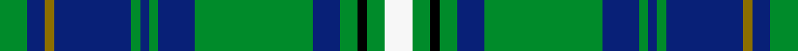

This is one **variant** — a specific cloth: this exact thread count and colourway, with its own
provenance below. It is one weaving of the [sett](/setts/g6db4y2db17g2db2g2db8g26db6g4k2g4w6/) (the scale-free proportion — the
same cloth at any scale or shade), whose colour order is pattern [GBGBGBGBGBGKGW](/stripes/gbgbgbgbgbgkgw/).

Part of the [Hay Hunting](/tartans/h/ha/hay-hunting/) tartan — the named design grouping this sett with its other cloths.

Sourced from register-of-tartans.  It is a [14 stripe tartan](/stripes/stripes14/).

Original link [https://www.tartanregister.gov.uk/tartanDetails.aspx?ref=6021](https://www.tartanregister.gov.uk/tartanDetails.aspx?ref=6021)

Dataset <small>— provenance for this record, inherited from the source manifest</small>

<dl class="dataset-prov">
<dt>source</dt><dd><a href="/sources/register-of-tartans/">Scottish Register of Tartans</a></dd>
<dt>data captured from</dt><dd><a href="https://github.com/thetartan/tartan-database/blob/master/data/register-of-tartans/data.csv">https://github.com/thetartan/tartan-database/blob/master/data/register-of-tartans/data.csv</a></dd>
<dt>data date</dt><dd>2017-01-06 <small>(dataset default)</small></dd>
<dt>licence</dt><dd><a href="https://www.tartanregister.gov.uk/copyright">Crown copyright</a></dd>
</dl>

Capture chain <small>— the hands this data passed through, oldest first; each capture carries its own licence</small>

<ol class="capture-chain">
<li><a href="https://www.tartanregister.gov.uk/">Scottish Register of Tartans</a> · <a href="https://www.tartanregister.gov.uk/copyright">Crown copyright</a> <small>the living register — still published by National Records of Scotland</small></li>
<li><a href="https://github.com/thetartan/tartan-database">thetartan/tartan-database</a> <small>2016-2017</small> · <a href="https://creativecommons.org/licenses/by-nc-nd/4.0/">CC BY-NC-ND 4.0</a> <small>Levko Kravets's frozen compilation — the capture we vendored, and where its CC licence text came from</small></li>
<li>this dictionary <small>captured 2026-06-10 · commit 5bf86c7566</small> <small>each re-capture is a git commit to data/sources</small></li>
</ol>

## Register references

External register numbers recorded for this tartan.

- Scottish Register of Tartans: [6021](https://www.tartanregister.gov.uk/tartanDetails.aspx?ref=6021)

## Thread count
G/12 DB8 Y4 DB34 G4 DB4 G4 DB16 G52 DB12 G8 K4 G8 W/12

One full sett is **340 threads**.

## Palette
<table><thead><tr><th>Colour</th><th>Shade</th><th>OKLCh</th></tr></thead><tbody><tr><td>DB</td><td><code style="background-color:#082077;">#082077</code> <small style="color:#888">#082077</small></td><td><small style="color:#888">oklch(30.0% 0.149 265.1)</small></td></tr><tr><td>G</td><td><code style="background-color:#008B2A;">#008B2A</code> <small style="color:#888">#008B2A</small></td><td><small style="color:#888">oklch(55.4% 0.170 145.9)</small></td></tr><tr><td>K</td><td><code style="background-color:#000000;">#000000</code> <small style="color:#888">#000000</small></td><td><small style="color:#888">oklch(0.0% 0.000 0.0)</small></td></tr><tr><td>W</td><td><code style="background-color:#F7F7F7;">#F7F7F7</code> <small style="color:#888">#F7F7F7</small></td><td><small style="color:#888">oklch(97.6% 0.000 89.9)</small></td></tr><tr><td>Y</td><td><code style="background-color:#8B6E00;">#8B6E00</code> <small style="color:#888">#8B6E00</small></td><td><small style="color:#888">oklch(55.1% 0.113 90.4)</small></td></tr></tbody></table>

# Sample pattern

## Nearest tartan variants

The nearest existing variants by ΔTartan distance, with this cloth at the top so the swatches line up against it.

ΔTartan

Threads

Variant

Sett

—

340

<a href="/variants/s14/g6db4y2db17g2db2g2db8g26db6g4k2g4w6~x2/">Hay Hunting</a>

<a href="/ttd/edit/#slug=k6g3k3g28db4g4db10g4db4g4db24g5w3~x2&amp;base=g6db4y2db17g2db2g2db8g26db6g4k2g4w6~x2" title="compare in the TTD">2.18</a>

390

<a href="/variants/s13/k6g3k3g28db4g4db10g4db4g4db24g5w3~x2/">Marthas Vineyard (District)</a>

<a href="/ttd/edit/#slug=t18db2k2db2k1t2k8g1ly1g6k8t14k2g2~x2&amp;base=g6db4y2db17g2db2g2db8g26db6g4k2g4w6~x2" title="compare in the TTD">2.29</a>

236

<a href="/variants/s14/t18db2k2db2k1t2k8g1ly1g6k8t14k2g2~x2/">Angove, the Black Swan (Name)</a>

<a href="/ttd/edit/#slug=db8g8k1r1ly1db2g2k1r1ly1db8g8~x4&amp;base=g6db4y2db17g2db2g2db8g26db6g4k2g4w6~x2" title="compare in the TTD">2.34</a>

272

<a href="/variants/s12/db8g8k1r1ly1db2g2k1r1ly1db8g8~x4/">Chieftain's (Corporate)</a>

<a href="/ttd/edit/#slug=g10k1g10db1g1k1g1k1db10k1lo1dr1~x4&amp;base=g6db4y2db17g2db2g2db8g26db6g4k2g4w6~x2" title="compare in the TTD">2.45</a>

268

<a href="/variants/s12/g10k1g10db1g1k1g1k1db10k1lo1dr1~x4/">Old Dobbs County (District)</a>

<a href="/ttd/edit/#slug=ly3g3dr2g16k2db24k2g16dr2g3lb3~x2&amp;base=g6db4y2db17g2db2g2db8g26db6g4k2g4w6~x2" title="compare in the TTD">2.51</a>

292

<a href="/variants/s11/ly3g3dr2g16k2db24k2g16dr2g3lb3~x2/">Loch Tay (District)</a>

<a href="/ttd/edit/#slug=b15g5b5g60b13g10db67g5k5g5k5g13y10&amp;base=g6db4y2db17g2db2g2db8g26db6g4k2g4w6~x2" title="compare in the TTD">2.55</a>

411

<a href="/variants/s13/b15g5b5g60b13g10db67g5k5g5k5g13y10/">Beatrice, Princess.. (hunting)</a>

<a href="/ttd/edit/#slug=y3g3r2g16k2db24k2g16r2g3lb3~x2&amp;base=g6db4y2db17g2db2g2db8g26db6g4k2g4w6~x2" title="compare in the TTD">2.58</a>

292

<a href="/variants/s11/y3g3r2g16k2db24k2g16r2g3lb3~x2/">Loch Tay</a>

<a href="/ttd/edit/#slug=t25k3t3k3g6k3g6k3g6k3t3k3t25r3t3y3t3r3~x2&amp;base=g6db4y2db17g2db2g2db8g26db6g4k2g4w6~x2" title="compare in the TTD">2.60</a>

372

<a href="/variants/s18/t25k3t3k3g6k3g6k3g6k3t3k3t25r3t3y3t3r3~x2/">Borders Health Board</a>

<a href="/ttd/edit/#slug=t30y2t2y2t5g5k15t5g20dr2k3dr2g20t5k15g5t20y2t2~x2&amp;base=g6db4y2db17g2db2g2db8g26db6g4k2g4w6~x2" title="compare in the TTD">2.65</a>

584

<a href="/variants/s19/t30y2t2y2t5g5k15t5g20dr2k3dr2g20t5k15g5t20y2t2~x2/">Pennsylvania (District)</a>

<a href="/ttd/edit/#slug=g6k3g6k3t3k3t25r3t3y3~x2&amp;base=g6db4y2db17g2db2g2db8g26db6g4k2g4w6~x2" title="compare in the TTD">2.66</a>

214

<a href="/variants/s10/g6k3g6k3t3k3t25r3t3y3~x2/">Borders Health Board (Corporate)</a>

## Neighbour map

Every grey dot is one of 13621 variants placed by the first two principal components of the ΔTartan feature space (42% of its variance). Red is this tartan; blue dots are its nearest — click one to open its page. The map is a flat projection of a many-dimensional space — [how to read it](/posts/neighbourhood-maps/).

<svg viewBox="0 0 640 380" role="img" style="max-width:100%;height:auto;border:1px solid #e0e0e0;border-radius:4px;display:block" xmlns="http://www.w3.org/2000/svg"><image href="/nn/cloud.v1.png" width="640" height="380"/><a href="/variants/s13/k6g3k3g28db4g4db10g4db4g4db24g5w3~x2/"><circle cx="223.4" cy="160.4" r="4" fill="#3465a4"><title>Marthas Vineyard (District)</title></circle></a><a href="/variants/s14/t18db2k2db2k1t2k8g1ly1g6k8t14k2g2~x2/"><circle cx="206.6" cy="112.7" r="4" fill="#3465a4"><title>Angove, the Black Swan (Name)</title></circle></a><a href="/variants/s12/db8g8k1r1ly1db2g2k1r1ly1db8g8~x4/"><circle cx="182.6" cy="164.4" r="4" fill="#3465a4"><title>Chieftain's (Corporate)</title></circle></a><a href="/variants/s12/g10k1g10db1g1k1g1k1db10k1lo1dr1~x4/"><circle cx="253.9" cy="134.8" r="4" fill="#3465a4"><title>Old Dobbs County (District)</title></circle></a><a href="/variants/s11/ly3g3dr2g16k2db24k2g16dr2g3lb3~x2/"><circle cx="207.6" cy="128.6" r="4" fill="#3465a4"><title>Loch Tay (District)</title></circle></a><a href="/variants/s13/b15g5b5g60b13g10db67g5k5g5k5g13y10/"><circle cx="219.7" cy="130.0" r="4" fill="#3465a4"><title>Beatrice, Princess.. (hunting)</title></circle></a><a href="/variants/s11/y3g3r2g16k2db24k2g16r2g3lb3~x2/"><circle cx="210.5" cy="128.4" r="4" fill="#3465a4"><title>Loch Tay</title></circle></a><a href="/variants/s18/t25k3t3k3g6k3g6k3g6k3t3k3t25r3t3y3t3r3~x2/"><circle cx="238.1" cy="127.9" r="4" fill="#3465a4"><title>Borders Health Board</title></circle></a><a href="/variants/s19/t30y2t2y2t5g5k15t5g20dr2k3dr2g20t5k15g5t20y2t2~x2/"><circle cx="172.0" cy="121.1" r="4" fill="#3465a4"><title>Pennsylvania (District)</title></circle></a><a href="/variants/s10/g6k3g6k3t3k3t25r3t3y3~x2/"><circle cx="229.0" cy="155.7" r="4" fill="#3465a4"><title>Borders Health Board (Corporate)</title></circle></a><circle cx="224.1" cy="133.9" r="5" fill="#c00000"/><text x="320" y="376" text-anchor="middle" font-size="11" fill="#999">ground</text><text x="11" y="190" text-anchor="middle" font-size="11" fill="#999" transform="rotate(-90 11 190)">complexity</text></svg>

ID: /variants/s14/g6db4y2db17g2db2g2db8g26db6g4k2g4w6~x2/
