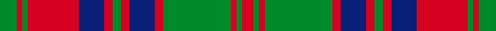

This is one **variant** — a specific cloth: this exact thread count and colourway, with its own
provenance below. It is one weaving of the [sett](/setts/g6r2g2r18db9r3g3r3db9r3g24r2g2r4/) (the scale-free proportion — the
same cloth at any scale or shade), whose colour order is pattern [GRGRBRGRBRGRGR](/stripes/grgrbrgrbrgrgr/).

Sourced from house-of-tartan.  It is a [14 stripe tartan](/stripes/stripes14/).

Original link [http://www.house-of-tartan.scotland.net/house/TartanViewjs.asp?colr=Def&tnam=898](http://www.house-of-tartan.scotland.net/house/TartanViewjs.asp?colr=Def&tnam=898)

## Provenance

Earliest known date: pre 1930 A kilt in this material was brought into the Scottish Tartans Museum in Comrie which could be dated to before 1930. It belonged to a member of the Stewart Society at that time. The threadcount and the name were documented by Mackinlay, who studied and collected tartans between 1930 and 1950.

3 attestations — the source records this cloth was collapsed from (oldest owns this page)

<ul>
<li>pre 1930 — Stewart of Urrard Clan Tartan (house-of-tartan, <a href="http://www.house-of-tartan.scotland.net/house/TartanViewjs.asp?colr=Def&tnam=898">record</a>) </li>
<li>undated — Stuart/Stewart of Urrard (register-of-tartans, <a href="https://www.tartanregister.gov.uk/tartanDetails.aspx?ref=4021">record</a>)  <em>A kilt in this material was brought into the Scottish Tartans Society which could be dated to before 1930. It belonged to a member of the Stewart Society at that time. The threadcount and the name were documented by Mackinlay, who studied and collected tartans between 1930 and 1950. The Society also has a sample by Coulson Bonner which has the blue as black.</em></li>
<li>undated — Stewart of Urrard (weddslist, <a href="http://www.weddslist.com/cgi-bin/tartans/pg.pl?source=sts">record</a>) </li>
</ul>

Dataset <small>— provenance for this record, inherited from the source manifest</small>

<dl class="dataset-prov">
<dt>source</dt><dd><a href="/sources/house-of-tartan/">House of Tartan</a></dd>
<dt>data captured from</dt><dd><a href="https://github.com/thetartan/tartan-database/blob/master/data/house-of-tartan/data.csv">https://github.com/thetartan/tartan-database/blob/master/data/house-of-tartan/data.csv</a></dd>
<dt>data date</dt><dd>pre 1930 <small>(this record)</small></dd>
<dt>licence</dt><dd><a href="https://creativecommons.org/licenses/by-nc-nd/4.0/">CC BY-NC-ND 4.0</a></dd>
</dl>

Capture chain <small>— the hands this data passed through, oldest first; each capture carries its own licence</small>

<ol class="capture-chain">
<li><a href="http://www.house-of-tartan.scotland.net/">House of Tartan</a> <small>the weaver/retailer's database — the site is now offline; the URL is kept as the ultimate source's identity</small></li>
<li><a href="https://github.com/thetartan/tartan-database">thetartan/tartan-database</a> <small>2016-2017</small> · <a href="https://creativecommons.org/licenses/by-nc-nd/4.0/">CC BY-NC-ND 4.0</a> <small>Levko Kravets's frozen compilation — the capture we vendored, and where its CC licence text came from</small></li>
<li>this dictionary <small>captured 2026-06-10 · commit 5bf86c7566</small> <small>each re-capture is a git commit to data/sources</small></li>
</ol>

## Register references

External register numbers recorded for this tartan.

- Scottish Register of Tartans: [4021](https://www.tartanregister.gov.uk/tartanDetails.aspx?ref=4021)
- Scottish Tartans World Register: 898

## Thread count
G/12 R4 G4 R36 DB18 R6 G6 R6 DB18 R6 G48 R4 G4 R/8

One full sett is **340 threads**.

## Palette
<table><thead><tr><th>Colour</th><th>Shade</th><th>OKLCh</th></tr></thead><tbody><tr><td>DB</td><td><code style="background-color:#082077;">#082077</code> <small style="color:#888">#082077</small></td><td><small style="color:#888">oklch(30.0% 0.149 265.1)</small></td></tr><tr><td>G</td><td><code style="background-color:#008B2A;">#008B2A</code> <small style="color:#888">#008B2A</small></td><td><small style="color:#888">oklch(55.4% 0.170 145.9)</small></td></tr><tr><td>R</td><td><code style="background-color:#D60020;">#D60020</code> <small style="color:#888">#D60020</small></td><td><small style="color:#888">oklch(55.2% 0.224 25.5)</small></td></tr></tbody></table>

# Sample pattern

## Nearest tartan variants

The nearest existing variants by ΔTartan distance, with this cloth at the top so the swatches line up against it.

ΔTartan

Threads

Variant

Sett

—

340

<a href="/variants/s14/g6r2g2r18db9r3g3r3db9r3g24r2g2r4~x2/">Stewart of Urrard Clan Tartan</a>

<a href="/ttd/edit/#slug=r28g2r2g2db12g18r2g18db12r15g2r3~x2&amp;base=g6r2g2r18db9r3g3r3db9r3g24r2g2r4~x2" title="compare in the TTD">1.60</a>

402

<a href="/variants/s12/r28g2r2g2db12g18r2g18db12r15g2r3~x2/">Frasers Highlanders (Military?)</a>

<a href="/ttd/edit/#slug=g18db3g3db3g2db8r23db2r4g2~x2&amp;base=g6r2g2r18db9r3g3r3db9r3g24r2g2r4~x2" title="compare in the TTD">1.62</a>

232

<a href="/variants/s10/g18db3g3db3g2db8r23db2r4g2~x2/">McGlynn</a>

<a href="/ttd/edit/#slug=r6g28r6dp2r6dp19r6dp2r6g28r6dp2~x2~dp1607327&amp;base=g6r2g2r18db9r3g3r3db9r3g24r2g2r4~x2" title="compare in the TTD">1.81</a>

452

<a href="/variants/s12/r6g28r6dp2r6dp19r6dp2r6g28r6dp2~x2~dp1607327/">Wilson's No.119</a>

<a href="/ttd/edit/#slug=g8r4g1r1g1r14db8g4r1g1r1g4r8g1r1g1r1db8g8r2g4~x4&amp;base=g6r2g2r18db9r3g3r3db9r3g24r2g2r4~x2" title="compare in the TTD">1.91</a>

608

<a href="/variants/s21/g8r4g1r1g1r14db8g4r1g1r1g4r8g1r1g1r1db8g8r2g4~x4/">Matheson (Clan)</a>

<a href="/ttd/edit/#slug=r1g1r9db1r1g9r1db9r1g1r9g1r1~x4&amp;base=g6r2g2r18db9r3g3r3db9r3g24r2g2r4~x2" title="compare in the TTD">1.91</a>

352

<a href="/variants/s13/r1g1r9db1r1g9r1db9r1g1r9g1r1~x4/">Robertson Clan Tartan</a>

<a href="/ttd/edit/#slug=r1g1r9db1r1g9r1db9r1g1r9g1r1&amp;base=g6r2g2r18db9r3g3r3db9r3g24r2g2r4~x2" title="compare in the TTD">1.91</a>

88

<a href="/variants/s13/r1g1r9db1r1g9r1db9r1g1r9g1r1/">Robertson</a>

<a href="/ttd/edit/#slug=r1g1r9db1r1g9r1db9r1g1r9g1r1~x2&amp;base=g6r2g2r18db9r3g3r3db9r3g24r2g2r4~x2" title="compare in the TTD">1.94</a>

176

<a href="/variants/s13/r1g1r9db1r1g9r1db9r1g1r9g1r1~x2/">Robertson</a>

<a href="/ttd/edit/#slug=g6r2g2r18dp9r3g3r3dp9r3g24r2g2r4~x2&amp;base=g6r2g2r18db9r3g3r3db9r3g24r2g2r4~x2" title="compare in the TTD">2.00</a>

340

<a href="/variants/s14/g6r2g2r18dp9r3g3r3dp9r3g24r2g2r4~x2/">Stewart of Urrard (Clan?)</a>

<a href="/ttd/edit/#slug=g20db2g2db2g2db8r24db2r3&amp;base=g6r2g2r18db9r3g3r3db9r3g24r2g2r4~x2" title="compare in the TTD">2.11</a>

107

<a href="/variants/s9/g20db2g2db2g2db8r24db2r3/">Lindsay</a>

<a href="/ttd/edit/#slug=g20db2g2db2g2db8r24db2r3~x2&amp;base=g6r2g2r18db9r3g3r3db9r3g24r2g2r4~x2" title="compare in the TTD">2.11</a>

214

<a href="/variants/s9/g20db2g2db2g2db8r24db2r3~x2/">Lindsay</a>

## Neighbour map

Every grey dot is one of 13621 variants placed by the first two principal components of the ΔTartan feature space (42% of its variance). Red is this tartan; blue dots are its nearest — click one to open its page.

<svg viewBox="0 0 640 380" role="img" style="max-width:100%;height:auto;border:1px solid #e0e0e0;border-radius:4px;display:block" xmlns="http://www.w3.org/2000/svg"><image href="/nn/cloud.v1.png" width="640" height="380"/><a href="/variants/s12/r28g2r2g2db12g18r2g18db12r15g2r3~x2/"><circle cx="263.4" cy="182.5" r="4" fill="#3465a4"><title>Frasers Highlanders (Military?)</title></circle></a><a href="/variants/s10/g18db3g3db3g2db8r23db2r4g2~x2/"><circle cx="259.7" cy="186.7" r="4" fill="#3465a4"><title>McGlynn</title></circle></a><a href="/variants/s12/r6g28r6dp2r6dp19r6dp2r6g28r6dp2~x2~dp1607327/"><circle cx="302.7" cy="183.1" r="4" fill="#3465a4"><title>Wilson's No.119</title></circle></a><a href="/variants/s21/g8r4g1r1g1r14db8g4r1g1r1g4r8g1r1g1r1db8g8r2g4~x4/"><circle cx="248.8" cy="160.5" r="4" fill="#3465a4"><title>Matheson (Clan)</title></circle></a><a href="/variants/s13/r1g1r9db1r1g9r1db9r1g1r9g1r1~x4/"><circle cx="293.4" cy="176.1" r="4" fill="#3465a4"><title>Robertson Clan Tartan</title></circle></a><a href="/variants/s13/r1g1r9db1r1g9r1db9r1g1r9g1r1/"><circle cx="293.4" cy="176.1" r="4" fill="#3465a4"><title>Robertson</title></circle></a><a href="/variants/s13/r1g1r9db1r1g9r1db9r1g1r9g1r1~x2/"><circle cx="293.4" cy="176.1" r="4" fill="#3465a4"><title>Robertson</title></circle></a><a href="/variants/s14/g6r2g2r18dp9r3g3r3dp9r3g24r2g2r4~x2/"><circle cx="270.6" cy="176.4" r="4" fill="#3465a4"><title>Stewart of Urrard (Clan?)</title></circle></a><a href="/variants/s9/g20db2g2db2g2db8r24db2r3/"><circle cx="277.4" cy="183.7" r="4" fill="#3465a4"><title>Lindsay</title></circle></a><a href="/variants/s9/g20db2g2db2g2db8r24db2r3~x2/"><circle cx="277.4" cy="183.7" r="4" fill="#3465a4"><title>Lindsay</title></circle></a><circle cx="260.0" cy="175.7" r="5" fill="#c00000"/><text x="320" y="376" text-anchor="middle" font-size="11" fill="#999">ground</text><text x="11" y="190" text-anchor="middle" font-size="11" fill="#999" transform="rotate(-90 11 190)">complexity</text></svg>

ID: /variants/s14/g6r2g2r18db9r3g3r3db9r3g24r2g2r4~x2/
