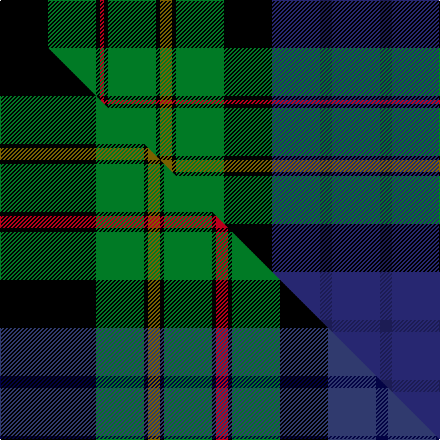

This is one **variant** — a specific cloth: this exact thread count and colourway, with its own
provenance below. It is one weaving of the [sett](/tartans/g/go/gow-hunting-2/) (the scale-free proportion — the
same cloth at any scale or shade), whose colour order is pattern [BBBKGKGKGKRKGK](/stripes/bbbkgkgkgkrkgk/).

Part of the [Gow Hunting](/tartans/g/go/gow-hunting-2/) tartan — the named design grouping this sett with its other cloths.

Sourced from house-of-tartan.  It is a [14 stripe tartan](/stripes/stripes14/).

Original link [http://www.house-of-tartan.scotland.net/house/TartanViewjs.asp?colr=Def&tnam=1893](http://www.house-of-tartan.scotland.net/house/TartanViewjs.asp?colr=Def&tnam=1893)

## Provenance

Earliest known date: pre 2003 MacDonells of Keppoch are an independant branch of Clan Donald.

Dataset <small>— provenance for this record, inherited from the source manifest</small>

<dl class="dataset-prov">
<dt>source</dt><dd><a href="/sources/house-of-tartan/">House of Tartan</a></dd>
<dt>data captured from</dt><dd><a href="https://github.com/thetartan/tartan-database/blob/master/data/house-of-tartan/data.csv">https://github.com/thetartan/tartan-database/blob/master/data/house-of-tartan/data.csv</a></dd>
<dt>data date</dt><dd>pre 2003 <small>(this record)</small></dd>
<dt>licence</dt><dd><a href="https://creativecommons.org/licenses/by-nc-nd/4.0/">CC BY-NC-ND 4.0</a></dd>
</dl>

Capture chain <small>— the hands this data passed through, oldest first; each capture carries its own licence</small>

<ol class="capture-chain">
<li><a href="http://www.house-of-tartan.scotland.net/">House of Tartan</a> <small>the weaver/retailer's database — the site is now offline; the URL is kept as the ultimate source's identity</small></li>
<li><a href="https://github.com/thetartan/tartan-database">thetartan/tartan-database</a> <small>2016-2017</small> · <a href="https://creativecommons.org/licenses/by-nc-nd/4.0/">CC BY-NC-ND 4.0</a> <small>Levko Kravets's frozen compilation — the capture we vendored, and where its CC licence text came from</small></li>
<li>this dictionary <small>captured 2026-06-10 · commit 5bf86c7566</small> <small>each re-capture is a git commit to data/sources</small></li>
</ol>

## Thread count
K/48 G48 K4 R4 K4 G48 K4 Y12 K4 G48 K48 DBi48 DB12 DBi/48

One full sett is **664 threads**.

## Palette
<table><thead><tr><th>Colour</th><th>Shade</th><th>OKLCh</th></tr></thead><tbody><tr><td>DB</td><td><code style="background-color:#2C2C80;">#2C2C80</code> <small style="color:#888">#2C2C80</small></td><td><small style="color:#888">oklch(35.0% 0.138 276.6)</small></td></tr><tr><td>DB</td><td><code style="background-color:#202060;">#202060</code> <small style="color:#888">#202060</small></td><td><small style="color:#888">oklch(28.9% 0.111 276.9)</small></td></tr><tr><td>G</td><td><code style="background-color:#008B2A;">#008B2A</code> <small style="color:#888">#008B2A</small></td><td><small style="color:#888">oklch(55.4% 0.170 145.9)</small></td></tr><tr><td>K</td><td><code style="background-color:#000000;">#000000</code> <small style="color:#888">#000000</small></td><td><small style="color:#888">oklch(0.0% 0.000 0.0)</small></td></tr><tr><td>R</td><td><code style="background-color:#D60020;">#D60020</code> <small style="color:#888">#D60020</small></td><td><small style="color:#888">oklch(55.2% 0.224 25.5)</small></td></tr><tr><td>Y</td><td><code style="background-color:#8B6E00;">#8B6E00</code> <small style="color:#888">#8B6E00</small></td><td><small style="color:#888">oklch(55.1% 0.113 90.4)</small></td></tr></tbody></table>

# Sample pattern

## Compared to the master

This cloth is one sett of its design; the master sett (the exemplar the design is anchored on) is below for comparison.

Its **ΔTartan distance** from the master is **0.38** — the same measure the nearest-tartans table ranks by (0 is identical; a re-scale of the same cloth is near 0, a recolour or a different proportion further).

<figure class="master-compare" style="margin:0">

this sett
master sett ★

<figcaption style="color:#888;font-size:smaller">One weave of this sett against the <a href="/setts/k24g12k1y3k1g12k1r3k1g12k12dbi12db3dbi12/">master sett ★</a>, split on the diagonal: a shared proportion runs seamlessly across it with only the shades shifting; a different proportion breaks on it.</figcaption>
</figure>

## Nearest tartan variants

The nearest existing variants by ΔTartan distance, with this cloth at the top so the swatches line up against it.

ΔTartan

Threads

Variant

Sett

—

664

<a href="/variants/s14/k12g12k1r1k1g12k1y3k1g12k12dbi12db3dbi12~x4~dbi1406275-db1204274/">Gow Hunting Family Tartan</a>

<a href="/ttd/edit/#slug=k24g12k1y3k1g12k1r3k1g12k12dbi12db3dbi12~x4~dbi1605267-db0804274&amp;base=k12g12k1r1k1g12k1y3k1g12k12dbi12db3dbi12~x4~dbi1406275-db1204274" title="compare in the TTD">0.38</a>

728

<a href="/variants/s14/k24g12k1y3k1g12k1r3k1g12k12dbi12db3dbi12~x4~dbi1605267-db0804274/">Gow Hunting #2</a>

<a href="/ttd/edit/#slug=k24g12k1y3k1g12k1r3k1g12k12n12db3n12~x4~n1604274-db0805267&amp;base=k12g12k1r1k1g12k1y3k1g12k12dbi12db3dbi12~x4~dbi1406275-db1204274" title="compare in the TTD">0.38</a>

728

<a href="/variants/s14/k24g12k1y3k1g12k1r3k1g12k12dbi12db3dbi12~x4~dbi1604274-db0805267/">Gow, hunting</a>

<a href="/ttd/edit/#slug=k6g20lb2r6lb2k20y3db20g26r3db6~x2&amp;base=k12g12k1r1k1g12k1y3k1g12k12dbi12db3dbi12~x4~dbi1406275-db1204274" title="compare in the TTD">1.72</a>

432

<a href="/variants/s11/k6g20lb2r6lb2k20y3db20g26r3db6~x2/">Stevenson</a>

<a href="/ttd/edit/#slug=k6g20lb2dr5lb2k20lo3db20g26dr3db5~x2&amp;base=k12g12k1r1k1g12k1y3k1g12k12dbi12db3dbi12~x4~dbi1406275-db1204274" title="compare in the TTD">1.77</a>

426

<a href="/variants/s11/k6g20lb2dr5lb2k20lo3db20g26dr3db5~x2/">Stephenson (Name)</a>

<a href="/ttd/edit/#slug=k6g20lb2r5lb2k20y3db20g26r3db5~x2&amp;base=k12g12k1r1k1g12k1y3k1g12k12dbi12db3dbi12~x4~dbi1406275-db1204274" title="compare in the TTD">1.79</a>

426

<a href="/variants/s11/k6g20lb2r5lb2k20y3db20g26r3db5~x2/">Stephenson Clan Tartan</a>

<a href="/ttd/edit/#slug=db7w2g3db18y2k15y2g17r5g3r2g7~x2&amp;base=k12g12k1r1k1g12k1y3k1g12k12dbi12db3dbi12~x4~dbi1406275-db1204274" title="compare in the TTD">1.85</a>

304

<a href="/variants/s12/db7w2g3db18y2k15y2g17r5g3r2g7~x2/">Paisley District Tartan</a>

<a href="/ttd/edit/#slug=k20g18k2y2k5w2k2g18k20dp18t4dp4t4dp18~x2&amp;base=k12g12k1r1k1g12k1y3k1g12k12dbi12db3dbi12~x4~dbi1406275-db1204274" title="compare in the TTD">1.87</a>

472

<a href="/variants/s14/k20g18k2y2k5w2k2g18k20dp18t4dp4t4dp18~x2/">Shandon (Personal)</a>

<a href="/ttd/edit/#slug=r2g6db12k3lb3k3g16k2g2k2g2k12y2~x2&amp;base=k12g12k1r1k1g12k1y3k1g12k12dbi12db3dbi12~x4~dbi1406275-db1204274" title="compare in the TTD">1.88</a>

260

<a href="/variants/s13/r2g6db12k3lb3k3g16k2g2k2g2k12y2~x2/">MacInnes</a>

<a href="/ttd/edit/#slug=r2g6db12k3lb3k3g16k2g2k2g2k12y2&amp;base=k12g12k1r1k1g12k1y3k1g12k12dbi12db3dbi12~x4~dbi1406275-db1204274" title="compare in the TTD">1.88</a>

130

<a href="/variants/s13/r2g6db12k3lb3k3g16k2g2k2g2k12y2/">MacInnes</a>

<a href="/ttd/edit/#slug=r2g6db12k3w3k3g16k2g2k2g2k12y2&amp;base=k12g12k1r1k1g12k1y3k1g12k12dbi12db3dbi12~x4~dbi1406275-db1204274" title="compare in the TTD">2.01</a>

130

<a href="/variants/s13/r2g6db12k3w3k3g16k2g2k2g2k12y2/">MacInnes</a>

## Neighbour map

Every grey dot is one of 13657 variants placed by the first two principal components of the ΔTartan feature space (42% of its variance). Red is this tartan; blue dots are its nearest — click one to open its page. The map is a flat projection of a many-dimensional space — [how to read it](/posts/neighbourhood-maps/).

<svg viewBox="0 0 640 380" role="img" style="max-width:100%;height:auto;border:1px solid #e0e0e0;border-radius:4px;display:block" xmlns="http://www.w3.org/2000/svg"><image href="/nn/cloud.v1.png" width="640" height="380"/><a href="/variants/s14/k24g12k1y3k1g12k1r3k1g12k12dbi12db3dbi12~x4~dbi1605267-db0804274/"><circle cx="127.8" cy="100.7" r="4" fill="#3465a4"><title>Gow Hunting #2</title></circle></a><a href="/variants/s14/k24g12k1y3k1g12k1r3k1g12k12dbi12db3dbi12~x4~dbi1604274-db0805267/"><circle cx="127.9" cy="100.7" r="4" fill="#3465a4"><title>Gow, hunting</title></circle></a><a href="/variants/s11/k6g20lb2r6lb2k20y3db20g26r3db6~x2/"><circle cx="120.7" cy="136.7" r="4" fill="#3465a4"><title>Stevenson</title></circle></a><a href="/variants/s11/k6g20lb2dr5lb2k20lo3db20g26dr3db5~x2/"><circle cx="127.5" cy="136.3" r="4" fill="#3465a4"><title>Stephenson (Name)</title></circle></a><a href="/variants/s11/k6g20lb2r5lb2k20y3db20g26r3db5~x2/"><circle cx="125.6" cy="134.6" r="4" fill="#3465a4"><title>Stephenson Clan Tartan</title></circle></a><a href="/variants/s12/db7w2g3db18y2k15y2g17r5g3r2g7~x2/"><circle cx="94.8" cy="146.4" r="4" fill="#3465a4"><title>Paisley District Tartan</title></circle></a><a href="/variants/s14/k20g18k2y2k5w2k2g18k20dp18t4dp4t4dp18~x2/"><circle cx="96.8" cy="137.6" r="4" fill="#3465a4"><title>Shandon (Personal)</title></circle></a><a href="/variants/s13/r2g6db12k3lb3k3g16k2g2k2g2k12y2~x2/"><circle cx="101.8" cy="140.1" r="4" fill="#3465a4"><title>MacInnes</title></circle></a><a href="/variants/s13/r2g6db12k3lb3k3g16k2g2k2g2k12y2/"><circle cx="101.8" cy="140.1" r="4" fill="#3465a4"><title>MacInnes</title></circle></a><a href="/variants/s13/r2g6db12k3w3k3g16k2g2k2g2k12y2/"><circle cx="97.8" cy="138.9" r="4" fill="#3465a4"><title>MacInnes</title></circle></a><circle cx="107.9" cy="134.9" r="5" fill="#c00000"/><text x="320" y="376" text-anchor="middle" font-size="11" fill="#999">ground</text><text x="11" y="190" text-anchor="middle" font-size="11" fill="#999" transform="rotate(-90 11 190)">complexity</text></svg>

ID: /variants/s14/k12g12k1r1k1g12k1y3k1g12k12dbi12db3dbi12~x4~dbi1406275-db1204274/
