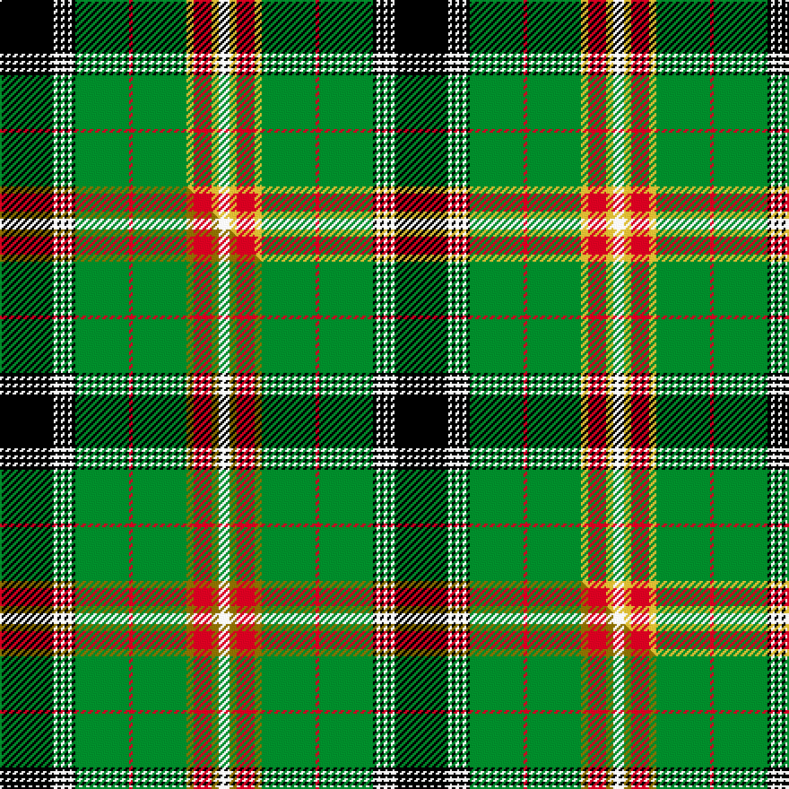

This page is one **sett** — a single exact thread-count. It belongs to the [tartan](/setts/k15w1k1w1k1w1k1g15r1g15ly2r5ly2w3/)
(the same proportion at any scale), whose colour order is pattern [KWKWKWKGRGYRYW](/stripes/kwkwkwkgrgyryw/).

Part of the [Courtet-Meyer](/tartans/courtet-meyer/) tartan — the named design grouping this sett with its other cloths.

Sourced from tartans-authority.  It is a [14 stripe tartan](/stripes/stripes14/).

Original link http://www.tartansauthority.com/tartan-ferret/display/10366/

## Register references

External register numbers recorded for this tartan.

- Scottish Register of Tartans: [10366](https://www.tartanregister.gov.uk/tartanDetails?ref=10366)
- Scottish Tartans Authority (ITI): 10366

## Thread count
K/30 W2 K2 W2 K2 W2 K2 G30 R2 G30 LY4 R10 LY4 W/6

One full sett is **220 threads**.

## Palette
<table><thead><tr><th>Colour</th><th>Shade</th><th>OKLCh</th></tr></thead><tbody><tr><td>LY</td><td><code style="background-color:#DCBC32;">#DCBC32</code> <small style="color:#888">#DCBC32</small></td><td><small style="color:#888">oklch(80.0% 0.150 95.2)</small></td></tr><tr><td>G</td><td><code style="background-color:#008B2A;">#008B2A</code> <small style="color:#888">#008B2A</small></td><td><small style="color:#888">oklch(55.4% 0.170 145.9)</small></td></tr><tr><td>K</td><td><code style="background-color:#000000;">#000000</code> <small style="color:#888">#000000</small></td><td><small style="color:#888">oklch(0.0% 0.000 0.0)</small></td></tr><tr><td>R</td><td><code style="background-color:#D60020;">#D60020</code> <small style="color:#888">#D60020</small></td><td><small style="color:#888">oklch(55.2% 0.224 25.5)</small></td></tr><tr><td>W</td><td><code style="background-color:#F7F7F7;">#F7F7F7</code> <small style="color:#888">#F7F7F7</small></td><td><small style="color:#888">oklch(97.6% 0.000 89.9)</small></td></tr></tbody></table>

# Sample pattern

## Compared to the master

This cloth is one sett of its design; the master sett (the exemplar the design is anchored on) is below for comparison.

Its **ΔTartan distance** from the master is **0.04** — the same measure the nearest-tartans table ranks by (0 is identical; a re-scale of the same cloth is near 0, a recolour or a different proportion further).

<figure class="master-compare" style="margin:0">

this sett
master sett ★

<figcaption style="color:#888;font-size:smaller">One weave of this sett against the <a href="/setts/k15w1k1w1k1w1k1g15r1g15y2r5y2w3/">master sett ★</a>, split on the diagonal: a shared proportion runs seamlessly across it with only the shades shifting; a different proportion breaks on it.</figcaption>
</figure>

## Nearest tartan variants

The nearest existing variants by ΔTartan distance, with this cloth at the top so the swatches line up against it.

ΔTartan

Threads

Variant

Sett

—

220

<a href="/variants/s14/k15w1k1w1k1w1k1g15r1g15ly2r5ly2w3~x2/">Courtet-Meyer (Personal)</a>

<a href="/ttd/edit/#slug=k15w1k1w1k1w1k1g15r1g15y2r5y2w3~x2&amp;base=k15w1k1w1k1w1k1g15r1g15ly2r5ly2w3~x2" title="compare in the TTD">0.04</a>

220

<a href="/variants/s14/k15w1k1w1k1w1k1g15r1g15y2r5y2w3~x2/">Courtet-Meyer (Personal)</a>

<a href="/ttd/edit/#slug=g34r4g3r2g4r2g3r4g17k17r2db17r4db4ly3~x2&amp;base=k15w1k1w1k1w1k1g15r1g15ly2r5ly2w3~x2" title="compare in the TTD">1.96</a>

406

<a href="/variants/s15/g34r4g3r2g4r2g3r4g17k17r2db17r4db4ly3~x2/">Cochrane</a>

<a href="/ttd/edit/#slug=g1k1g14k2r3db3k6w1k1w1~x4&amp;base=k15w1k1w1k1w1k1g15r1g15ly2r5ly2w3~x2" title="compare in the TTD">2.13</a>

256

<a href="/variants/s10/g1k1g14k2r3db3k6w1k1w1~x4/">Murray-Hetherington (Personal)</a>

<a href="/ttd/edit/#slug=g34r4g4r2g4r2g3r4g17k17r2db17r4db4y3~x2&amp;base=k15w1k1w1k1w1k1g15r1g15ly2r5ly2w3~x2" title="compare in the TTD">2.16</a>

410

<a href="/variants/s15/g34r4g4r2g4r2g3r4g17k17r2db17r4db4y3~x2/">Cochrane (1984) Clan Tartan</a>

<a href="/ttd/edit/#slug=g1k1g14k2r3db3k6w1k1w1k1w1~x4&amp;base=k15w1k1w1k1w1k1g15r1g15ly2r5ly2w3~x2" title="compare in the TTD">2.35</a>

272

<a href="/variants/s12/g1k1g14k2r3db3k6w1k1w1k1w1~x4/">Murray-Hetherington (Personal) Name Tartan</a>

<a href="/ttd/edit/#slug=dr2g13t2k3ly1k1lr1k1g4dr2k1dr2lr1~x4&amp;base=k15w1k1w1k1w1k1g15r1g15ly2r5ly2w3~x2" title="compare in the TTD">2.36</a>

260

<a href="/variants/s13/dr2g13t2k3ly1k1lr1k1g4dr2k1dr2lr1~x4/">Stewart (King George VI)</a>

<a href="/ttd/edit/#slug=k8r2k3y2k2w3k2o10g26r2g3k2~x2&amp;base=k15w1k1w1k1w1k1g15r1g15ly2r5ly2w3~x2" title="compare in the TTD">2.45</a>

240

<a href="/variants/s12/k8r2k3y2k2w3k2o10g26r2g3k2~x2/">Tara, Murphy</a>

<a href="/ttd/edit/#slug=t11k3t3k3t4k15g36w3g36k15t4k3t3k3t11r4~x2&amp;base=k15w1k1w1k1w1k1g15r1g15ly2r5ly2w3~x2" title="compare in the TTD">2.45</a>

598

<a href="/variants/s16/t11k3t3k3t4k15g36w3g36k15t4k3t3k3t11r4~x2/">Semple</a>

<a href="/ttd/edit/#slug=g16k3g20w2r3k2r3w2g2db18k2r4w2g3~x2&amp;base=k15w1k1w1k1w1k1g15r1g15ly2r5ly2w3~x2" title="compare in the TTD">2.50</a>

290

<a href="/variants/s14/g16k3g20w2r3k2r3w2g2db18k2r4w2g3~x2/">MacFarlane Hunting Clan Tartan</a>

<a href="/ttd/edit/#slug=lr1lb3k2g5dp4g1k14lb1k4g25lb2lr1~x2&amp;base=k15w1k1w1k1w1k1g15r1g15ly2r5ly2w3~x2" title="compare in the TTD">2.50</a>

248

<a href="/variants/s12/lr1lb3k2g5dp4g1k14lb1k4g25lb2lr1~x2/">Walker, Gauvin (Personal)</a>

## Neighbour map

Every grey dot is one of 13620 variants placed by the first two principal components of the ΔTartan feature space (42% of its variance). Red is this tartan; blue dots are its nearest — click one to open its page.

<svg viewBox="0 0 640 380" role="img" style="max-width:100%;height:auto;border:1px solid #e0e0e0;border-radius:4px;display:block" xmlns="http://www.w3.org/2000/svg"><image href="/nn/cloud.v1.png" width="640" height="380"/><a href="/variants/s14/k15w1k1w1k1w1k1g15r1g15y2r5y2w3~x2/"><circle cx="177.2" cy="102.8" r="4" fill="#3465a4"><title>Courtet-Meyer (Personal)</title></circle></a><a href="/variants/s15/g34r4g3r2g4r2g3r4g17k17r2db17r4db4ly3~x2/"><circle cx="207.0" cy="105.5" r="4" fill="#3465a4"><title>Cochrane</title></circle></a><a href="/variants/s10/g1k1g14k2r3db3k6w1k1w1~x4/"><circle cx="175.5" cy="119.6" r="4" fill="#3465a4"><title>Murray-Hetherington (Personal)</title></circle></a><a href="/variants/s15/g34r4g4r2g4r2g3r4g17k17r2db17r4db4y3~x2/"><circle cx="211.7" cy="107.3" r="4" fill="#3465a4"><title>Cochrane (1984) Clan Tartan</title></circle></a><a href="/variants/s12/g1k1g14k2r3db3k6w1k1w1k1w1~x4/"><circle cx="159.6" cy="107.7" r="4" fill="#3465a4"><title>Murray-Hetherington (Personal) Name Tartan</title></circle></a><a href="/variants/s13/dr2g13t2k3ly1k1lr1k1g4dr2k1dr2lr1~x4/"><circle cx="184.8" cy="105.0" r="4" fill="#3465a4"><title>Stewart (King George VI)</title></circle></a><a href="/variants/s12/k8r2k3y2k2w3k2o10g26r2g3k2~x2/"><circle cx="148.3" cy="97.1" r="4" fill="#3465a4"><title>Tara, Murphy</title></circle></a><a href="/variants/s16/t11k3t3k3t4k15g36w3g36k15t4k3t3k3t11r4~x2/"><circle cx="175.8" cy="122.0" r="4" fill="#3465a4"><title>Semple</title></circle></a><a href="/variants/s14/g16k3g20w2r3k2r3w2g2db18k2r4w2g3~x2/"><circle cx="184.0" cy="129.3" r="4" fill="#3465a4"><title>MacFarlane Hunting Clan Tartan</title></circle></a><a href="/variants/s12/lr1lb3k2g5dp4g1k14lb1k4g25lb2lr1~x2/"><circle cx="223.5" cy="86.5" r="4" fill="#3465a4"><title>Walker, Gauvin (Personal)</title></circle></a><circle cx="174.7" cy="102.3" r="5" fill="#c00000"/><text x="320" y="376" text-anchor="middle" font-size="11" fill="#999">ground</text><text x="11" y="190" text-anchor="middle" font-size="11" fill="#999" transform="rotate(-90 11 190)">complexity</text></svg>

ID: /variants/s14/k15w1k1w1k1w1k1g15r1g15ly2r5ly2w3~x2/
