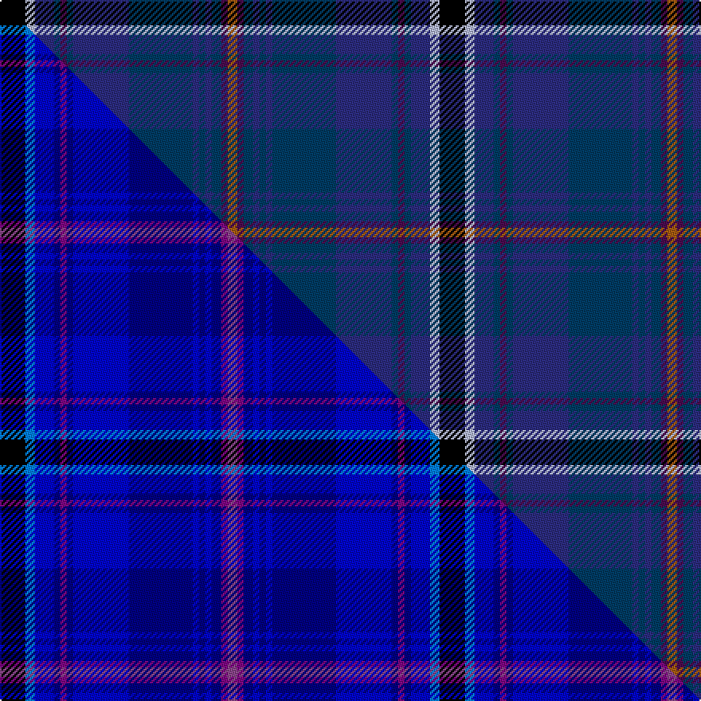

This is one **variant** — a specific cloth: this exact thread count and colourway, with its own
provenance below. It is one weaving of the [sett](/tartans/b/be/benedictus/) (the scale-free proportion — the
same cloth at any scale or shade), whose colour order is pattern [KWBBBBBBBBBBBR](/stripes/kwbbbbbbbbbbbr/).

Part of the [Benedictus](/tartans/b/be/benedictus/) tartan — the named design grouping this sett with its other cloths.

Sourced from tartans-authority.  It is a [14 stripe tartan](/stripes/stripes14/).

Original link <code>http://www.tartansauthority.com/tartan-ferret/display/10213/</code> — retired · [Internet Archive copy](https://web.archive.org/web/*/http://www.tartansauthority.com/tartan-ferret/display/10213/*)

Dataset <small>— provenance for this record, inherited from the source manifest</small>

<dl class="dataset-prov">
<dt>source</dt><dd><a href="/sources/tartans-authority/">Scottish Tartans Authority</a></dd>
<dt>data captured from</dt><dd><a href="https://github.com/thetartan/tartan-database/blob/master/data/tartans-authority/data.csv">https://github.com/thetartan/tartan-database/blob/master/data/tartans-authority/data.csv</a></dd>
<dt>data date</dt><dd>9th Mar. 2010 <small>(this record)</small></dd>
<dt>licence</dt><dd><a href="https://creativecommons.org/licenses/by-nc-nd/4.0/">CC BY-NC-ND 4.0</a></dd>
</dl>

Capture chain <small>— the hands this data passed through, oldest first; each capture carries its own licence</small>

<ol class="capture-chain">
<li><a href="https://www.tartansauthority.com/">Scottish Tartans Authority</a> <small>the heritage body’s archive — its tartan-ferret record browser is retired; dead record links are shown unlinked, with an Internet Archive copy (ITI numbers are not SRT references)</small></li>
<li><a href="https://github.com/thetartan/tartan-database">thetartan/tartan-database</a> <small>2016-2017</small> · <a href="https://creativecommons.org/licenses/by-nc-nd/4.0/">CC BY-NC-ND 4.0</a> <small>Levko Kravets's frozen compilation — the capture we vendored, and where its CC licence text came from</small></li>
<li>this dictionary <small>captured 2026-06-10 · commit 5bf86c7566</small> <small>each re-capture is a git commit to data/sources</small></li>
</ol>

## Register references

External register numbers recorded for this tartan.

- Scottish Register of Tartans: [10213](https://www.tartanregister.gov.uk/tartanDetails?ref=10213)
- Scottish Tartans Authority (ITI): 10213

## Thread count
K/16 LB6 DBi12 DB4 DP4 DB4 DBi35 DB40 DBi4 DB4 DBi4 DB6 DP4 O/6

One full sett is **276 threads**.

## Palette
<table><thead><tr><th>Colour</th><th>Shade</th><th>OKLCh</th></tr></thead><tbody><tr><td>LB</td><td><code style="background-color:#B5BBDE;">#B5BBDE</code> <small style="color:#888">#B5BBDE</small></td><td><small style="color:#888">oklch(79.9% 0.050 277.6)</small></td></tr><tr><td>DB</td><td><code style="background-color:#2C2C80;">#2C2C80</code> <small style="color:#888">#2C2C80</small></td><td><small style="color:#888">oklch(35.0% 0.138 276.6)</small></td></tr><tr><td>DB</td><td><code style="background-color:#003C64;">#003C64</code> <small style="color:#888">#003C64</small></td><td><small style="color:#888">oklch(34.5% 0.089 246.0)</small></td></tr><tr><td>K</td><td><code style="background-color:#000000;">#000000</code> <small style="color:#888">#000000</small></td><td><small style="color:#888">oklch(0.0% 0.000 0.0)</small></td></tr><tr><td>O</td><td><code style="background-color:#A65C11;">#A65C11</code> <small style="color:#888">#A65C11</small></td><td><small style="color:#888">oklch(55.0% 0.125 58.3)</small></td></tr><tr><td>DP</td><td><code style="background-color:#4B0B4F;">#4B0B4F</code> <small style="color:#888">#4B0B4F</small></td><td><small style="color:#888">oklch(30.1% 0.125 325.4)</small></td></tr></tbody></table>

# Sample pattern

## Compared to the master

This cloth is one sett of its design; the master sett (the exemplar the design is anchored on) is below for comparison.

Its **ΔTartan distance** from the master is **0.42** — the same measure the nearest-tartans table ranks by (0 is identical; a re-scale of the same cloth is near 0, a recolour or a different proportion further).

<figure class="master-compare" style="margin:0">

this sett
master sett ★

<figcaption style="color:#888;font-size:smaller">One weave of this sett against the <a href="/setts/k16t6b12db4dp4db4b35db40b4db4b4db6dp4p6/">master sett ★</a>, split on the diagonal: a shared proportion runs seamlessly across it with only the shades shifting; a different proportion breaks on it.</figcaption>
</figure>

## Nearest tartan variants

The nearest existing variants by ΔTartan distance, with this cloth at the top so the swatches line up against it.

ΔTartan

Threads

Variant

Sett

—

276

<a href="/variants/s14/k16lb6dbi12db4dp4db4dbi35db40dbi4db4dbi4db6dp4o6~dbi3514276-db3409246/">Benedictus Blue (Personal)</a>

<a href="/ttd/edit/#slug=k16t6b12db4dp4db4b35db40b4db4b4db6dp4p6~t6121255-b3826264-db2719264-dp4219327-p5013327&amp;base=k16lb6dbi12db4dp4db4dbi35db40dbi4db4dbi4db6dp4o6~dbi3514276-db3409246" title="compare in the TTD">0.42</a>

276

<a href="/variants/s14/k16t6b12db4dp4db4b35db40b4db4b4db6dp4p6~t6121255-b3826264-db2719264-dp4219327-p5013327/">Benedictus Blue (Personal)</a>

<a href="/ttd/edit/#slug=g2k3db30k2db4k2db30k3dg30k3dbi30k2lb2~g5408159-db2616276-dg4514144-dbi2911276&amp;base=k16lb6dbi12db4dp4db4dbi35db40dbi4db4dbi4db6dp4o6~dbi3514276-db3409246" title="compare in the TTD">2.70</a>

282

<a href="/variants/s13/g2k3db30k2db4k2db30k3dg30k3dbi30k2lb2~g5408159-db2616276-dg4514144-dbi2911276/">Davies (Welsh Name)</a>

<a href="/ttd/edit/#slug=dp6db4k4db26k12dp3dbi42y4dbi4~db3409246-dbi3514276&amp;base=k16lb6dbi12db4dp4db4dbi35db40dbi4db4dbi4db6dp4o6~dbi3514276-db3409246" title="compare in the TTD">3.28</a>

200

<a href="/variants/s9/dp6db4k4db26k12dp3dbi42y4dbi4~db3409246-dbi3514276/">Goldblatt, Joe, Jeff (Personal)</a>

<a href="/ttd/edit/#slug=r2dp4db2dg25db4dg2db4k11dp4w2dp4dg11db2k2db24dp4db2r2~x2&amp;base=k16lb6dbi12db4dp4db4dbi35db40dbi4db4dbi4db6dp4o6~dbi3514276-db3409246" title="compare in the TTD">3.29</a>

436

<a href="/variants/s18/r2dp4db2dg25db4dg2db4k11dp4w2dp4dg11db2k2db24dp4db2r2~x2/">Empire Golf Check (Fashion)</a>

<a href="/ttd/edit/#slug=db45dp6n6dp30dg6dp6dg30k4r4k3&amp;base=k16lb6dbi12db4dp4db4dbi35db40dbi4db4dbi4db6dp4o6~dbi3514276-db3409246" title="compare in the TTD">3.40</a>

232

<a href="/variants/s10/db45dp6n6dp30dg6dp6dg30k4r4k3/">Dalgliesh, Ewen (Personal)</a>

<a href="/ttd/edit/#slug=dy2db4dbi2dg25dbi4dg2dbi4k10db4dg2db4dg11dbi2k2dbi24db4dbi2dy2~x2~db2616276-dbi3514276&amp;base=k16lb6dbi12db4dp4db4dbi35db40dbi4db4dbi4db6dp4o6~dbi3514276-db3409246" title="compare in the TTD">3.40</a>

432

<a href="/variants/s18/dy2db4dbi2dg25dbi4dg2dbi4k10db4dg2db4dg11dbi2k2dbi24db4dbi2dy2~x2~db2616276-dbi3514276/">LS Curling</a>

<a href="/ttd/edit/#slug=k3db30k2db4k2db30k3dg30k3dbi30k2lb2k2dbi30k3dg30k3db30k2db4k2db30k3g3~db2616276-dg4514144-dbi2911276-g5408159&amp;base=k16lb6dbi12db4dp4db4dbi35db40dbi4db4dbi4db6dp4o6~dbi3514276-db3409246" title="compare in the TTD">3.41</a>

560

<a href="/variants/s24/k3db30k2db4k2db30k3dg30k3dbi30k2lb2k2dbi30k3dg30k3db30k2db4k2db30k3g3~db2616276-dg4514144-dbi2911276-g5408159/">Davies of Wales</a>

<a href="/ttd/edit/#slug=dp6db4k4db26k12dp3dbi42dy4dbi4~db2911276-dbi3912267&amp;base=k16lb6dbi12db4dp4db4dbi35db40dbi4db4dbi4db6dp4o6~dbi3514276-db3409246" title="compare in the TTD">3.56</a>

200

<a href="/variants/s9/dp6db4k4db26k12dp3dbi42dy4dbi4~db2911276-dbi3912267/">Goldblatt, Joe Jeff (Personal)</a>

<a href="/ttd/edit/#slug=dp4dpi4dp3dg20dp5k4dp3k7dp3k3db35lb2db35k3dp3k7dp3k4dp5dg20dp3dpi4dp4k2~x2~dp3406321-dpi4018327&amp;base=k16lb6dbi12db4dp4db4dbi35db40dbi4db4dbi4db6dp4o6~dbi3514276-db3409246" title="compare in the TTD">3.62</a>

732

<a href="/variants/s24/dp4dpi4dp3dg20dp5k4dp3k7dp3k3db35lb2db35k3dp3k7dp3k4dp5dg20dp3dpi4dp4k2~x2~dp3406321-dpi4018327/">Spirit of Bannockburn Fashion Tartan</a>

<a href="/ttd/edit/#slug=db6y2dbi24db4dbi8db6dbi6db8dbi3db10k14db4r3db34w4~db2911276-dbi3514276&amp;base=k16lb6dbi12db4dp4db4dbi35db40dbi4db4dbi4db6dp4o6~dbi3514276-db3409246" title="compare in the TTD">3.62</a>

262

<a href="/variants/s15/db6y2dbi24db4dbi8db6dbi6db8dbi3db10k14db4r3db34w4~db2911276-dbi3514276/">Matchpoint</a>

## Neighbour map

Every grey dot is one of 13662 variants placed by the first two principal components of the ΔTartan feature space (42% of its variance). Red is this tartan; blue dots are its nearest — click one to open its page. The map is a flat projection of a many-dimensional space — [how to read it](/posts/neighbourhood-maps/).

<svg viewBox="0 0 640 380" role="img" style="max-width:100%;height:auto;border:1px solid #e0e0e0;border-radius:4px;display:block" xmlns="http://www.w3.org/2000/svg"><image href="/nn/cloud.v1.png" width="640" height="380"/><a href="/variants/s14/k16t6b12db4dp4db4b35db40b4db4b4db6dp4p6~t6121255-b3826264-db2719264-dp4219327-p5013327/"><circle cx="219.2" cy="148.8" r="4" fill="#3465a4"><title>Benedictus Blue (Personal)</title></circle></a><a href="/variants/s13/g2k3db30k2db4k2db30k3dg30k3dbi30k2lb2~g5408159-db2616276-dg4514144-dbi2911276/"><circle cx="235.5" cy="123.2" r="4" fill="#3465a4"><title>Davies (Welsh Name)</title></circle></a><a href="/variants/s9/dp6db4k4db26k12dp3dbi42y4dbi4~db3409246-dbi3514276/"><circle cx="302.4" cy="173.8" r="4" fill="#3465a4"><title>Goldblatt, Joe, Jeff (Personal)</title></circle></a><a href="/variants/s18/r2dp4db2dg25db4dg2db4k11dp4w2dp4dg11db2k2db24dp4db2r2~x2/"><circle cx="182.8" cy="121.7" r="4" fill="#3465a4"><title>Empire Golf Check (Fashion)</title></circle></a><a href="/variants/s10/db45dp6n6dp30dg6dp6dg30k4r4k3/"><circle cx="239.6" cy="159.6" r="4" fill="#3465a4"><title>Dalgliesh, Ewen (Personal)</title></circle></a><a href="/variants/s18/dy2db4dbi2dg25dbi4dg2dbi4k10db4dg2db4dg11dbi2k2dbi24db4dbi2dy2~x2~db2616276-dbi3514276/"><circle cx="264.9" cy="154.7" r="4" fill="#3465a4"><title>LS Curling</title></circle></a><a href="/variants/s24/k3db30k2db4k2db30k3dg30k3dbi30k2lb2k2dbi30k3dg30k3db30k2db4k2db30k3g3~db2616276-dg4514144-dbi2911276-g5408159/"><circle cx="227.5" cy="105.3" r="4" fill="#3465a4"><title>Davies of Wales</title></circle></a><a href="/variants/s9/dp6db4k4db26k12dp3dbi42dy4dbi4~db2911276-dbi3912267/"><circle cx="312.3" cy="176.3" r="4" fill="#3465a4"><title>Goldblatt, Joe Jeff (Personal)</title></circle></a><a href="/variants/s24/dp4dpi4dp3dg20dp5k4dp3k7dp3k3db35lb2db35k3dp3k7dp3k4dp5dg20dp3dpi4dp4k2~x2~dp3406321-dpi4018327/"><circle cx="220.2" cy="101.2" r="4" fill="#3465a4"><title>Spirit of Bannockburn Fashion Tartan</title></circle></a><a href="/variants/s15/db6y2dbi24db4dbi8db6dbi6db8dbi3db10k14db4r3db34w4~db2911276-dbi3514276/"><circle cx="300.6" cy="132.7" r="4" fill="#3465a4"><title>Matchpoint</title></circle></a><circle cx="226.2" cy="148.9" r="5" fill="#c00000"/><text x="320" y="376" text-anchor="middle" font-size="11" fill="#999">ground</text><text x="11" y="190" text-anchor="middle" font-size="11" fill="#999" transform="rotate(-90 11 190)">complexity</text></svg>

ID: /variants/s14/k16lb6dbi12db4dp4db4dbi35db40dbi4db4dbi4db6dp4o6~dbi3514276-db3409246/
