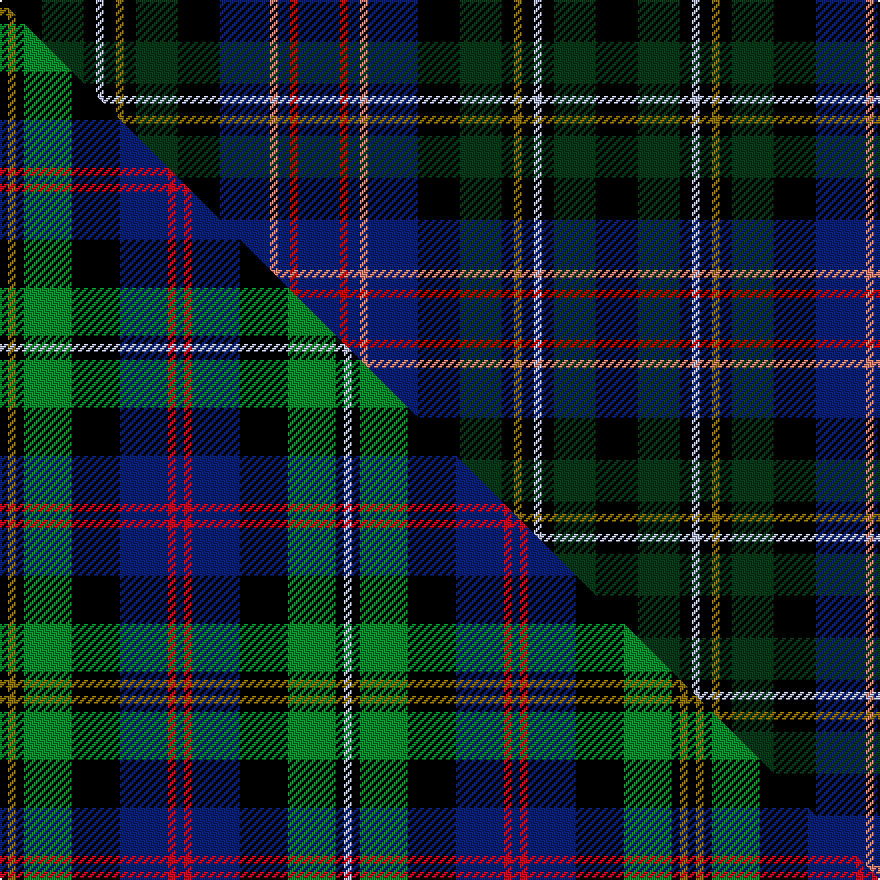

This page is one **sett** — a single exact thread-count. It belongs to the [tartan](/setts/k21dg21k6lb4k6y4k6dg21k21db25lr4db6r4db21/)
(the same proportion at any scale), whose colour order is pattern [BRBYBKGKGKWKGK](/stripes/brbybkgkgkwkgk/).

Part of the [Malcolm](/tartans/malcolm/) tartan — the named design grouping this sett with its other cloths.

Sourced from register-of-tartans.  It is a [14 stripe tartan](/stripes/stripes14/).

Original link https://www.tartanregister.gov.uk/tartanDetails.aspx?ref=2793

2 attestations — the source records this cloth was collapsed from (oldest owns this page)

<ul>
<li>01/01/1840 — Malcolm (1840) (register-of-tartans, <a href="https://www.tartanregister.gov.uk/tartanDetails.aspx?ref=2793">record</a>)  <em>Count (halved to fit screen) taken by Peter MacDonald from a sample book of Wilson patterns which, judging by the other samples, Peter MacDonald dates as c1840. The pattern is interesting because it utilises two shades of red: scarlet and rose. Given that the sample is the oldest example of the Malcolm tartan, one must ask whether this should in fact be the correct sett.</em></li>
<li>1840 — Malcolm (1840) (tartans-authority, <a href="http://www.tartansauthority.com/tartan-ferret/display/6470/">record</a>)  <em>Asymmetric. Count (halved to fit screen) taken by Peter MacDonald from a sample book of Wilson patterns which, judging by the other samples, P E MacD dates as c1840. The pattern is interesting because it utilises two shades of red: scarlet and rose. Given that the sample is the oldest example of the Malcolm tartan, one must ask whether this should in fact be the correct sett?</em></li>
</ul>

## Register references

External register numbers recorded for this tartan.

- Scottish Register of Tartans: [2793](https://www.tartanregister.gov.uk/tartanDetails.aspx?ref=2793)
- Scottish Tartans Authority (ITI): 6470

## Thread count
K/21 DG21 K6 LB4 K6 Y4 K6 DG21 K21 DB25 LR4 DB6 R4 DB/21

One full sett is **298 threads**.

## Palette
<table><thead><tr><th>Colour</th><th>Shade</th><th>OKLCh</th></tr></thead><tbody><tr><td>DB</td><td><code style="background-color:#082077;">#082077</code> <small style="color:#888">#082077</small></td><td><small style="color:#888">oklch(30.0% 0.149 265.1)</small></td></tr><tr><td>DG</td><td><code style="background-color:#053819;">#053819</code> <small style="color:#888">#053819</small></td><td><small style="color:#888">oklch(30.0% 0.075 151.3)</small></td></tr><tr><td>K</td><td><code style="background-color:#000000;">#000000</code> <small style="color:#888">#000000</small></td><td><small style="color:#888">oklch(0.0% 0.000 0.0)</small></td></tr><tr><td>LB</td><td><code style="background-color:#B5BBDE;">#B5BBDE</code> <small style="color:#888">#B5BBDE</small></td><td><small style="color:#888">oklch(79.9% 0.050 277.6)</small></td></tr><tr><td>LR</td><td><code style="background-color:#E08070;">#E08070</code> <small style="color:#888">#E08070</small></td><td><small style="color:#888">oklch(70.1% 0.122 30.4)</small></td></tr><tr><td>R</td><td><code style="background-color:#C80000;">#C80000</code> <small style="color:#888">#C80000</small></td><td><small style="color:#888">oklch(52.3% 0.215 29.2)</small></td></tr><tr><td>Y</td><td><code style="background-color:#8B6E00;">#8B6E00</code> <small style="color:#888">#8B6E00</small></td><td><small style="color:#888">oklch(55.1% 0.113 90.4)</small></td></tr></tbody></table>

# Sample pattern

## Compared to the master

This cloth is one sett of its design; the master sett (the exemplar the design is anchored on) is below for comparison.

Its **ΔTartan distance** from the master is **0.55** — the same measure the nearest-tartans table ranks by (0 is identical; a re-scale of the same cloth is near 0, a recolour or a different proportion further).

<figure class="master-compare" style="margin:0">

this sett
master sett ★

<figcaption style="color:#888;font-size:smaller">One weave of this sett against the <a href="/setts/k1y1k1g6k6db6r1db1r1db6k6g6k1lb1/">master sett ★</a>, split on the diagonal: a shared proportion runs seamlessly across it with only the shades shifting; a different proportion breaks on it.</figcaption>
</figure>

## Nearest tartan variants

The nearest existing variants by ΔTartan distance, with this cloth at the top so the swatches line up against it.

ΔTartan

Threads

Variant

Sett

—

298

<a href="/variants/s14/k21dg21k6lb4k6y4k6dg21k21db25lr4db6r4db21~lr2805035-r2109032/">Malcolm (1840)</a>

<a href="/ttd/edit/#slug=k1y1k1g6k6db6r1db1r1db6k6g6k1lb1~x4&amp;base=k21dg21k6lb4k6y4k6dg21k21db25lr4db6r4db21~lr2805035-r2109032" title="compare in the TTD">0.55</a>

344

<a href="/variants/s14/k1y1k1g6k6db6r1db1r1db6k6g6k1lb1~x4/">Malcolm #2</a>

<a href="/ttd/edit/#slug=db1r1db6k6g6k1y1k1lb1k1g6k6db6r1~x2&amp;base=k21dg21k6lb4k6y4k6dg21k21db25lr4db6r4db21~lr2805035-r2109032" title="compare in the TTD">0.55</a>

172

<a href="/variants/s14/db1r1db6k6g6k1y1k1lb1k1g6k6db6r1~x2/">Malcolm (a)</a>

<a href="/ttd/edit/#slug=k1y1k1g6k6db6r1db1r1db6k6g6k1t1~x4&amp;base=k21dg21k6lb4k6y4k6dg21k21db25lr4db6r4db21~lr2805035-r2109032" title="compare in the TTD">0.55</a>

344

<a href="/variants/s14/k1y1k1g6k6db6r1db1r1db6k6g6k1t1~x4/">Malcolm</a>

<a href="/ttd/edit/#slug=db1r1db6k6g6k1y1k1w1k1g6k6db6r1&amp;base=k21dg21k6lb4k6y4k6dg21k21db25lr4db6r4db21~lr2805035-r2109032" title="compare in the TTD">0.81</a>

86

<a href="/variants/s14/db1r1db6k6g6k1y1k1w1k1g6k6db6r1/">Malcolm</a>

<a href="/ttd/edit/#slug=k20dg18k2w2k5y2k2dg18k20db18t4db4t4db18~x2~db1406275-t2205244&amp;base=k21dg21k6lb4k6y4k6dg21k21db25lr4db6r4db21~lr2805035-r2109032" title="compare in the TTD">1.36</a>

472

<a href="/variants/s14/k20dg18k2w2k5y2k2dg18k20db18t4db4t4db18~x2~db1406275-t2205244/">Shandon (Personal)</a>

<a href="/ttd/edit/#slug=dt3k3dt15k15y3dg15k3dg15w3k15db4r6k3y2~x2~dt1204274-db1406275&amp;base=k21dg21k6lb4k6y4k6dg21k21db25lr4db6r4db21~lr2805035-r2109032" title="compare in the TTD">1.67</a>

410

<a href="/variants/s14/db3k3db15k15y3dg15k3dg15w3k15dbi4r6k3y2~x2~db1204274-dbi1406275/">Allison Family Tartan</a>

<a href="/ttd/edit/#slug=db2r1db6k6g6k1lb1k1y1k1g6k6db6g1db2~x4&amp;base=k21dg21k6lb4k6y4k6dg21k21db25lr4db6r4db21~lr2805035-r2109032" title="compare in the TTD">2.32</a>

360

<a href="/variants/s15/db2r1db6k6g6k1lb1k1y1k1g6k6db6g1db2~x4/">Malcolm (symmetrical)</a>

<a href="/ttd/edit/#slug=db11r3db2n3k12dg20y2k12db11ly3~x2~ly2705081&amp;base=k21dg21k6lb4k6y4k6dg21k21db25lr4db6r4db21~lr2805035-r2109032" title="compare in the TTD">2.41</a>

288

<a href="/variants/s10/db11r3db2n3k12dg20y2k12db11ly3~x2~ly2705081/">Wisconsin State American District Tartan</a>

<a href="/ttd/edit/#slug=db11r3db2n3k12dg20y2k12db11ly3~x2&amp;base=k21dg21k6lb4k6y4k6dg21k21db25lr4db6r4db21~lr2805035-r2109032" title="compare in the TTD">2.42</a>

288

<a href="/variants/s10/db11r3db2n3k12dg20y2k12db11ly3~x2/">Wisconsin (US State)</a>

<a href="/ttd/edit/#slug=r4y3g12k16dy5db20k4w2~x2&amp;base=k21dg21k6lb4k6y4k6dg21k21db25lr4db6r4db21~lr2805035-r2109032" title="compare in the TTD">2.55</a>

252

<a href="/variants/s8/r4y3g12k16dy5db20k4w2~x2/">Iowa</a>

## Neighbour map

Every grey dot is one of 13620 variants placed by the first two principal components of the ΔTartan feature space (42% of its variance). Red is this tartan; blue dots are its nearest — click one to open its page.

<svg viewBox="0 0 640 380" role="img" style="max-width:100%;height:auto;border:1px solid #e0e0e0;border-radius:4px;display:block" xmlns="http://www.w3.org/2000/svg"><image href="/nn/cloud.v1.png" width="640" height="380"/><a href="/variants/s14/k1y1k1g6k6db6r1db1r1db6k6g6k1lb1~x4/"><circle cx="71.9" cy="159.4" r="4" fill="#3465a4"><title>Malcolm #2</title></circle></a><a href="/variants/s14/db1r1db6k6g6k1y1k1lb1k1g6k6db6r1~x2/"><circle cx="71.9" cy="159.4" r="4" fill="#3465a4"><title>Malcolm (a)</title></circle></a><a href="/variants/s14/k1y1k1g6k6db6r1db1r1db6k6g6k1t1~x4/"><circle cx="74.6" cy="160.4" r="4" fill="#3465a4"><title>Malcolm</title></circle></a><a href="/variants/s14/db1r1db6k6g6k1y1k1w1k1g6k6db6r1/"><circle cx="69.1" cy="158.5" r="4" fill="#3465a4"><title>Malcolm</title></circle></a><a href="/variants/s14/k20dg18k2w2k5y2k2dg18k20db18t4db4t4db18~x2~db1406275-t2205244/"><circle cx="128.6" cy="148.8" r="4" fill="#3465a4"><title>Shandon (Personal)</title></circle></a><a href="/variants/s14/db3k3db15k15y3dg15k3dg15w3k15dbi4r6k3y2~x2~db1204274-dbi1406275/"><circle cx="81.0" cy="142.6" r="4" fill="#3465a4"><title>Allison Family Tartan</title></circle></a><a href="/variants/s15/db2r1db6k6g6k1lb1k1y1k1g6k6db6g1db2~x4/"><circle cx="75.4" cy="161.4" r="4" fill="#3465a4"><title>Malcolm (symmetrical)</title></circle></a><a href="/variants/s10/db11r3db2n3k12dg20y2k12db11ly3~x2~ly2705081/"><circle cx="92.0" cy="155.7" r="4" fill="#3465a4"><title>Wisconsin State American District Tartan</title></circle></a><a href="/variants/s10/db11r3db2n3k12dg20y2k12db11ly3~x2/"><circle cx="84.5" cy="153.4" r="4" fill="#3465a4"><title>Wisconsin (US State)</title></circle></a><a href="/variants/s8/r4y3g12k16dy5db20k4w2~x2/"><circle cx="56.2" cy="136.4" r="4" fill="#3465a4"><title>Iowa</title></circle></a><circle cx="84.7" cy="161.8" r="5" fill="#c00000"/><text x="320" y="376" text-anchor="middle" font-size="11" fill="#999">ground</text><text x="11" y="190" text-anchor="middle" font-size="11" fill="#999" transform="rotate(-90 11 190)">complexity</text></svg>

ID: /variants/s14/k21dg21k6lb4k6y4k6dg21k21db25lr4db6r4db21~lr2805035-r2109032/
