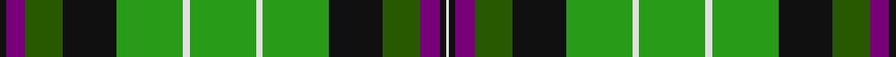

This page is one **sett** — a single exact thread-count. It belongs to the [tartan](/setts/k2dp6dg12k17g21w2g21w2g21k17dg12dp6k2w1/)
(the same proportion at any scale), whose colour order is pattern [KBGKGWGWGKGBKW](/stripes/kbgkgwgwgkgbkw/).

Part of the [Hibernian Football Club](/tartans/hibernian-football-club/) tartan — the named design grouping this sett with its other cloths.

Sourced from register-of-tartans.  It is a [14 stripe tartan](/stripes/stripes14/).

Original link https://www.tartanregister.gov.uk/tartanDetails.aspx?ref=1702

## Register references

External register numbers recorded for this tartan.

- Scottish Register of Tartans: [1702](https://www.tartanregister.gov.uk/tartanDetails.aspx?ref=1702)
- Scottish Tartans Authority (ITI): 6894

## Thread count
K/4 P12 G24 K34 Ga42 LN4 Ga42 LN4 Ga42 K34 G24 P12 K4 LN/2

One full sett is **562 threads**.

## Palette

Palette: <strong>Tartan Register</strong>
<table><thead><tr><th>Colour</th><th>Threads</th><th>Shade</th><th>Base</th><th>OKLCh</th></tr></thead><tbody><tr><td>K/</td><td style="text-align:right;font-variant-numeric:tabular-nums">4</td><td><code style="background-color:#101010;">#101010</code> <small style="color:#888">#101010</small></td><td>K <code style="background-color:#000000;">#000000</code></td><td><small style="color:#888">oklch(17.3% 0.000 89.9)</small></td></tr><tr><td>P</td><td style="text-align:right;font-variant-numeric:tabular-nums">12</td><td><code style="background-color:#780078;">#780078</code> <small style="color:#888">#780078</small></td><td>B <code style="background-color:#2A418A;">#2A418A</code></td><td><small style="color:#888">oklch(40.2% 0.185 328.4)</small></td></tr><tr><td>G</td><td style="text-align:right;font-variant-numeric:tabular-nums">24</td><td><code style="background-color:#285800;">#285800</code> <small style="color:#888">#285800</small></td><td>G <code style="background-color:#006100;">#006100</code></td><td><small style="color:#888">oklch(41.0% 0.122 135.8)</small></td></tr><tr><td>K</td><td style="text-align:right;font-variant-numeric:tabular-nums">34</td><td><code style="background-color:#101010;">#101010</code> <small style="color:#888">#101010</small></td><td>K <code style="background-color:#000000;">#000000</code></td><td><small style="color:#888">oklch(17.3% 0.000 89.9)</small></td></tr><tr><td>Ga</td><td style="text-align:right;font-variant-numeric:tabular-nums">42</td><td><code style="background-color:#289C18;">#289C18</code> <small style="color:#888">#289C18</small></td><td>G <code style="background-color:#006100;">#006100</code></td><td><small style="color:#888">oklch(60.6% 0.191 141.6)</small></td></tr><tr><td>LN</td><td style="text-align:right;font-variant-numeric:tabular-nums">4</td><td><code style="background-color:#E0E0E0;">#E0E0E0</code> <small style="color:#888">#E0E0E0</small></td><td>W <code style="background-color:#F7F7F7;">#F7F7F7</code></td><td><small style="color:#888">oklch(90.7% 0.000 89.9)</small></td></tr><tr><td>Ga</td><td style="text-align:right;font-variant-numeric:tabular-nums">42</td><td><code style="background-color:#289C18;">#289C18</code> <small style="color:#888">#289C18</small></td><td>G <code style="background-color:#006100;">#006100</code></td><td><small style="color:#888">oklch(60.6% 0.191 141.6)</small></td></tr><tr><td>LN</td><td style="text-align:right;font-variant-numeric:tabular-nums">4</td><td><code style="background-color:#E0E0E0;">#E0E0E0</code> <small style="color:#888">#E0E0E0</small></td><td>W <code style="background-color:#F7F7F7;">#F7F7F7</code></td><td><small style="color:#888">oklch(90.7% 0.000 89.9)</small></td></tr><tr><td>Ga</td><td style="text-align:right;font-variant-numeric:tabular-nums">42</td><td><code style="background-color:#289C18;">#289C18</code> <small style="color:#888">#289C18</small></td><td>G <code style="background-color:#006100;">#006100</code></td><td><small style="color:#888">oklch(60.6% 0.191 141.6)</small></td></tr><tr><td>K</td><td style="text-align:right;font-variant-numeric:tabular-nums">34</td><td><code style="background-color:#101010;">#101010</code> <small style="color:#888">#101010</small></td><td>K <code style="background-color:#000000;">#000000</code></td><td><small style="color:#888">oklch(17.3% 0.000 89.9)</small></td></tr><tr><td>G</td><td style="text-align:right;font-variant-numeric:tabular-nums">24</td><td><code style="background-color:#285800;">#285800</code> <small style="color:#888">#285800</small></td><td>G <code style="background-color:#006100;">#006100</code></td><td><small style="color:#888">oklch(41.0% 0.122 135.8)</small></td></tr><tr><td>P</td><td style="text-align:right;font-variant-numeric:tabular-nums">12</td><td><code style="background-color:#780078;">#780078</code> <small style="color:#888">#780078</small></td><td>B <code style="background-color:#2A418A;">#2A418A</code></td><td><small style="color:#888">oklch(40.2% 0.185 328.4)</small></td></tr><tr><td>K</td><td style="text-align:right;font-variant-numeric:tabular-nums">4</td><td><code style="background-color:#101010;">#101010</code> <small style="color:#888">#101010</small></td><td>K <code style="background-color:#000000;">#000000</code></td><td><small style="color:#888">oklch(17.3% 0.000 89.9)</small></td></tr><tr><td>LN/</td><td style="text-align:right;font-variant-numeric:tabular-nums">2</td><td><code style="background-color:#E0E0E0;">#E0E0E0</code> <small style="color:#888">#E0E0E0</small></td><td>W <code style="background-color:#F7F7F7;">#F7F7F7</code></td><td><small style="color:#888">oklch(90.7% 0.000 89.9)</small></td></tr></tbody></table>

## Compared to the master

This cloth is one sett of its design; the master sett (the exemplar the design is anchored on) is below for comparison.

<figure style="margin:0"><figcaption style="color:#888;font-size:smaller">this sett</figcaption></figure>
<figure style="margin:0"><figcaption style="color:#888;font-size:smaller"><a href="/setts/g22w2g22k18dg12dp6k2w1/">master sett →</a></figcaption></figure>

## Nearest tartans

The nearest existing variants by ΔTartan distance, with this tartan at the top so the swatches line up against it.

ΔTartan

Tartan

Sett

—

<a href="/ttd/edit/#slug=k2dp6dg12k17g21w2g21w2g21k17dg12dp6k2w1~x2">Hibernian Football Club (2004)</a> <a class="nn-out" href="/variants/s14/k2dp6dg12k17g21w2g21w2g21k17dg12dp6k2w1~x2/" title="open its dictionary page">↗</a>

1.24

<a href="/ttd/edit/#slug=g5gi22g13k5w4k7g5k2lo7k2gi2g6gi1k2w2~x2&amp;base=k2dp6dg12k17g21w2g21w2g21k17dg12dp6k2w1~x2">Ireland's National</a> <a class="nn-out" href="/variants/s15/g5gi22g13k5w4k7g5k2lo7k2gi2g6gi1k2w2~x2/" title="open its dictionary page">↗</a>

1.29

<a href="/ttd/edit/#slug=g16r2g2r1g3r1g2r2g12k12r1db16r2db8ly2~x2&amp;base=k2dp6dg12k17g21w2g21w2g21k17dg12dp6k2w1~x2">Cochrane</a> <a class="nn-out" href="/variants/s15/g16r2g2r1g3r1g2r2g12k12r1db16r2db8ly2~x2/" title="open its dictionary page">↗</a>

1.35

<a href="/ttd/edit/#slug=g21w2g21k17dg12dp6k2w1~x2&amp;base=k2dp6dg12k17g21w2g21w2g21k17dg12dp6k2w1~x2">Hibernian F. C. (2004) (C orporate)</a> <a class="nn-out" href="/variants/s8/g21w2g21k17dg12dp6k2w1~x2/" title="open its dictionary page">↗</a>

1.41

<a href="/ttd/edit/#slug=g22r4g2r2g2r4g12k12r2db10r4db4ly3~x2&amp;base=k2dp6dg12k17g21w2g21w2g21k17dg12dp6k2w1~x2">Cochrane, -1974</a> <a class="nn-out" href="/variants/s13/g22r4g2r2g2r4g12k12r2db10r4db4ly3~x2/" title="open its dictionary page">↗</a>

1.41

<a href="/ttd/edit/#slug=g2lo21do1k5g11do13g2do13g11k5do1lo21g2dy1~x2&amp;base=k2dp6dg12k17g21w2g21w2g21k17dg12dp6k2w1~x2">St. Lawrence #2</a> <a class="nn-out" href="/variants/s14/g2lo21do1k5g11do13g2do13g11k5do1lo21g2dy1~x2/" title="open its dictionary page">↗</a>

1.45

<a href="/ttd/edit/#slug=g30ly2g5ly2g4k15db29r2db29k15g5ly2g4ly2g17~x2&amp;base=k2dp6dg12k17g21w2g21w2g21k17dg12dp6k2w1~x2">Unidentified, B'gowrie</a> <a class="nn-out" href="/variants/s15/g30ly2g5ly2g4k15db29r2db29k15g5ly2g4ly2g17~x2/" title="open its dictionary page">↗</a>

1.50

<a href="/ttd/edit/#slug=k6g20t2r6t2k20ly3db20g26r3db6~x2&amp;base=k2dp6dg12k17g21w2g21w2g21k17dg12dp6k2w1~x2">Stevenson</a> <a class="nn-out" href="/variants/s11/k6g20t2r6t2k20ly3db20g26r3db6~x2/" title="open its dictionary page">↗</a>

1.52

<a href="/ttd/edit/#slug=k4dg33k18lo10g19lo3dg15k1ly3~x2&amp;base=k2dp6dg12k17g21w2g21w2g21k17dg12dp6k2w1~x2">Leinster Ancestry</a> <a class="nn-out" href="/variants/s9/k4dg33k18lo10g19lo3dg15k1ly3~x2/" title="open its dictionary page">↗</a>

1.54

<a href="/ttd/edit/#slug=gi1k1gi9k7ly1gi5g4w2g1w1gi1~x4&amp;base=k2dp6dg12k17g21w2g21w2g21k17dg12dp6k2w1~x2">Parkhead</a> <a class="nn-out" href="/variants/s11/gi1k1gi9k7ly1gi5g4w2g1w1gi1~x4/" title="open its dictionary page">↗</a>

1.56

<a href="/ttd/edit/#slug=ly7gi1k1ly2k9g22gi7k27b4k3w4~x2&amp;base=k2dp6dg12k17g21w2g21w2g21k17dg12dp6k2w1~x2">Gilhooley (Name)</a> <a class="nn-out" href="/variants/s11/ly7gi1k1ly2k9g22gi7k27b4k3w4~x2/" title="open its dictionary page">↗</a>

## Neighbour map

Every grey dot is one of 14360 variants placed by the first two principal components of the ΔTartan feature space (44% of its variance). Red is this tartan; blue dots are its nearest — click one to open its page.

<svg viewBox="0 0 640 380" role="img" style="max-width:100%;height:auto;border:1px solid #e0e0e0;border-radius:4px;display:block" xmlns="http://www.w3.org/2000/svg"><image href="/nn/cloud.v1.png" width="640" height="380"/><a href="/variants/s15/g5gi22g13k5w4k7g5k2lo7k2gi2g6gi1k2w2~x2/"><circle cx="146.2" cy="116.2" r="4" fill="#3465a4"><title>Ireland's National</title></circle></a><a href="/variants/s15/g16r2g2r1g3r1g2r2g12k12r1db16r2db8ly2~x2/"><circle cx="189.7" cy="124.3" r="4" fill="#3465a4"><title>Cochrane</title></circle></a><a href="/variants/s8/g21w2g21k17dg12dp6k2w1~x2/"><circle cx="235.4" cy="160.8" r="4" fill="#3465a4"><title>Hibernian F. C. (2004) (C orporate)</title></circle></a><a href="/variants/s13/g22r4g2r2g2r4g12k12r2db10r4db4ly3~x2/"><circle cx="177.3" cy="145.5" r="4" fill="#3465a4"><title>Cochrane, -1974</title></circle></a><a href="/variants/s14/g2lo21do1k5g11do13g2do13g11k5do1lo21g2dy1~x2/"><circle cx="191.1" cy="126.2" r="4" fill="#3465a4"><title>St. Lawrence #2</title></circle></a><a href="/variants/s15/g30ly2g5ly2g4k15db29r2db29k15g5ly2g4ly2g17~x2/"><circle cx="178.0" cy="131.6" r="4" fill="#3465a4"><title>Unidentified, B'gowrie</title></circle></a><a href="/variants/s11/k6g20t2r6t2k20ly3db20g26r3db6~x2/"><circle cx="140.5" cy="139.7" r="4" fill="#3465a4"><title>Stevenson</title></circle></a><a href="/variants/s9/k4dg33k18lo10g19lo3dg15k1ly3~x2/"><circle cx="247.8" cy="147.1" r="4" fill="#3465a4"><title>Leinster Ancestry</title></circle></a><a href="/variants/s11/gi1k1gi9k7ly1gi5g4w2g1w1gi1~x4/"><circle cx="186.7" cy="164.5" r="4" fill="#3465a4"><title>Parkhead</title></circle></a><a href="/variants/s11/ly7gi1k1ly2k9g22gi7k27b4k3w4~x2/"><circle cx="194.2" cy="93.4" r="4" fill="#3465a4"><title>Gilhooley (Name)</title></circle></a><circle cx="186.6" cy="138.3" r="5" fill="#c00000"/></svg>

ID: /variants/s14/k2dp6dg12k17g21w2g21w2g21k17dg12dp6k2w1~x2/
