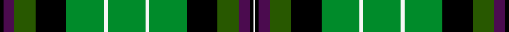

This page is one **sett** — a single exact thread-count. It belongs to the [tartan](/setts/k2dp6dg12k17g21w2g21w2g21k17dg12dp6k2w1/)
(the same proportion at any scale), whose colour order is pattern [KBGKGWGWGKGBKW](/stripes/kbgkgwgwgkgbkw/).

Sourced from register-of-tartans.  It is a [14 stripe tartan](/stripes/stripes14/).

Original link https://www.tartanregister.gov.uk/tartanDetails.aspx?ref=1702

## Register references

External register numbers recorded for this tartan.

- Scottish Register of Tartans: [1702](https://www.tartanregister.gov.uk/tartanDetails.aspx?ref=1702)
- Scottish Tartans Authority (ITI): 6894

## Thread count
K/4 DP12 DG24 K34 G42 W4 G42 W4 G42 K34 DG24 DP12 K4 W/2

One full sett is **562 threads**.

## Palette
<table><thead><tr><th>Colour</th><th>Shade</th><th>OKLCh</th></tr></thead><tbody><tr><td>DG</td><td><code style="background-color:#003820;">#003820</code> <small style="color:#888">#003820</small></td><td><small style="color:#888">oklch(30.0% 0.070 158.3)</small></td></tr><tr><td>G</td><td><code style="background-color:#285800;">#285800</code> <small style="color:#888">#285800</small></td><td><small style="color:#888">oklch(41.0% 0.122 135.8)</small></td></tr><tr><td>Ga</td><td><code style="background-color:#008B2A;">#008B2A</code> <small style="color:#888">#008B2A</small></td><td><small style="color:#888">oklch(55.4% 0.170 145.9)</small></td></tr><tr><td>K</td><td><code style="background-color:#000000;">#000000</code> <small style="color:#888">#000000</small></td><td><small style="color:#888">oklch(0.0% 0.000 0.0)</small></td></tr><tr><td>LN</td><td><code style="background-color:#F7F7F7;">#F7F7F7</code> <small style="color:#888">#F7F7F7</small></td><td><small style="color:#888">oklch(97.6% 0.000 89.9)</small></td></tr><tr><td>P</td><td><code style="background-color:#4B0B4F;">#4B0B4F</code> <small style="color:#888">#4B0B4F</small></td><td><small style="color:#888">oklch(30.1% 0.125 325.4)</small></td></tr></tbody></table>

# Sample pattern

## Nearest variants

The nearest existing variants by ΔTartan distance, with this cloth at the top so the swatches line up against it.

ΔTartan

Threads

Variant

Sett

—

562

<a href="/variants/s14/k2dp6dg12k17g21w2g21w2g21k17dg12dp6k2w1~x2~dg1605139/">Hibernian Football Club (2004)</a>

<a href="/ttd/edit/#slug=dp3dg6k9g11w1g11w1g11k9dg6dp3~x4&amp;base=k2dp6dg12k17g21w2g21w2g21k17dg12dp6k2w1~x2~dg1605139" title="compare in the TTD">2.83</a>

544

<a href="/variants/s11/dp3dg6k9g11w1g11w1g11k9dg6dp3~x4/">Hibernian F.C.</a>

## Neighbour map

Every grey dot is one of 13620 variants placed by the first two principal components of the ΔTartan feature space (42% of its variance). Red is this tartan; blue dots are its nearest — click one to open its page.

<svg viewBox="0 0 640 380" role="img" style="max-width:100%;height:auto;border:1px solid #e0e0e0;border-radius:4px;display:block" xmlns="http://www.w3.org/2000/svg"><image href="/nn/cloud.v1.png" width="640" height="380"/><a href="/variants/s11/dp3dg6k9g11w1g11w1g11k9dg6dp3~x4/"><circle cx="145.7" cy="182.5" r="4" fill="#3465a4"><title>Hibernian F.C.</title></circle></a><circle cx="161.9" cy="131.6" r="5" fill="#c00000"/><text x="320" y="376" text-anchor="middle" font-size="11" fill="#999">ground</text><text x="11" y="190" text-anchor="middle" font-size="11" fill="#999" transform="rotate(-90 11 190)">complexity</text></svg>

ID: /variants/s14/k2dp6dg12k17g21w2g21w2g21k17dg12dp6k2w1~x2~dg1605139/
