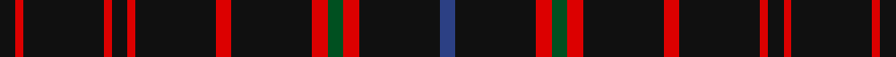

This page is one **sett** — a single exact thread-count. It belongs to the [tartan](/setts/k2r1k10r1k2r1k10r2k10r2dg2r2k10db2/)
(the same proportion at any scale), whose colour order is pattern [BKRGRKRKRKRKRK](/stripes/bkrgrkrkrkrkrk/).

Part of the [Hebridean](/tartans/hebridean/) tartan — the named design grouping this sett with its other cloths.

Sourced from register-of-tartans.  It is a [14 stripe tartan](/stripes/stripes14/).

Original link https://www.tartanregister.gov.uk/tartanDetails.aspx?ref=1649

## Also known as

This cloth is also recorded under:

- Hebridean Artifact
- Hebridean,
- Hebridean, North Uist
- Hebrides #5
- Hebrides North Uist

## Register references

External register numbers recorded for this tartan.

- Scottish Register of Tartans: [1649](https://www.tartanregister.gov.uk/tartanDetails.aspx?ref=1649)
- Scottish Tartans World Register: 1989

## Thread count
K/4 R2 K20 R2 K4 R2 K20 R4 K20 R4 G4 R4 K20 B/4

One full sett is **220 threads**.

## Palette

Palette: <strong>Tartan Register</strong>
<table><thead><tr><th>Colour</th><th>Threads</th><th>Shade</th><th>Base</th><th>OKLCh</th></tr></thead><tbody><tr><td>K/</td><td style="text-align:right;font-variant-numeric:tabular-nums">4</td><td><code style="background-color:#101010;">#101010</code> <small style="color:#888">#101010</small></td><td>K <code style="background-color:#000000;">#000000</code></td><td><small style="color:#888">oklch(17.3% 0.000 89.9)</small></td></tr><tr><td>R</td><td style="text-align:right;font-variant-numeric:tabular-nums">2</td><td><code style="background-color:#DC0000;">#DC0000</code> <small style="color:#888">#DC0000</small></td><td>R <code style="background-color:#CC0000;">#CC0000</code></td><td><small style="color:#888">oklch(56.2% 0.230 29.2)</small></td></tr><tr><td>K</td><td style="text-align:right;font-variant-numeric:tabular-nums">20</td><td><code style="background-color:#101010;">#101010</code> <small style="color:#888">#101010</small></td><td>K <code style="background-color:#000000;">#000000</code></td><td><small style="color:#888">oklch(17.3% 0.000 89.9)</small></td></tr><tr><td>R</td><td style="text-align:right;font-variant-numeric:tabular-nums">2</td><td><code style="background-color:#DC0000;">#DC0000</code> <small style="color:#888">#DC0000</small></td><td>R <code style="background-color:#CC0000;">#CC0000</code></td><td><small style="color:#888">oklch(56.2% 0.230 29.2)</small></td></tr><tr><td>K</td><td style="text-align:right;font-variant-numeric:tabular-nums">4</td><td><code style="background-color:#101010;">#101010</code> <small style="color:#888">#101010</small></td><td>K <code style="background-color:#000000;">#000000</code></td><td><small style="color:#888">oklch(17.3% 0.000 89.9)</small></td></tr><tr><td>R</td><td style="text-align:right;font-variant-numeric:tabular-nums">2</td><td><code style="background-color:#DC0000;">#DC0000</code> <small style="color:#888">#DC0000</small></td><td>R <code style="background-color:#CC0000;">#CC0000</code></td><td><small style="color:#888">oklch(56.2% 0.230 29.2)</small></td></tr><tr><td>K</td><td style="text-align:right;font-variant-numeric:tabular-nums">20</td><td><code style="background-color:#101010;">#101010</code> <small style="color:#888">#101010</small></td><td>K <code style="background-color:#000000;">#000000</code></td><td><small style="color:#888">oklch(17.3% 0.000 89.9)</small></td></tr><tr><td>R</td><td style="text-align:right;font-variant-numeric:tabular-nums">4</td><td><code style="background-color:#DC0000;">#DC0000</code> <small style="color:#888">#DC0000</small></td><td>R <code style="background-color:#CC0000;">#CC0000</code></td><td><small style="color:#888">oklch(56.2% 0.230 29.2)</small></td></tr><tr><td>K</td><td style="text-align:right;font-variant-numeric:tabular-nums">20</td><td><code style="background-color:#101010;">#101010</code> <small style="color:#888">#101010</small></td><td>K <code style="background-color:#000000;">#000000</code></td><td><small style="color:#888">oklch(17.3% 0.000 89.9)</small></td></tr><tr><td>R</td><td style="text-align:right;font-variant-numeric:tabular-nums">4</td><td><code style="background-color:#DC0000;">#DC0000</code> <small style="color:#888">#DC0000</small></td><td>R <code style="background-color:#CC0000;">#CC0000</code></td><td><small style="color:#888">oklch(56.2% 0.230 29.2)</small></td></tr><tr><td>G</td><td style="text-align:right;font-variant-numeric:tabular-nums">4</td><td><code style="background-color:#005020;">#005020</code> <small style="color:#888">#005020</small></td><td>G <code style="background-color:#006100;">#006100</code></td><td><small style="color:#888">oklch(37.7% 0.105 149.6)</small></td></tr><tr><td>R</td><td style="text-align:right;font-variant-numeric:tabular-nums">4</td><td><code style="background-color:#DC0000;">#DC0000</code> <small style="color:#888">#DC0000</small></td><td>R <code style="background-color:#CC0000;">#CC0000</code></td><td><small style="color:#888">oklch(56.2% 0.230 29.2)</small></td></tr><tr><td>K</td><td style="text-align:right;font-variant-numeric:tabular-nums">20</td><td><code style="background-color:#101010;">#101010</code> <small style="color:#888">#101010</small></td><td>K <code style="background-color:#000000;">#000000</code></td><td><small style="color:#888">oklch(17.3% 0.000 89.9)</small></td></tr><tr><td>B/</td><td style="text-align:right;font-variant-numeric:tabular-nums">4</td><td><code style="background-color:#2C4084;">#2C4084</code> <small style="color:#888">#2C4084</small></td><td>B <code style="background-color:#2A418A;">#2A418A</code></td><td><small style="color:#888">oklch(39.4% 0.117 268.3)</small></td></tr></tbody></table>

## Compared to the master

This cloth is one sett of its design; the master sett (the exemplar the design is anchored on) is below for comparison.

<figure style="margin:0"><figcaption style="color:#888;font-size:smaller">this sett</figcaption></figure>
<figure style="margin:0"><figcaption style="color:#888;font-size:smaller"><a href="/setts/db10r1db10r2db10r1g2/">master sett →</a></figcaption></figure>

## Nearest tartans

The nearest existing variants by ΔTartan distance, with this tartan at the top so the swatches line up against it.

ΔTartan

Tartan

Sett

—

<a href="/ttd/edit/#slug=k2r1k10r1k2r1k10r2k10r2dg2r2k10db2~x2">Hebridean</a> <a class="nn-out" href="/variants/s14/k2r1k10r1k2r1k10r2k10r2dg2r2k10db2~x2/" title="open its dictionary page">↗</a>

0.88

<a href="/ttd/edit/#slug=k3r2k17r3k17r3g3r3k17b3k4r1k17r2~x2&amp;base=k2r1k10r1k2r1k10r2k10r2dg2r2k10db2~x2">Hebrides #11</a> <a class="nn-out" href="/variants/s14/k3r2k17r3k17r3g3r3k17b3k4r1k17r2~x2/" title="open its dictionary page">↗</a>

0.94

<a href="/ttd/edit/#slug=k17db3k4r1k17r2k3r2k17r3k17r3g3r3~x2&amp;base=k2r1k10r1k2r1k10r2k10r2dg2r2k10db2~x2">Black (Hebridean) (Artefact)</a> <a class="nn-out" href="/variants/s14/k17db3k4r1k17r2k3r2k17r3k17r3g3r3~x2/" title="open its dictionary page">↗</a>

1.34

<a href="/ttd/edit/#slug=r2k25dy2k20n5k2n4k3n3k4n2k6ly2~x2&amp;base=k2r1k10r1k2r1k10r2k10r2dg2r2k10db2~x2">Gold-Smith (Personal)</a> <a class="nn-out" href="/variants/s13/r2k25dy2k20n5k2n4k3n3k4n2k6ly2~x2/" title="open its dictionary page">↗</a>

1.52

<a href="/ttd/edit/#slug=k2r1k10r1k2r1k10r2k10r2g2r2k10db2~x2&amp;base=k2r1k10r1k2r1k10r2k10r2dg2r2k10db2~x2">Hebridean 7</a> <a class="nn-out" href="/variants/s14/k2r1k10r1k2r1k10r2k10r2g2r2k10db2~x2/" title="open its dictionary page">↗</a>

1.59

<a href="/ttd/edit/#slug=k2r1k10r1k2r1k10r1k2r1k10r2k10r2dg2r2k10db2~x2&amp;base=k2r1k10r1k2r1k10r2k10r2dg2r2k10db2~x2">Hebridean 6</a> <a class="nn-out" href="/variants/s18/k2r1k10r1k2r1k10r1k2r1k10r2k10r2dg2r2k10db2~x2/" title="open its dictionary page">↗</a>

1.72

<a href="/ttd/edit/#slug=k14n2k2n5k25w1n9m3k3w1k14~x2&amp;base=k2r1k10r1k2r1k10r2k10r2dg2r2k10db2~x2">Springbank</a> <a class="nn-out" href="/variants/s11/k14n2k2n5k25w1n9m3k3w1k14~x2/" title="open its dictionary page">↗</a>

1.74

<a href="/ttd/edit/#slug=k14n2k2n5k25w1n9p3k3w1k14~x2&amp;base=k2r1k10r1k2r1k10r2k10r2dg2r2k10db2~x2">Springbank</a> <a class="nn-out" href="/variants/s11/k14n2k2n5k25w1n9p3k3w1k14~x2/" title="open its dictionary page">↗</a>

1.77

<a href="/ttd/edit/#slug=r7k3r3k22r3k3r3k37ly2k4~x2&amp;base=k2r1k10r1k2r1k10r2k10r2dg2r2k10db2~x2">Maier (Personal)</a> <a class="nn-out" href="/variants/s10/r7k3r3k22r3k3r3k37ly2k4~x2/" title="open its dictionary page">↗</a>

1.81

<a href="/ttd/edit/#slug=k16b2k8r3lr3r3k8~x2&amp;base=k2r1k10r1k2r1k10r2k10r2dg2r2k10db2~x2">Benson (New England)</a> <a class="nn-out" href="/variants/s7/k16b2k8r3lr3r3k8~x2/" title="open its dictionary page">↗</a>

1.81

<a href="/ttd/edit/#slug=k49o8k4n6oi4n6k4o8k49oi2&amp;base=k2r1k10r1k2r1k10r2k10r2dg2r2k10db2~x2">Harley Davidson</a> <a class="nn-out" href="/variants/s10/k49o8k4n6oi4n6k4o8k49oi2/" title="open its dictionary page">↗</a>

## Neighbour map

Every grey dot is one of 14360 variants placed by the first two principal components of the ΔTartan feature space (44% of its variance). Red is this tartan; blue dots are its nearest — click one to open its page.

<svg viewBox="0 0 640 380" role="img" style="max-width:100%;height:auto;border:1px solid #e0e0e0;border-radius:4px;display:block" xmlns="http://www.w3.org/2000/svg"><image href="/nn/cloud.v1.png" width="640" height="380"/><a href="/variants/s14/k3r2k17r3k17r3g3r3k17b3k4r1k17r2~x2/"><circle cx="500.9" cy="174.5" r="4" fill="#3465a4"><title>Hebrides #11</title></circle></a><a href="/variants/s14/k17db3k4r1k17r2k3r2k17r3k17r3g3r3~x2/"><circle cx="507.0" cy="177.4" r="4" fill="#3465a4"><title>Black (Hebridean) (Artefact)</title></circle></a><a href="/variants/s13/r2k25dy2k20n5k2n4k3n3k4n2k6ly2~x2/"><circle cx="457.6" cy="162.6" r="4" fill="#3465a4"><title>Gold-Smith (Personal)</title></circle></a><a href="/variants/s14/k2r1k10r1k2r1k10r2k10r2g2r2k10db2~x2/"><circle cx="436.8" cy="187.2" r="4" fill="#3465a4"><title>Hebridean 7</title></circle></a><a href="/variants/s18/k2r1k10r1k2r1k10r1k2r1k10r2k10r2dg2r2k10db2~x2/"><circle cx="456.4" cy="179.1" r="4" fill="#3465a4"><title>Hebridean 6</title></circle></a><a href="/variants/s11/k14n2k2n5k25w1n9m3k3w1k14~x2/"><circle cx="475.3" cy="166.3" r="4" fill="#3465a4"><title>Springbank</title></circle></a><a href="/variants/s11/k14n2k2n5k25w1n9p3k3w1k14~x2/"><circle cx="466.6" cy="161.5" r="4" fill="#3465a4"><title>Springbank</title></circle></a><a href="/variants/s10/r7k3r3k22r3k3r3k37ly2k4~x2/"><circle cx="541.7" cy="172.7" r="4" fill="#3465a4"><title>Maier (Personal)</title></circle></a><a href="/variants/s7/k16b2k8r3lr3r3k8~x2/"><circle cx="402.8" cy="229.1" r="4" fill="#3465a4"><title>Benson (New England)</title></circle></a><a href="/variants/s10/k49o8k4n6oi4n6k4o8k49oi2/"><circle cx="507.3" cy="155.0" r="4" fill="#3465a4"><title>Harley Davidson</title></circle></a><circle cx="459.8" cy="191.2" r="5" fill="#c00000"/></svg>

ID: /variants/s14/k2r1k10r1k2r1k10r2k10r2dg2r2k10db2~x2/
