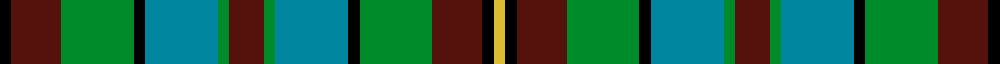

This page is one **sett** — a single exact thread-count. It belongs to the [tartan](/setts/k3dr13g19k3t19g3dr9g3t19k3g19dr13k3ly3/)
(the same proportion at any scale), whose colour order is pattern [KBGKBGBGBKGBKY](/stripes/kbgkbgbgbkgbky/).

Sourced from register-of-tartans.  It is a [14 stripe tartan](/stripes/stripes14/).

Original link https://www.tartanregister.gov.uk/tartanDetails.aspx?ref=3263

## Register references

External register numbers recorded for this tartan.

- Scottish Register of Tartans: [3263](https://www.tartanregister.gov.uk/tartanDetails.aspx?ref=3263)
- Scottish Tartans Authority (ITI): 2681
- Scottish Tartans World Register: 2681

## Thread count
K/6 DR26 G38 K6 T38 G6 DR18 G6 T38 K6 G38 DR26 K6 LY/6

One full sett is **516 threads**.

## Palette
<table><thead><tr><th>Colour</th><th>Shade</th><th>OKLCh</th></tr></thead><tbody><tr><td>B</td><td><code style="background-color:#00879F;">#00879F</code> <small style="color:#888">#00879F</small></td><td><small style="color:#888">oklch(57.4% 0.102 216.1)</small></td></tr><tr><td>DR</td><td><code style="background-color:#55120C;">#55120C</code> <small style="color:#888">#55120C</small></td><td><small style="color:#888">oklch(30.0% 0.099 29.3)</small></td></tr><tr><td>DY</td><td><code style="background-color:#DCBC32;">#DCBC32</code> <small style="color:#888">#DCBC32</small></td><td><small style="color:#888">oklch(80.0% 0.150 95.2)</small></td></tr><tr><td>G</td><td><code style="background-color:#008B2A;">#008B2A</code> <small style="color:#888">#008B2A</small></td><td><small style="color:#888">oklch(55.4% 0.170 145.9)</small></td></tr><tr><td>K</td><td><code style="background-color:#000000;">#000000</code> <small style="color:#888">#000000</small></td><td><small style="color:#888">oklch(0.0% 0.000 0.0)</small></td></tr></tbody></table>

# Sample pattern

ID: /variants/s14/k3dr13g19k3t19g3dr9g3t19k3g19dr13k3ly3~x2/
