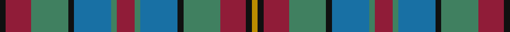

This page is one **sett** — a single exact thread-count. It belongs to the [tartan](/setts/k3r13g19k3b19g3r9g3b19k3g19r13k3lo3/)
(the same proportion at any scale), whose colour order is pattern [KRGKBGRGBKGRKY](/stripes/krgkbgrgbkgrky/).

Part of the [Orkney](/tartans/orkney/) tartan — the named design grouping this sett with its other cloths.

Sourced from register-of-tartans.  It is a [14 stripe tartan](/stripes/stripes14/).

Original link https://www.tartanregister.gov.uk/tartanDetails.aspx?ref=3263

## Register references

External register numbers recorded for this tartan.

- Scottish Register of Tartans: [3263](https://www.tartanregister.gov.uk/tartanDetails.aspx?ref=3263)
- Scottish Tartans Authority (ITI): 2681
- Scottish Tartans World Register: 2681

## Thread count
K/6 DR26 G38 K6 B38 G6 DR18 G6 B38 K6 G38 DR26 K6 DY/6

One full sett is **516 threads**.

## Palette

Palette: <strong>Tartan Register</strong>
<table><thead><tr><th>Colour</th><th>Threads</th><th>Shade</th><th>Base</th><th>OKLCh</th></tr></thead><tbody><tr><td>K/</td><td style="text-align:right;font-variant-numeric:tabular-nums">6</td><td><code style="background-color:#101010;">#101010</code> <small style="color:#888">#101010</small></td><td>K <code style="background-color:#000000;">#000000</code></td><td><small style="color:#888">oklch(17.3% 0.000 89.9)</small></td></tr><tr><td>DR</td><td style="text-align:right;font-variant-numeric:tabular-nums">26</td><td><code style="background-color:#901C38;">#901C38</code> <small style="color:#888">#901C38</small></td><td>R <code style="background-color:#CC0000;">#CC0000</code></td><td><small style="color:#888">oklch(43.2% 0.150 13.1)</small></td></tr><tr><td>G</td><td style="text-align:right;font-variant-numeric:tabular-nums">38</td><td><code style="background-color:#408060;">#408060</code> <small style="color:#888">#408060</small></td><td>G <code style="background-color:#006100;">#006100</code></td><td><small style="color:#888">oklch(54.8% 0.084 160.1)</small></td></tr><tr><td>K</td><td style="text-align:right;font-variant-numeric:tabular-nums">6</td><td><code style="background-color:#101010;">#101010</code> <small style="color:#888">#101010</small></td><td>K <code style="background-color:#000000;">#000000</code></td><td><small style="color:#888">oklch(17.3% 0.000 89.9)</small></td></tr><tr><td>B</td><td style="text-align:right;font-variant-numeric:tabular-nums">38</td><td><code style="background-color:#1870A4;">#1870A4</code> <small style="color:#888">#1870A4</small></td><td>B <code style="background-color:#2A418A;">#2A418A</code></td><td><small style="color:#888">oklch(52.2% 0.113 241.2)</small></td></tr><tr><td>G</td><td style="text-align:right;font-variant-numeric:tabular-nums">6</td><td><code style="background-color:#408060;">#408060</code> <small style="color:#888">#408060</small></td><td>G <code style="background-color:#006100;">#006100</code></td><td><small style="color:#888">oklch(54.8% 0.084 160.1)</small></td></tr><tr><td>DR</td><td style="text-align:right;font-variant-numeric:tabular-nums">18</td><td><code style="background-color:#901C38;">#901C38</code> <small style="color:#888">#901C38</small></td><td>R <code style="background-color:#CC0000;">#CC0000</code></td><td><small style="color:#888">oklch(43.2% 0.150 13.1)</small></td></tr><tr><td>G</td><td style="text-align:right;font-variant-numeric:tabular-nums">6</td><td><code style="background-color:#408060;">#408060</code> <small style="color:#888">#408060</small></td><td>G <code style="background-color:#006100;">#006100</code></td><td><small style="color:#888">oklch(54.8% 0.084 160.1)</small></td></tr><tr><td>B</td><td style="text-align:right;font-variant-numeric:tabular-nums">38</td><td><code style="background-color:#1870A4;">#1870A4</code> <small style="color:#888">#1870A4</small></td><td>B <code style="background-color:#2A418A;">#2A418A</code></td><td><small style="color:#888">oklch(52.2% 0.113 241.2)</small></td></tr><tr><td>K</td><td style="text-align:right;font-variant-numeric:tabular-nums">6</td><td><code style="background-color:#101010;">#101010</code> <small style="color:#888">#101010</small></td><td>K <code style="background-color:#000000;">#000000</code></td><td><small style="color:#888">oklch(17.3% 0.000 89.9)</small></td></tr><tr><td>G</td><td style="text-align:right;font-variant-numeric:tabular-nums">38</td><td><code style="background-color:#408060;">#408060</code> <small style="color:#888">#408060</small></td><td>G <code style="background-color:#006100;">#006100</code></td><td><small style="color:#888">oklch(54.8% 0.084 160.1)</small></td></tr><tr><td>DR</td><td style="text-align:right;font-variant-numeric:tabular-nums">26</td><td><code style="background-color:#901C38;">#901C38</code> <small style="color:#888">#901C38</small></td><td>R <code style="background-color:#CC0000;">#CC0000</code></td><td><small style="color:#888">oklch(43.2% 0.150 13.1)</small></td></tr><tr><td>K</td><td style="text-align:right;font-variant-numeric:tabular-nums">6</td><td><code style="background-color:#101010;">#101010</code> <small style="color:#888">#101010</small></td><td>K <code style="background-color:#000000;">#000000</code></td><td><small style="color:#888">oklch(17.3% 0.000 89.9)</small></td></tr><tr><td>DY/</td><td style="text-align:right;font-variant-numeric:tabular-nums">6</td><td><code style="background-color:#BC8C00;">#BC8C00</code> <small style="color:#888">#BC8C00</small></td><td>Y <code style="background-color:#F2BF00;">#F2BF00</code></td><td><small style="color:#888">oklch(66.8% 0.137 84.1)</small></td></tr></tbody></table>

## Nearest tartans

The nearest existing variants by ΔTartan distance, with this tartan at the top so the swatches line up against it.

ΔTartan

Tartan

Sett

—

<a href="/ttd/edit/#slug=k3r13g19k3b19g3r9g3b19k3g19r13k3lo3~x2">Orkney</a> <a class="nn-out" href="/variants/s14/k3r13g19k3b19g3r9g3b19k3g19r13k3lo3~x2/" title="open its dictionary page">↗</a>

1.10

<a href="/ttd/edit/#slug=dt12dy2ly2dy2dt2dy10g10dy3g12dy10dt11r2ly2~x2&amp;base=k3r13g19k3b19g3r9g3b19k3g19r13k3lo3~x2">MacVicker (Name)</a> <a class="nn-out" href="/variants/s13/dt12dy2ly2dy2dt2dy10g10dy3g12dy10dt11r2ly2~x2/" title="open its dictionary page">↗</a>

1.16

<a href="/ttd/edit/#slug=db22g4db4g17o17g17db4g4db22ly8o8r8~x2&amp;base=k3r13g19k3b19g3r9g3b19k3g19r13k3lo3~x2">Niagara Falls</a> <a class="nn-out" href="/variants/s12/db22g4db4g17o17g17db4g4db22ly8o8r8~x2/" title="open its dictionary page">↗</a>

1.18

<a href="/ttd/edit/#slug=dg12r2dg4r5dg16lo2k16r2db16r5db4r2db12~x2&amp;base=k3r13g19k3b19g3r9g3b19k3g19r13k3lo3~x2">Macallan</a> <a class="nn-out" href="/variants/s13/dg12r2dg4r5dg16lo2k16r2db16r5db4r2db12~x2/" title="open its dictionary page">↗</a>

1.18

<a href="/ttd/edit/#slug=db22g4db4g17dy17g17db4g4db22ly8dy8r8~x2&amp;base=k3r13g19k3b19g3r9g3b19k3g19r13k3lo3~x2">Niagra Falls Trade Tartan</a> <a class="nn-out" href="/variants/s12/db22g4db4g17dy17g17db4g4db22ly8dy8r8~x2/" title="open its dictionary page">↗</a>

1.19

<a href="/ttd/edit/#slug=r9g3b19k3g19r13k3lo3~x2&amp;base=k3r13g19k3b19g3r9g3b19k3g19r13k3lo3~x2">Orkney (District?)</a> <a class="nn-out" href="/variants/s8/r9g3b19k3g19r13k3lo3~x2/" title="open its dictionary page">↗</a>

1.22

<a href="/ttd/edit/#slug=dg10lo2dg3r4dg13k13r2b13r4b3r2b10~x2&amp;base=k3r13g19k3b19g3r9g3b19k3g19r13k3lo3~x2">Bowie (Lochcarron)</a> <a class="nn-out" href="/variants/s12/dg10lo2dg3r4dg13k13r2b13r4b3r2b10~x2/" title="open its dictionary page">↗</a>

1.24

<a href="/ttd/edit/#slug=db18dy4db3dy3db3dy18g18r10g18dy18db18dy3r10~x2&amp;base=k3r13g19k3b19g3r9g3b19k3g19r13k3lo3~x2">Murray of Atholl</a> <a class="nn-out" href="/variants/s13/db18dy4db3dy3db3dy18g18r10g18dy18db18dy3r10~x2/" title="open its dictionary page">↗</a>

1.24

<a href="/ttd/edit/#slug=o8dt8o4dt28dti12n6dti12r4n8r4n29lb6&amp;base=k3r13g19k3b19g3r9g3b19k3g19r13k3lo3~x2">Kinloch Anderson Granite (Corporate)</a> <a class="nn-out" href="/variants/s12/o8dt8o4dt28dti12n6dti12r4n8r4n29lb6/" title="open its dictionary page">↗</a>

1.25

<a href="/ttd/edit/#slug=db18o4db3o3db3o18g18r10g18o18db18o3r10~x2&amp;base=k3r13g19k3b19g3r9g3b19k3g19r13k3lo3~x2">Murray of Atholl</a> <a class="nn-out" href="/variants/s13/db18o4db3o3db3o18g18r10g18o18db18o3r10~x2/" title="open its dictionary page">↗</a>

1.25

<a href="/ttd/edit/#slug=db4ly3db17r7w2o7w2db7g17o3g4~x2&amp;base=k3r13g19k3b19g3r9g3b19k3g19r13k3lo3~x2">Asman Hunting</a> <a class="nn-out" href="/variants/s11/db4ly3db17r7w2o7w2db7g17o3g4~x2/" title="open its dictionary page">↗</a>

## Neighbour map

Every grey dot is one of 14360 variants placed by the first two principal components of the ΔTartan feature space (44% of its variance). Red is this tartan; blue dots are its nearest — click one to open its page.

<svg viewBox="0 0 640 380" role="img" style="max-width:100%;height:auto;border:1px solid #e0e0e0;border-radius:4px;display:block" xmlns="http://www.w3.org/2000/svg"><image href="/nn/cloud.v1.png" width="640" height="380"/><a href="/variants/s13/dt12dy2ly2dy2dt2dy10g10dy3g12dy10dt11r2ly2~x2/"><circle cx="164.8" cy="219.0" r="4" fill="#3465a4"><title>MacVicker (Name)</title></circle></a><a href="/variants/s12/db22g4db4g17o17g17db4g4db22ly8o8r8~x2/"><circle cx="141.9" cy="220.6" r="4" fill="#3465a4"><title>Niagara Falls</title></circle></a><a href="/variants/s13/dg12r2dg4r5dg16lo2k16r2db16r5db4r2db12~x2/"><circle cx="143.1" cy="190.1" r="4" fill="#3465a4"><title>Macallan</title></circle></a><a href="/variants/s12/db22g4db4g17dy17g17db4g4db22ly8dy8r8~x2/"><circle cx="140.8" cy="221.1" r="4" fill="#3465a4"><title>Niagra Falls Trade Tartan</title></circle></a><a href="/variants/s8/r9g3b19k3g19r13k3lo3~x2/"><circle cx="151.5" cy="222.4" r="4" fill="#3465a4"><title>Orkney (District?)</title></circle></a><a href="/variants/s12/dg10lo2dg3r4dg13k13r2b13r4b3r2b10~x2/"><circle cx="123.8" cy="202.5" r="4" fill="#3465a4"><title>Bowie (Lochcarron)</title></circle></a><a href="/variants/s13/db18dy4db3dy3db3dy18g18r10g18dy18db18dy3r10~x2/"><circle cx="159.8" cy="236.4" r="4" fill="#3465a4"><title>Murray of Atholl</title></circle></a><a href="/variants/s12/o8dt8o4dt28dti12n6dti12r4n8r4n29lb6/"><circle cx="135.5" cy="188.2" r="4" fill="#3465a4"><title>Kinloch Anderson Granite (Corporate)</title></circle></a><a href="/variants/s13/db18o4db3o3db3o18g18r10g18o18db18o3r10~x2/"><circle cx="143.9" cy="228.7" r="4" fill="#3465a4"><title>Murray of Atholl</title></circle></a><a href="/variants/s11/db4ly3db17r7w2o7w2db7g17o3g4~x2/"><circle cx="154.5" cy="174.5" r="4" fill="#3465a4"><title>Asman Hunting</title></circle></a><circle cx="152.4" cy="202.5" r="5" fill="#c00000"/></svg>

ID: /variants/s14/k3r13g19k3b19g3r9g3b19k3g19r13k3lo3~x2/
