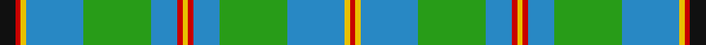

This page is one **sett** — a single exact thread-count. It belongs to the [tartan](/setts/k3r1ly1t11g13t5r1ly1/)
(the same proportion at any scale), whose colour order is pattern [KRYBGBRYRBGBYR](/stripes/krybgbryrbgbyr/).

Part of the [Snodgrass](/tartans/snodgrass/) tartan — the named design grouping this sett with its other cloths.

Sourced from register-of-tartans.  It is a [14 stripe tartan](/stripes/stripes14/).

Original link https://www.tartanregister.gov.uk/tartanDetails.aspx?ref=3827

## Register references

External register numbers recorded for this tartan.

- Scottish Register of Tartans: [3827](https://www.tartanregister.gov.uk/tartanDetails.aspx?ref=3827)
- Scottish Tartans Authority (ITI): 1216
- Scottish Tartans World Register: 1216

## Thread count
K/12 Ra4 Ya4 Ba44 G52 Ba20 Ra4 Ya4 Ra4 Ba20 G52 Ba44 Ya4 Ra/4

One full sett is **528 threads**.

## Palette

Palette: <strong>Tartan Register</strong>
<table><thead><tr><th>Colour</th><th>Threads</th><th>Shade</th><th>Base</th><th>OKLCh</th></tr></thead><tbody><tr><td>K/</td><td style="text-align:right;font-variant-numeric:tabular-nums">12</td><td><code style="background-color:#101010;">#101010</code> <small style="color:#888">#101010</small></td><td>K <code style="background-color:#000000;">#000000</code></td><td><small style="color:#888">oklch(17.3% 0.000 89.9)</small></td></tr><tr><td>Ra</td><td style="text-align:right;font-variant-numeric:tabular-nums">4</td><td><code style="background-color:#C80000;">#C80000</code> <small style="color:#888">#C80000</small></td><td>R <code style="background-color:#CC0000;">#CC0000</code></td><td><small style="color:#888">oklch(52.3% 0.215 29.2)</small></td></tr><tr><td>Ya</td><td style="text-align:right;font-variant-numeric:tabular-nums">4</td><td><code style="background-color:#E8C000;">#E8C000</code> <small style="color:#888">#E8C000</small></td><td>Y <code style="background-color:#F2BF00;">#F2BF00</code></td><td><small style="color:#888">oklch(81.9% 0.168 93.7)</small></td></tr><tr><td>Ba</td><td style="text-align:right;font-variant-numeric:tabular-nums">44</td><td><code style="background-color:#2888C4;">#2888C4</code> <small style="color:#888">#2888C4</small></td><td>B <code style="background-color:#2A418A;">#2A418A</code></td><td><small style="color:#888">oklch(60.1% 0.125 241.5)</small></td></tr><tr><td>G</td><td style="text-align:right;font-variant-numeric:tabular-nums">52</td><td><code style="background-color:#289C18;">#289C18</code> <small style="color:#888">#289C18</small></td><td>G <code style="background-color:#006100;">#006100</code></td><td><small style="color:#888">oklch(60.6% 0.191 141.6)</small></td></tr><tr><td>Ba</td><td style="text-align:right;font-variant-numeric:tabular-nums">20</td><td><code style="background-color:#2888C4;">#2888C4</code> <small style="color:#888">#2888C4</small></td><td>B <code style="background-color:#2A418A;">#2A418A</code></td><td><small style="color:#888">oklch(60.1% 0.125 241.5)</small></td></tr><tr><td>Ra</td><td style="text-align:right;font-variant-numeric:tabular-nums">4</td><td><code style="background-color:#C80000;">#C80000</code> <small style="color:#888">#C80000</small></td><td>R <code style="background-color:#CC0000;">#CC0000</code></td><td><small style="color:#888">oklch(52.3% 0.215 29.2)</small></td></tr><tr><td>Ya</td><td style="text-align:right;font-variant-numeric:tabular-nums">4</td><td><code style="background-color:#E8C000;">#E8C000</code> <small style="color:#888">#E8C000</small></td><td>Y <code style="background-color:#F2BF00;">#F2BF00</code></td><td><small style="color:#888">oklch(81.9% 0.168 93.7)</small></td></tr><tr><td>Ra</td><td style="text-align:right;font-variant-numeric:tabular-nums">4</td><td><code style="background-color:#C80000;">#C80000</code> <small style="color:#888">#C80000</small></td><td>R <code style="background-color:#CC0000;">#CC0000</code></td><td><small style="color:#888">oklch(52.3% 0.215 29.2)</small></td></tr><tr><td>Ba</td><td style="text-align:right;font-variant-numeric:tabular-nums">20</td><td><code style="background-color:#2888C4;">#2888C4</code> <small style="color:#888">#2888C4</small></td><td>B <code style="background-color:#2A418A;">#2A418A</code></td><td><small style="color:#888">oklch(60.1% 0.125 241.5)</small></td></tr><tr><td>G</td><td style="text-align:right;font-variant-numeric:tabular-nums">52</td><td><code style="background-color:#289C18;">#289C18</code> <small style="color:#888">#289C18</small></td><td>G <code style="background-color:#006100;">#006100</code></td><td><small style="color:#888">oklch(60.6% 0.191 141.6)</small></td></tr><tr><td>Ba</td><td style="text-align:right;font-variant-numeric:tabular-nums">44</td><td><code style="background-color:#2888C4;">#2888C4</code> <small style="color:#888">#2888C4</small></td><td>B <code style="background-color:#2A418A;">#2A418A</code></td><td><small style="color:#888">oklch(60.1% 0.125 241.5)</small></td></tr><tr><td>Ya</td><td style="text-align:right;font-variant-numeric:tabular-nums">4</td><td><code style="background-color:#E8C000;">#E8C000</code> <small style="color:#888">#E8C000</small></td><td>Y <code style="background-color:#F2BF00;">#F2BF00</code></td><td><small style="color:#888">oklch(81.9% 0.168 93.7)</small></td></tr><tr><td>Ra/</td><td style="text-align:right;font-variant-numeric:tabular-nums">4</td><td><code style="background-color:#C80000;">#C80000</code> <small style="color:#888">#C80000</small></td><td>R <code style="background-color:#CC0000;">#CC0000</code></td><td><small style="color:#888">oklch(52.3% 0.215 29.2)</small></td></tr></tbody></table>

## Nearest tartans

The nearest existing variants by ΔTartan distance, with this tartan at the top so the swatches line up against it.

ΔTartan

Tartan

Sett

—

<a href="/ttd/edit/#slug=k3r1ly1t11g13t5r1ly1~x4">Snodgrass</a> <a class="nn-out" href="/variants/s14/k3r1ly1t11g13t5r1ly1~x4/" title="open its dictionary page">↗</a>

0.62

<a href="/ttd/edit/#slug=g6b4ly2b17g2b2g2b8g26b6g4k2g4w6~x2&amp;base=k3r1ly1t11g13t5r1ly1~x4">Hay Hunting</a> <a class="nn-out" href="/variants/s14/g6b4ly2b17g2b2g2b8g26b6g4k2g4w6~x2/" title="open its dictionary page">↗</a>

1.23

<a href="/ttd/edit/#slug=g8b8ly1r1k1g2b2ly1r1k1g8b8~x4&amp;base=k3r1ly1t11g13t5r1ly1~x4">Chieftain's</a> <a class="nn-out" href="/variants/s12/g8b8ly1r1k1g2b2ly1r1k1g8b8~x4/" title="open its dictionary page">↗</a>

1.28

<a href="/ttd/edit/#slug=k3r1ly1t11g13t5r1ly1~x4">Snodgrass (Clan)</a> <a class="nn-out" href="/variants/s8/k3r1ly1t11g13t5r1ly1~x4/" title="open its dictionary page">↗</a>

1.32

<a href="/ttd/edit/#slug=g2r2g21k8t8k2t28k2t8k8g21w2g2~x2&amp;base=k3r1ly1t11g13t5r1ly1~x4">Mack Original (Personal)</a> <a class="nn-out" href="/variants/s13/g2r2g21k8t8k2t28k2t8k8g21w2g2~x2/" title="open its dictionary page">↗</a>

1.33

<a href="/ttd/edit/#slug=g2db1t6db6g4r1g18db1g1r1g1db1g4db10t6db1~x4&amp;base=k3r1ly1t11g13t5r1ly1~x4">Pina (Corporate)</a> <a class="nn-out" href="/variants/s16/g2db1t6db6g4r1g18db1g1r1g1db1g4db10t6db1~x4/" title="open its dictionary page">↗</a>

1.40

<a href="/ttd/edit/#slug=db22g6db5t2g22r6g5r4g9w3~x2&amp;base=k3r1ly1t11g13t5r1ly1~x4">MacConnell</a> <a class="nn-out" href="/variants/s10/db22g6db5t2g22r6g5r4g9w3~x2/" title="open its dictionary page">↗</a>

1.40

<a href="/ttd/edit/#slug=ly2g16t2w2t2w2t6g7r2w1t1p1~x2&amp;base=k3r1ly1t11g13t5r1ly1~x4">Fredericton</a> <a class="nn-out" href="/variants/s12/ly2g16t2w2t2w2t6g7r2w1t1p1~x2/" title="open its dictionary page">↗</a>

1.43

<a href="/ttd/edit/#slug=g20ly2y5w4g2y2g2y2b6~x2&amp;base=k3r1ly1t11g13t5r1ly1~x4">Boucherville (Tartan de..)</a> <a class="nn-out" href="/variants/s9/g20ly2y5w4g2y2g2y2b6~x2/" title="open its dictionary page">↗</a>

1.44

<a href="/ttd/edit/#slug=t14g4w4t1w2lo2w2g12t4w2t2w2lo1~x4&amp;base=k3r1ly1t11g13t5r1ly1~x4">Entrelacs (District)</a> <a class="nn-out" href="/variants/s13/t14g4w4t1w2lo2w2g12t4w2t2w2lo1~x4/" title="open its dictionary page">↗</a>

1.44

<a href="/ttd/edit/#slug=g11lr2g12k3t15r3t15g19lr2t3k2t3lo3~x2&amp;base=k3r1ly1t11g13t5r1ly1~x4">Greylock</a> <a class="nn-out" href="/variants/s13/g11lr2g12k3t15r3t15g19lr2t3k2t3lo3~x2/" title="open its dictionary page">↗</a>

## Neighbour map

Every grey dot is one of 14360 variants placed by the first two principal components of the ΔTartan feature space (44% of its variance). Red is this tartan; blue dots are its nearest — click one to open its page.

<svg viewBox="0 0 640 380" role="img" style="max-width:100%;height:auto;border:1px solid #e0e0e0;border-radius:4px;display:block" xmlns="http://www.w3.org/2000/svg"><image href="/nn/cloud.v1.png" width="640" height="380"/><a href="/variants/s14/g6b4ly2b17g2b2g2b8g26b6g4k2g4w6~x2/"><circle cx="253.7" cy="147.8" r="4" fill="#3465a4"><title>Hay Hunting</title></circle></a><a href="/variants/s12/g8b8ly1r1k1g2b2ly1r1k1g8b8~x4/"><circle cx="231.2" cy="187.1" r="4" fill="#3465a4"><title>Chieftain's</title></circle></a><a href="/variants/s8/k3r1ly1t11g13t5r1ly1~x4/"><circle cx="225.9" cy="163.8" r="4" fill="#3465a4"><title>Snodgrass (Clan)</title></circle></a><a href="/variants/s13/g2r2g21k8t8k2t28k2t8k8g21w2g2~x2/"><circle cx="207.6" cy="150.3" r="4" fill="#3465a4"><title>Mack Original (Personal)</title></circle></a><a href="/variants/s16/g2db1t6db6g4r1g18db1g1r1g1db1g4db10t6db1~x4/"><circle cx="262.1" cy="135.8" r="4" fill="#3465a4"><title>Pina (Corporate)</title></circle></a><a href="/variants/s10/db22g6db5t2g22r6g5r4g9w3~x2/"><circle cx="246.2" cy="180.8" r="4" fill="#3465a4"><title>MacConnell</title></circle></a><a href="/variants/s12/ly2g16t2w2t2w2t6g7r2w1t1p1~x2/"><circle cx="252.0" cy="117.0" r="4" fill="#3465a4"><title>Fredericton</title></circle></a><a href="/variants/s9/g20ly2y5w4g2y2g2y2b6~x2/"><circle cx="246.5" cy="157.6" r="4" fill="#3465a4"><title>Boucherville (Tartan de..)</title></circle></a><a href="/variants/s13/t14g4w4t1w2lo2w2g12t4w2t2w2lo1~x4/"><circle cx="218.0" cy="156.1" r="4" fill="#3465a4"><title>Entrelacs (District)</title></circle></a><a href="/variants/s13/g11lr2g12k3t15r3t15g19lr2t3k2t3lo3~x2/"><circle cx="217.6" cy="170.7" r="4" fill="#3465a4"><title>Greylock</title></circle></a><circle cx="244.6" cy="150.0" r="5" fill="#c00000"/></svg>

ID: /variants/s14/k3r1ly1t11g13t5r1ly1~x4/
