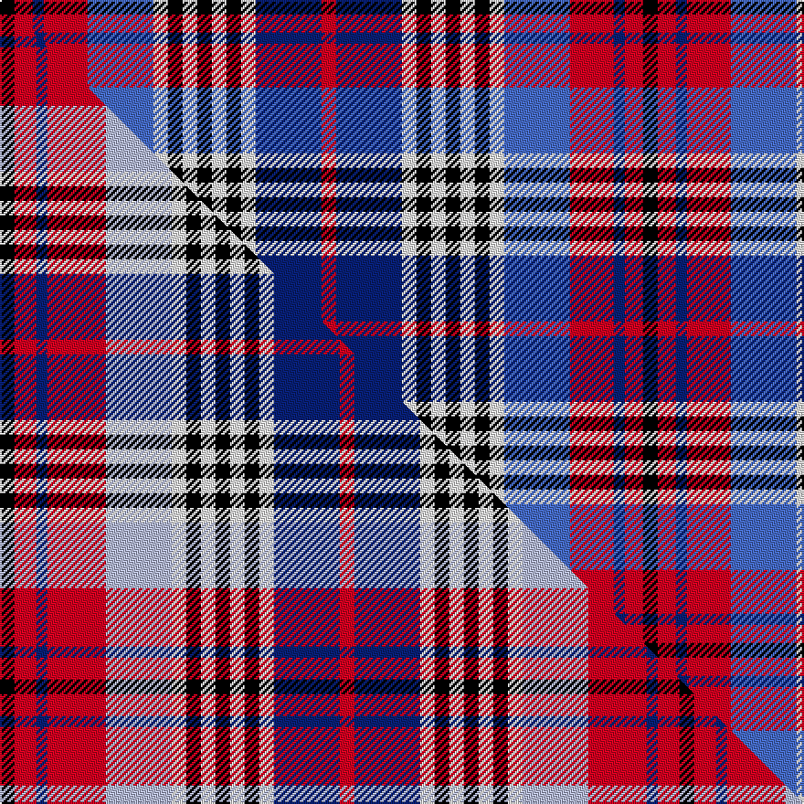

This is one **variant** — a specific cloth: this exact thread count and colourway, with its own
provenance below. It is one weaving of the [sett](/setts/k4r5db3r12b18w4k4w4k4w4k4w4db18r4/) (the scale-free proportion — the
same cloth at any scale or shade), whose colour order is pattern [KRBRBWKWKWKWBR](/stripes/krbrbwkwkwkwbr/).

Part of the [Edinburgh Military Tattoo](/tartans/edinburgh-military-tattoo/) tartan — the named design grouping this sett with its other cloths.

Sourced from weddslist.  It is a [14 stripe tartan](/stripes/stripes14/).

Original link [http://www.weddslist.com/cgi-bin/tartans/pg.pl?source=sts](http://www.weddslist.com/cgi-bin/tartans/pg.pl?source=sts)

Dataset <small>— provenance for this record, inherited from the source manifest</small>

<dl class="dataset-prov">
<dt>source</dt><dd><a href="/sources/weddslist/">Weddslist</a></dd>
<dt>data captured from</dt><dd><a href="https://github.com/thetartan/tartan-database/blob/master/data/weddslist/data.csv">https://github.com/thetartan/tartan-database/blob/master/data/weddslist/data.csv</a></dd>
<dt>data date</dt><dd>2016-11-17 <small>(dataset default)</small></dd>
<dt>licence</dt><dd><a href="https://creativecommons.org/licenses/by-nc-nd/4.0/">CC BY-NC-ND 4.0</a></dd>
</dl>

Capture chain <small>— the hands this data passed through, oldest first; each capture carries its own licence</small>

<ol class="capture-chain">
<li><a href="https://www.weddslist.com/tartans/">Weddslist</a> <small>the living privately compiled reference</small></li>
<li><a href="https://github.com/thetartan/tartan-database">thetartan/tartan-database</a> <small>2016-2017</small> · <a href="https://creativecommons.org/licenses/by-nc-nd/4.0/">CC BY-NC-ND 4.0</a> <small>Levko Kravets's frozen compilation — the capture we vendored, and where its CC licence text came from</small></li>
<li>this dictionary <small>captured 2026-06-10 · commit 5bf86c7566</small> <small>each re-capture is a git commit to data/sources</small></li>
</ol>

## Thread count
K/8 R10 DB6 R24 B36 W8 K8 W8 K8 W8 K8 W8 DB36 R/8

One full sett is **352 threads**.

## Palette
<table><thead><tr><th>Colour</th><th>Shade</th><th>OKLCh</th></tr></thead><tbody><tr><td>B</td><td><code style="background-color:#466CC8;">#466CC8</code> <small style="color:#888">#466CC8</small></td><td><small style="color:#888">oklch(55.1% 0.149 265.0)</small></td></tr><tr><td>DB</td><td><code style="background-color:#082077;">#082077</code> <small style="color:#888">#082077</small></td><td><small style="color:#888">oklch(30.0% 0.149 265.1)</small></td></tr><tr><td>K</td><td><code style="background-color:#000000;">#000000</code> <small style="color:#888">#000000</small></td><td><small style="color:#888">oklch(0.0% 0.000 0.0)</small></td></tr><tr><td>W</td><td><code style="background-color:#F7F7F7;">#F7F7F7</code> <small style="color:#888">#F7F7F7</small></td><td><small style="color:#888">oklch(97.6% 0.000 89.9)</small></td></tr><tr><td>R</td><td><code style="background-color:#D60020;">#D60020</code> <small style="color:#888">#D60020</small></td><td><small style="color:#888">oklch(55.2% 0.224 25.5)</small></td></tr></tbody></table>

# Sample pattern

## Compared to the master

This cloth is one sett of its design; the master sett (the exemplar the design is anchored on) is below for comparison.

Its **ΔTartan distance** from the master is **0.26** — the same measure the nearest-tartans table ranks by (0 is identical; a re-scale of the same cloth is near 0, a recolour or a different proportion further).

<figure class="master-compare" style="margin:0">

this sett
master sett ★

<figcaption style="color:#888;font-size:smaller">One weave of this sett against the <a href="/setts/k4r6db3r16lb18w4k4w4k4w4k4w4db18r4/">master sett ★</a>, split on the diagonal: a shared proportion runs seamlessly across it with only the shades shifting; a different proportion breaks on it.</figcaption>
</figure>

## Nearest tartan variants

The nearest existing variants by ΔTartan distance, with this cloth at the top so the swatches line up against it.

ΔTartan

Threads

Variant

Sett

—

352

<a href="/variants/s14/k4r5db3r12b18w4k4w4k4w4k4w4db18r4~x2/">Edinburgh, Military Tattoo</a>

<a href="/ttd/edit/#slug=k4r6db3r16lb18w4k4w4k4w4k4w4db18r4~x2&amp;base=k4r5db3r12b18w4k4w4k4w4k4w4db18r4~x2" title="compare in the TTD">0.26</a>

372

<a href="/variants/s14/k4r6db3r16lb18w4k4w4k4w4k4w4db18r4~x2/">Edinburgh Military Tattoo (Dance)</a>

<a href="/ttd/edit/#slug=dr8w30o5w8o5k12w6k12db28dr4db8dr8&amp;base=k4r5db3r12b18w4k4w4k4w4k4w4db18r4~x2" title="compare in the TTD">2.53</a>

252

<a href="/variants/s12/dr8w30o5w8o5k12w6k12db28dr4db8dr8/">Kinloch Anderson Dress</a>

<a href="/ttd/edit/#slug=r3lb3r3lb12k6g3k4db16k4g3k6lb3~x2&amp;base=k4r5db3r12b18w4k4w4k4w4k4w4db18r4~x2" title="compare in the TTD">2.67</a>

252

<a href="/variants/s12/r3lb3r3lb12k6g3k4db16k4g3k6lb3~x2/">Trinity Presbyterian Church</a>

<a href="/ttd/edit/#slug=db2k1db6k1dr5y3dr5k2w3k2w9k1w2k1y2~x2&amp;base=k4r5db3r12b18w4k4w4k4w4k4w4db18r4~x2" title="compare in the TTD">2.83</a>

172

<a href="/variants/s15/db2k1db6k1dr5y3dr5k2w3k2w9k1w2k1y2~x2/">Unidentified #11</a>

<a href="/ttd/edit/#slug=k20w3lb20k3r3dg20r10w3k20~x2&amp;base=k4r5db3r12b18w4k4w4k4w4k4w4db18r4~x2" title="compare in the TTD">2.88</a>

328

<a href="/variants/s9/k20w3lb20k3r3dg20r10w3k20~x2/">Soutar/Souter</a>

<a href="/ttd/edit/#slug=y2k2r2db10r1k9w9r2w2r1w2~x2&amp;base=k4r5db3r12b18w4k4w4k4w4k4w4db18r4~x2" title="compare in the TTD">2.97</a>

160

<a href="/variants/s11/y2k2r2db10r1k9w9r2w2r1w2~x2/">Cameron Erracht Dress Trade Tartan</a>

<a href="/ttd/edit/#slug=r20g3r3g13r6k10db14w3r3w3db14k12~x2&amp;base=k4r5db3r12b18w4k4w4k4w4k4w4db18r4~x2" title="compare in the TTD">3.07</a>

352

<a href="/variants/s12/r20g3r3g13r6k10db14w3r3w3db14k12~x2/">Glengarry Highland Games</a>

<a href="/ttd/edit/#slug=r6db9k2db2k2db9k10y4n17r5k2r5w4~x2&amp;base=k4r5db3r12b18w4k4w4k4w4k4w4db18r4~x2" title="compare in the TTD">3.09</a>

288

<a href="/variants/s13/r6db9k2db2k2db9k10y4n17r5k2r5w4~x2/">Alberta Caledonia (Corporate)</a>

<a href="/ttd/edit/#slug=db2k1db6k1r5y3r5k2w3k2w9k1w2k1y2~x2&amp;base=k4r5db3r12b18w4k4w4k4w4k4w4db18r4~x2" title="compare in the TTD">3.10</a>

172

<a href="/variants/s15/db2k1db6k1r5y3r5k2w3k2w9k1w2k1y2~x2/">Unidentified 32</a>

<a href="/ttd/edit/#slug=lyi3ly3lyi12k2ly2lo2ly8k2db12dp8k2dp2~x2~lyi3202083-ly2804101&amp;base=k4r5db3r12b18w4k4w4k4w4k4w4db18r4~x2" title="compare in the TTD">3.10</a>

222

<a href="/variants/s12/lyi3ly3lyi12k2ly2lo2ly8k2db12dp8k2dp2~x2~lyi3202083-ly2804101/">Merise and Lars (Personal)</a>

## Neighbour map

Every grey dot is one of 13621 variants placed by the first two principal components of the ΔTartan feature space (42% of its variance). Red is this tartan; blue dots are its nearest — click one to open its page.

<svg viewBox="0 0 640 380" role="img" style="max-width:100%;height:auto;border:1px solid #e0e0e0;border-radius:4px;display:block" xmlns="http://www.w3.org/2000/svg"><image href="/nn/cloud.v1.png" width="640" height="380"/><a href="/variants/s14/k4r6db3r16lb18w4k4w4k4w4k4w4db18r4~x2/"><circle cx="29.1" cy="162.0" r="4" fill="#3465a4"><title>Edinburgh Military Tattoo (Dance)</title></circle></a><a href="/variants/s12/dr8w30o5w8o5k12w6k12db28dr4db8dr8/"><circle cx="58.4" cy="165.0" r="4" fill="#3465a4"><title>Kinloch Anderson Dress</title></circle></a><a href="/variants/s12/r3lb3r3lb12k6g3k4db16k4g3k6lb3~x2/"><circle cx="46.9" cy="182.1" r="4" fill="#3465a4"><title>Trinity Presbyterian Church</title></circle></a><a href="/variants/s15/db2k1db6k1dr5y3dr5k2w3k2w9k1w2k1y2~x2/"><circle cx="50.0" cy="151.9" r="4" fill="#3465a4"><title>Unidentified #11</title></circle></a><a href="/variants/s9/k20w3lb20k3r3dg20r10w3k20~x2/"><circle cx="33.9" cy="156.3" r="4" fill="#3465a4"><title>Soutar/Souter</title></circle></a><a href="/variants/s11/y2k2r2db10r1k9w9r2w2r1w2~x2/"><circle cx="73.0" cy="142.8" r="4" fill="#3465a4"><title>Cameron Erracht Dress Trade Tartan</title></circle></a><a href="/variants/s12/r20g3r3g13r6k10db14w3r3w3db14k12~x2/"><circle cx="55.2" cy="179.2" r="4" fill="#3465a4"><title>Glengarry Highland Games</title></circle></a><a href="/variants/s13/r6db9k2db2k2db9k10y4n17r5k2r5w4~x2/"><circle cx="34.6" cy="152.9" r="4" fill="#3465a4"><title>Alberta Caledonia (Corporate)</title></circle></a><a href="/variants/s15/db2k1db6k1r5y3r5k2w3k2w9k1w2k1y2~x2/"><circle cx="48.4" cy="147.5" r="4" fill="#3465a4"><title>Unidentified 32</title></circle></a><a href="/variants/s12/lyi3ly3lyi12k2ly2lo2ly8k2db12dp8k2dp2~x2~lyi3202083-ly2804101/"><circle cx="27.2" cy="166.4" r="4" fill="#3465a4"><title>Merise and Lars (Personal)</title></circle></a><circle cx="16.8" cy="166.0" r="5" fill="#c00000"/><text x="320" y="376" text-anchor="middle" font-size="11" fill="#999">ground</text><text x="11" y="190" text-anchor="middle" font-size="11" fill="#999" transform="rotate(-90 11 190)">complexity</text></svg>

ID: /variants/s14/k4r5db3r12b18w4k4w4k4w4k4w4db18r4~x2/
