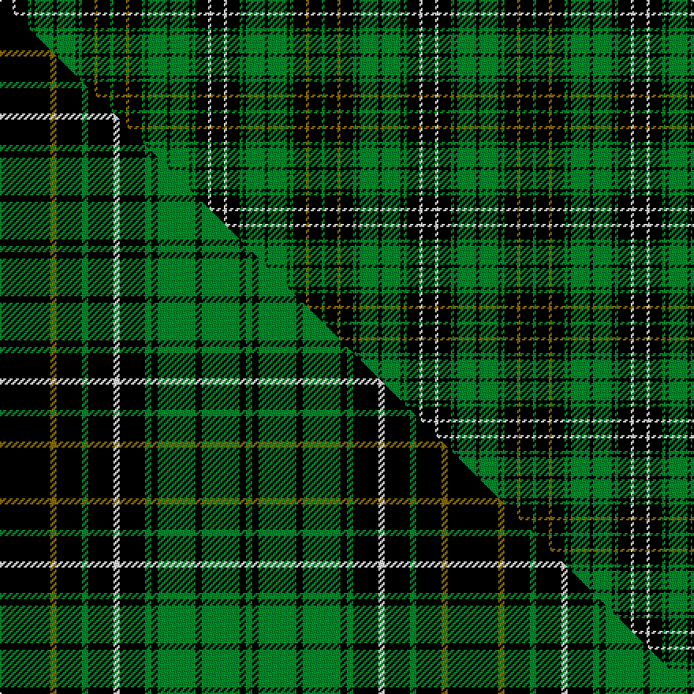

This is one **variant** — a specific cloth: this exact thread count and colourway, with its own
provenance below. It is one weaving of the [sett](/tartans/m/ma/macalpine-2/) (the scale-free proportion — the
same cloth at any scale or shade), whose colour order is pattern [GKGKGKGKGKGKWK](/stripes/gkgkgkgkgkgkwk/).

Part of the [MacAlpine](/tartans/m/ma/macalpine-2/) tartan — the named design grouping this sett with its other cloths.

Sourced from weddslist.  It is a [14 stripe tartan](/stripes/stripes14/).

Original link [http://www.weddslist.com/cgi-bin/tartans/pg.pl?source=rb](http://www.weddslist.com/cgi-bin/tartans/pg.pl?source=rb)

3 attestations — the source records this cloth was collapsed from (oldest owns this page)

<ul>
<li>undated — MacAlpine (weddslist, <a href="http://www.weddslist.com/cgi-bin/tartans/pg.pl?source=rb">record</a>) </li>
<li>undated — MacAlpine (a) (weddslist, <a href="http://www.weddslist.com/cgi-bin/tartans/pg.pl?source=tinsel">record</a>) </li>
<li>undated — MacAlpine (weddslist, <a href="http://www.weddslist.com/cgi-bin/tartans/pg.pl?source=x">record</a>) </li>
</ul>

Dataset <small>— provenance for this record, inherited from the source manifest</small>

<dl class="dataset-prov">
<dt>source</dt><dd><a href="/sources/weddslist/">Weddslist</a></dd>
<dt>data captured from</dt><dd><a href="https://github.com/thetartan/tartan-database/blob/master/data/weddslist/data.csv">https://github.com/thetartan/tartan-database/blob/master/data/weddslist/data.csv</a></dd>
<dt>data date</dt><dd>2016-11-17 <small>(dataset default)</small></dd>
<dt>licence</dt><dd><a href="https://creativecommons.org/licenses/by-nc-nd/4.0/">CC BY-NC-ND 4.0</a></dd>
</dl>

Capture chain <small>— the hands this data passed through, oldest first; each capture carries its own licence</small>

<ol class="capture-chain">
<li><a href="https://www.weddslist.com/tartans/">Weddslist</a> <small>the living privately compiled reference</small></li>
<li><a href="https://github.com/thetartan/tartan-database">thetartan/tartan-database</a> <small>2016-2017</small> · <a href="https://creativecommons.org/licenses/by-nc-nd/4.0/">CC BY-NC-ND 4.0</a> <small>Levko Kravets's frozen compilation — the capture we vendored, and where its CC licence text came from</small></li>
<li>this dictionary <small>captured 2026-06-10 · commit 5bf86c7566</small> <small>each re-capture is a git commit to data/sources</small></li>
</ol>

## Thread count
K/8 W2 K8 G2 K2 G12 K2 G12 K2 G2 K8 Y2 K8 G/2

One full sett is **134 threads**.

## Palette
<table><thead><tr><th>Colour</th><th>Shade</th><th>OKLCh</th></tr></thead><tbody><tr><td>G</td><td><code style="background-color:#008B2A;">#008B2A</code> <small style="color:#888">#008B2A</small></td><td><small style="color:#888">oklch(55.4% 0.170 145.9)</small></td></tr><tr><td>K</td><td><code style="background-color:#000000;">#000000</code> <small style="color:#888">#000000</small></td><td><small style="color:#888">oklch(0.0% 0.000 0.0)</small></td></tr><tr><td>W</td><td><code style="background-color:#F7F7F7;">#F7F7F7</code> <small style="color:#888">#F7F7F7</small></td><td><small style="color:#888">oklch(97.6% 0.000 89.9)</small></td></tr><tr><td>Y</td><td><code style="background-color:#8B6E00;">#8B6E00</code> <small style="color:#888">#8B6E00</small></td><td><small style="color:#888">oklch(55.1% 0.113 90.4)</small></td></tr></tbody></table>

# Sample pattern

[Sample sheet (PDF)](swatch.pdf) — the woven sample, thread count and palette on one printable A4, rendered on demand (the same sheet the TTD print page downloads).

## Compared to the master

This cloth is one sett of its design; the master sett (the exemplar the design is anchored on) is below for comparison.

Its **ΔTartan distance** from the master is **0.24** — the same measure the nearest-tartans table ranks by (0 is identical; a re-scale of the same cloth is near 0, a recolour or a different proportion further).

<figure class="master-compare" style="margin:0">

this sett
master sett ★

<figcaption style="color:#888;font-size:smaller">One weave of this sett against the <a href="/setts/k8y1k4g1k4w1k4g1k1g6k1g6k1g1/">master sett ★</a>, split on the diagonal: a shared proportion runs seamlessly across it with only the shades shifting; a different proportion breaks on it.</figcaption>
</figure>

## Nearest tartan variants

The nearest existing variants by ΔTartan distance, with this cloth at the top so the swatches line up against it.

ΔTartan

Threads

Variant

Sett

—

134

<a href="/variants/s14/k4w1k4g1k1g6k1g6k1g1k4y1k4g1~x2/">MacAlpine</a>

<a href="/ttd/edit/#slug=k4y1k4g1k4w1k4g1k1g6k1g6k1g1~x4&amp;base=k4w1k4g1k1g6k1g6k1g1k4y1k4g1~x2" title="compare in the TTD">0.00</a>

268

<a href="/variants/s14/k4y1k4g1k4w1k4g1k1g6k1g6k1g1~x4/">MacAlpine Clan Tartan</a>

<a href="/ttd/edit/#slug=k8y1k4g1k4w1k4g1k1g6k1g6k1g1~x4&amp;base=k4w1k4g1k1g6k1g6k1g1k4y1k4g1~x2" title="compare in the TTD">0.24</a>

284

<a href="/variants/s14/k8y1k4g1k4w1k4g1k1g6k1g6k1g1~x4/">MacAlpine</a>

<a href="/ttd/edit/#slug=k3g10y2g10k9g2k9g10r2g10k3g2k5g2k5g2~x2&amp;base=k4w1k4g1k1g6k1g6k1g1k4y1k4g1~x2" title="compare in the TTD">1.91</a>

334

<a href="/variants/s16/k3g10y2g10k9g2k9g10r2g10k3g2k5g2k5g2~x2/">Stuart/Stewart Hunting #4</a>

<a href="/ttd/edit/#slug=k8w3k8g4k4g32k4g32k4g4k8w3k8lb4~x2&amp;base=k4w1k4g1k1g6k1g6k1g1k4y1k4g1~x2" title="compare in the TTD">2.08</a>

480

<a href="/variants/s14/k8w3k8g4k4g32k4g32k4g4k8w3k8lb4~x2/">Hartmann (Personal)</a>

<a href="/ttd/edit/#slug=k4w1k4g1k1g6k1g6db1g1db4y1k4g1~x2&amp;base=k4w1k4g1k1g6k1g6k1g1k4y1k4g1~x2" title="compare in the TTD">2.18</a>

134

<a href="/variants/s14/k4w1k4g1k1g6k1g6db1g1db4y1k4g1~x2/">MacAlpine D</a>

<a href="/ttd/edit/#slug=g11db1k1g2k12y1k12g2k2g11k2g2k12y1~x4&amp;base=k4w1k4g1k1g6k1g6k1g1k4y1k4g1~x2" title="compare in the TTD">2.27</a>

528

<a href="/variants/s14/g11db1k1g2k12y1k12g2k2g11k2g2k12y1~x4/">Hopetoun Rejected design</a>

<a href="/ttd/edit/#slug=dg13r2dg19k15dg5k15dg5k15dg5k15dg19r2dg13lb4~x2~dg4514144&amp;base=k4w1k4g1k1g6k1g6k1g1k4y1k4g1~x2" title="compare in the TTD">2.34</a>

554

<a href="/variants/s14/dg13r2dg19k15dg5k15dg5k15dg5k15dg19r2dg13lb4~x2~dg4514144/">Strath Hallidale (Sutherland)</a>

<a href="/ttd/edit/#slug=k1dr1g7k8w1k8dr1g2dr1g4dr1~x4&amp;base=k4w1k4g1k1g6k1g6k1g1k4y1k4g1~x2" title="compare in the TTD">2.48</a>

272

<a href="/variants/s11/k1dr1g7k8w1k8dr1g2dr1g4dr1~x4/">Episcopal Clergy (Corporate)</a>

<a href="/ttd/edit/#slug=k14r3k7g26w6g26k16r3k16r3k16g26w6g26k7r3k14r4&amp;base=k4w1k4g1k1g6k1g6k1g1k4y1k4g1~x2" title="compare in the TTD">2.67</a>

426

<a href="/variants/s18/k14r3k7g26w6g26k16r3k16r3k16g26w6g26k7r3k14r4/">J &amp; B Whisky (Original)</a>

<a href="/ttd/edit/#slug=g5y1g3y2g8k8db1k8g1~x4&amp;base=k4w1k4g1k1g6k1g6k1g1k4y1k4g1~x2" title="compare in the TTD">2.71</a>

272

<a href="/variants/s9/g5y1g3y2g8k8db1k8g1~x4/">Fitzpatrick Irish Family Tartan</a>

## Neighbour map

Every grey dot is one of 13662 variants placed by the first two principal components of the ΔTartan feature space (42% of its variance). Red is this tartan; blue dots are its nearest — click one to open its page. The map is a flat projection of a many-dimensional space — [how to read it](/posts/neighbourhood-maps/).

<svg viewBox="0 0 640 380" role="img" style="max-width:100%;height:auto;border:1px solid #e0e0e0;border-radius:4px;display:block" xmlns="http://www.w3.org/2000/svg"><image href="/nn/cloud.v1.png" width="640" height="380"/><a href="/variants/s14/k4y1k4g1k4w1k4g1k1g6k1g6k1g1~x4/"><circle cx="202.0" cy="183.2" r="4" fill="#3465a4"><title>MacAlpine Clan Tartan</title></circle></a><a href="/variants/s14/k8y1k4g1k4w1k4g1k1g6k1g6k1g1~x4/"><circle cx="238.3" cy="163.7" r="4" fill="#3465a4"><title>MacAlpine</title></circle></a><a href="/variants/s16/k3g10y2g10k9g2k9g10r2g10k3g2k5g2k5g2~x2/"><circle cx="202.9" cy="197.6" r="4" fill="#3465a4"><title>Stuart/Stewart Hunting #4</title></circle></a><a href="/variants/s14/k8w3k8g4k4g32k4g32k4g4k8w3k8lb4~x2/"><circle cx="248.9" cy="138.1" r="4" fill="#3465a4"><title>Hartmann (Personal)</title></circle></a><a href="/variants/s14/k4w1k4g1k1g6k1g6db1g1db4y1k4g1~x2/"><circle cx="118.9" cy="174.5" r="4" fill="#3465a4"><title>MacAlpine D</title></circle></a><a href="/variants/s14/g11db1k1g2k12y1k12g2k2g11k2g2k12y1~x4/"><circle cx="262.7" cy="141.1" r="4" fill="#3465a4"><title>Hopetoun Rejected design</title></circle></a><a href="/variants/s14/dg13r2dg19k15dg5k15dg5k15dg5k15dg19r2dg13lb4~x2~dg4514144/"><circle cx="222.8" cy="188.8" r="4" fill="#3465a4"><title>Strath Hallidale (Sutherland)</title></circle></a><a href="/variants/s11/k1dr1g7k8w1k8dr1g2dr1g4dr1~x4/"><circle cx="198.6" cy="169.3" r="4" fill="#3465a4"><title>Episcopal Clergy (Corporate)</title></circle></a><a href="/variants/s18/k14r3k7g26w6g26k16r3k16r3k16g26w6g26k7r3k14r4/"><circle cx="158.8" cy="162.4" r="4" fill="#3465a4"><title>J &amp; B Whisky (Original)</title></circle></a><a href="/variants/s9/g5y1g3y2g8k8db1k8g1~x4/"><circle cx="189.6" cy="196.5" r="4" fill="#3465a4"><title>Fitzpatrick Irish Family Tartan</title></circle></a><circle cx="202.0" cy="183.2" r="5" fill="#c00000"/><text x="320" y="376" text-anchor="middle" font-size="11" fill="#999">ground</text><text x="11" y="190" text-anchor="middle" font-size="11" fill="#999" transform="rotate(-90 11 190)">complexity</text></svg>

ID: /variants/s14/k4w1k4g1k1g6k1g6k1g1k4y1k4g1~x2/
