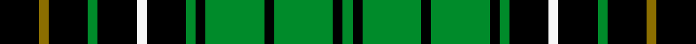
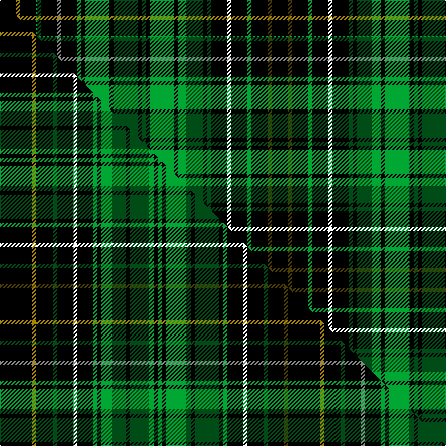

This page is one **sett** — a single exact thread-count. It belongs to the [tartan](/setts/k4y1k4g1k4w1k4g1k1g6k1g6k1g1/)
(the same proportion at any scale), whose colour order is pattern [GKGKGKGKWKGKGK](/stripes/gkgkgkgkwkgkgk/).

Part of the [MacAlpine](/tartans/macalpine-2/) tartan — the named design grouping this sett with its other cloths.

Sourced from weddslist.  It is a [14 stripe tartan](/stripes/stripes14/).

Original link http://www.weddslist.com/cgi-bin/tartans/pg.pl?source=sts

## Provenance

Earliest known date: 1908 'The Clans, Sept and Regiments of the Scottish Highlands' (1908) by Frank Adam, is the first document of the tartan. The history of the Clan MacAlpine is obscure. The Siol Alpin is claimed as the origin of a number of clans, but as D.C. Stewart remarks, "belongs rather to mythology than to history." It is considered to be a branch of the royal Clan Alpin, of the Kings of Dalriada. The tartan is similar to the hunting MacLean, but for the yellow lines. Other tartans connected with Siol Alpin are red.

2 attestations — the source records this cloth was collapsed from (oldest owns this page)

<ul>
<li>undated — MacAlpine (weddslist, <a href="http://www.weddslist.com/cgi-bin/tartans/pg.pl?source=sts">record</a>) </li>
<li>undated — MacAlpine Clan Tartan (house-of-tartan, <a href="http://www.house-of-tartan.scotland.net/house/TartanViewjs.asp?colr=Def&tnam=2024">record</a>) </li>
</ul>

## Thread count
K/16 Y4 K16 G4 K16 W4 K16 G4 K4 G24 K4 G24 K4 G/4

One full sett is **268 threads**.

## Palette
<table><thead><tr><th>Colour</th><th>Shade</th><th>OKLCh</th></tr></thead><tbody><tr><td>G</td><td><code style="background-color:#008B2A;">#008B2A</code> <small style="color:#888">#008B2A</small></td><td><small style="color:#888">oklch(55.4% 0.170 145.9)</small></td></tr><tr><td>K</td><td><code style="background-color:#000000;">#000000</code> <small style="color:#888">#000000</small></td><td><small style="color:#888">oklch(0.0% 0.000 0.0)</small></td></tr><tr><td>W</td><td><code style="background-color:#F7F7F7;">#F7F7F7</code> <small style="color:#888">#F7F7F7</small></td><td><small style="color:#888">oklch(97.6% 0.000 89.9)</small></td></tr><tr><td>Y</td><td><code style="background-color:#8B6E00;">#8B6E00</code> <small style="color:#888">#8B6E00</small></td><td><small style="color:#888">oklch(55.1% 0.113 90.4)</small></td></tr></tbody></table>

# Sample pattern

## Compared to the master

This cloth is one sett of its design; the master sett (the exemplar the design is anchored on) is below for comparison.

Its **ΔTartan distance** from the master is **0.70** — the same measure the nearest-tartans table ranks by (0 is identical; a re-scale of the same cloth is near 0, a recolour or a different proportion further).

<figure class="master-compare" style="margin:0">

this sett
master sett ★

<figcaption style="color:#888;font-size:smaller">One weave of this sett against the <a href="/setts/k8y1k4g1k4w1k4g1k1g6k1g6k1g1/">master sett ★</a>, split on the diagonal: a shared proportion runs seamlessly across it with only the shades shifting; a different proportion breaks on it.</figcaption>
</figure>

## Nearest variants

The nearest existing variants by ΔTartan distance, with this cloth at the top so the swatches line up against it.

ΔTartan

Threads

Variant

Sett

—

268

<a href="/variants/s14/k4y1k4g1k4w1k4g1k1g6k1g6k1g1~x4/">MacAlpine</a>

<a href="/ttd/edit/#slug=k4w1k4g1k1g6k1g6k1g1k4y1k4g1~x2&amp;base=k4y1k4g1k4w1k4g1k1g6k1g6k1g1~x4" title="compare in the TTD">0.00</a>

134

<a href="/variants/s14/k4w1k4g1k1g6k1g6k1g1k4y1k4g1~x2/">MacAlpine</a>

<a href="/ttd/edit/#slug=k8y1k4g1k4w1k4g1k1g6k1g6k1g1~x4&amp;base=k4y1k4g1k4w1k4g1k1g6k1g6k1g1~x4" title="compare in the TTD">0.20</a>

284

<a href="/variants/s14/k8y1k4g1k4w1k4g1k1g6k1g6k1g1~x4/">MacAlpine</a>

<a href="/ttd/edit/#slug=k8w3k8g4k4g32k4g32k4g4k8w3k8lb4~x2&amp;base=k4y1k4g1k4w1k4g1k1g6k1g6k1g1~x4" title="compare in the TTD">2.06</a>

480

<a href="/variants/s14/k8w3k8g4k4g32k4g32k4g4k8w3k8lb4~x2/">Hartmann (Personal)</a>

<a href="/ttd/edit/#slug=k4w1k4g1k1g6k1g6db1g1db4y1k4g1~x2&amp;base=k4y1k4g1k4w1k4g1k1g6k1g6k1g1~x4" title="compare in the TTD">2.15</a>

134

<a href="/variants/s14/k4w1k4g1k1g6k1g6db1g1db4y1k4g1~x2/">MacAlpine D</a>

<a href="/ttd/edit/#slug=g11db1k1g2k12y1k12g2k2g11k2g2k12y1~x4&amp;base=k4y1k4g1k4w1k4g1k1g6k1g6k1g1~x4" title="compare in the TTD">2.23</a>

528

<a href="/variants/s14/g11db1k1g2k12y1k12g2k2g11k2g2k12y1~x4/">Hopetoun Rejected design</a>

## Neighbour map

Every grey dot is one of 13620 variants placed by the first two principal components of the ΔTartan feature space (42% of its variance). Red is this tartan; blue dots are its nearest — click one to open its page.

<svg viewBox="0 0 640 380" role="img" style="max-width:100%;height:auto;border:1px solid #e0e0e0;border-radius:4px;display:block" xmlns="http://www.w3.org/2000/svg"><image href="/nn/cloud.v1.png" width="640" height="380"/><a href="/variants/s14/k4w1k4g1k1g6k1g6k1g1k4y1k4g1~x2/"><circle cx="202.2" cy="183.6" r="4" fill="#3465a4"><title>MacAlpine</title></circle></a><a href="/variants/s14/k8y1k4g1k4w1k4g1k1g6k1g6k1g1~x4/"><circle cx="238.5" cy="164.1" r="4" fill="#3465a4"><title>MacAlpine</title></circle></a><a href="/variants/s14/k8w3k8g4k4g32k4g32k4g4k8w3k8lb4~x2/"><circle cx="249.1" cy="138.4" r="4" fill="#3465a4"><title>Hartmann (Personal)</title></circle></a><a href="/variants/s14/k4w1k4g1k1g6k1g6db1g1db4y1k4g1~x2/"><circle cx="119.2" cy="174.7" r="4" fill="#3465a4"><title>MacAlpine D</title></circle></a><a href="/variants/s14/g11db1k1g2k12y1k12g2k2g11k2g2k12y1~x4/"><circle cx="262.9" cy="141.4" r="4" fill="#3465a4"><title>Hopetoun Rejected design</title></circle></a><circle cx="202.2" cy="183.6" r="5" fill="#c00000"/><text x="320" y="376" text-anchor="middle" font-size="11" fill="#999">ground</text><text x="11" y="190" text-anchor="middle" font-size="11" fill="#999" transform="rotate(-90 11 190)">complexity</text></svg>

ID: /variants/s14/k4y1k4g1k4w1k4g1k1g6k1g6k1g1~x4/
