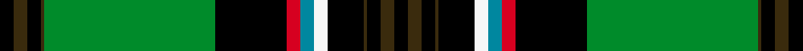

This is one **variant** — a specific cloth: this exact thread count and colourway, with its own
provenance below. It is one weaving of the [sett](/setts/k8dy8k8dy2g100k42r8t8w8k21dy2k8dy8k8/) (the scale-free proportion — the
same cloth at any scale or shade), whose colour order is pattern [KGKGGKRBWKGKGK](/stripes/kgkggkrbwkgkgk/).

Sourced from house-of-tartan.  It is a [14 stripe tartan](/stripes/stripes14/).

Original link [http://www.house-of-tartan.scotland.net/house/TartanViewjs.asp?colr=Def&tnam=7614](http://www.house-of-tartan.scotland.net/house/TartanViewjs.asp?colr=Def&tnam=7614)

## Provenance

Earliest known date: 2008 In Germany our scout association stands under the patronage of the Russian orthodox parish in Frankfurt, which has the status of charitable organisation. We also have in France the status of Association Loi de 1901 - which is a non profit association based on benevolate : Sergei Tarassow is the elected president of this association, named Scouts Russes Saint Georges 1909. In USA they have the same status under the name of Saint George Pathfinders of America. The yellow stripes in the design represent the ribbon of the Order of St George

Dataset <small>— provenance for this record, inherited from the source manifest</small>

<dl class="dataset-prov">
<dt>source</dt><dd><a href="/sources/house-of-tartan/">House of Tartan</a></dd>
<dt>data captured from</dt><dd><a href="https://github.com/thetartan/tartan-database/blob/master/data/house-of-tartan/data.csv">https://github.com/thetartan/tartan-database/blob/master/data/house-of-tartan/data.csv</a></dd>
<dt>data date</dt><dd>2008 <small>(this record)</small></dd>
<dt>licence</dt><dd><a href="https://creativecommons.org/licenses/by-nc-nd/4.0/">CC BY-NC-ND 4.0</a></dd>
</dl>

Capture chain <small>— the hands this data passed through, oldest first; each capture carries its own licence</small>

<ol class="capture-chain">
<li><a href="http://www.house-of-tartan.scotland.net/">House of Tartan</a> <small>the weaver/retailer's database — the site is now offline; the URL is kept as the ultimate source's identity</small></li>
<li><a href="https://github.com/thetartan/tartan-database">thetartan/tartan-database</a> <small>2016-2017</small> · <a href="https://creativecommons.org/licenses/by-nc-nd/4.0/">CC BY-NC-ND 4.0</a> <small>Levko Kravets's frozen compilation — the capture we vendored, and where its CC licence text came from</small></li>
<li>this dictionary <small>captured 2026-06-10 · commit 5bf86c7566</small> <small>each re-capture is a git commit to data/sources</small></li>
</ol>

## Thread count
K/8 DY8 K8 DY2 G100 K42 R8 T8 W8 K21 DY2 K8 DY8 K/8

One full sett is **462 threads**.

## Palette
<table><thead><tr><th>Colour</th><th>Shade</th><th>OKLCh</th></tr></thead><tbody><tr><td>T</td><td><code style="background-color:#00879F;">#00879F</code> <small style="color:#888">#00879F</small></td><td><small style="color:#888">oklch(57.4% 0.102 216.1)</small></td></tr><tr><td>DR</td><td><code style="background-color:#55120C;">#55120C</code> <small style="color:#888">#55120C</small></td><td><small style="color:#888">oklch(30.0% 0.099 29.3)</small></td></tr><tr><td>DY</td><td><code style="background-color:#3A2B0D;">#3A2B0D</code> <small style="color:#888">#3A2B0D</small></td><td><small style="color:#888">oklch(30.0% 0.049 82.0)</small></td></tr><tr><td>G</td><td><code style="background-color:#008B2A;">#008B2A</code> <small style="color:#888">#008B2A</small></td><td><small style="color:#888">oklch(55.4% 0.170 145.9)</small></td></tr><tr><td>K</td><td><code style="background-color:#000000;">#000000</code> <small style="color:#888">#000000</small></td><td><small style="color:#888">oklch(0.0% 0.000 0.0)</small></td></tr><tr><td>W</td><td><code style="background-color:#F7F7F7;">#F7F7F7</code> <small style="color:#888">#F7F7F7</small></td><td><small style="color:#888">oklch(97.6% 0.000 89.9)</small></td></tr><tr><td>R</td><td><code style="background-color:#D60020;">#D60020</code> <small style="color:#888">#D60020</small></td><td><small style="color:#888">oklch(55.2% 0.224 25.5)</small></td></tr><tr><td>LY</td><td><code style="background-color:#DCBC32;">#DCBC32</code> <small style="color:#888">#DCBC32</small></td><td><small style="color:#888">oklch(80.0% 0.150 95.2)</small></td></tr></tbody></table>

# Sample pattern

## Nearest tartan variants

The nearest existing variants by ΔTartan distance, with this cloth at the top so the swatches line up against it.

ΔTartan

Threads

Variant

Sett

—

462

<a href="/variants/s14/k8dy8k8dy2g100k42r8t8w8k21dy2k8dy8k8/">Tarassow Russian Scouts Corporate Tartan</a>

<a href="/ttd/edit/#slug=k8ly8k8ly2g100k42r8t8w8k21ly2k8ly8k8&amp;base=k8dy8k8dy2g100k42r8t8w8k21dy2k8dy8k8" title="compare in the TTD">0.09</a>

462

<a href="/variants/s14/k8ly8k8ly2g100k42r8t8w8k21ly2k8ly8k8/">Tarassow Russian Scout (Corporate)</a>

<a href="/ttd/edit/#slug=k8lo8k8lo2g100k42r8t8w8k21lo2k8lo8k8&amp;base=k8dy8k8dy2g100k42r8t8w8k21dy2k8dy8k8" title="compare in the TTD">1.20</a>

462

<a href="/variants/s14/k8lo8k8lo2g100k42r8t8w8k21lo2k8lo8k8/">Tarassow Russian Scout</a>

<a href="/ttd/edit/#slug=db4k1r2k32g32y2k1g3lb2~x2~db1407270&amp;base=k8dy8k8dy2g100k42r8t8w8k21dy2k8dy8k8" title="compare in the TTD">2.63</a>

304

<a href="/variants/s9/db4k1r2k32g32y2k1g3lb2~x2~db1407270/">Roderick Dhu Canada Tartan</a>

<a href="/ttd/edit/#slug=db4k1r2k32g32y2k1g3lb2~x2&amp;base=k8dy8k8dy2g100k42r8t8w8k21dy2k8dy8k8" title="compare in the TTD">2.63</a>

304

<a href="/variants/s9/db4k1r2k32g32y2k1g3lb2~x2/">Roderick, Dhu</a>

<a href="/ttd/edit/#slug=k8lb2r2k6r2k2y1k2dy16g30k1r2k4lb2~x2&amp;base=k8dy8k8dy2g100k42r8t8w8k21dy2k8dy8k8" title="compare in the TTD">2.71</a>

300

<a href="/variants/s14/k8lb2r2k6r2k2y1k2dy16g30k1r2k4lb2~x2/">Murphy, Andrew (Personal)</a>

<a href="/ttd/edit/#slug=g4dg40g4k8db4k8g5k2ly4k2dg1g2dg2k1n1~x2&amp;base=k8dy8k8dy2g100k42r8t8w8k21dy2k8dy8k8" title="compare in the TTD">2.80</a>

342

<a href="/variants/s15/g4dg40g4k8db4k8g5k2ly4k2dg1g2dg2k1n1~x2/">Eastern Shore Police (Corporate)</a>

<a href="/ttd/edit/#slug=dg50k3w4k1ly5r4k1w2k2t15k5dg4w2~x2&amp;base=k8dy8k8dy2g100k42r8t8w8k21dy2k8dy8k8" title="compare in the TTD">2.98</a>

288

<a href="/variants/s13/dg50k3w4k1ly5r4k1w2k2t15k5dg4w2~x2/">City of Abbotsford (District)</a>

<a href="/ttd/edit/#slug=t3k3w1dr3k8t2dg36t2k8w1k3t3y2~x2&amp;base=k8dy8k8dy2g100k42r8t8w8k21dy2k8dy8k8" title="compare in the TTD">3.24</a>

290

<a href="/variants/s13/t3k3w1dr3k8t2dg36t2k8w1k3t3y2~x2/">U.S. Special Forces (Military)</a>

<a href="/ttd/edit/#slug=lb11k2lb2k2dy2k11dg30r2dg3k1w5~x2&amp;base=k8dy8k8dy2g100k42r8t8w8k21dy2k8dy8k8" title="compare in the TTD">3.25</a>

252

<a href="/variants/s11/lb11k2lb2k2dy2k11dg30r2dg3k1w5~x2/">Labrador</a>

<a href="/ttd/edit/#slug=lb11k2lb2k2ly2k11dg30r2dg3k1w5~x2&amp;base=k8dy8k8dy2g100k42r8t8w8k21dy2k8dy8k8" title="compare in the TTD">3.27</a>

252

<a href="/variants/s11/lb11k2lb2k2ly2k11dg30r2dg3k1w5~x2/">Labrador (District)</a>

## Neighbour map

Every grey dot is one of 13621 variants placed by the first two principal components of the ΔTartan feature space (42% of its variance). Red is this tartan; blue dots are its nearest — click one to open its page.

<svg viewBox="0 0 640 380" role="img" style="max-width:100%;height:auto;border:1px solid #e0e0e0;border-radius:4px;display:block" xmlns="http://www.w3.org/2000/svg"><image href="/nn/cloud.v1.png" width="640" height="380"/><a href="/variants/s14/k8ly8k8ly2g100k42r8t8w8k21ly2k8ly8k8/"><circle cx="193.4" cy="29.6" r="4" fill="#3465a4"><title>Tarassow Russian Scout (Corporate)</title></circle></a><a href="/variants/s14/k8lo8k8lo2g100k42r8t8w8k21lo2k8lo8k8/"><circle cx="194.1" cy="28.9" r="4" fill="#3465a4"><title>Tarassow Russian Scout</title></circle></a><a href="/variants/s9/db4k1r2k32g32y2k1g3lb2~x2~db1407270/"><circle cx="219.1" cy="67.3" r="4" fill="#3465a4"><title>Roderick Dhu Canada Tartan</title></circle></a><a href="/variants/s9/db4k1r2k32g32y2k1g3lb2~x2/"><circle cx="219.2" cy="67.4" r="4" fill="#3465a4"><title>Roderick, Dhu</title></circle></a><a href="/variants/s14/k8lb2r2k6r2k2y1k2dy16g30k1r2k4lb2~x2/"><circle cx="153.8" cy="58.0" r="4" fill="#3465a4"><title>Murphy, Andrew (Personal)</title></circle></a><a href="/variants/s15/g4dg40g4k8db4k8g5k2ly4k2dg1g2dg2k1n1~x2/"><circle cx="251.2" cy="43.1" r="4" fill="#3465a4"><title>Eastern Shore Police (Corporate)</title></circle></a><a href="/variants/s13/dg50k3w4k1ly5r4k1w2k2t15k5dg4w2~x2/"><circle cx="267.4" cy="26.0" r="4" fill="#3465a4"><title>City of Abbotsford (District)</title></circle></a><a href="/variants/s13/t3k3w1dr3k8t2dg36t2k8w1k3t3y2~x2/"><circle cx="252.7" cy="54.5" r="4" fill="#3465a4"><title>U.S. Special Forces (Military)</title></circle></a><a href="/variants/s11/lb11k2lb2k2dy2k11dg30r2dg3k1w5~x2/"><circle cx="188.7" cy="68.4" r="4" fill="#3465a4"><title>Labrador</title></circle></a><a href="/variants/s11/lb11k2lb2k2ly2k11dg30r2dg3k1w5~x2/"><circle cx="187.1" cy="68.2" r="4" fill="#3465a4"><title>Labrador (District)</title></circle></a><circle cx="198.7" cy="30.2" r="5" fill="#c00000"/><text x="320" y="376" text-anchor="middle" font-size="11" fill="#999">ground</text><text x="11" y="190" text-anchor="middle" font-size="11" fill="#999" transform="rotate(-90 11 190)">complexity</text></svg>

ID: /variants/s14/k8dy8k8dy2g100k42r8t8w8k21dy2k8dy8k8/
