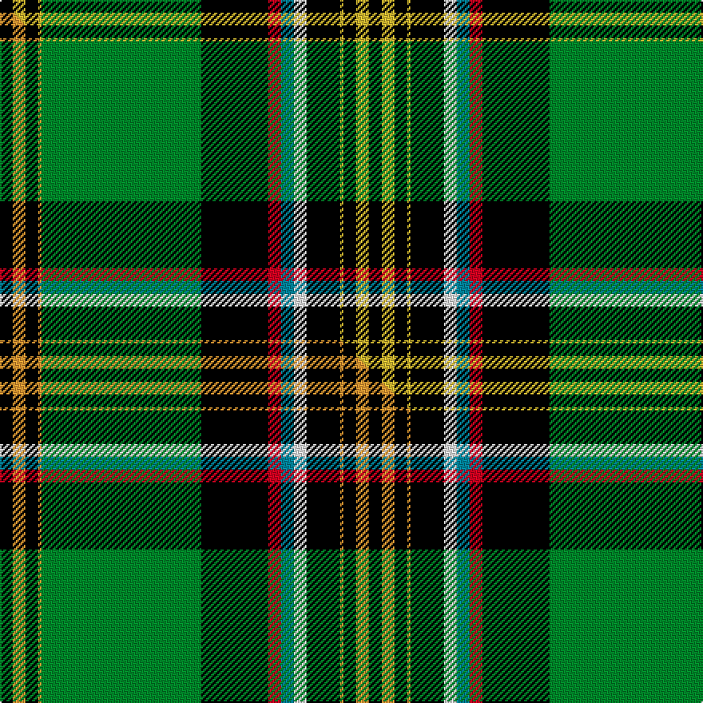

This is one **variant** — a specific cloth: this exact thread count and colourway, with its own
provenance below. It is one weaving of the [sett](/setts/k8ly8k8ly2g100k42r8t8w8k21ly2k8ly8k8/) (the scale-free proportion — the
same cloth at any scale or shade), whose colour order is pattern [KYKYGKRBWKYKYK](/stripes/kykygkrbwkykyk/).

Part of the [Tarassow Russian Scout](/tartans/tarassow-russian-scout/) tartan — the named design grouping this sett with its other cloths.

Sourced from tartans-authority.  It is a [14 stripe tartan](/stripes/stripes14/).

Original link [https://www.tartanregister.gov.uk/tartanDetails.aspx?ref=7614](https://www.tartanregister.gov.uk/tartanDetails.aspx?ref=7614)

Dataset <small>— provenance for this record, inherited from the source manifest</small>

<dl class="dataset-prov">
<dt>source</dt><dd><a href="/sources/tartans-authority/">Scottish Tartans Authority</a></dd>
<dt>data captured from</dt><dd><a href="https://github.com/thetartan/tartan-database/blob/master/data/tartans-authority/data.csv">https://github.com/thetartan/tartan-database/blob/master/data/tartans-authority/data.csv</a></dd>
<dt>data date</dt><dd>2008 <small>(this record)</small></dd>
<dt>licence</dt><dd><a href="https://creativecommons.org/licenses/by-nc-nd/4.0/">CC BY-NC-ND 4.0</a></dd>
</dl>

Capture chain <small>— the hands this data passed through, oldest first; each capture carries its own licence</small>

<ol class="capture-chain">
<li><a href="https://www.tartansauthority.com/">Scottish Tartans Authority</a> <small>the heritage body's archive — its tartan-ferret record browser is retired (links repaired to the SRT, above)</small></li>
<li><a href="https://github.com/thetartan/tartan-database">thetartan/tartan-database</a> <small>2016-2017</small> · <a href="https://creativecommons.org/licenses/by-nc-nd/4.0/">CC BY-NC-ND 4.0</a> <small>Levko Kravets's frozen compilation — the capture we vendored, and where its CC licence text came from</small></li>
<li>this dictionary <small>captured 2026-06-10 · commit 5bf86c7566</small> <small>each re-capture is a git commit to data/sources</small></li>
</ol>

## Register references

External register numbers recorded for this tartan.

- Scottish Tartans Authority (ITI): 7614

## Thread count
K/8 LY8 K8 LY2 G100 K42 R8 T8 W8 K21 LY2 K8 LY8 K/8

One full sett is **462 threads**.

## Palette
<table><thead><tr><th>Colour</th><th>Shade</th><th>OKLCh</th></tr></thead><tbody><tr><td>T</td><td><code style="background-color:#00879F;">#00879F</code> <small style="color:#888">#00879F</small></td><td><small style="color:#888">oklch(57.4% 0.102 216.1)</small></td></tr><tr><td>G</td><td><code style="background-color:#008B2A;">#008B2A</code> <small style="color:#888">#008B2A</small></td><td><small style="color:#888">oklch(55.4% 0.170 145.9)</small></td></tr><tr><td>K</td><td><code style="background-color:#000000;">#000000</code> <small style="color:#888">#000000</small></td><td><small style="color:#888">oklch(0.0% 0.000 0.0)</small></td></tr><tr><td>W</td><td><code style="background-color:#F7F7F7;">#F7F7F7</code> <small style="color:#888">#F7F7F7</small></td><td><small style="color:#888">oklch(97.6% 0.000 89.9)</small></td></tr><tr><td>R</td><td><code style="background-color:#D60020;">#D60020</code> <small style="color:#888">#D60020</small></td><td><small style="color:#888">oklch(55.2% 0.224 25.5)</small></td></tr><tr><td>LY</td><td><code style="background-color:#DCBC32;">#DCBC32</code> <small style="color:#888">#DCBC32</small></td><td><small style="color:#888">oklch(80.0% 0.150 95.2)</small></td></tr></tbody></table>

# Sample pattern

## Compared to the master

This cloth is one sett of its design; the master sett (the exemplar the design is anchored on) is below for comparison.

Its **ΔTartan distance** from the master is **1.20** — the same measure the nearest-tartans table ranks by (0 is identical; a re-scale of the same cloth is near 0, a recolour or a different proportion further).

<figure class="master-compare" style="margin:0">

this sett
master sett ★

<figcaption style="color:#888;font-size:smaller">One weave of this sett against the <a href="/setts/k8lo8k8lo2g100k42r8t8w8k21lo2k8lo8k8/">master sett ★</a>, split on the diagonal: a shared proportion runs seamlessly across it with only the shades shifting; a different proportion breaks on it.</figcaption>
</figure>

## Nearest tartan variants

The nearest existing variants by ΔTartan distance, with this cloth at the top so the swatches line up against it.

ΔTartan

Threads

Variant

Sett

—

462

<a href="/variants/s14/k8ly8k8ly2g100k42r8t8w8k21ly2k8ly8k8/">Tarassow Russian Scout (Corporate)</a>

<a href="/ttd/edit/#slug=k8dy8k8dy2g100k42r8t8w8k21dy2k8dy8k8&amp;base=k8ly8k8ly2g100k42r8t8w8k21ly2k8ly8k8" title="compare in the TTD">0.09</a>

462

<a href="/variants/s14/k8dy8k8dy2g100k42r8t8w8k21dy2k8dy8k8/">Tarassow Russian Scouts Corporate Tartan</a>

<a href="/ttd/edit/#slug=k8lo8k8lo2g100k42r8t8w8k21lo2k8lo8k8&amp;base=k8ly8k8ly2g100k42r8t8w8k21ly2k8ly8k8" title="compare in the TTD">1.20</a>

462

<a href="/variants/s14/k8lo8k8lo2g100k42r8t8w8k21lo2k8lo8k8/">Tarassow Russian Scout</a>

<a href="/ttd/edit/#slug=k8lb2r2k6r2k2y1k2dy16g30k1r2k4lb2~x2&amp;base=k8ly8k8ly2g100k42r8t8w8k21ly2k8ly8k8" title="compare in the TTD">2.74</a>

300

<a href="/variants/s14/k8lb2r2k6r2k2y1k2dy16g30k1r2k4lb2~x2/">Murphy, Andrew (Personal)</a>

<a href="/ttd/edit/#slug=db4k1r2k32g32y2k1g3lb2~x2~db1407270&amp;base=k8ly8k8ly2g100k42r8t8w8k21ly2k8ly8k8" title="compare in the TTD">2.85</a>

304

<a href="/variants/s9/db4k1r2k32g32y2k1g3lb2~x2~db1407270/">Roderick Dhu Canada Tartan</a>

<a href="/ttd/edit/#slug=db4k1r2k32g32y2k1g3lb2~x2&amp;base=k8ly8k8ly2g100k42r8t8w8k21ly2k8ly8k8" title="compare in the TTD">2.85</a>

304

<a href="/variants/s9/db4k1r2k32g32y2k1g3lb2~x2/">Roderick, Dhu</a>

<a href="/ttd/edit/#slug=dg50k3w4k1ly5r4k1w2k2t15k5dg4w2~x2&amp;base=k8ly8k8ly2g100k42r8t8w8k21ly2k8ly8k8" title="compare in the TTD">3.06</a>

288

<a href="/variants/s13/dg50k3w4k1ly5r4k1w2k2t15k5dg4w2~x2/">City of Abbotsford (District)</a>

<a href="/ttd/edit/#slug=r3w3k3w3r3db8k1y2k1db8k2g30k1g10k2~x2&amp;base=k8ly8k8ly2g100k42r8t8w8k21ly2k8ly8k8" title="compare in the TTD">3.11</a>

310

<a href="/variants/s15/r3w3k3w3r3db8k1y2k1db8k2g30k1g10k2~x2/">Coigach</a>

<a href="/ttd/edit/#slug=r3w3k3w3r3db8k1y2k1db8k2g30k1g10k2~x2~r1506019&amp;base=k8ly8k8ly2g100k42r8t8w8k21ly2k8ly8k8" title="compare in the TTD">3.13</a>

310

<a href="/variants/s15/r3w3k3w3r3db8k1y2k1db8k2g30k1g10k2~x2~r1506019/">Coigach (District)</a>

<a href="/ttd/edit/#slug=k40g8r1g57y5g9w5g57r1g8k40o7k4g4k2w4k2g4k4o7~x2&amp;base=k8ly8k8ly2g100k42r8t8w8k21ly2k8ly8k8" title="compare in the TTD">3.20</a>

982

<a href="/variants/s20/k40g8r1g57y5g9w5g57r1g8k40o7k4g4k2w4k2g4k4o7~x2/">Unidentified Phyllis Gordon</a>

<a href="/ttd/edit/#slug=dg55ly20w2ly3k2ly3w2ly3db18k2ly4y2ly3~x2&amp;base=k8ly8k8ly2g100k42r8t8w8k21ly2k8ly8k8" title="compare in the TTD">3.22</a>

360

<a href="/variants/s13/dg55ly20w2ly3k2ly3w2ly3db18k2ly4y2ly3~x2/">Knox (Personal)</a>

## Neighbour map

Every grey dot is one of 13621 variants placed by the first two principal components of the ΔTartan feature space (42% of its variance). Red is this tartan; blue dots are its nearest — click one to open its page.

<svg viewBox="0 0 640 380" role="img" style="max-width:100%;height:auto;border:1px solid #e0e0e0;border-radius:4px;display:block" xmlns="http://www.w3.org/2000/svg"><image href="/nn/cloud.v1.png" width="640" height="380"/><a href="/variants/s14/k8dy8k8dy2g100k42r8t8w8k21dy2k8dy8k8/"><circle cx="198.7" cy="30.2" r="4" fill="#3465a4"><title>Tarassow Russian Scouts Corporate Tartan</title></circle></a><a href="/variants/s14/k8lo8k8lo2g100k42r8t8w8k21lo2k8lo8k8/"><circle cx="194.1" cy="28.9" r="4" fill="#3465a4"><title>Tarassow Russian Scout</title></circle></a><a href="/variants/s14/k8lb2r2k6r2k2y1k2dy16g30k1r2k4lb2~x2/"><circle cx="153.8" cy="58.0" r="4" fill="#3465a4"><title>Murphy, Andrew (Personal)</title></circle></a><a href="/variants/s9/db4k1r2k32g32y2k1g3lb2~x2~db1407270/"><circle cx="219.0" cy="67.3" r="4" fill="#3465a4"><title>Roderick Dhu Canada Tartan</title></circle></a><a href="/variants/s9/db4k1r2k32g32y2k1g3lb2~x2/"><circle cx="219.2" cy="67.4" r="4" fill="#3465a4"><title>Roderick, Dhu</title></circle></a><a href="/variants/s13/dg50k3w4k1ly5r4k1w2k2t15k5dg4w2~x2/"><circle cx="267.4" cy="26.0" r="4" fill="#3465a4"><title>City of Abbotsford (District)</title></circle></a><a href="/variants/s15/r3w3k3w3r3db8k1y2k1db8k2g30k1g10k2~x2/"><circle cx="204.0" cy="58.3" r="4" fill="#3465a4"><title>Coigach</title></circle></a><a href="/variants/s15/r3w3k3w3r3db8k1y2k1db8k2g30k1g10k2~x2~r1506019/"><circle cx="205.5" cy="59.2" r="4" fill="#3465a4"><title>Coigach (District)</title></circle></a><a href="/variants/s20/k40g8r1g57y5g9w5g57r1g8k40o7k4g4k2w4k2g4k4o7~x2/"><circle cx="250.9" cy="23.0" r="4" fill="#3465a4"><title>Unidentified Phyllis Gordon</title></circle></a><a href="/variants/s13/dg55ly20w2ly3k2ly3w2ly3db18k2ly4y2ly3~x2/"><circle cx="215.7" cy="58.4" r="4" fill="#3465a4"><title>Knox (Personal)</title></circle></a><circle cx="193.4" cy="29.6" r="5" fill="#c00000"/><text x="320" y="376" text-anchor="middle" font-size="11" fill="#999">ground</text><text x="11" y="190" text-anchor="middle" font-size="11" fill="#999" transform="rotate(-90 11 190)">complexity</text></svg>

ID: /variants/s14/k8ly8k8ly2g100k42r8t8w8k21ly2k8ly8k8/
