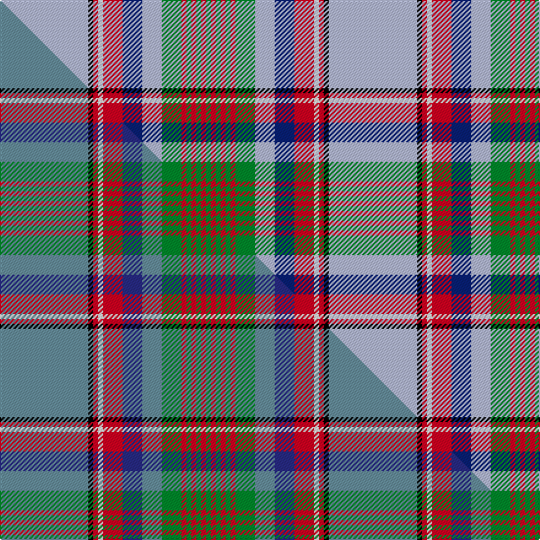

This page is one **sett** — a single exact thread-count. It belongs to the [tartan](/setts/lb18k1r1w1r4db4lb4g4r1g1r1g1r1g1/)
(the same proportion at any scale), whose colour order is pattern [GRGRGRGWBRWRKW](/stripes/grgrgrgwbrwrkw/).

Part of the [Hill 70](/tartans/hill-70/) tartan — the named design grouping this sett with its other cloths.

Sourced from tartans-authority.  It is a [14 stripe tartan](/stripes/stripes14/).

Original link [https://www.tartanregister.gov.uk/tartanDetails.aspx?ref=11285](https://www.tartanregister.gov.uk/tartanDetails.aspx?ref=11285)

Dataset <small>— provenance for this record, inherited from the source manifest</small>

<dl class="dataset-prov">
<dt>source</dt><dd><a href="/sources/tartans-authority/">Scottish Tartans Authority</a></dd>
<dt>data captured from</dt><dd><a href="https://github.com/thetartan/tartan-database/blob/master/data/tartans-authority/data.csv">https://github.com/thetartan/tartan-database/blob/master/data/tartans-authority/data.csv</a></dd>
<dt>data date</dt><dd>2015 <small>(this record)</small></dd>
<dt>licence</dt><dd><a href="https://creativecommons.org/licenses/by-nc-nd/4.0/">CC BY-NC-ND 4.0</a></dd>
</dl>

Capture chain <small>— the hands this data passed through, oldest first; each capture carries its own licence</small>

<ol class="capture-chain">
<li><a href="https://www.tartansauthority.com/">Scottish Tartans Authority</a> <small>the heritage body's archive — its tartan-ferret record browser is retired (links repaired to the SRT, above)</small></li>
<li><a href="https://github.com/thetartan/tartan-database">thetartan/tartan-database</a> <small>2016-2017</small> · <a href="https://creativecommons.org/licenses/by-nc-nd/4.0/">CC BY-NC-ND 4.0</a> <small>Levko Kravets's frozen compilation — the capture we vendored, and where its CC licence text came from</small></li>
<li>this dictionary <small>captured 2026-06-10 · commit 5bf86c7566</small> <small>each re-capture is a git commit to data/sources</small></li>
</ol>

## Register references

External register numbers recorded for this tartan.

- Scottish Register of Tartans: [11285](https://www.tartanregister.gov.uk/tartanDetails?ref=11285)
- Scottish Tartans Authority (ITI): 11285

## Thread count
LB/72 K4 R4 W4 R16 DB16 LB16 G16 R4 G4 R4 G4 R4 G/4

One full sett is **268 threads**.

## Palette
<table><thead><tr><th>Colour</th><th>Shade</th><th>OKLCh</th></tr></thead><tbody><tr><td>LB</td><td><code style="background-color:#B5BBDE;">#B5BBDE</code> <small style="color:#888">#B5BBDE</small></td><td><small style="color:#888">oklch(79.9% 0.050 277.6)</small></td></tr><tr><td>DB</td><td><code style="background-color:#082077;">#082077</code> <small style="color:#888">#082077</small></td><td><small style="color:#888">oklch(30.0% 0.149 265.1)</small></td></tr><tr><td>G</td><td><code style="background-color:#008B2A;">#008B2A</code> <small style="color:#888">#008B2A</small></td><td><small style="color:#888">oklch(55.4% 0.170 145.9)</small></td></tr><tr><td>K</td><td><code style="background-color:#000000;">#000000</code> <small style="color:#888">#000000</small></td><td><small style="color:#888">oklch(0.0% 0.000 0.0)</small></td></tr><tr><td>R</td><td><code style="background-color:#D60020;">#D60020</code> <small style="color:#888">#D60020</small></td><td><small style="color:#888">oklch(55.2% 0.224 25.5)</small></td></tr><tr><td>W</td><td><code style="background-color:#F7F7F7;">#F7F7F7</code> <small style="color:#888">#F7F7F7</small></td><td><small style="color:#888">oklch(97.6% 0.000 89.9)</small></td></tr></tbody></table>

# Sample pattern

## Compared to the master

This cloth is one sett of its design; the master sett (the exemplar the design is anchored on) is below for comparison.

Its **ΔTartan distance** from the master is **0.16** — the same measure the nearest-tartans table ranks by (0 is identical; a re-scale of the same cloth is near 0, a recolour or a different proportion further).

<figure class="master-compare" style="margin:0">

this sett
master sett ★

<figcaption style="color:#888;font-size:smaller">One weave of this sett against the <a href="/setts/t18k1r1w1r4db4t4g4r1g1r1g1r1g1/">master sett ★</a>, split on the diagonal: a shared proportion runs seamlessly across it with only the shades shifting; a different proportion breaks on it.</figcaption>
</figure>

## Nearest tartan variants

The nearest existing variants by ΔTartan distance, with this cloth at the top so the swatches line up against it.

ΔTartan

Threads

Variant

Sett

—

268

<a href="/variants/s14/lb18k1r1w1r4db4lb4g4r1g1r1g1r1g1~x4/">Hill 70</a>

<a href="/ttd/edit/#slug=y18k1r1w1r4db4y4g4r1g1r1g1r1g1~x4~y2502222-db1406275&amp;base=lb18k1r1w1r4db4lb4g4r1g1r1g1r1g1~x4" title="compare in the TTD">0.16</a>

268

<a href="/variants/s14/t18k1r1w1r4db4t4g4r1g1r1g1r1g1~x4~t2502222-db1406275/">Hill 70</a>

<a href="/ttd/edit/#slug=dy4lb1dy2lb1dy2lb16k1g8dy8r8k1lb24k1w4~x2&amp;base=lb18k1r1w1r4db4lb4g4r1g1r1g1r1g1~x4" title="compare in the TTD">1.87</a>

308

<a href="/variants/s14/dy4lb1dy2lb1dy2lb16k1g8dy8r8k1lb24k1w4~x2/">Ethiopia</a>

<a href="/ttd/edit/#slug=o2w3k1t9k1lr6g1lr3g1lr19k2w7o1~x2~t2503227-lr2800000&amp;base=lb18k1r1w1r4db4lb4g4r1g1r1g1r1g1~x4" title="compare in the TTD">2.14</a>

218

<a href="/variants/s13/o2w3k1t9k1lr6g1lr3g1lr19k2w7o1~x2~t2503227-lr2800000/">Cahaba Memorial (Commemorative)</a>

<a href="/ttd/edit/#slug=lb18y2lb2y1r3g3r2g2r1k2lb3w7lb2w2lb1w4~x4&amp;base=lb18k1r1w1r4db4lb4g4r1g1r1g1r1g1~x4" title="compare in the TTD">2.31</a>

352

<a href="/variants/s16/lb18y2lb2y1r3g3r2g2r1k2lb3w7lb2w2lb1w4~x4/">Inverness County (Canada) (District)</a>

<a href="/ttd/edit/#slug=lb18y2lb2y1r3g3r2g2r1k2lb3w7lb2w2lb1w4~x4~w3600000&amp;base=lb18k1r1w1r4db4lb4g4r1g1r1g1r1g1~x4" title="compare in the TTD">2.54</a>

352

<a href="/variants/s16/lb18y2lb2y1r3g3r2g2r1k2lb3w7lb2w2lb1w4~x4~w3600000/">Inverness County (Canada)</a>

<a href="/ttd/edit/#slug=y4lb1y2lb20y2r8y2lb20db16k1w4~x2&amp;base=lb18k1r1w1r4db4lb4g4r1g1r1g1r1g1~x4" title="compare in the TTD">2.75</a>

304

<a href="/variants/s11/y4lb1y2lb20y2r8y2lb20db16k1w4~x2/">Congo, The Democratic Republic of the</a>

<a href="/ttd/edit/#slug=y3lb2k1lb24k2lb2k2lb2k2g8dp2g8k1w2~x2&amp;base=lb18k1r1w1r4db4lb4g4r1g1r1g1r1g1~x4" title="compare in the TTD">2.77</a>

234

<a href="/variants/s14/y3lb2k1lb24k2lb2k2lb2k2g8dp2g8k1w2~x2/">Alexander-Johnstone (Personal)</a>

<a href="/ttd/edit/#slug=w31db4k6y2k2w2k2g7r4k2r2w2~x2&amp;base=lb18k1r1w1r4db4lb4g4r1g1r1g1r1g1~x4" title="compare in the TTD">2.80</a>

198

<a href="/variants/s12/w31db4k6y2k2w2k2g7r4k2r2w2~x2/">Stuart/Stewart Dress Royal</a>

<a href="/ttd/edit/#slug=w15db2k3y1k1w1k1g3r4k1r1w1~x2&amp;base=lb18k1r1w1r4db4lb4g4r1g1r1g1r1g1~x4" title="compare in the TTD">2.80</a>

104

<a href="/variants/s12/w15db2k3y1k1w1k1g3r4k1r1w1~x2/">Stewart Dress MINI Tartan</a>

<a href="/ttd/edit/#slug=lo2w3k1b9k1bi6g1bi3g1bi19k2w7lo1~x2~b1611266-bi2501240&amp;base=lb18k1r1w1r4db4lb4g4r1g1r1g1r1g1~x4" title="compare in the TTD">2.83</a>

218

<a href="/variants/s13/lo2w3k1b9k1bi6g1bi3g1bi19k2w7lo1~x2~b1511266-bi2501240/">Cahaba Memorial</a>

## Neighbour map

Every grey dot is one of 13621 variants placed by the first two principal components of the ΔTartan feature space (42% of its variance). Red is this tartan; blue dots are its nearest — click one to open its page.

<svg viewBox="0 0 640 380" role="img" style="max-width:100%;height:auto;border:1px solid #e0e0e0;border-radius:4px;display:block" xmlns="http://www.w3.org/2000/svg"><image href="/nn/cloud.v1.png" width="640" height="380"/><a href="/variants/s14/t18k1r1w1r4db4t4g4r1g1r1g1r1g1~x4~t2502222-db1406275/"><circle cx="267.3" cy="91.6" r="4" fill="#3465a4"><title>Hill 70</title></circle></a><a href="/variants/s14/dy4lb1dy2lb1dy2lb16k1g8dy8r8k1lb24k1w4~x2/"><circle cx="209.9" cy="77.3" r="4" fill="#3465a4"><title>Ethiopia</title></circle></a><a href="/variants/s13/o2w3k1t9k1lr6g1lr3g1lr19k2w7o1~x2~t2503227-lr2800000/"><circle cx="220.6" cy="102.5" r="4" fill="#3465a4"><title>Cahaba Memorial (Commemorative)</title></circle></a><a href="/variants/s16/lb18y2lb2y1r3g3r2g2r1k2lb3w7lb2w2lb1w4~x4/"><circle cx="194.9" cy="89.2" r="4" fill="#3465a4"><title>Inverness County (Canada) (District)</title></circle></a><a href="/variants/s16/lb18y2lb2y1r3g3r2g2r1k2lb3w7lb2w2lb1w4~x4~w3600000/"><circle cx="207.8" cy="93.7" r="4" fill="#3465a4"><title>Inverness County (Canada)</title></circle></a><a href="/variants/s11/y4lb1y2lb20y2r8y2lb20db16k1w4~x2/"><circle cx="218.0" cy="109.8" r="4" fill="#3465a4"><title>Congo, The Democratic Republic of the</title></circle></a><a href="/variants/s14/y3lb2k1lb24k2lb2k2lb2k2g8dp2g8k1w2~x2/"><circle cx="202.9" cy="68.7" r="4" fill="#3465a4"><title>Alexander-Johnstone (Personal)</title></circle></a><a href="/variants/s12/w31db4k6y2k2w2k2g7r4k2r2w2~x2/"><circle cx="189.9" cy="74.1" r="4" fill="#3465a4"><title>Stuart/Stewart Dress Royal</title></circle></a><a href="/variants/s12/w15db2k3y1k1w1k1g3r4k1r1w1~x2/"><circle cx="169.9" cy="79.2" r="4" fill="#3465a4"><title>Stewart Dress MINI Tartan</title></circle></a><a href="/variants/s13/lo2w3k1b9k1bi6g1bi3g1bi19k2w7lo1~x2~b1511266-bi2501240/"><circle cx="196.0" cy="93.4" r="4" fill="#3465a4"><title>Cahaba Memorial</title></circle></a><circle cx="225.8" cy="76.5" r="5" fill="#c00000"/><text x="320" y="376" text-anchor="middle" font-size="11" fill="#999">ground</text><text x="11" y="190" text-anchor="middle" font-size="11" fill="#999" transform="rotate(-90 11 190)">complexity</text></svg>

ID: /variants/s14/lb18k1r1w1r4db4lb4g4r1g1r1g1r1g1~x4/
