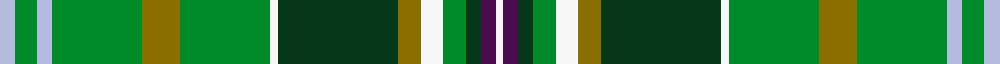

This page is one **sett** — a single exact thread-count. It belongs to the [tartan](/setts/lb2g3lb2g12y5g12w1dg16y3w3g3dg2dp2w1/)
(the same proportion at any scale), whose colour order is pattern [WBGGWGGWGGGWGW](/stripes/wbggwggwgggwgw/).

Sourced from register-of-tartans.  It is a [14 stripe tartan](/stripes/stripes14/).

Original link https://www.tartanregister.gov.uk/tartanDetails.aspx?ref=11625

Dataset <small>— provenance for this record, inherited from the source manifest</small>

<dl class="dataset-prov">
<dt>source</dt><dd><a href="/sources/register-of-tartans/">Scottish Register of Tartans</a></dd>
<dt>data captured from</dt><dd><a href="https://github.com/thetartan/tartan-database/blob/master/data/register-of-tartans/data.csv">https://github.com/thetartan/tartan-database/blob/master/data/register-of-tartans/data.csv</a></dd>
<dt>data date</dt><dd>16/09/2013 <small>(this record)</small></dd>
<dt>licence</dt><dd><a href="https://www.tartanregister.gov.uk/copyright">Crown copyright</a></dd>
</dl>

Capture chain <small>— the hands this data passed through, oldest first; each capture carries its own licence</small>

<ol class="capture-chain">
<li><a href="https://www.tartanregister.gov.uk/">Scottish Register of Tartans</a> · <a href="https://www.tartanregister.gov.uk/copyright">Crown copyright</a> <small>the living register — still published by National Records of Scotland</small></li>
<li><a href="https://github.com/thetartan/tartan-database">thetartan/tartan-database</a> <small>2016-2017</small> · <a href="https://creativecommons.org/licenses/by-nc-nd/4.0/">CC BY-NC-ND 4.0</a> <small>Levko Kravets's frozen compilation — the capture we vendored, and where its CC licence text came from</small></li>
<li>this dictionary <small>captured 2026-06-10 · commit 5bf86c7566</small> <small>each re-capture is a git commit to data/sources</small></li>
</ol>

## Register references

External register numbers recorded for this tartan.

- Scottish Register of Tartans: [11625](https://www.tartanregister.gov.uk/tartanDetails.aspx?ref=11625)

## Thread count
LB/4 G6 LB4 G24 Y10 G24 W2 DG32 Y6 W6 G6 DG4 DP4 W/2

One full sett is **262 threads**.

## Palette
<table><thead><tr><th>Colour</th><th>Shade</th><th>OKLCh</th></tr></thead><tbody><tr><td>DG</td><td><code style="background-color:#053819;">#053819</code> <small style="color:#888">#053819</small></td><td><small style="color:#888">oklch(30.0% 0.075 151.3)</small></td></tr><tr><td>G</td><td><code style="background-color:#008B2A;">#008B2A</code> <small style="color:#888">#008B2A</small></td><td><small style="color:#888">oklch(55.4% 0.170 145.9)</small></td></tr><tr><td>DP</td><td><code style="background-color:#4B0B4F;">#4B0B4F</code> <small style="color:#888">#4B0B4F</small></td><td><small style="color:#888">oklch(30.1% 0.125 325.4)</small></td></tr><tr><td>LB</td><td><code style="background-color:#B5BBDE;">#B5BBDE</code> <small style="color:#888">#B5BBDE</small></td><td><small style="color:#888">oklch(79.9% 0.050 277.6)</small></td></tr><tr><td>W</td><td><code style="background-color:#F7F7F7;">#F7F7F7</code> <small style="color:#888">#F7F7F7</small></td><td><small style="color:#888">oklch(97.6% 0.000 89.9)</small></td></tr><tr><td>Y</td><td><code style="background-color:#8B6E00;">#8B6E00</code> <small style="color:#888">#8B6E00</small></td><td><small style="color:#888">oklch(55.1% 0.113 90.4)</small></td></tr></tbody></table>

# Sample pattern

## Nearest tartan variants

The nearest existing variants by ΔTartan distance, with this cloth at the top so the swatches line up against it.

ΔTartan

Threads

Variant

Sett

—

262

<a href="/variants/s14/lb2g3lb2g12y5g12w1dg16y3w3g3dg2dp2w1~x2/">Malone, Keagan Allen (Personal)</a>

<a href="/ttd/edit/#slug=dy4dg3dy30y12dg5lg4dg3lg14lgi2lg2lgi10ly3~x2~dg1804158-y2204115-lgi3205128&amp;base=lb2g3lb2g12y5g12w1dg16y3w3g3dg2dp2w1~x2" title="compare in the TTD">2.46</a>

354

<a href="/variants/s12/dy4dg3dy30y12dg5lg4dg3lg14lgi2lg2lgi10ly3~x2~dg1804158-y2204115-lgi3205128/">Shrek</a>

<a href="/ttd/edit/#slug=dy4dg3dy30y12dg5lg4dg3lg14lgi2lg2lgi10ly3~x2~y2204115-lgi3205128&amp;base=lb2g3lb2g12y5g12w1dg16y3w3g3dg2dp2w1~x2" title="compare in the TTD">2.66</a>

354

<a href="/variants/s12/dy4dg3dy30y12dg5lg4dg3lg14lgi2lg2lgi10ly3~x2~y2204115-lgi3205128/">Shrek (Fashion)</a>

<a href="/ttd/edit/#slug=dy4dg26lb1dg2lb2dy4lg26dy4g3y3~x2~dg1806142-lb3301180-g2408144&amp;base=lb2g3lb2g12y5g12w1dg16y3w3g3dg2dp2w1~x2" title="compare in the TTD">3.14</a>

286

<a href="/variants/s10/dy4dg26lt1dg2lt2dy4lg26dy4g3y3~x2~dg1806142-lt3301180-g2408144/">Carter (Savannah) (Personal)</a>

<a href="/ttd/edit/#slug=dg18g6dy3w1dy3w1lb6db6~x2~dg1806142-g2408144&amp;base=lb2g3lb2g12y5g12w1dg16y3w3g3dg2dp2w1~x2" title="compare in the TTD">3.17</a>

128

<a href="/variants/s8/dg18g6dy3w1dy3w1lb6db6~x2~dg1806142-g2408144/">Iroquois Falls Centenary (Commem.)</a>

<a href="/ttd/edit/#slug=g8dg2w2dg6y2db14g4dg16g16b2g5w2g4dg7&amp;base=lb2g3lb2g12y5g12w1dg16y3w3g3dg2dp2w1~x2" title="compare in the TTD">3.28</a>

165

<a href="/variants/s14/g8dg2w2dg6y2db14g4dg16g16b2g5w2g4dg7/">Scott, hunting special</a>

<a href="/ttd/edit/#slug=g11dr6db6dg2g3dg2db6dr6g36lo2dg3lo2db5dr5~x2&amp;base=lb2g3lb2g12y5g12w1dg16y3w3g3dg2dp2w1~x2" title="compare in the TTD">3.32</a>

348

<a href="/variants/s14/g11dr6db6dg2g3dg2db6dr6g36lo2dg3lo2db5dr5~x2/">Westmeath Irish County Tartan</a>

<a href="/ttd/edit/#slug=dp4g13db5y3lb6y3db5n6g28w2~x2&amp;base=lb2g3lb2g12y5g12w1dg16y3w3g3dg2dp2w1~x2" title="compare in the TTD">3.33</a>

288

<a href="/variants/s10/dp4g13db5y3lb6y3db5n6g28w2~x2/">Highland, Green (Corporate)</a>

<a href="/ttd/edit/#slug=dy31ly6lb3db36dy8g60ly7n7~x2~db1004274-n2203265&amp;base=lb2g3lb2g12y5g12w1dg16y3w3g3dg2dp2w1~x2" title="compare in the TTD">3.46</a>

556

<a href="/variants/s8/dy31ly6lb3db36dy8g60ly7n7~x2~db1004274-n2203265/">Little-Dowse Wedding</a>

<a href="/ttd/edit/#slug=dr12g1dg3g20lb1g1lb3g1lb1g20dg3g1dr12ly3~x4&amp;base=lb2g3lb2g12y5g12w1dg16y3w3g3dg2dp2w1~x2" title="compare in the TTD">3.46</a>

596

<a href="/variants/s14/dr12g1dg3g20lb1g1lb3g1lb1g20dg3g1dr12ly3~x4/">Manitoba Province</a>

<a href="/ttd/edit/#slug=dr3ly21dr14w3db11g36do3db3do4ly3~x2&amp;base=lb2g3lb2g12y5g12w1dg16y3w3g3dg2dp2w1~x2" title="compare in the TTD">3.50</a>

392

<a href="/variants/s10/dr3ly21dr14w3db11g36do3db3do4ly3~x2/">State Seal of Florida (Fashion)</a>

## Neighbour map

Every grey dot is one of 13620 variants placed by the first two principal components of the ΔTartan feature space (42% of its variance). Red is this tartan; blue dots are its nearest — click one to open its page.

<svg viewBox="0 0 640 380" role="img" style="max-width:100%;height:auto;border:1px solid #e0e0e0;border-radius:4px;display:block" xmlns="http://www.w3.org/2000/svg"><image href="/nn/cloud.v1.png" width="640" height="380"/><a href="/variants/s12/dy4dg3dy30y12dg5lg4dg3lg14lgi2lg2lgi10ly3~x2~dg1804158-y2204115-lgi3205128/"><circle cx="176.2" cy="153.4" r="4" fill="#3465a4"><title>Shrek</title></circle></a><a href="/variants/s12/dy4dg3dy30y12dg5lg4dg3lg14lgi2lg2lgi10ly3~x2~y2204115-lgi3205128/"><circle cx="170.3" cy="150.8" r="4" fill="#3465a4"><title>Shrek (Fashion)</title></circle></a><a href="/variants/s10/dy4dg26lt1dg2lt2dy4lg26dy4g3y3~x2~dg1806142-lt3301180-g2408144/"><circle cx="239.6" cy="134.1" r="4" fill="#3465a4"><title>Carter (Savannah) (Personal)</title></circle></a><a href="/variants/s8/dg18g6dy3w1dy3w1lb6db6~x2~dg1806142-g2408144/"><circle cx="205.2" cy="170.5" r="4" fill="#3465a4"><title>Iroquois Falls Centenary (Commem.)</title></circle></a><a href="/variants/s14/g8dg2w2dg6y2db14g4dg16g16b2g5w2g4dg7/"><circle cx="195.1" cy="196.4" r="4" fill="#3465a4"><title>Scott, hunting special</title></circle></a><a href="/variants/s14/g11dr6db6dg2g3dg2db6dr6g36lo2dg3lo2db5dr5~x2/"><circle cx="310.7" cy="141.7" r="4" fill="#3465a4"><title>Westmeath Irish County Tartan</title></circle></a><a href="/variants/s10/dp4g13db5y3lb6y3db5n6g28w2~x2/"><circle cx="276.2" cy="159.6" r="4" fill="#3465a4"><title>Highland, Green (Corporate)</title></circle></a><a href="/variants/s8/dy31ly6lb3db36dy8g60ly7n7~x2~db1004274-n2203265/"><circle cx="219.6" cy="165.1" r="4" fill="#3465a4"><title>Little-Dowse Wedding</title></circle></a><a href="/variants/s14/dr12g1dg3g20lb1g1lb3g1lb1g20dg3g1dr12ly3~x4/"><circle cx="325.2" cy="141.6" r="4" fill="#3465a4"><title>Manitoba Province</title></circle></a><a href="/variants/s10/dr3ly21dr14w3db11g36do3db3do4ly3~x2/"><circle cx="165.0" cy="164.4" r="4" fill="#3465a4"><title>State Seal of Florida (Fashion)</title></circle></a><circle cx="228.0" cy="153.0" r="5" fill="#c00000"/><text x="320" y="376" text-anchor="middle" font-size="11" fill="#999">ground</text><text x="11" y="190" text-anchor="middle" font-size="11" fill="#999" transform="rotate(-90 11 190)">complexity</text></svg>

ID: /variants/s14/lb2g3lb2g12y5g12w1dg16y3w3g3dg2dp2w1~x2/
