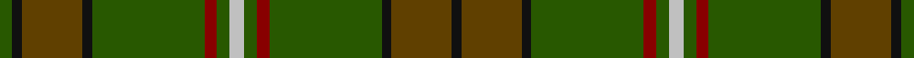

This page is one **sett** — a single exact thread-count. It belongs to the [tartan](/setts/lb6dg5r5dg45k4dy24k4dg5/)
(the same proportion at any scale), whose colour order is pattern [GKGKGRGWGRGKGK](/stripes/gkgkgrgwgrgkgk/).

Sourced from house-of-tartan.  It is a [14 stripe tartan](/stripes/stripes14/).

Original link http://www.house-of-tartan.scotland.net/house/TartanViewjs.asp?colr=Def&tnam=4135

## Provenance

Earliest known date: 1999 Designed by Linda Clifford, USA for a Timothy O'Neill but may be used by anyone of the name O'Neill and its variants.

## Thread count
G/10 K8 T48 K8 G90 DR10 G10 N12 G10 DR10 G90 K8 T48 K/8

One full sett is **722 threads**.

## Palette

Palette: <strong>Tartan Register</strong>
<table><thead><tr><th>Colour</th><th>Threads</th><th>Shade</th><th>Base</th><th>OKLCh</th></tr></thead><tbody><tr><td>G/</td><td style="text-align:right;font-variant-numeric:tabular-nums">10</td><td><code style="background-color:#285800;">#285800</code> <small style="color:#888">#285800</small></td><td>G <code style="background-color:#006100;">#006100</code></td><td><small style="color:#888">oklch(41.0% 0.122 135.8)</small></td></tr><tr><td>K</td><td style="text-align:right;font-variant-numeric:tabular-nums">8</td><td><code style="background-color:#101010;">#101010</code> <small style="color:#888">#101010</small></td><td>K <code style="background-color:#000000;">#000000</code></td><td><small style="color:#888">oklch(17.3% 0.000 89.9)</small></td></tr><tr><td>T</td><td style="text-align:right;font-variant-numeric:tabular-nums">48</td><td><code style="background-color:#604000;">#604000</code> <small style="color:#888">#604000</small></td><td>G <code style="background-color:#006100;">#006100</code></td><td><small style="color:#888">oklch(39.8% 0.083 76.8)</small></td></tr><tr><td>K</td><td style="text-align:right;font-variant-numeric:tabular-nums">8</td><td><code style="background-color:#101010;">#101010</code> <small style="color:#888">#101010</small></td><td>K <code style="background-color:#000000;">#000000</code></td><td><small style="color:#888">oklch(17.3% 0.000 89.9)</small></td></tr><tr><td>G</td><td style="text-align:right;font-variant-numeric:tabular-nums">90</td><td><code style="background-color:#285800;">#285800</code> <small style="color:#888">#285800</small></td><td>G <code style="background-color:#006100;">#006100</code></td><td><small style="color:#888">oklch(41.0% 0.122 135.8)</small></td></tr><tr><td>DR</td><td style="text-align:right;font-variant-numeric:tabular-nums">10</td><td><code style="background-color:#880000;">#880000</code> <small style="color:#888">#880000</small></td><td>R <code style="background-color:#CC0000;">#CC0000</code></td><td><small style="color:#888">oklch(39.4% 0.162 29.2)</small></td></tr><tr><td>G</td><td style="text-align:right;font-variant-numeric:tabular-nums">10</td><td><code style="background-color:#285800;">#285800</code> <small style="color:#888">#285800</small></td><td>G <code style="background-color:#006100;">#006100</code></td><td><small style="color:#888">oklch(41.0% 0.122 135.8)</small></td></tr><tr><td>N</td><td style="text-align:right;font-variant-numeric:tabular-nums">12</td><td><code style="background-color:#C0C0C0;">#C0C0C0</code> <small style="color:#888">#C0C0C0</small></td><td>W <code style="background-color:#F7F7F7;">#F7F7F7</code></td><td><small style="color:#888">oklch(80.8% 0.000 89.9)</small></td></tr><tr><td>G</td><td style="text-align:right;font-variant-numeric:tabular-nums">10</td><td><code style="background-color:#285800;">#285800</code> <small style="color:#888">#285800</small></td><td>G <code style="background-color:#006100;">#006100</code></td><td><small style="color:#888">oklch(41.0% 0.122 135.8)</small></td></tr><tr><td>DR</td><td style="text-align:right;font-variant-numeric:tabular-nums">10</td><td><code style="background-color:#880000;">#880000</code> <small style="color:#888">#880000</small></td><td>R <code style="background-color:#CC0000;">#CC0000</code></td><td><small style="color:#888">oklch(39.4% 0.162 29.2)</small></td></tr><tr><td>G</td><td style="text-align:right;font-variant-numeric:tabular-nums">90</td><td><code style="background-color:#285800;">#285800</code> <small style="color:#888">#285800</small></td><td>G <code style="background-color:#006100;">#006100</code></td><td><small style="color:#888">oklch(41.0% 0.122 135.8)</small></td></tr><tr><td>K</td><td style="text-align:right;font-variant-numeric:tabular-nums">8</td><td><code style="background-color:#101010;">#101010</code> <small style="color:#888">#101010</small></td><td>K <code style="background-color:#000000;">#000000</code></td><td><small style="color:#888">oklch(17.3% 0.000 89.9)</small></td></tr><tr><td>T</td><td style="text-align:right;font-variant-numeric:tabular-nums">48</td><td><code style="background-color:#604000;">#604000</code> <small style="color:#888">#604000</small></td><td>G <code style="background-color:#006100;">#006100</code></td><td><small style="color:#888">oklch(39.8% 0.083 76.8)</small></td></tr><tr><td>K/</td><td style="text-align:right;font-variant-numeric:tabular-nums">8</td><td><code style="background-color:#101010;">#101010</code> <small style="color:#888">#101010</small></td><td>K <code style="background-color:#000000;">#000000</code></td><td><small style="color:#888">oklch(17.3% 0.000 89.9)</small></td></tr></tbody></table>

## Nearest tartans

The nearest existing variants by ΔTartan distance, with this tartan at the top so the swatches line up against it.

ΔTartan

Tartan

Sett

—

<a href="/ttd/edit/#slug=lb6dg5r5dg45k4dy24k4dg5~x2">O'Neill Clan/Family Tartan</a> <a class="nn-out" href="/variants/s14/lb6dg5r5dg45k4dy24k4dg5~x2/" title="open its dictionary page">↗</a>

1.31

<a href="/ttd/edit/#slug=g21k1r4k1dy21g3dy3g3dy21g3ly4g21dy3g3dy3~x2&amp;base=lb6dg5r5dg45k4dy24k4dg5~x2">Ensign of Ontario Canadian Tartan</a> <a class="nn-out" href="/variants/s15/g21k1r4k1dy21g3dy3g3dy21g3ly4g21dy3g3dy3~x2/" title="open its dictionary page">↗</a>

1.62

<a href="/ttd/edit/#slug=r12g1dg3g20t1g1t3g1t1g20dg3g1r12lo3~x4&amp;base=lb6dg5r5dg45k4dy24k4dg5~x2">Manitoba Province</a> <a class="nn-out" href="/variants/s14/r12g1dg3g20t1g1t3g1t1g20dg3g1r12lo3~x4/" title="open its dictionary page">↗</a>

1.63

<a href="/ttd/edit/#slug=dy6w1dy24db6g2db1g2db1g12r1~x2&amp;base=lb6dg5r5dg45k4dy24k4dg5~x2">Chisholm Hunting Clan Tartan</a> <a class="nn-out" href="/variants/s10/dy6w1dy24db6g2db1g2db1g12r1~x2/" title="open its dictionary page">↗</a>

1.66

<a href="/ttd/edit/#slug=g11r6dt6do2g3do2dt6r6g36lo2do3lo2dt5r5~x2&amp;base=lb6dg5r5dg45k4dy24k4dg5~x2">Westmeath (District)</a> <a class="nn-out" href="/variants/s14/g11r6dt6do2g3do2dt6r6g36lo2do3lo2dt5r5~x2/" title="open its dictionary page">↗</a>

1.70

<a href="/ttd/edit/#slug=dg39k2dg2k2dg2k3dt13k2lb4k2dt13k3dg24lo3~x2&amp;base=lb6dg5r5dg45k4dy24k4dg5~x2">Proctor (Name)</a> <a class="nn-out" href="/variants/s14/dg39k2dg2k2dg2k3dt13k2lb4k2dt13k3dg24lo3~x2/" title="open its dictionary page">↗</a>

1.71

<a href="/ttd/edit/#slug=g11r6db6dy2g3dy2db6r6g36ly2dy3ly2db5r5~x2&amp;base=lb6dg5r5dg45k4dy24k4dg5~x2">Westmeath Irish County Tartan</a> <a class="nn-out" href="/variants/s14/g11r6db6dy2g3dy2db6r6g36ly2dy3ly2db5r5~x2/" title="open its dictionary page">↗</a>

1.73

<a href="/ttd/edit/#slug=w2dy14dg7dy1db7dy1db7dy1dg7dy14r2dy14dg7dy1db7dy1~x4&amp;base=lb6dg5r5dg45k4dy24k4dg5~x2">Fraser Hunting (unmarked sample)</a> <a class="nn-out" href="/variants/s16/w2dy14dg7dy1db7dy1db7dy1dg7dy14r2dy14dg7dy1db7dy1~x4/" title="open its dictionary page">↗</a>

1.74

<a href="/ttd/edit/#slug=dg24k1r5k1dy20dg4dy4dg4dy21dg4ly5dg24dy4dg4dy4~x2&amp;base=lb6dg5r5dg45k4dy24k4dg5~x2">Ontario</a> <a class="nn-out" href="/variants/s15/dg24k1r5k1dy20dg4dy4dg4dy21dg4ly5dg24dy4dg4dy4~x2/" title="open its dictionary page">↗</a>

1.75

<a href="/ttd/edit/#slug=dg3g1lo2dg3g1lo2dy21dg18dy2dg3dy2dg18dy21g1lo2~x2&amp;base=lb6dg5r5dg45k4dy24k4dg5~x2">Prince David Royal Family Tartan</a> <a class="nn-out" href="/variants/s15/dg3g1lo2dg3g1lo2dy21dg18dy2dg3dy2dg18dy21g1lo2~x2/" title="open its dictionary page">↗</a>

1.80

<a href="/ttd/edit/#slug=y12db2r2db2dt26dg2y3dg3y24r4~x2&amp;base=lb6dg5r5dg45k4dy24k4dg5~x2">New South Wales Waratah</a> <a class="nn-out" href="/variants/s10/y12db2r2db2dt26dg2y3dg3y24r4~x2/" title="open its dictionary page">↗</a>

## Neighbour map

Every grey dot is one of 14360 variants placed by the first two principal components of the ΔTartan feature space (44% of its variance). Red is this tartan; blue dots are its nearest — click one to open its page.

<svg viewBox="0 0 640 380" role="img" style="max-width:100%;height:auto;border:1px solid #e0e0e0;border-radius:4px;display:block" xmlns="http://www.w3.org/2000/svg"><image href="/nn/cloud.v1.png" width="640" height="380"/><a href="/variants/s15/g21k1r4k1dy21g3dy3g3dy21g3ly4g21dy3g3dy3~x2/"><circle cx="366.0" cy="168.0" r="4" fill="#3465a4"><title>Ensign of Ontario Canadian Tartan</title></circle></a><a href="/variants/s14/r12g1dg3g20t1g1t3g1t1g20dg3g1r12lo3~x4/"><circle cx="349.8" cy="144.9" r="4" fill="#3465a4"><title>Manitoba Province</title></circle></a><a href="/variants/s10/dy6w1dy24db6g2db1g2db1g12r1~x2/"><circle cx="389.7" cy="159.4" r="4" fill="#3465a4"><title>Chisholm Hunting Clan Tartan</title></circle></a><a href="/variants/s14/g11r6dt6do2g3do2dt6r6g36lo2do3lo2dt5r5~x2/"><circle cx="331.1" cy="145.4" r="4" fill="#3465a4"><title>Westmeath (District)</title></circle></a><a href="/variants/s14/dg39k2dg2k2dg2k3dt13k2lb4k2dt13k3dg24lo3~x2/"><circle cx="386.2" cy="149.0" r="4" fill="#3465a4"><title>Proctor (Name)</title></circle></a><a href="/variants/s14/g11r6db6dy2g3dy2db6r6g36ly2dy3ly2db5r5~x2/"><circle cx="340.7" cy="146.6" r="4" fill="#3465a4"><title>Westmeath Irish County Tartan</title></circle></a><a href="/variants/s16/w2dy14dg7dy1db7dy1db7dy1dg7dy14r2dy14dg7dy1db7dy1~x4/"><circle cx="324.6" cy="199.8" r="4" fill="#3465a4"><title>Fraser Hunting (unmarked sample)</title></circle></a><a href="/variants/s15/dg24k1r5k1dy20dg4dy4dg4dy21dg4ly5dg24dy4dg4dy4~x2/"><circle cx="347.7" cy="160.7" r="4" fill="#3465a4"><title>Ontario</title></circle></a><a href="/variants/s15/dg3g1lo2dg3g1lo2dy21dg18dy2dg3dy2dg18dy21g1lo2~x2/"><circle cx="407.7" cy="187.5" r="4" fill="#3465a4"><title>Prince David Royal Family Tartan</title></circle></a><a href="/variants/s10/y12db2r2db2dt26dg2y3dg3y24r4~x2/"><circle cx="323.5" cy="184.7" r="4" fill="#3465a4"><title>New South Wales Waratah</title></circle></a><circle cx="370.4" cy="190.3" r="5" fill="#c00000"/></svg>

ID: /variants/s14/lb6dg5r5dg45k4dy24k4dg5~x2/
