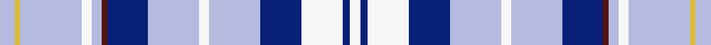

This page is one **sett** — a single exact thread-count. It belongs to the [tartan](/setts/lb6ly2lb24w4lb4dr2db16lb20w4lb20db16w16db3w4/)
(the same proportion at any scale), whose colour order is pattern [WBWBWWWBBWWWYW](/stripes/wbwbwwwbbwwwyw/).

Sourced from tartans-authority.  It is a [14 stripe tartan](/stripes/stripes14/).

Original link http://www.tartansauthority.com/tartan-ferret/display/3389/

## Register references

External register numbers recorded for this tartan.

- Scottish Tartans Authority (ITI): 3389

## Thread count
LB/12 LY4 LB48 W8 LB8 DR4 DB32 LB40 W8 LB40 DB32 W32 DB6 W/8

One full sett is **544 threads**.

## Palette
<table><thead><tr><th>Colour</th><th>Shade</th><th>OKLCh</th></tr></thead><tbody><tr><td>LB</td><td><code style="background-color:#B5BBDE;">#B5BBDE</code> <small style="color:#888">#B5BBDE</small></td><td><small style="color:#888">oklch(79.9% 0.050 277.6)</small></td></tr><tr><td>DB</td><td><code style="background-color:#082077;">#082077</code> <small style="color:#888">#082077</small></td><td><small style="color:#888">oklch(30.0% 0.149 265.1)</small></td></tr><tr><td>DR</td><td><code style="background-color:#55120C;">#55120C</code> <small style="color:#888">#55120C</small></td><td><small style="color:#888">oklch(30.0% 0.099 29.3)</small></td></tr><tr><td>W</td><td><code style="background-color:#F7F7F7;">#F7F7F7</code> <small style="color:#888">#F7F7F7</small></td><td><small style="color:#888">oklch(97.6% 0.000 89.9)</small></td></tr><tr><td>LY</td><td><code style="background-color:#DCBC32;">#DCBC32</code> <small style="color:#888">#DCBC32</small></td><td><small style="color:#888">oklch(80.0% 0.150 95.2)</small></td></tr></tbody></table>

# Sample pattern

ID: /variants/s14/lb6ly2lb24w4lb4dr2db16lb20w4lb20db16w16db3w4~x2/
