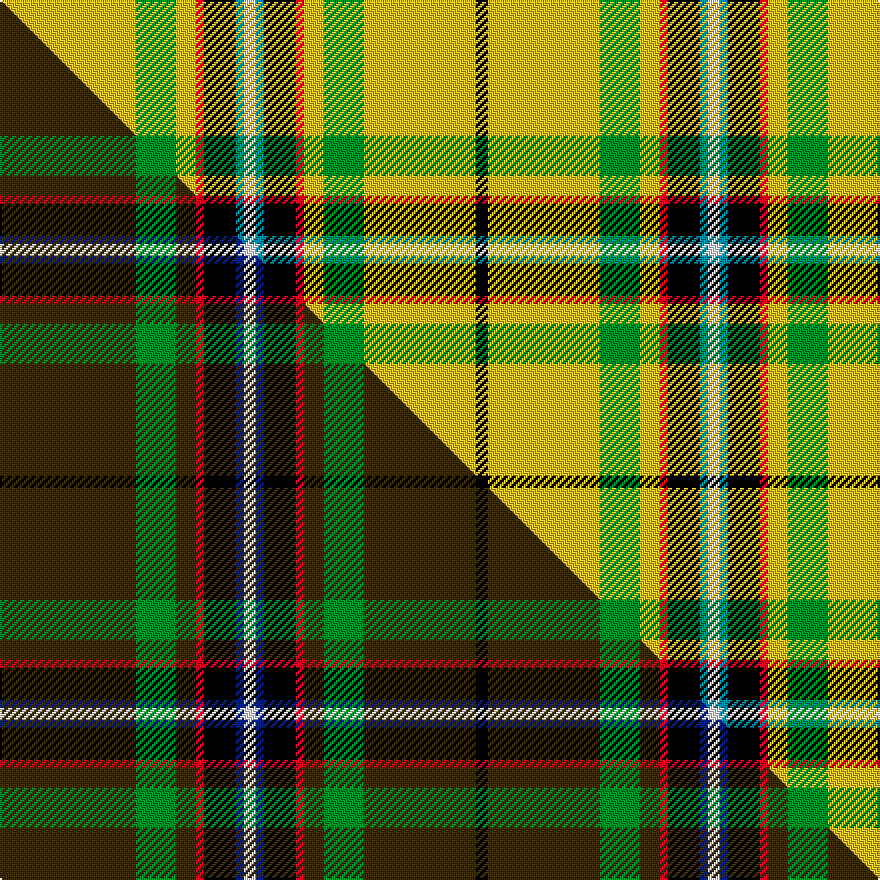

This page is one **sett** — a single exact thread-count. It belongs to the [tartan](/setts/ly34g10ly5r2k8t2w3t2k8r2ly5g10ly28k3/)
(the same proportion at any scale), whose colour order is pattern [KYGYRKBWBKRYGY](/stripes/kygyrkbwbkrygy/).

Part of the [Lambert Hunting](/tartans/lambert-hunting/) tartan — the named design grouping this sett with its other cloths.

Sourced from tartans-authority.  It is a [14 stripe tartan](/stripes/stripes14/).

Original link [https://www.tartanregister.gov.uk/tartanDetails.aspx?ref=10663](https://www.tartanregister.gov.uk/tartanDetails.aspx?ref=10663)

Dataset <small>— provenance for this record, inherited from the source manifest</small>

<dl class="dataset-prov">
<dt>source</dt><dd><a href="/sources/tartans-authority/">Scottish Tartans Authority</a></dd>
<dt>data captured from</dt><dd><a href="https://github.com/thetartan/tartan-database/blob/master/data/tartans-authority/data.csv">https://github.com/thetartan/tartan-database/blob/master/data/tartans-authority/data.csv</a></dd>
<dt>data date</dt><dd>29/07/2012 <small>(this record)</small></dd>
<dt>licence</dt><dd><a href="https://creativecommons.org/licenses/by-nc-nd/4.0/">CC BY-NC-ND 4.0</a></dd>
</dl>

Capture chain <small>— the hands this data passed through, oldest first; each capture carries its own licence</small>

<ol class="capture-chain">
<li><a href="https://www.tartansauthority.com/">Scottish Tartans Authority</a> <small>the heritage body's archive — its tartan-ferret record browser is retired (links repaired to the SRT, above)</small></li>
<li><a href="https://github.com/thetartan/tartan-database">thetartan/tartan-database</a> <small>2016-2017</small> · <a href="https://creativecommons.org/licenses/by-nc-nd/4.0/">CC BY-NC-ND 4.0</a> <small>Levko Kravets's frozen compilation — the capture we vendored, and where its CC licence text came from</small></li>
<li>this dictionary <small>captured 2026-06-10 · commit 5bf86c7566</small> <small>each re-capture is a git commit to data/sources</small></li>
</ol>

## Register references

External register numbers recorded for this tartan.

- Scottish Register of Tartans: [10663](https://www.tartanregister.gov.uk/tartanDetails?ref=10663)
- Scottish Tartans Authority (ITI): 10663

## Thread count
LY/68 G20 LY10 R4 K16 T4 W6 T4 K16 R4 LY10 G20 LY56 K/6

One full sett is **414 threads**.

## Palette
<table><thead><tr><th>Colour</th><th>Shade</th><th>OKLCh</th></tr></thead><tbody><tr><td>T</td><td><code style="background-color:#00879F;">#00879F</code> <small style="color:#888">#00879F</small></td><td><small style="color:#888">oklch(57.4% 0.102 216.1)</small></td></tr><tr><td>G</td><td><code style="background-color:#008B2A;">#008B2A</code> <small style="color:#888">#008B2A</small></td><td><small style="color:#888">oklch(55.4% 0.170 145.9)</small></td></tr><tr><td>K</td><td><code style="background-color:#000000;">#000000</code> <small style="color:#888">#000000</small></td><td><small style="color:#888">oklch(0.0% 0.000 0.0)</small></td></tr><tr><td>LY</td><td><code style="background-color:#DCBC32;">#DCBC32</code> <small style="color:#888">#DCBC32</small></td><td><small style="color:#888">oklch(80.0% 0.150 95.2)</small></td></tr><tr><td>R</td><td><code style="background-color:#D60020;">#D60020</code> <small style="color:#888">#D60020</small></td><td><small style="color:#888">oklch(55.2% 0.224 25.5)</small></td></tr><tr><td>W</td><td><code style="background-color:#F7F7F7;">#F7F7F7</code> <small style="color:#888">#F7F7F7</small></td><td><small style="color:#888">oklch(97.6% 0.000 89.9)</small></td></tr></tbody></table>

# Sample pattern

## Compared to the master

This cloth is one sett of its design; the master sett (the exemplar the design is anchored on) is below for comparison.

Its **ΔTartan distance** from the master is **0.24** — the same measure the nearest-tartans table ranks by (0 is identical; a re-scale of the same cloth is near 0, a recolour or a different proportion further).

<figure class="master-compare" style="margin:0">

this sett
master sett ★

<figcaption style="color:#888;font-size:smaller">One weave of this sett against the <a href="/setts/dy34g10dy5r2k8db2w3db2k8r2dy5g10dy28k3/">master sett ★</a>, split on the diagonal: a shared proportion runs seamlessly across it with only the shades shifting; a different proportion breaks on it.</figcaption>
</figure>

## Nearest tartan variants

The nearest existing variants by ΔTartan distance, with this cloth at the top so the swatches line up against it.

ΔTartan

Threads

Variant

Sett

—

414

<a href="/variants/s14/ly34g10ly5r2k8t2w3t2k8r2ly5g10ly28k3~x2/">Lambert Hunting (Personal)</a>

<a href="/ttd/edit/#slug=db3k1g13y1r1w1r6g3r1g3w1~x2&amp;base=ly34g10ly5r2k8t2w3t2k8r2ly5g10ly28k3~x2" title="compare in the TTD">3.26</a>

128

<a href="/variants/s11/db3k1g13y1r1w1r6g3r1g3w1~x2/">Canadian Caledonian, hunting</a>

<a href="/ttd/edit/#slug=db6g48k4y4k4w4g20r10k4r6w5&amp;base=ly34g10ly5r2k8t2w3t2k8r2ly5g10ly28k3~x2" title="compare in the TTD">3.29</a>

219

<a href="/variants/s11/db6g48k4y4k4w4g20r10k4r6w5/">Steel (Personal)</a>

<a href="/ttd/edit/#slug=r4ly40dt12y2dt12ly30k2ly4k2ly4y2ly3k3~x2~dt1500000-y2301120&amp;base=ly34g10ly5r2k8t2w3t2k8r2ly5g10ly28k3~x2" title="compare in the TTD">3.52</a>

466

<a href="/variants/s13/r4ly40dt12y2dt12ly30k2ly4k2ly4y2ly3k3~x2~dt1500000-y2301120/">Bartlett, Chris (Personal)</a>

<a href="/ttd/edit/#slug=k3g3y2g30k2g3r12g6lp6k3g3~x2&amp;base=ly34g10ly5r2k8t2w3t2k8r2ly5g10ly28k3~x2" title="compare in the TTD">3.54</a>

280

<a href="/variants/s11/k3g3y2g30k2g3r12g6lp6k3g3~x2/">McAlifyfe (Personal)</a>

<a href="/ttd/edit/#slug=db2dy15ly10dy4ly2k2ly2dy4ly50dy4ly2k2ly2dy4ly10dy15w2~x2&amp;base=ly34g10ly5r2k8t2w3t2k8r2ly5g10ly28k3~x2" title="compare in the TTD">3.60</a>

520

<a href="/variants/s17/db2dy15ly10dy4ly2k2ly2dy4ly50dy4ly2k2ly2dy4ly10dy15w2~x2/">Australian District Tartan</a>

<a href="/ttd/edit/#slug=ly24k7db1k1w1k1dy4dr3k1dr2ly1~x4&amp;base=ly34g10ly5r2k8t2w3t2k8r2ly5g10ly28k3~x2" title="compare in the TTD">3.61</a>

268

<a href="/variants/s11/ly24k7db1k1w1k1dy4dr3k1dr2ly1~x4/">U.S. Customs &amp; Border Protection (C</a>

<a href="/ttd/edit/#slug=y2ly1r2ly26dy11g6k1w2~x2~dy1603076&amp;base=ly34g10ly5r2k8t2w3t2k8r2ly5g10ly28k3~x2" title="compare in the TTD">3.62</a>

196

<a href="/variants/s8/y2ly1r2ly26dy11g6k1w2~x2~dy1603076/">Saskatchewan</a>

<a href="/ttd/edit/#slug=y24k8r4k6g76k8w14g4k9g12ly10&amp;base=ly34g10ly5r2k8t2w3t2k8r2ly5g10ly28k3~x2" title="compare in the TTD">3.68</a>

316

<a href="/variants/s11/y24k8r4k6g76k8w14g4k9g12ly10/">Offally County Crest (Fashion)</a>

<a href="/ttd/edit/#slug=r2db2k3g25k2db3g4y2g2w2g6db2r7k2r3w2~x2&amp;base=ly34g10ly5r2k8t2w3t2k8r2ly5g10ly28k3~x2" title="compare in the TTD">3.75</a>

268

<a href="/variants/s16/r2db2k3g25k2db3g4y2g2w2g6db2r7k2r3w2~x2/">Hueg (Bavaria) Scottish Thistle (Personal)</a>

<a href="/ttd/edit/#slug=w3k1g19r4g3r11g5r11g3r4g19k1ly3~x2&amp;base=ly34g10ly5r2k8t2w3t2k8r2ly5g10ly28k3~x2" title="compare in the TTD">3.79</a>

336

<a href="/variants/s13/w3k1g19r4g3r11g5r11g3r4g19k1ly3~x2/">Bruce Hunting (Clan)</a>

## Neighbour map

Every grey dot is one of 13621 variants placed by the first two principal components of the ΔTartan feature space (42% of its variance). Red is this tartan; blue dots are its nearest — click one to open its page.

<svg viewBox="0 0 640 380" role="img" style="max-width:100%;height:auto;border:1px solid #e0e0e0;border-radius:4px;display:block" xmlns="http://www.w3.org/2000/svg"><image href="/nn/cloud.v1.png" width="640" height="380"/><a href="/variants/s11/db3k1g13y1r1w1r6g3r1g3w1~x2/"><circle cx="242.0" cy="118.9" r="4" fill="#3465a4"><title>Canadian Caledonian, hunting</title></circle></a><a href="/variants/s11/db6g48k4y4k4w4g20r10k4r6w5/"><circle cx="234.7" cy="109.8" r="4" fill="#3465a4"><title>Steel (Personal)</title></circle></a><a href="/variants/s13/r4ly40dt12y2dt12ly30k2ly4k2ly4y2ly3k3~x2~dt1500000-y2301120/"><circle cx="336.0" cy="91.4" r="4" fill="#3465a4"><title>Bartlett, Chris (Personal)</title></circle></a><a href="/variants/s11/k3g3y2g30k2g3r12g6lp6k3g3~x2/"><circle cx="287.8" cy="119.1" r="4" fill="#3465a4"><title>McAlifyfe (Personal)</title></circle></a><a href="/variants/s17/db2dy15ly10dy4ly2k2ly2dy4ly50dy4ly2k2ly2dy4ly10dy15w2~x2/"><circle cx="309.9" cy="66.5" r="4" fill="#3465a4"><title>Australian District Tartan</title></circle></a><a href="/variants/s11/ly24k7db1k1w1k1dy4dr3k1dr2ly1~x4/"><circle cx="231.1" cy="57.3" r="4" fill="#3465a4"><title>U.S. Customs &amp; Border Protection (C</title></circle></a><a href="/variants/s8/y2ly1r2ly26dy11g6k1w2~x2~dy1603076/"><circle cx="250.0" cy="67.9" r="4" fill="#3465a4"><title>Saskatchewan</title></circle></a><a href="/variants/s11/y24k8r4k6g76k8w14g4k9g12ly10/"><circle cx="203.0" cy="91.4" r="4" fill="#3465a4"><title>Offally County Crest (Fashion)</title></circle></a><a href="/variants/s16/r2db2k3g25k2db3g4y2g2w2g6db2r7k2r3w2~x2/"><circle cx="199.3" cy="90.0" r="4" fill="#3465a4"><title>Hueg (Bavaria) Scottish Thistle (Personal)</title></circle></a><a href="/variants/s13/w3k1g19r4g3r11g5r11g3r4g19k1ly3~x2/"><circle cx="288.6" cy="129.3" r="4" fill="#3465a4"><title>Bruce Hunting (Clan)</title></circle></a><circle cx="226.8" cy="89.4" r="5" fill="#c00000"/><text x="320" y="376" text-anchor="middle" font-size="11" fill="#999">ground</text><text x="11" y="190" text-anchor="middle" font-size="11" fill="#999" transform="rotate(-90 11 190)">complexity</text></svg>

ID: /variants/s14/ly34g10ly5r2k8t2w3t2k8r2ly5g10ly28k3~x2/
