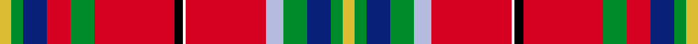

This page is one **sett** — a single exact thread-count. It belongs to the [tartan](/setts/ly4g4db8r8g8r27k3w1r27lb6g8db8g4ly4/)
(the same proportion at any scale), whose colour order is pattern [YGBGWRWKRGRBGY](/stripes/ygbgwrwkrgrbgy/).

Sourced from register-of-tartans.  It is a [14 stripe tartan](/stripes/stripes14/).

Original link https://www.tartanregister.gov.uk/tartanDetails.aspx?ref=5649

## Provenance

Earliest known date: May 2008 Adapted from 4252 - West Virginia Shawl by Dr Phil Smith and John A Grant III. Adopted by the West Virginia senate (HCR #29) on March 6th 2008. Part of the resolution reads: "Whereas, In order to complement our mountain state the color red is to represent the cardinal (State bird); yellow for the fall colors; dark blue for the mountain rivers and lakes; black for the black bear, coal and oil; green for the rhododendron and mountain meadows; azure for the sky above; and white to have all the colors of this great nation intertwined with the State of West Virginia; therefore, be it Resolved by the Legislature of West Virginia: That the adaption, as described above, of the West Virgina Shawl be designated the Official Tartan of the State of West Virginia."

3 attestations — the source records this cloth was collapsed from (oldest owns this page)

<ul>
<li>27/05/2008 — West Virginia (register-of-tartans, <a href="https://www.tartanregister.gov.uk/tartanDetails.aspx?ref=5649">record</a>)  <em>Adapted from the West Virginia Shawl tartan and adopted by the West Virginia senate (HCR #29) on March 6th 2008. The colours have been chosen to represent the mountain state as follows: red for the Cardinal, the State bird; yellow for the Sugar Maple, the State tree, and the fall colors; dark blue for the mountain rivers and lakes; black for the Black Bear, the State animal, and for coal and oil; green for the Rhododendron, the State Flower, and mountain meadows; azure for the sky above; and white to have all the colors of this great nation intertwined with the State of West Virginia.</em></li>
<li>May 2008 — West Virginia (US State) (tartans-authority, <a href="http://www.tartansauthority.com/tartan-ferret/display/7631/">record</a>)  <em>Adapted from 4252 - West Virginia Shawl by Dr Phil Smith and John A Grant III. Adopted by the West Virginia senate (HCR #29) on March 6th 2008. Part of the resolution reads: "Whereas, In order to complement our mountain state the color red is to represent the cardinal (State bird); yellow for the fall colors; dark blue for the mountain rivers and lakes; black for the black bear, coal and oil; green for the rhododendron and mountain meadows; azure for the sky above; and white to have all the colors of this great nation intertwined with the State of West Virginia; therefore, be it Resolved by the Legislature of West Virginia: That the adaption, as described above, of the West Virgina Shawl be designated the Official Tartan of the State of West Virginia;" Woven sample by Marjorie Warren.</em></li>
<li>undated — West Virginia State American District Tartan (house-of-tartan, <a href="http://www.house-of-tartan.scotland.net/house/TartanViewjs.asp?colr=Def&tnam=7631">record</a>) </li>
</ul>

## Register references

External register numbers recorded for this tartan.

- Scottish Register of Tartans: [5649](https://www.tartanregister.gov.uk/tartanDetails.aspx?ref=5649)
- Scottish Tartans Authority (ITI): 7631

## Thread count
LY/8 G8 DB16 R16 G16 R54 K6 W2 R54 LB12 G16 DB16 G8 LY/8

One full sett is **464 threads**.

## Palette
<table><thead><tr><th>Colour</th><th>Shade</th><th>OKLCh</th></tr></thead><tbody><tr><td>LB</td><td><code style="background-color:#B5BBDE;">#B5BBDE</code> <small style="color:#888">#B5BBDE</small></td><td><small style="color:#888">oklch(79.9% 0.050 277.6)</small></td></tr><tr><td>DB</td><td><code style="background-color:#082077;">#082077</code> <small style="color:#888">#082077</small></td><td><small style="color:#888">oklch(30.0% 0.149 265.1)</small></td></tr><tr><td>LY</td><td><code style="background-color:#DCBC32;">#DCBC32</code> <small style="color:#888">#DCBC32</small></td><td><small style="color:#888">oklch(80.0% 0.150 95.2)</small></td></tr><tr><td>G</td><td><code style="background-color:#008B2A;">#008B2A</code> <small style="color:#888">#008B2A</small></td><td><small style="color:#888">oklch(55.4% 0.170 145.9)</small></td></tr><tr><td>K</td><td><code style="background-color:#000000;">#000000</code> <small style="color:#888">#000000</small></td><td><small style="color:#888">oklch(0.0% 0.000 0.0)</small></td></tr><tr><td>W</td><td><code style="background-color:#F7F7F7;">#F7F7F7</code> <small style="color:#888">#F7F7F7</small></td><td><small style="color:#888">oklch(97.6% 0.000 89.9)</small></td></tr><tr><td>R</td><td><code style="background-color:#D60020;">#D60020</code> <small style="color:#888">#D60020</small></td><td><small style="color:#888">oklch(55.2% 0.224 25.5)</small></td></tr></tbody></table>

# Sample pattern

ID: /variants/s14/ly4g4db8r8g8r27k3w1r27lb6g8db8g4ly4~x2/
