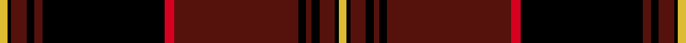

This page is one **sett** — a single exact thread-count. It belongs to the [tartan](/setts/ly4k2dr8k4dr4k63r5dr64k4dr3k4dr8k2ly4/)
(the same proportion at any scale), whose colour order is pattern [YKBKBKBRKBKBKY](/stripes/ykbkbkbrkbkbky/).

Sourced from register-of-tartans.  It is a [14 stripe tartan](/stripes/stripes14/).

Original link https://www.tartanregister.gov.uk/tartanDetails.aspx?ref=1335

## Provenance

Earliest known date: December 2006 Designed by William C. (Rocky) Roeger III of usakilts.com to honor anyone with German heritage. Itr is a private fashion tartan designed for ANYONE to wear, regardless of clan affiliation or nationality. The Colours were chosen to reflect those of the German flag. Woven sample.

3 attestations — the source records this cloth was collapsed from (oldest owns this page)

<ul>
<li>01/12/2006 — German Heritage (register-of-tartans, <a href="https://www.tartanregister.gov.uk/tartanDetails.aspx?ref=1335">record</a>)  <em>Designed by William C. (Rocky) Roeger III of usakilts.com to honour anyone with German heritage. It is a private fashion tartan designed for anyone to wear, regardless of clan affiliation or nationality. The Colours were chosen to reflect the colours in the German flag.</em></li>
<li>December 2006 — German Heritage (Fashion) (tartans-authority, <a href="http://www.tartansauthority.com/tartan-ferret/display/7016/">record</a>)  <em>Designed by William C. (Rocky) Roeger III of usakilts.com to honor anyone with German heritage. Itr is a private fashion tartan designed for ANYONE to wear, regardless of clan affiliation or nationality. The Colours were chosen to reflect those of the German flag. Woven sample.</em></li>
<li>undated — German Heritage (Fashion) American Fashion Tartan (house-of-tartan, <a href="http://www.house-of-tartan.scotland.net/house/TartanViewjs.asp?colr=Def&tnam=7016">record</a>) </li>
</ul>

## Register references

External register numbers recorded for this tartan.

- Scottish Register of Tartans: [1335](https://www.tartanregister.gov.uk/tartanDetails.aspx?ref=1335)
- Scottish Tartans Authority (ITI): 7016

## Thread count
LY/4 K2 DR8 K4 DR4 K63 R5 DR64 K4 DR3 K4 DR8 K2 LY/4

One full sett is **350 threads**.

## Palette
<table><thead><tr><th>Colour</th><th>Shade</th><th>OKLCh</th></tr></thead><tbody><tr><td>DR</td><td><code style="background-color:#55120C;">#55120C</code> <small style="color:#888">#55120C</small></td><td><small style="color:#888">oklch(30.0% 0.099 29.3)</small></td></tr><tr><td>LY</td><td><code style="background-color:#DCBC32;">#DCBC32</code> <small style="color:#888">#DCBC32</small></td><td><small style="color:#888">oklch(80.0% 0.150 95.2)</small></td></tr><tr><td>K</td><td><code style="background-color:#000000;">#000000</code> <small style="color:#888">#000000</small></td><td><small style="color:#888">oklch(0.0% 0.000 0.0)</small></td></tr><tr><td>R</td><td><code style="background-color:#D60020;">#D60020</code> <small style="color:#888">#D60020</small></td><td><small style="color:#888">oklch(55.2% 0.224 25.5)</small></td></tr></tbody></table>

# Sample pattern

## Nearest tartan variants

The nearest existing variants by ΔTartan distance, with this cloth at the top so the swatches line up against it.

ΔTartan

Threads

Variant

Sett

—

350

<a href="/variants/s14/ly4k2dr8k4dr4k63r5dr64k4dr3k4dr8k2ly4/">German Heritage</a>

<a href="/ttd/edit/#slug=dr3r2k7dr3k3dr52r4k52dr3k3dr3k7r2dr3&amp;base=ly4k2dr8k4dr4k63r5dr64k4dr3k4dr8k2ly4" title="compare in the TTD">2.30</a>

288

<a href="/variants/s14/dr3r2k7dr3k3dr52r4k52dr3k3dr3k7r2dr3/">Old Aberdeen Diamond Jubilee</a>

## Neighbour map

Every grey dot is one of 13620 variants placed by the first two principal components of the ΔTartan feature space (42% of its variance). Red is this tartan; blue dots are its nearest — click one to open its page.

<svg viewBox="0 0 640 380" role="img" style="max-width:100%;height:auto;border:1px solid #e0e0e0;border-radius:4px;display:block" xmlns="http://www.w3.org/2000/svg"><image href="/nn/cloud.v1.png" width="640" height="380"/><a href="/variants/s14/dr3r2k7dr3k3dr52r4k52dr3k3dr3k7r2dr3/"><circle cx="365.6" cy="96.8" r="4" fill="#3465a4"><title>Old Aberdeen Diamond Jubilee</title></circle></a><circle cx="325.7" cy="68.9" r="5" fill="#c00000"/><text x="320" y="376" text-anchor="middle" font-size="11" fill="#999">ground</text><text x="11" y="190" text-anchor="middle" font-size="11" fill="#999" transform="rotate(-90 11 190)">complexity</text></svg>

ID: /variants/s14/ly4k2dr8k4dr4k63r5dr64k4dr3k4dr8k2ly4/
