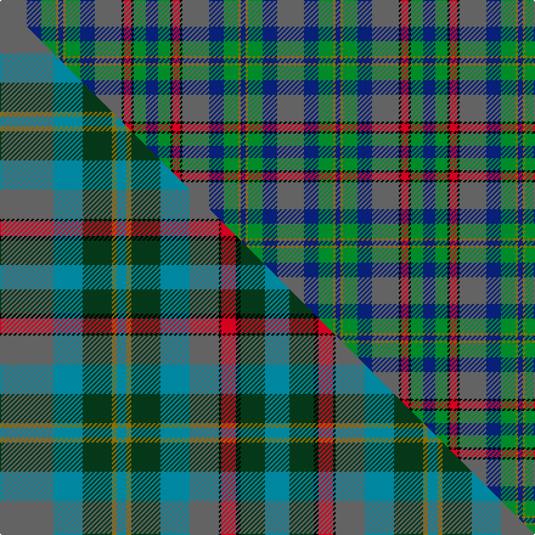

This page is one **sett** — a single exact thread-count. It belongs to the [tartan](/setts/n11db6g6y1db2y1g6db6n11k1r3k1g5db5/)
(the same proportion at any scale), whose colour order is pattern [BBGGBGGBBKRKGB](/stripes/bbggbggbbkrkgb/).

Part of the [Penman](/tartans/penman/) tartan — the named design grouping this sett with its other cloths.

Sourced from weddslist.  It is a [14 stripe tartan](/stripes/stripes14/).

Original link http://www.weddslist.com/cgi-bin/tartans/pg.pl?source=sts

## Provenance

Earliest known date: pre 1992 The late William Penman supplied members of the Penman family with this tartan for many years.

2 attestations — the source records this cloth was collapsed from (oldest owns this page)

<ul>
<li>undated — Penman (weddslist, <a href="http://www.weddslist.com/cgi-bin/tartans/pg.pl?source=sts">record</a>) </li>
<li>undated — Penman Family Tartan (house-of-tartan, <a href="http://www.house-of-tartan.scotland.net/house/TartanViewjs.asp?colr=Def&tnam=167">record</a>) </li>
</ul>

Dataset <small>— provenance for this record, inherited from the source manifest</small>

<dl class="dataset-prov">
<dt>source</dt><dd><a href="/sources/weddslist/">Weddslist</a></dd>
<dt>data captured from</dt><dd><a href="https://github.com/thetartan/tartan-database/blob/master/data/weddslist/data.csv">https://github.com/thetartan/tartan-database/blob/master/data/weddslist/data.csv</a></dd>
<dt>data date</dt><dd>2016-11-17 <small>(dataset default)</small></dd>
<dt>licence</dt><dd><a href="https://creativecommons.org/licenses/by-nc-nd/4.0/">CC BY-NC-ND 4.0</a></dd>
</dl>

Capture chain <small>— the hands this data passed through, oldest first; each capture carries its own licence</small>

<ol class="capture-chain">
<li><a href="https://www.weddslist.com/tartans/">Weddslist</a> <small>the living privately compiled reference</small></li>
<li><a href="https://github.com/thetartan/tartan-database">thetartan/tartan-database</a> <small>2016-2017</small> · <a href="https://creativecommons.org/licenses/by-nc-nd/4.0/">CC BY-NC-ND 4.0</a> <small>Levko Kravets's frozen compilation — the capture we vendored, and where its CC licence text came from</small></li>
<li>this dictionary <small>captured 2026-06-10 · commit 5bf86c7566</small> <small>each re-capture is a git commit to data/sources</small></li>
</ol>

## Thread count
N/22 DB12 G12 Y2 DB4 Y2 G12 DB12 N22 K2 R6 K2 G10 DB/10

One full sett is **228 threads**.

## Palette
<table><thead><tr><th>Colour</th><th>Shade</th><th>OKLCh</th></tr></thead><tbody><tr><td>DB</td><td><code style="background-color:#082077;">#082077</code> <small style="color:#888">#082077</small></td><td><small style="color:#888">oklch(30.0% 0.149 265.1)</small></td></tr><tr><td>G</td><td><code style="background-color:#008B2A;">#008B2A</code> <small style="color:#888">#008B2A</small></td><td><small style="color:#888">oklch(55.4% 0.170 145.9)</small></td></tr><tr><td>K</td><td><code style="background-color:#000000;">#000000</code> <small style="color:#888">#000000</small></td><td><small style="color:#888">oklch(0.0% 0.000 0.0)</small></td></tr><tr><td>N</td><td><code style="background-color:#636363;">#636363</code> <small style="color:#888">#636363</small></td><td><small style="color:#888">oklch(50.0% 0.000 89.9)</small></td></tr><tr><td>R</td><td><code style="background-color:#D60020;">#D60020</code> <small style="color:#888">#D60020</small></td><td><small style="color:#888">oklch(55.2% 0.224 25.5)</small></td></tr><tr><td>Y</td><td><code style="background-color:#8B6E00;">#8B6E00</code> <small style="color:#888">#8B6E00</small></td><td><small style="color:#888">oklch(55.1% 0.113 90.4)</small></td></tr></tbody></table>

# Sample pattern

## Compared to the master

This cloth is one sett of its design; the master sett (the exemplar the design is anchored on) is below for comparison.

Its **ΔTartan distance** from the master is **0.68** — the same measure the nearest-tartans table ranks by (0 is identical; a re-scale of the same cloth is near 0, a recolour or a different proportion further).

<figure class="master-compare" style="margin:0">

this sett
master sett ★

<figcaption style="color:#888;font-size:smaller">One weave of this sett against the <a href="/setts/n22t12dg12y2t4y2dg12t12n12k1r6k2dg10t10/">master sett ★</a>, split on the diagonal: a shared proportion runs seamlessly across it with only the shades shifting; a different proportion breaks on it.</figcaption>
</figure>

## Nearest tartan variants

The nearest existing variants by ΔTartan distance, with this cloth at the top so the swatches line up against it.

ΔTartan

Threads

Variant

Sett

—

228

<a href="/variants/s14/n11db6g6y1db2y1g6db6n11k1r3k1g5db5~x2/">Penman</a>

<a href="/ttd/edit/#slug=n22t12dg12y2t4y2dg12t12n12k1r6k2dg10t10~x2&amp;base=n11db6g6y1db2y1g6db6n11k1r3k1g5db5~x2" title="compare in the TTD">0.68</a>

412

<a href="/variants/s14/n22t12dg12y2t4y2dg12t12n12k1r6k2dg10t10~x2/">Penman</a>

<a href="/ttd/edit/#slug=dy3y3dy12y1k1db12k1db12k1g12k1dy12lb3db2~x2&amp;base=n11db6g6y1db2y1g6db6n11k1r3k1g5db5~x2" title="compare in the TTD">2.33</a>

294

<a href="/variants/s14/dy3y3dy12y1k1db12k1db12k1g12k1dy12lb3db2~x2/">Balmaha</a>

<a href="/ttd/edit/#slug=db8r2db2r4db8g2k10g10k4g2y2g4w1~x2~db1605267-g1903114-k0503265&amp;base=n11db6g6y1db2y1g6db6n11k1r3k1g5db5~x2" title="compare in the TTD">2.49</a>

218

<a href="/variants/s13/db8r2db2r4db8g2k10g10k4g2y2g4w1~x2~db1605267-g1903114-k0503265/">McCrann, Julian David (Personal)</a>

<a href="/ttd/edit/#slug=dg15db3dg3db3dg3db16o16k5lo2k5o16db16dg15r1k4~x2&amp;base=n11db6g6y1db2y1g6db6n11k1r3k1g5db5~x2" title="compare in the TTD">2.91</a>

454

<a href="/variants/s15/dg15db3dg3db3dg3db16o16k5lo2k5o16db16dg15r1k4~x2/">Loseby, Luke (Personal)</a>

<a href="/ttd/edit/#slug=dr4g4k2g15do5g5do15g6w1db19dr2~x2&amp;base=n11db6g6y1db2y1g6db6n11k1r3k1g5db5~x2" title="compare in the TTD">3.05</a>

300

<a href="/variants/s11/dr4g4k2g15do5g5do15g6w1db19dr2~x2/">Adams</a>

<a href="/ttd/edit/#slug=dt8y8dt4y28k12dti6k12dr4dti8dr4dti29lb6~y2100000-dti1200000&amp;base=n11db6g6y1db2y1g6db6n11k1r3k1g5db5~x2" title="compare in the TTD">3.18</a>

244

<a href="/variants/s12/dt8y8dt4y28k12dti6k12dr4dti8dr4dti29lb6~y2100000-dti1200000/">Kinloch Anderson Castle Grey</a>

<a href="/ttd/edit/#slug=t13g19k2t7k2g7k2db18r2t13~x2~db1406275&amp;base=n11db6g6y1db2y1g6db6n11k1r3k1g5db5~x2" title="compare in the TTD">3.19</a>

288

<a href="/variants/s10/t13g19k2t7k2g7k2db18r2t13~x2~db1406275/">South Australia</a>

<a href="/ttd/edit/#slug=g15db3g3db3g3db16o16k5y2k5o16db16g15r1k4~x2&amp;base=n11db6g6y1db2y1g6db6n11k1r3k1g5db5~x2" title="compare in the TTD">3.24</a>

454

<a href="/variants/s15/g15db3g3db3g3db16o16k5y2k5o16db16g15r1k4~x2/">Loseby, Luke (Personal)</a>

<a href="/ttd/edit/#slug=dr4g4k2g17do5g5do17g6lb1db22dr2~x2&amp;base=n11db6g6y1db2y1g6db6n11k1r3k1g5db5~x2" title="compare in the TTD">3.35</a>

328

<a href="/variants/s11/dr4g4k2g17do5g5do17g6lb1db22dr2~x2/">Adams (Name)</a>

<a href="/ttd/edit/#slug=db12g24r5do20g4w2g4do21y5g24db12do4k2do4~x2&amp;base=n11db6g6y1db2y1g6db6n11k1r3k1g5db5~x2" title="compare in the TTD">3.35</a>

540

<a href="/variants/s14/db12g24r5do20g4w2g4do21y5g24db12do4k2do4~x2/">Hyndman (Personal)</a>

## Neighbour map

Every grey dot is one of 13620 variants placed by the first two principal components of the ΔTartan feature space (42% of its variance). Red is this tartan; blue dots are its nearest — click one to open its page.

<svg viewBox="0 0 640 380" role="img" style="max-width:100%;height:auto;border:1px solid #e0e0e0;border-radius:4px;display:block" xmlns="http://www.w3.org/2000/svg"><image href="/nn/cloud.v1.png" width="640" height="380"/><a href="/variants/s14/n22t12dg12y2t4y2dg12t12n12k1r6k2dg10t10~x2/"><circle cx="186.5" cy="157.6" r="4" fill="#3465a4"><title>Penman</title></circle></a><a href="/variants/s14/dy3y3dy12y1k1db12k1db12k1g12k1dy12lb3db2~x2/"><circle cx="153.8" cy="139.9" r="4" fill="#3465a4"><title>Balmaha</title></circle></a><a href="/variants/s13/db8r2db2r4db8g2k10g10k4g2y2g4w1~x2~db1605267-g1903114-k0503265/"><circle cx="107.3" cy="165.1" r="4" fill="#3465a4"><title>McCrann, Julian David (Personal)</title></circle></a><a href="/variants/s15/dg15db3dg3db3dg3db16o16k5lo2k5o16db16dg15r1k4~x2/"><circle cx="121.3" cy="134.5" r="4" fill="#3465a4"><title>Loseby, Luke (Personal)</title></circle></a><a href="/variants/s11/dr4g4k2g15do5g5do15g6w1db19dr2~x2/"><circle cx="175.3" cy="140.1" r="4" fill="#3465a4"><title>Adams</title></circle></a><a href="/variants/s12/dt8y8dt4y28k12dti6k12dr4dti8dr4dti29lb6~y2100000-dti1200000/"><circle cx="113.8" cy="174.0" r="4" fill="#3465a4"><title>Kinloch Anderson Castle Grey</title></circle></a><a href="/variants/s10/t13g19k2t7k2g7k2db18r2t13~x2~db1406275/"><circle cx="140.1" cy="160.7" r="4" fill="#3465a4"><title>South Australia</title></circle></a><a href="/variants/s15/g15db3g3db3g3db16o16k5y2k5o16db16g15r1k4~x2/"><circle cx="100.3" cy="130.7" r="4" fill="#3465a4"><title>Loseby, Luke (Personal)</title></circle></a><a href="/variants/s11/dr4g4k2g17do5g5do17g6lb1db22dr2~x2/"><circle cx="188.0" cy="131.3" r="4" fill="#3465a4"><title>Adams (Name)</title></circle></a><a href="/variants/s14/db12g24r5do20g4w2g4do21y5g24db12do4k2do4~x2/"><circle cx="151.3" cy="139.0" r="4" fill="#3465a4"><title>Hyndman (Personal)</title></circle></a><circle cx="140.6" cy="165.9" r="5" fill="#c00000"/><text x="320" y="376" text-anchor="middle" font-size="11" fill="#999">ground</text><text x="11" y="190" text-anchor="middle" font-size="11" fill="#999" transform="rotate(-90 11 190)">complexity</text></svg>

ID: /variants/s14/n11db6g6y1db2y1g6db6n11k1r3k1g5db5~x2/
