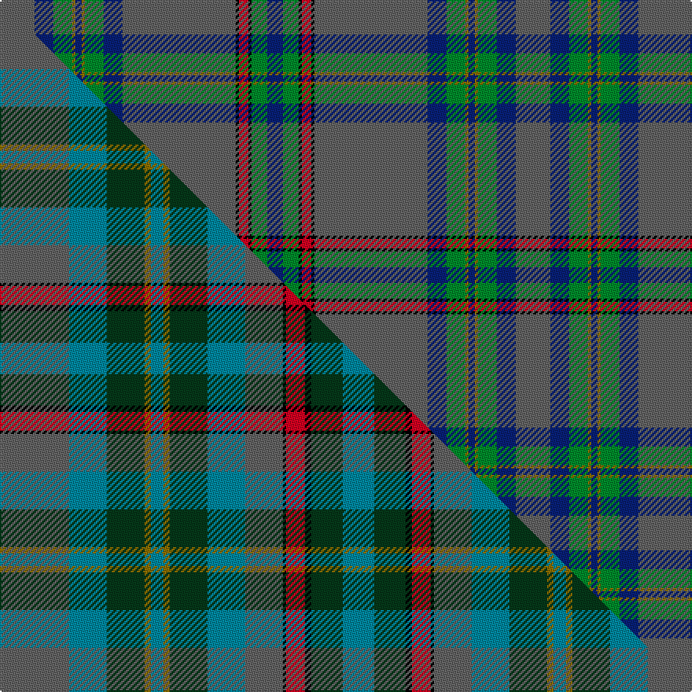

This page is one **sett** — a single exact thread-count. It belongs to the [tartan](/setts/n11db6g6y1db2y1g6db6n36k1r3k1g5db5/)
(the same proportion at any scale), whose colour order is pattern [BBGGBGGBBKRKGB](/stripes/bbggbggbbkrkgb/).

Part of the [Penman](/tartans/penman/) tartan — the named design grouping this sett with its other cloths.

Sourced from weddslist.  It is a [14 stripe tartan](/stripes/stripes14/).

Original link [http://www.weddslist.com/cgi-bin/tartans/pg.pl?source=sts](http://www.weddslist.com/cgi-bin/tartans/pg.pl?source=sts)

## Provenance

Earliest known date: 1984 From design by the late William Penman.

2 attestations — the source records this cloth was collapsed from (oldest owns this page)

<ul>
<li>undated — Penman (weddslist, <a href="http://www.weddslist.com/cgi-bin/tartans/pg.pl?source=sts">record</a>) </li>
<li>undated — Penman Clan Tartan (house-of-tartan, <a href="http://www.house-of-tartan.scotland.net/house/TartanViewjs.asp?colr=Def&tnam=166">record</a>) </li>
</ul>

Dataset <small>— provenance for this record, inherited from the source manifest</small>

<dl class="dataset-prov">
<dt>source</dt><dd><a href="/sources/weddslist/">Weddslist</a></dd>
<dt>data captured from</dt><dd><a href="https://github.com/thetartan/tartan-database/blob/master/data/weddslist/data.csv">https://github.com/thetartan/tartan-database/blob/master/data/weddslist/data.csv</a></dd>
<dt>data date</dt><dd>2016-11-17 <small>(dataset default)</small></dd>
<dt>licence</dt><dd><a href="https://creativecommons.org/licenses/by-nc-nd/4.0/">CC BY-NC-ND 4.0</a></dd>
</dl>

Capture chain <small>— the hands this data passed through, oldest first; each capture carries its own licence</small>

<ol class="capture-chain">
<li><a href="https://www.weddslist.com/tartans/">Weddslist</a> <small>the living privately compiled reference</small></li>
<li><a href="https://github.com/thetartan/tartan-database">thetartan/tartan-database</a> <small>2016-2017</small> · <a href="https://creativecommons.org/licenses/by-nc-nd/4.0/">CC BY-NC-ND 4.0</a> <small>Levko Kravets's frozen compilation — the capture we vendored, and where its CC licence text came from</small></li>
<li>this dictionary <small>captured 2026-06-10 · commit 5bf86c7566</small> <small>each re-capture is a git commit to data/sources</small></li>
</ol>

## Thread count
N/22 DB12 G12 Y2 DB4 Y2 G12 DB12 N72 K2 R6 K2 G10 DB/10

One full sett is **328 threads**.

## Palette
<table><thead><tr><th>Colour</th><th>Shade</th><th>OKLCh</th></tr></thead><tbody><tr><td>DB</td><td><code style="background-color:#082077;">#082077</code> <small style="color:#888">#082077</small></td><td><small style="color:#888">oklch(30.0% 0.149 265.1)</small></td></tr><tr><td>G</td><td><code style="background-color:#008B2A;">#008B2A</code> <small style="color:#888">#008B2A</small></td><td><small style="color:#888">oklch(55.4% 0.170 145.9)</small></td></tr><tr><td>K</td><td><code style="background-color:#000000;">#000000</code> <small style="color:#888">#000000</small></td><td><small style="color:#888">oklch(0.0% 0.000 0.0)</small></td></tr><tr><td>N</td><td><code style="background-color:#636363;">#636363</code> <small style="color:#888">#636363</small></td><td><small style="color:#888">oklch(50.0% 0.000 89.9)</small></td></tr><tr><td>R</td><td><code style="background-color:#D60020;">#D60020</code> <small style="color:#888">#D60020</small></td><td><small style="color:#888">oklch(55.2% 0.224 25.5)</small></td></tr><tr><td>Y</td><td><code style="background-color:#8B6E00;">#8B6E00</code> <small style="color:#888">#8B6E00</small></td><td><small style="color:#888">oklch(55.1% 0.113 90.4)</small></td></tr></tbody></table>

# Sample pattern

## Compared to the master

This cloth is one sett of its design; the master sett (the exemplar the design is anchored on) is below for comparison.

Its **ΔTartan distance** from the master is **0.93** — the same measure the nearest-tartans table ranks by (0 is identical; a re-scale of the same cloth is near 0, a recolour or a different proportion further).

<figure class="master-compare" style="margin:0">

this sett
master sett ★

<figcaption style="color:#888;font-size:smaller">One weave of this sett against the <a href="/setts/n22t12dg12y2t4y2dg12t12n12k1r6k2dg10t10/">master sett ★</a>, split on the diagonal: a shared proportion runs seamlessly across it with only the shades shifting; a different proportion breaks on it.</figcaption>
</figure>

## Nearest tartan variants

The nearest existing variants by ΔTartan distance, with this cloth at the top so the swatches line up against it.

ΔTartan

Threads

Variant

Sett

—

328

<a href="/variants/s14/n11db6g6y1db2y1g6db6n36k1r3k1g5db5~x2/">Penman</a>

<a href="/ttd/edit/#slug=db4n4w1db2n50db20y1g25r4k2~x2&amp;base=n11db6g6y1db2y1g6db6n36k1r3k1g5db5~x2" title="compare in the TTD">2.78</a>

440

<a href="/variants/s10/db4n4w1db2n50db20y1g25r4k2~x2/">Philip Boisserolles de St-Julien, baron of Hartsyde (Personal)</a>

<a href="/ttd/edit/#slug=db4n4w1db2n50db20y1dg25o4k2~x2&amp;base=n11db6g6y1db2y1g6db6n36k1r3k1g5db5~x2" title="compare in the TTD">3.01</a>

440

<a href="/variants/s10/db4n4w1db2n50db20y1dg25o4k2~x2/">Boisserolles de St-Julien, Baron of</a>

<a href="/ttd/edit/#slug=dp10lb1dg2k2dg18r1n45k1~x2&amp;base=n11db6g6y1db2y1g6db6n36k1r3k1g5db5~x2" title="compare in the TTD">3.16</a>

298

<a href="/variants/s8/dp10lb1dg2k2dg18r1n45k1~x2/">Highland Burn (Fashion)</a>

<a href="/ttd/edit/#slug=n19o4t2n10o22k1g3k1o3w1t5o1k3~x2~n1900000-o2500000&amp;base=n11db6g6y1db2y1g6db6n36k1r3k1g5db5~x2" title="compare in the TTD">3.29</a>

256

<a href="/variants/s13/n19o4t2n10o22k1g3k1o3w1t5o1k3~x2~n1900000-o2500000/">Giants Causeway (District)</a>

<a href="/ttd/edit/#slug=t12n4r4n4k2n56r18w1db4w3db4w1~x2~t2405244-r2109032-db1406275&amp;base=n11db6g6y1db2y1g6db6n36k1r3k1g5db5~x2" title="compare in the TTD">3.31</a>

426

<a href="/variants/s12/t12n4r4n4k2n56r18w1db4w3db4w1~x2~t2405244-r2109032-db1406275/">Confederate Memorial</a>

<a href="/ttd/edit/#slug=k3n3k1dg26k10y1k3dp5n4ly2~x2~k0603284-n1802249&amp;base=n11db6g6y1db2y1g6db6n36k1r3k1g5db5~x2" title="compare in the TTD">3.61</a>

222

<a href="/variants/s10/k3n3k1dg26k10y1k3dp5n4ly2~x2~k0603284-n1802249/">Rikaco Heirloom</a>

<a href="/ttd/edit/#slug=y18k1r1w1r4db4y4g4r1g1r1g1r1g1~x4~y2502222-db1406275&amp;base=n11db6g6y1db2y1g6db6n36k1r3k1g5db5~x2" title="compare in the TTD">3.64</a>

268

<a href="/variants/s14/t18k1r1w1r4db4t4g4r1g1r1g1r1g1~x4~t2502222-db1406275/">Hill 70</a>

<a href="/ttd/edit/#slug=n38y8db3n20y44k2g6k2y5w2db10y2k6~n1800000-y2101120&amp;base=n11db6g6y1db2y1g6db6n36k1r3k1g5db5~x2" title="compare in the TTD">3.66</a>

252

<a href="/variants/s13/n38y8db3n20y44k2g6k2y5w2db10y2k6~n1800000-y2101120/">Giants Causeway, The</a>

<a href="/ttd/edit/#slug=db56dg11r2dg7k2dg7r2dg7dt3lo4~x2~db1406275-dt1204274&amp;base=n11db6g6y1db2y1g6db6n36k1r3k1g5db5~x2" title="compare in the TTD">3.71</a>

284

<a href="/variants/s10/dbi56dg11r2dg7k2dg7r2dg7db3lo4~x2~dbi1406275-db1204274/">CAL FIRE Local 2881</a>

<a href="/ttd/edit/#slug=lb5g5k4n31dg3n3dg62n3dg3n31k4g5lb5r3~x2~g2408144-dg1806142&amp;base=n11db6g6y1db2y1g6db6n36k1r3k1g5db5~x2" title="compare in the TTD">3.72</a>

652

<a href="/variants/s14/lb5g5k4n31dg3n3dg62n3dg3n31k4g5lb5r3~x2~g2408144-dg1806142/">Sheffield, City of</a>

## Neighbour map

Every grey dot is one of 13621 variants placed by the first two principal components of the ΔTartan feature space (42% of its variance). Red is this tartan; blue dots are its nearest — click one to open its page.

<svg viewBox="0 0 640 380" role="img" style="max-width:100%;height:auto;border:1px solid #e0e0e0;border-radius:4px;display:block" xmlns="http://www.w3.org/2000/svg"><image href="/nn/cloud.v1.png" width="640" height="380"/><a href="/variants/s10/db4n4w1db2n50db20y1g25r4k2~x2/"><circle cx="293.5" cy="66.1" r="4" fill="#3465a4"><title>Philip Boisserolles de St-Julien, baron of Hartsyde (Personal)</title></circle></a><a href="/variants/s10/db4n4w1db2n50db20y1dg25o4k2~x2/"><circle cx="318.9" cy="73.0" r="4" fill="#3465a4"><title>Boisserolles de St-Julien, Baron of</title></circle></a><a href="/variants/s8/dp10lb1dg2k2dg18r1n45k1~x2/"><circle cx="391.7" cy="91.7" r="4" fill="#3465a4"><title>Highland Burn (Fashion)</title></circle></a><a href="/variants/s13/n19o4t2n10o22k1g3k1o3w1t5o1k3~x2~n1900000-o2500000/"><circle cx="258.7" cy="117.3" r="4" fill="#3465a4"><title>Giants Causeway (District)</title></circle></a><a href="/variants/s12/t12n4r4n4k2n56r18w1db4w3db4w1~x2~t2405244-r2109032-db1406275/"><circle cx="365.9" cy="58.0" r="4" fill="#3465a4"><title>Confederate Memorial</title></circle></a><a href="/variants/s10/k3n3k1dg26k10y1k3dp5n4ly2~x2~k0603284-n1802249/"><circle cx="290.4" cy="116.6" r="4" fill="#3465a4"><title>Rikaco Heirloom</title></circle></a><a href="/variants/s14/t18k1r1w1r4db4t4g4r1g1r1g1r1g1~x4~t2502222-db1406275/"><circle cx="267.3" cy="91.6" r="4" fill="#3465a4"><title>Hill 70</title></circle></a><a href="/variants/s13/n38y8db3n20y44k2g6k2y5w2db10y2k6~n1800000-y2101120/"><circle cx="278.9" cy="122.9" r="4" fill="#3465a4"><title>Giants Causeway, The</title></circle></a><a href="/variants/s10/dbi56dg11r2dg7k2dg7r2dg7db3lo4~x2~dbi1406275-db1204274/"><circle cx="367.4" cy="92.0" r="4" fill="#3465a4"><title>CAL FIRE Local 2881</title></circle></a><a href="/variants/s14/lb5g5k4n31dg3n3dg62n3dg3n31k4g5lb5r3~x2~g2408144-dg1806142/"><circle cx="276.2" cy="108.4" r="4" fill="#3465a4"><title>Sheffield, City of</title></circle></a><circle cx="323.8" cy="80.0" r="5" fill="#c00000"/><text x="320" y="376" text-anchor="middle" font-size="11" fill="#999">ground</text><text x="11" y="190" text-anchor="middle" font-size="11" fill="#999" transform="rotate(-90 11 190)">complexity</text></svg>

ID: /variants/s14/n11db6g6y1db2y1g6db6n36k1r3k1g5db5~x2/
