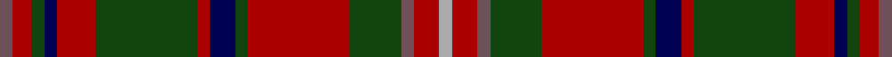

This page is one **sett** — a single exact thread-count. It belongs to the [tartan](/setts/n2r3dg2db2r6dg16r2db4dg2r16dg8n2r4lr2/)
(the same proportion at any scale), whose colour order is pattern [BRGBRGRBGRGBRY](/stripes/brgbrgrbgrgbry/).

Part of the [MacKinnon](/tartans/mackinnon/) tartan — the named design grouping this sett with its other cloths.

Sourced from weddslist.  It is a [14 stripe tartan](/stripes/stripes14/).

Original link http://www.weddslist.com/cgi-bin/tartans/pg.pl?source=tinsel

## Also known as

This cloth is also recorded under:

- MacKinnon #4
- MacKinnon #5
- MacKinnon #8
- MacKinnon #9
- MacKinnon 5
- MacKinnon Black

## Thread count
N/4 DR6 DG4 DB4 DR12 DG32 DR4 DB8 DG4 DR32 DG16 N4 DR8 Na/4

One full sett is **276 threads**.

## Palette

Palette: <strong>custom</strong>
<table><thead><tr><th>Colour</th><th>Threads</th><th>Shade</th><th>Base</th><th>OKLCh</th></tr></thead><tbody><tr><td>N/</td><td style="text-align:right;font-variant-numeric:tabular-nums">4</td><td><code style="background-color:#6E5058;">#6E5058</code> <small style="color:#888">#6E5058</small></td><td>B <code style="background-color:#2A418A;">#2A418A</code></td><td><small style="color:#888">oklch(46.6% 0.042 1.2)</small></td></tr><tr><td>DR</td><td style="text-align:right;font-variant-numeric:tabular-nums">6</td><td><code style="background-color:#AA0000;">#AA0000</code> <small style="color:#888">#AA0000</small></td><td>R <code style="background-color:#CC0000;">#CC0000</code></td><td><small style="color:#888">oklch(46.3% 0.190 29.2)</small></td></tr><tr><td>DG</td><td style="text-align:right;font-variant-numeric:tabular-nums">4</td><td><code style="background-color:#11450D;">#11450D</code> <small style="color:#888">#11450D</small></td><td>G <code style="background-color:#006100;">#006100</code></td><td><small style="color:#888">oklch(34.4% 0.101 142.1)</small></td></tr><tr><td>DB</td><td style="text-align:right;font-variant-numeric:tabular-nums">4</td><td><code style="background-color:#000052;">#000052</code> <small style="color:#888">#000052</small></td><td>B <code style="background-color:#2A418A;">#2A418A</code></td><td><small style="color:#888">oklch(19.8% 0.137 264.1)</small></td></tr><tr><td>DR</td><td style="text-align:right;font-variant-numeric:tabular-nums">12</td><td><code style="background-color:#AA0000;">#AA0000</code> <small style="color:#888">#AA0000</small></td><td>R <code style="background-color:#CC0000;">#CC0000</code></td><td><small style="color:#888">oklch(46.3% 0.190 29.2)</small></td></tr><tr><td>DG</td><td style="text-align:right;font-variant-numeric:tabular-nums">32</td><td><code style="background-color:#11450D;">#11450D</code> <small style="color:#888">#11450D</small></td><td>G <code style="background-color:#006100;">#006100</code></td><td><small style="color:#888">oklch(34.4% 0.101 142.1)</small></td></tr><tr><td>DR</td><td style="text-align:right;font-variant-numeric:tabular-nums">4</td><td><code style="background-color:#AA0000;">#AA0000</code> <small style="color:#888">#AA0000</small></td><td>R <code style="background-color:#CC0000;">#CC0000</code></td><td><small style="color:#888">oklch(46.3% 0.190 29.2)</small></td></tr><tr><td>DB</td><td style="text-align:right;font-variant-numeric:tabular-nums">8</td><td><code style="background-color:#000052;">#000052</code> <small style="color:#888">#000052</small></td><td>B <code style="background-color:#2A418A;">#2A418A</code></td><td><small style="color:#888">oklch(19.8% 0.137 264.1)</small></td></tr><tr><td>DG</td><td style="text-align:right;font-variant-numeric:tabular-nums">4</td><td><code style="background-color:#11450D;">#11450D</code> <small style="color:#888">#11450D</small></td><td>G <code style="background-color:#006100;">#006100</code></td><td><small style="color:#888">oklch(34.4% 0.101 142.1)</small></td></tr><tr><td>DR</td><td style="text-align:right;font-variant-numeric:tabular-nums">32</td><td><code style="background-color:#AA0000;">#AA0000</code> <small style="color:#888">#AA0000</small></td><td>R <code style="background-color:#CC0000;">#CC0000</code></td><td><small style="color:#888">oklch(46.3% 0.190 29.2)</small></td></tr><tr><td>DG</td><td style="text-align:right;font-variant-numeric:tabular-nums">16</td><td><code style="background-color:#11450D;">#11450D</code> <small style="color:#888">#11450D</small></td><td>G <code style="background-color:#006100;">#006100</code></td><td><small style="color:#888">oklch(34.4% 0.101 142.1)</small></td></tr><tr><td>N</td><td style="text-align:right;font-variant-numeric:tabular-nums">4</td><td><code style="background-color:#6E5058;">#6E5058</code> <small style="color:#888">#6E5058</small></td><td>B <code style="background-color:#2A418A;">#2A418A</code></td><td><small style="color:#888">oklch(46.6% 0.042 1.2)</small></td></tr><tr><td>DR</td><td style="text-align:right;font-variant-numeric:tabular-nums">8</td><td><code style="background-color:#AA0000;">#AA0000</code> <small style="color:#888">#AA0000</small></td><td>R <code style="background-color:#CC0000;">#CC0000</code></td><td><small style="color:#888">oklch(46.3% 0.190 29.2)</small></td></tr><tr><td>Na/</td><td style="text-align:right;font-variant-numeric:tabular-nums">4</td><td><code style="background-color:#AAAAAA;">#AAAAAA</code> <small style="color:#888">#AAAAAA</small></td><td>Y <code style="background-color:#F2BF00;">#F2BF00</code></td><td><small style="color:#888">oklch(73.8% 0.000 89.9)</small></td></tr></tbody></table>

## Compared to the master

This cloth is one sett of its design; the master sett (the exemplar the design is anchored on) is below for comparison.

<figure style="margin:0"><figcaption style="color:#888;font-size:smaller">this sett</figcaption></figure>
<figure style="margin:0"><figcaption style="color:#888;font-size:smaller"><a href="/setts/dp2r3g2db2r6g16r2db4g2r16g8dp2r4w2/">master sett →</a></figcaption></figure>

## Nearest tartans

The nearest existing variants by ΔTartan distance, with this tartan at the top so the swatches line up against it.

ΔTartan

Tartan

Sett

—

<a href="/ttd/edit/#slug=n2r3dg2db2r6dg16r2db4dg2r16dg8n2r4lr2~x2">MacKinnon</a> <a class="nn-out" href="/variants/s14/n2r3dg2db2r6dg16r2db4dg2r16dg8n2r4lr2~x2/" title="open its dictionary page">↗</a>

0.00

<a href="/ttd/edit/#slug=n2r3dg2db2r6dg16r2db4dg2r16dg8n2r4lr2&amp;base=n2r3dg2db2r6dg16r2db4dg2r16dg8n2r4lr2~x2">MacKinnon</a> <a class="nn-out" href="/variants/s14/n2r3dg2db2r6dg16r2db4dg2r16dg8n2r4lr2/" title="open its dictionary page">↗</a>

0.87

<a href="/ttd/edit/#slug=w3k2dg18r2db8r18dg2r2dg2r2db2r18dg18k2~x2&amp;base=n2r3dg2db2r6dg16r2db4dg2r16dg8n2r4lr2~x2">MacGuire (Personal)</a> <a class="nn-out" href="/variants/s14/w3k2dg18r2db8r18dg2r2dg2r2db2r18dg18k2~x2/" title="open its dictionary page">↗</a>

0.90

<a href="/variants/s16/ki2r17ki2ly2ki2r8ki2y2k11y2ki5y5ki2y10r15ki2~x2/">Large (Personal)</a>

0.92

<a href="/ttd/edit/#slug=y3dg19r2dg2r2db10r17dg2r2dg2r3t2r3t3~x2&amp;base=n2r3dg2db2r6dg16r2db4dg2r16dg8n2r4lr2~x2">Manx Heritage</a> <a class="nn-out" href="/variants/s14/y3dg19r2dg2r2db10r17dg2r2dg2r3t2r3t3~x2/" title="open its dictionary page">↗</a>

0.94

<a href="/ttd/edit/#slug=dp2r3g2db2r6g16r2db4g2r16g8dp2r4w2~x2&amp;base=n2r3dg2db2r6dg16r2db4dg2r16dg8n2r4lr2~x2">MacKinnon</a> <a class="nn-out" href="/variants/s14/dp2r3g2db2r6g16r2db4g2r16g8dp2r4w2~x2/" title="open its dictionary page">↗</a>

0.97

<a href="/ttd/edit/#slug=dp2r3dg2db2r6dg16r2db4dg2r16dg8dp2r4lb2&amp;base=n2r3dg2db2r6dg16r2db4dg2r16dg8n2r4lr2~x2">MacKinnon</a> <a class="nn-out" href="/variants/s14/dp2r3dg2db2r6dg16r2db4dg2r16dg8dp2r4lb2/" title="open its dictionary page">↗</a>

1.04

<a href="/ttd/edit/#slug=db4r24dg2r3dg19ly2r2db8r2dg2w2r2~x2&amp;base=n2r3dg2db2r6dg16r2db4dg2r16dg8n2r4lr2~x2">Michael from Appin (Personal)</a> <a class="nn-out" href="/variants/s12/db4r24dg2r3dg19ly2r2db8r2dg2w2r2~x2/" title="open its dictionary page">↗</a>

1.09

<a href="/ttd/edit/#slug=k2g2r3dp18r2g6r4y2dp6r3g18r3k2g2~x2&amp;base=n2r3dg2db2r6dg16r2db4dg2r16dg8n2r4lr2~x2">MacIntyre and Glenorchy</a> <a class="nn-out" href="/variants/s14/k2g2r3dp18r2g6r4y2dp6r3g18r3k2g2~x2/" title="open its dictionary page">↗</a>

1.09

<a href="/ttd/edit/#slug=t2r3dg2db2r6dg16r2db4dg2r16dg8t2r4w2~x2&amp;base=n2r3dg2db2r6dg16r2db4dg2r16dg8n2r4lr2~x2">MacKinnon #2</a> <a class="nn-out" href="/variants/s14/t2r3dg2db2r6dg16r2db4dg2r16dg8t2r4w2~x2/" title="open its dictionary page">↗</a>

1.12

<a href="/ttd/edit/#slug=dp2r3dg2db2r6dg16r2db4dg2r16dg8dp2r4w2~x2&amp;base=n2r3dg2db2r6dg16r2db4dg2r16dg8n2r4lr2~x2">MacKinnon #8</a> <a class="nn-out" href="/variants/s14/dp2r3dg2db2r6dg16r2db4dg2r16dg8dp2r4w2~x2/" title="open its dictionary page">↗</a>

## Neighbour map

Every grey dot is one of 14360 variants placed by the first two principal components of the ΔTartan feature space (44% of its variance). Red is this tartan; blue dots are its nearest — click one to open its page.

<svg viewBox="0 0 640 380" role="img" style="max-width:100%;height:auto;border:1px solid #e0e0e0;border-radius:4px;display:block" xmlns="http://www.w3.org/2000/svg"><image href="/nn/cloud.v1.png" width="640" height="380"/><a href="/variants/s14/n2r3dg2db2r6dg16r2db4dg2r16dg8n2r4lr2/"><circle cx="240.9" cy="169.9" r="4" fill="#3465a4"><title>MacKinnon</title></circle></a><a href="/variants/s14/w3k2dg18r2db8r18dg2r2dg2r2db2r18dg18k2~x2/"><circle cx="224.9" cy="147.5" r="4" fill="#3465a4"><title>MacGuire (Personal)</title></circle></a><a href="/variants/s16/ki2r17ki2ly2ki2r8ki2y2k11y2ki5y5ki2y10r15ki2~x2/"><circle cx="213.7" cy="163.1" r="4" fill="#3465a4"><title>Large (Personal)</title></circle></a><a href="/variants/s14/y3dg19r2dg2r2db10r17dg2r2dg2r3t2r3t3~x2/"><circle cx="221.2" cy="147.1" r="4" fill="#3465a4"><title>Manx Heritage</title></circle></a><a href="/variants/s14/dp2r3g2db2r6g16r2db4g2r16g8dp2r4w2~x2/"><circle cx="220.7" cy="154.6" r="4" fill="#3465a4"><title>MacKinnon</title></circle></a><a href="/variants/s14/dp2r3dg2db2r6dg16r2db4dg2r16dg8dp2r4lb2/"><circle cx="213.9" cy="153.4" r="4" fill="#3465a4"><title>MacKinnon</title></circle></a><a href="/variants/s12/db4r24dg2r3dg19ly2r2db8r2dg2w2r2~x2/"><circle cx="270.2" cy="142.1" r="4" fill="#3465a4"><title>Michael from Appin (Personal)</title></circle></a><a href="/variants/s14/k2g2r3dp18r2g6r4y2dp6r3g18r3k2g2~x2/"><circle cx="194.0" cy="151.4" r="4" fill="#3465a4"><title>MacIntyre and Glenorchy</title></circle></a><a href="/variants/s14/t2r3dg2db2r6dg16r2db4dg2r16dg8t2r4w2~x2/"><circle cx="214.9" cy="151.3" r="4" fill="#3465a4"><title>MacKinnon #2</title></circle></a><a href="/variants/s14/dp2r3dg2db2r6dg16r2db4dg2r16dg8dp2r4w2~x2/"><circle cx="214.8" cy="150.2" r="4" fill="#3465a4"><title>MacKinnon #8</title></circle></a><circle cx="240.9" cy="169.9" r="5" fill="#c00000"/></svg>

ID: /variants/s14/n2r3dg2db2r6dg16r2db4dg2r16dg8n2r4lr2~x2/
