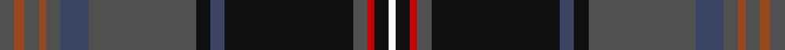

This page is one **sett** — a single exact thread-count. It belongs to the [tartan](/setts/n4o3n4o2n4dt8n30k4dt4k36n4r2k4w2/)
(the same proportion at any scale), whose colour order is pattern [BRBRBBBKBKBRKW](/stripes/brbrbbbkbkbrkw/).

Part of the [Capercaillie](/tartans/capercaillie/) tartan — the named design grouping this sett with its other cloths.

Sourced from house-of-tartan.  It is a [14 stripe tartan](/stripes/stripes14/).

Original link http://www.house-of-tartan.scotland.net/house/TartanViewjs.asp?colr=Def&tnam=6857

## Provenance

Earliest known date: 2005 RSPB Scotland will receive a 7% royalty on all products made from the new tartan, created in the colours of the world's largest woodland grouse, in a deal struck with the leading tartan weavers Lochcarron.

## Thread count
N/4 T3 N4 T2 N4 Nb8 N30 K4 Nb4 K36 N4 R2 K4 W/2

One full sett is **216 threads**.

## Palette

Palette: <strong>Tartan Register</strong> <small style="color:#888">(8 of 10 colours)</small>
<table><thead><tr><th>Colour</th><th>Threads</th><th>Shade</th><th>Base</th><th>OKLCh</th></tr></thead><tbody><tr><td>N/</td><td style="text-align:right;font-variant-numeric:tabular-nums">4</td><td><code style="background-color:#505050;">#505050</code> <small style="color:#888">#505050</small></td><td>B <code style="background-color:#2A418A;">#2A418A</code></td><td><small style="color:#888">oklch(43.1% 0.000 89.9)</small></td></tr><tr><td>T</td><td style="text-align:right;font-variant-numeric:tabular-nums">3</td><td><code style="background-color:#98481C;">#98481C</code> <small style="color:#888">#98481C</small></td><td>R <code style="background-color:#CC0000;">#CC0000</code></td><td><small style="color:#888">oklch(49.6% 0.121 46.1)</small></td></tr><tr><td>N</td><td style="text-align:right;font-variant-numeric:tabular-nums">4</td><td><code style="background-color:#505050;">#505050</code> <small style="color:#888">#505050</small></td><td>B <code style="background-color:#2A418A;">#2A418A</code></td><td><small style="color:#888">oklch(43.1% 0.000 89.9)</small></td></tr><tr><td>T</td><td style="text-align:right;font-variant-numeric:tabular-nums">2</td><td><code style="background-color:#98481C;">#98481C</code> <small style="color:#888">#98481C</small></td><td>R <code style="background-color:#CC0000;">#CC0000</code></td><td><small style="color:#888">oklch(49.6% 0.121 46.1)</small></td></tr><tr><td>N</td><td style="text-align:right;font-variant-numeric:tabular-nums">4</td><td><code style="background-color:#505050;">#505050</code> <small style="color:#888">#505050</small></td><td>B <code style="background-color:#2A418A;">#2A418A</code></td><td><small style="color:#888">oklch(43.1% 0.000 89.9)</small></td></tr><tr><td>Nb</td><td style="text-align:right;font-variant-numeric:tabular-nums">8</td><td><code style="background-color:#3C4464;">#3C4464</code> <small style="color:#888">#3C4464</small></td><td>B <code style="background-color:#2A418A;">#2A418A</code></td><td><small style="color:#888">oklch(39.4% 0.055 272.9)</small></td></tr><tr><td>N</td><td style="text-align:right;font-variant-numeric:tabular-nums">30</td><td><code style="background-color:#505050;">#505050</code> <small style="color:#888">#505050</small></td><td>B <code style="background-color:#2A418A;">#2A418A</code></td><td><small style="color:#888">oklch(43.1% 0.000 89.9)</small></td></tr><tr><td>K</td><td style="text-align:right;font-variant-numeric:tabular-nums">4</td><td><code style="background-color:#101010;">#101010</code> <small style="color:#888">#101010</small></td><td>K <code style="background-color:#000000;">#000000</code></td><td><small style="color:#888">oklch(17.3% 0.000 89.9)</small></td></tr><tr><td>Nb</td><td style="text-align:right;font-variant-numeric:tabular-nums">4</td><td><code style="background-color:#3C4464;">#3C4464</code> <small style="color:#888">#3C4464</small></td><td>B <code style="background-color:#2A418A;">#2A418A</code></td><td><small style="color:#888">oklch(39.4% 0.055 272.9)</small></td></tr><tr><td>K</td><td style="text-align:right;font-variant-numeric:tabular-nums">36</td><td><code style="background-color:#101010;">#101010</code> <small style="color:#888">#101010</small></td><td>K <code style="background-color:#000000;">#000000</code></td><td><small style="color:#888">oklch(17.3% 0.000 89.9)</small></td></tr><tr><td>N</td><td style="text-align:right;font-variant-numeric:tabular-nums">4</td><td><code style="background-color:#505050;">#505050</code> <small style="color:#888">#505050</small></td><td>B <code style="background-color:#2A418A;">#2A418A</code></td><td><small style="color:#888">oklch(43.1% 0.000 89.9)</small></td></tr><tr><td>R</td><td style="text-align:right;font-variant-numeric:tabular-nums">2</td><td><code style="background-color:#C80000;">#C80000</code> <small style="color:#888">#C80000</small></td><td>R <code style="background-color:#CC0000;">#CC0000</code></td><td><small style="color:#888">oklch(52.3% 0.215 29.2)</small></td></tr><tr><td>K</td><td style="text-align:right;font-variant-numeric:tabular-nums">4</td><td><code style="background-color:#101010;">#101010</code> <small style="color:#888">#101010</small></td><td>K <code style="background-color:#000000;">#000000</code></td><td><small style="color:#888">oklch(17.3% 0.000 89.9)</small></td></tr><tr><td>W/</td><td style="text-align:right;font-variant-numeric:tabular-nums">2</td><td><code style="background-color:#F8F8F8;">#F8F8F8</code> <small style="color:#888">#F8F8F8</small></td><td>W <code style="background-color:#F7F7F7;">#F7F7F7</code></td><td><small style="color:#888">oklch(97.9% 0.000 89.9)</small></td></tr></tbody></table>

## Compared to the master

This cloth is one sett of its design; the master sett (the exemplar the design is anchored on) is below for comparison.

<figure style="margin:0"><figcaption style="color:#888;font-size:smaller">this sett</figcaption></figure>
<figure style="margin:0"><figcaption style="color:#888;font-size:smaller"><a href="/setts/do4o3do4o2do4db8do30k4db4k36do4r2k4w2/">master sett →</a></figcaption></figure>

## Nearest tartans

The nearest existing variants by ΔTartan distance, with this tartan at the top so the swatches line up against it.

ΔTartan

Tartan

Sett

—

<a href="/ttd/edit/#slug=n4o3n4o2n4dt8n30k4dt4k36n4r2k4w2">Capercaillie Corporate Tartan</a> <a class="nn-out" href="/variants/s14/n4o3n4o2n4dt8n30k4dt4k36n4r2k4w2/" title="open its dictionary page">↗</a>

0.65

<a href="/ttd/edit/#slug=do4o3do4o2do4db8do30k4db4k36do4r2k4w2&amp;base=n4o3n4o2n4dt8n30k4dt4k36n4r2k4w2">Capercaillie</a> <a class="nn-out" href="/variants/s14/do4o3do4o2do4db8do30k4db4k36do4r2k4w2/" title="open its dictionary page">↗</a>

0.84

<a href="/ttd/edit/#slug=n10r3n32y12k5y2k4y2k17o4k2lr2~x2&amp;base=n4o3n4o2n4dt8n30k4dt4k36n4r2k4w2">Scottish Spirit Fashion Tartan</a> <a class="nn-out" href="/variants/s12/n10r3n32y12k5y2k4y2k17o4k2lr2~x2/" title="open its dictionary page">↗</a>

1.02

<a href="/ttd/edit/#slug=t3k1lo2k1db10k17db2t1dy1r1~x2&amp;base=n4o3n4o2n4dt8n30k4dt4k36n4r2k4w2">Six Frigates (US)</a> <a class="nn-out" href="/variants/s10/t3k1lo2k1db10k17db2t1dy1r1~x2/" title="open its dictionary page">↗</a>

1.05

<a href="/ttd/edit/#slug=dt38n8db3dt20n42k2g6k2n2dp3n2w2db10n2k6&amp;base=n4o3n4o2n4dt8n30k4dt4k36n4r2k4w2">Causeway, The (District)</a> <a class="nn-out" href="/variants/s15/dt38n8db3dt20n42k2g6k2n2dp3n2w2db10n2k6/" title="open its dictionary page">↗</a>

1.12

<a href="/ttd/edit/#slug=dg55y20w2y3k2y3w2y3db18k2y4ly2y3~x2&amp;base=n4o3n4o2n4dt8n30k4dt4k36n4r2k4w2">Knox (Personal)</a> <a class="nn-out" href="/variants/s13/dg55y20w2y3k2y3w2y3db18k2y4ly2y3~x2/" title="open its dictionary page">↗</a>

1.13

<a href="/ttd/edit/#slug=dg4r1dg1r3dg16k12r1db27lb2db3lb1ly2~x2&amp;base=n4o3n4o2n4dt8n30k4dt4k36n4r2k4w2">McGuirk (2013)</a> <a class="nn-out" href="/variants/s12/dg4r1dg1r3dg16k12r1db27lb2db3lb1ly2~x2/" title="open its dictionary page">↗</a>

1.14

<a href="/ttd/edit/#slug=g1dt28k11r5w1r5k11lr1k2g1~x2&amp;base=n4o3n4o2n4dt8n30k4dt4k36n4r2k4w2">Scragg Moran (Personal)</a> <a class="nn-out" href="/variants/s10/g1dt28k11r5w1r5k11lr1k2g1~x2/" title="open its dictionary page">↗</a>

1.14

<a href="/ttd/edit/#slug=dg5r4m1db36r4dg15r8y1db15r4dg36r4ri1db5y1~x2&amp;base=n4o3n4o2n4dt8n30k4dt4k36n4r2k4w2">Glen Orchy (Fashion)</a> <a class="nn-out" href="/variants/s15/dg5r4m1db36r4dg15r8y1db15r4dg36r4ri1db5y1~x2/" title="open its dictionary page">↗</a>

1.17

<a href="/ttd/edit/#slug=db2r2db2r2db20k24dg12ly1k2dg2t2~x2&amp;base=n4o3n4o2n4dt8n30k4dt4k36n4r2k4w2">Unidentified #7</a> <a class="nn-out" href="/variants/s11/db2r2db2r2db20k24dg12ly1k2dg2t2~x2/" title="open its dictionary page">↗</a>

1.17

<a href="/ttd/edit/#slug=r2ly2db3dg30t8db3t2db3t2db16lb2~x2&amp;base=n4o3n4o2n4dt8n30k4dt4k36n4r2k4w2">San Diego, The</a> <a class="nn-out" href="/variants/s11/r2ly2db3dg30t8db3t2db3t2db16lb2~x2/" title="open its dictionary page">↗</a>

## Neighbour map

Every grey dot is one of 14360 variants placed by the first two principal components of the ΔTartan feature space (44% of its variance). Red is this tartan; blue dots are its nearest — click one to open its page.

<svg viewBox="0 0 640 380" role="img" style="max-width:100%;height:auto;border:1px solid #e0e0e0;border-radius:4px;display:block" xmlns="http://www.w3.org/2000/svg"><image href="/nn/cloud.v1.png" width="640" height="380"/><a href="/variants/s14/do4o3do4o2do4db8do30k4db4k36do4r2k4w2/"><circle cx="285.8" cy="126.9" r="4" fill="#3465a4"><title>Capercaillie</title></circle></a><a href="/variants/s12/n10r3n32y12k5y2k4y2k17o4k2lr2~x2/"><circle cx="259.5" cy="143.5" r="4" fill="#3465a4"><title>Scottish Spirit Fashion Tartan</title></circle></a><a href="/variants/s10/t3k1lo2k1db10k17db2t1dy1r1~x2/"><circle cx="296.9" cy="137.6" r="4" fill="#3465a4"><title>Six Frigates (US)</title></circle></a><a href="/variants/s15/dt38n8db3dt20n42k2g6k2n2dp3n2w2db10n2k6/"><circle cx="243.9" cy="100.9" r="4" fill="#3465a4"><title>Causeway, The (District)</title></circle></a><a href="/variants/s13/dg55y20w2y3k2y3w2y3db18k2y4ly2y3~x2/"><circle cx="306.6" cy="94.4" r="4" fill="#3465a4"><title>Knox (Personal)</title></circle></a><a href="/variants/s12/dg4r1dg1r3dg16k12r1db27lb2db3lb1ly2~x2/"><circle cx="257.3" cy="112.4" r="4" fill="#3465a4"><title>McGuirk (2013)</title></circle></a><a href="/variants/s10/g1dt28k11r5w1r5k11lr1k2g1~x2/"><circle cx="276.2" cy="116.5" r="4" fill="#3465a4"><title>Scragg Moran (Personal)</title></circle></a><a href="/variants/s15/dg5r4m1db36r4dg15r8y1db15r4dg36r4ri1db5y1~x2/"><circle cx="287.4" cy="97.1" r="4" fill="#3465a4"><title>Glen Orchy (Fashion)</title></circle></a><a href="/variants/s11/db2r2db2r2db20k24dg12ly1k2dg2t2~x2/"><circle cx="232.5" cy="118.8" r="4" fill="#3465a4"><title>Unidentified #7</title></circle></a><a href="/variants/s11/r2ly2db3dg30t8db3t2db3t2db16lb2~x2/"><circle cx="232.8" cy="131.6" r="4" fill="#3465a4"><title>San Diego, The</title></circle></a><circle cx="269.8" cy="119.0" r="5" fill="#c00000"/></svg>

ID: /variants/s14/n4o3n4o2n4dt8n30k4dt4k36n4r2k4w2/
