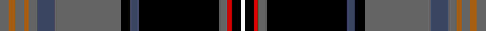
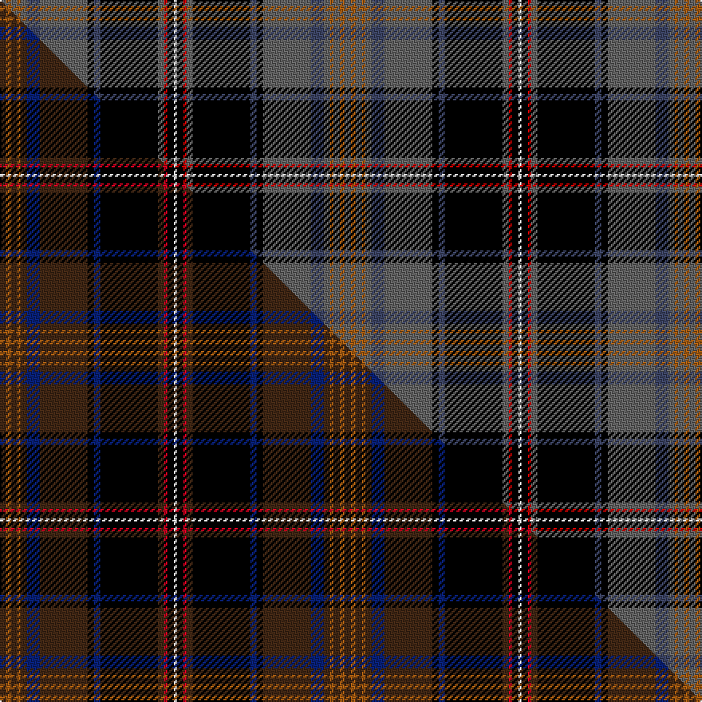

This page is one **sett** — a single exact thread-count. It belongs to the [tartan](/setts/n4o3n4o2n4dt8n30k4dt4k36n4r2k4w2/)
(the same proportion at any scale), whose colour order is pattern [BRBRBBBKBKBRKW](/stripes/brbrbbbkbkbrkw/).

Part of the [Capercaillie](/tartans/capercaillie/) tartan — the named design grouping this sett with its other cloths.

Sourced from house-of-tartan.  It is a [14 stripe tartan](/stripes/stripes14/).

Original link http://www.house-of-tartan.scotland.net/house/TartanViewjs.asp?colr=Def&tnam=6857

## Provenance

Earliest known date: 2005 RSPB Scotland will receive a 7% royalty on all products made from the new tartan, created in the colours of the world's largest woodland grouse, in a deal struck with the leading tartan weavers Lochcarron.

## Thread count
N/4 O3 N4 O2 N4 DT8 N30 K4 DT4 K36 N4 R2 K4 W/2

One full sett is **216 threads**.

## Palette
<table><thead><tr><th>Colour</th><th>Shade</th><th>OKLCh</th></tr></thead><tbody><tr><td>DB</td><td><code style="background-color:#2C2C80;">#2C2C80</code> <small style="color:#888">#2C2C80</small></td><td><small style="color:#888">oklch(35.0% 0.138 276.6)</small></td></tr><tr><td>R</td><td><code style="background-color:#A00000;">#A00000</code> <small style="color:#888">#A00000</small></td><td><small style="color:#888">oklch(44.3% 0.182 29.2)</small></td></tr><tr><td>K</td><td><code style="background-color:#000000;">#000000</code> <small style="color:#888">#000000</small></td><td><small style="color:#888">oklch(0.0% 0.000 0.0)</small></td></tr><tr><td>N</td><td><code style="background-color:#636363;">#636363</code> <small style="color:#888">#636363</small></td><td><small style="color:#888">oklch(50.0% 0.000 89.9)</small></td></tr><tr><td>DT</td><td><code style="background-color:#023535;">#023535</code> <small style="color:#888">#023535</small></td><td><small style="color:#888">oklch(29.8% 0.050 194.8)</small></td></tr><tr><td>DT</td><td><code style="background-color:#3C4464;">#3C4464</code> <small style="color:#888">#3C4464</small></td><td><small style="color:#888">oklch(39.4% 0.055 272.9)</small></td></tr><tr><td>R</td><td><code style="background-color:#C80000;">#C80000</code> <small style="color:#888">#C80000</small></td><td><small style="color:#888">oklch(52.3% 0.215 29.2)</small></td></tr><tr><td>O</td><td><code style="background-color:#A65C11;">#A65C11</code> <small style="color:#888">#A65C11</small></td><td><small style="color:#888">oklch(55.0% 0.125 58.3)</small></td></tr><tr><td>DO</td><td><code style="background-color:#412714;">#412714</code> <small style="color:#888">#412714</small></td><td><small style="color:#888">oklch(30.1% 0.050 55.7)</small></td></tr><tr><td>W</td><td><code style="background-color:#F7F7F7;">#F7F7F7</code> <small style="color:#888">#F7F7F7</small></td><td><small style="color:#888">oklch(97.6% 0.000 89.9)</small></td></tr></tbody></table>

# Sample pattern

## Compared to the master

This cloth is one sett of its design; the master sett (the exemplar the design is anchored on) is below for comparison.

Its **ΔTartan distance** from the master is **2.33** — the same measure the nearest-tartans table ranks by (0 is identical; a re-scale of the same cloth is near 0, a recolour or a different proportion further).

<figure class="master-compare" style="margin:0">

this sett
master sett ★

<figcaption style="color:#888;font-size:smaller">One weave of this sett against the <a href="/setts/do4o3do4o2do4db8do30k4db4k36do4r2k4w2/">master sett ★</a>, split on the diagonal: a shared proportion runs seamlessly across it with only the shades shifting; a different proportion breaks on it.</figcaption>
</figure>

## Nearest tartan variants

The nearest existing variants by ΔTartan distance, with this cloth at the top so the swatches line up against it.

ΔTartan

Threads

Variant

Sett

—

216

<a href="/variants/s14/n4o3n4o2n4dt8n30k4dt4k36n4r2k4w2~dt1602277-r2109032/">Capercaillie Corporate Tartan</a>

<a href="/ttd/edit/#slug=dt10r3dt32y12k5y2k4y2k17o4k2lb2~x2~dt1600000-y2200000&amp;base=n4o3n4o2n4dt8n30k4dt4k36n4r2k4w2~dt1602277-r2109032" title="compare in the TTD">1.91</a>

356

<a href="/variants/s12/dt10r3dt32y12k5y2k4y2k17o4k2lb2~x2~dt1600000-y2200000/">Scottish Spirit Fashion Tartan</a>

<a href="/ttd/edit/#slug=dt9r3dt32n12k5n2k4n2k17dp4k2lb2~x2~dt1700000&amp;base=n4o3n4o2n4dt8n30k4dt4k36n4r2k4w2~dt1602277-r2109032" title="compare in the TTD">2.18</a>

354

<a href="/variants/s12/ni9r3ni32n12k5n2k4n2k17dp4k2lb2~x2~ni1700000/">Scottish Spirit</a>

<a href="/ttd/edit/#slug=do4o3do4o2do4db8do30k4db4k36do4r2k4w2&amp;base=n4o3n4o2n4dt8n30k4dt4k36n4r2k4w2~dt1602277-r2109032" title="compare in the TTD">2.31</a>

216

<a href="/variants/s14/do4o3do4o2do4db8do30k4db4k36do4r2k4w2/">Capercaillie (Corporate)</a>

<a href="/ttd/edit/#slug=do4o3do4o2do4db8do30k4db4k36do4r2k4w2~r2109032&amp;base=n4o3n4o2n4dt8n30k4dt4k36n4r2k4w2~dt1602277-r2109032" title="compare in the TTD">2.34</a>

216

<a href="/variants/s14/do4o3do4o2do4db8do30k4db4k36do4r2k4w2~r2109032/">Capercaillie</a>

<a href="/ttd/edit/#slug=k56dt3lb6dt3w3dt3db6dt26t6dt3w3dt3db3dt3lb6~dt1102249-db1605267-t2003208&amp;base=n4o3n4o2n4dt8n30k4dt4k36n4r2k4w2~dt1602277-r2109032" title="compare in the TTD">2.38</a>

204

<a href="/variants/s15/k56dt3lb6dt3w3dt3db6dt26t6dt3w3dt3db3dt3lb6~dt1102249-db1605267-t2003208/">AIS Group</a>

<a href="/ttd/edit/#slug=k2r2k15lb2k4lb2n9dt27w2~x2~n1800000-dt1200000&amp;base=n4o3n4o2n4dt8n30k4dt4k36n4r2k4w2~dt1602277-r2109032" title="compare in the TTD">2.50</a>

252

<a href="/variants/s9/k2r2k15lb2k4lb2n9dt27w2~x2~n1800000-dt1200000/">Real Mary King's Close, The</a>

<a href="/ttd/edit/#slug=r8g2k2ly2k2y2k2g18db2g2db29k3~x2&amp;base=n4o3n4o2n4dt8n30k4dt4k36n4r2k4w2~dt1602277-r2109032" title="compare in the TTD">2.52</a>

274

<a href="/variants/s12/r8g2k2ly2k2y2k2g18db2g2db29k3~x2/">Cats Winter (Fashion)</a>

<a href="/ttd/edit/#slug=r4dg2y2dg24k2dg3k3dg3k10b10w2b4~x2&amp;base=n4o3n4o2n4dt8n30k4dt4k36n4r2k4w2~dt1602277-r2109032" title="compare in the TTD">2.59</a>

260

<a href="/variants/s12/r4dg2y2dg24k2dg3k3dg3k10b10w2b4~x2/">Kerby, from the Tennessee Cumberland Basin</a>

<a href="/ttd/edit/#slug=k2y2k24y2k2y2dy30lr3g2r2~x2&amp;base=n4o3n4o2n4dt8n30k4dt4k36n4r2k4w2~dt1602277-r2109032" title="compare in the TTD">2.61</a>

276

<a href="/variants/s10/k2y2k24y2k2y2dy30lr3g2r2~x2/">Spotsylvania County, Sherrif's Office of</a>

<a href="/ttd/edit/#slug=db2r2db2r2db20k24g12y1k2g2lb2~x2&amp;base=n4o3n4o2n4dt8n30k4dt4k36n4r2k4w2~dt1602277-r2109032" title="compare in the TTD">2.62</a>

276

<a href="/variants/s11/db2r2db2r2db20k24g12y1k2g2lb2~x2/">Unidentified #7</a>

## Neighbour map

Every grey dot is one of 13620 variants placed by the first two principal components of the ΔTartan feature space (42% of its variance). Red is this tartan; blue dots are its nearest — click one to open its page.

<svg viewBox="0 0 640 380" role="img" style="max-width:100%;height:auto;border:1px solid #e0e0e0;border-radius:4px;display:block" xmlns="http://www.w3.org/2000/svg"><image href="/nn/cloud.v1.png" width="640" height="380"/><a href="/variants/s12/dt10r3dt32y12k5y2k4y2k17o4k2lb2~x2~dt1600000-y2200000/"><circle cx="186.3" cy="104.9" r="4" fill="#3465a4"><title>Scottish Spirit Fashion Tartan</title></circle></a><a href="/variants/s12/ni9r3ni32n12k5n2k4n2k17dp4k2lb2~x2~ni1700000/"><circle cx="197.3" cy="111.1" r="4" fill="#3465a4"><title>Scottish Spirit</title></circle></a><a href="/variants/s14/do4o3do4o2do4db8do30k4db4k36do4r2k4w2/"><circle cx="214.8" cy="85.4" r="4" fill="#3465a4"><title>Capercaillie (Corporate)</title></circle></a><a href="/variants/s14/do4o3do4o2do4db8do30k4db4k36do4r2k4w2~r2109032/"><circle cx="215.5" cy="85.7" r="4" fill="#3465a4"><title>Capercaillie</title></circle></a><a href="/variants/s15/k56dt3lb6dt3w3dt3db6dt26t6dt3w3dt3db3dt3lb6~dt1102249-db1605267-t2003208/"><circle cx="180.7" cy="65.1" r="4" fill="#3465a4"><title>AIS Group</title></circle></a><a href="/variants/s9/k2r2k15lb2k4lb2n9dt27w2~x2~n1800000-dt1200000/"><circle cx="168.1" cy="116.2" r="4" fill="#3465a4"><title>Real Mary King's Close, The</title></circle></a><a href="/variants/s12/r8g2k2ly2k2y2k2g18db2g2db29k3~x2/"><circle cx="167.5" cy="94.9" r="4" fill="#3465a4"><title>Cats Winter (Fashion)</title></circle></a><a href="/variants/s12/r4dg2y2dg24k2dg3k3dg3k10b10w2b4~x2/"><circle cx="172.7" cy="117.9" r="4" fill="#3465a4"><title>Kerby, from the Tennessee Cumberland Basin</title></circle></a><a href="/variants/s10/k2y2k24y2k2y2dy30lr3g2r2~x2/"><circle cx="207.5" cy="94.7" r="4" fill="#3465a4"><title>Spotsylvania County, Sherrif's Office of</title></circle></a><a href="/variants/s11/db2r2db2r2db20k24g12y1k2g2lb2~x2/"><circle cx="160.5" cy="85.2" r="4" fill="#3465a4"><title>Unidentified #7</title></circle></a><circle cx="185.4" cy="77.8" r="5" fill="#c00000"/><text x="320" y="376" text-anchor="middle" font-size="11" fill="#999">ground</text><text x="11" y="190" text-anchor="middle" font-size="11" fill="#999" transform="rotate(-90 11 190)">complexity</text></svg>

ID: /variants/s14/n4o3n4o2n4dt8n30k4dt4k36n4r2k4w2~dt1602277-r2109032/
