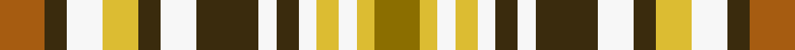

This is one **variant** — a specific cloth: this exact thread count and colourway, with its own
provenance below. It is one weaving of the [sett](/setts/o10dy5w8ly8dy5w8dy14w4dy5w4ly5w4ly4y10/) (the scale-free proportion — the
same cloth at any scale or shade), whose colour order is pattern [GYWYWGWGWGYWGR](/stripes/gywywgwgwgywgr/).

Part of the [Glen Forest](/tartans/g/gl/glen-forest/) tartan — the named design grouping this sett with its other cloths.

Sourced from register-of-tartans.  It is a [14 stripe tartan](/stripes/stripes14/).

Original link [https://www.tartanregister.gov.uk/tartanDetails.aspx?ref=1380](https://www.tartanregister.gov.uk/tartanDetails.aspx?ref=1380)

2 attestations — the source records this cloth was collapsed from (oldest owns this page)

<ul>
<li>01/01/1972 — Glen Forest (register-of-tartans, <a href="https://www.tartanregister.gov.uk/tartanDetails.aspx?ref=1380">record</a>)  <em>From Highland Queen Sportswear of 196 Spadina Avenue Toronto in 1972. Woven sample.</em></li>
<li>1972 — Glen Forest (Fashion) (tartans-authority, <a href="https://www.tartanregister.gov.uk/tartanDetails.aspx?ref=5010">record</a>)  <em>From Highland Queen Sportswear of 196 Spadina Avenue Toronto in 1972. Woven sample.</em></li>
</ul>

Dataset <small>— provenance for this record, inherited from the source manifest</small>

<dl class="dataset-prov">
<dt>source</dt><dd><a href="/sources/register-of-tartans/">Scottish Register of Tartans</a></dd>
<dt>data captured from</dt><dd><a href="https://github.com/thetartan/tartan-database/blob/master/data/register-of-tartans/data.csv">https://github.com/thetartan/tartan-database/blob/master/data/register-of-tartans/data.csv</a></dd>
<dt>data date</dt><dd>1972 <small>(this record)</small></dd>
<dt>licence</dt><dd><a href="https://www.tartanregister.gov.uk/copyright">Crown copyright</a></dd>
</dl>

Capture chain <small>— the hands this data passed through, oldest first; each capture carries its own licence</small>

<ol class="capture-chain">
<li><a href="https://www.tartanregister.gov.uk/">Scottish Register of Tartans</a> · <a href="https://www.tartanregister.gov.uk/copyright">Crown copyright</a> <small>the living register — still published by National Records of Scotland</small></li>
<li><a href="https://github.com/thetartan/tartan-database">thetartan/tartan-database</a> <small>2016-2017</small> · <a href="https://creativecommons.org/licenses/by-nc-nd/4.0/">CC BY-NC-ND 4.0</a> <small>Levko Kravets's frozen compilation — the capture we vendored, and where its CC licence text came from</small></li>
<li>this dictionary <small>captured 2026-06-10 · commit 5bf86c7566</small> <small>each re-capture is a git commit to data/sources</small></li>
</ol>

## Register references

External register numbers recorded for this tartan.

- Scottish Register of Tartans: [1380](https://www.tartanregister.gov.uk/tartanDetails.aspx?ref=1380)
- Scottish Tartans Authority (ITI): 5010

## Thread count
O/10 DY5 W8 LY8 DY5 W8 DY14 W4 DY5 W4 LY5 W4 LY4 Y/10

One full sett is **168 threads**.

## Palette
<table><thead><tr><th>Colour</th><th>Shade</th><th>OKLCh</th></tr></thead><tbody><tr><td>O</td><td><code style="background-color:#A65C11;">#A65C11</code> <small style="color:#888">#A65C11</small></td><td><small style="color:#888">oklch(55.0% 0.125 58.3)</small></td></tr><tr><td>W</td><td><code style="background-color:#F7F7F7;">#F7F7F7</code> <small style="color:#888">#F7F7F7</small></td><td><small style="color:#888">oklch(97.6% 0.000 89.9)</small></td></tr><tr><td>LY</td><td><code style="background-color:#DCBC32;">#DCBC32</code> <small style="color:#888">#DCBC32</small></td><td><small style="color:#888">oklch(80.0% 0.150 95.2)</small></td></tr><tr><td>DY</td><td><code style="background-color:#3A2B0D;">#3A2B0D</code> <small style="color:#888">#3A2B0D</small></td><td><small style="color:#888">oklch(30.0% 0.049 82.0)</small></td></tr><tr><td>Y</td><td><code style="background-color:#8B6E00;">#8B6E00</code> <small style="color:#888">#8B6E00</small></td><td><small style="color:#888">oklch(55.1% 0.113 90.4)</small></td></tr></tbody></table>

# Sample pattern

## Nearest tartan variants

The nearest existing variants by ΔTartan distance, with this cloth at the top so the swatches line up against it.

ΔTartan

Threads

Variant

Sett

—

168

<a href="/variants/s14/o10dy5w8ly8dy5w8dy14w4dy5w4ly5w4ly4y10/">Glen Forest</a>

<a href="/ttd/edit/#slug=r2lr2dt2lo2lr6g3dt3lo4lr2dt3g2lr2r2~x2~lr3301060-dt1300000&amp;base=o10dy5w8ly8dy5w8dy14w4dy5w4ly5w4ly4y10" title="compare in the TTD">2.12</a>

132

<a href="/variants/s13/r2lr2dt2lo2lr6g3dt3lo4lr2dt3g2lr2r2~x2~lr3301060-dt1300000/">Callanish, The</a>

<a href="/ttd/edit/#slug=r3db6g5db1g1db3y6w6y2w6r2~x2&amp;base=o10dy5w8ly8dy5w8dy14w4dy5w4ly5w4ly4y10" title="compare in the TTD">3.40</a>

154

<a href="/variants/s11/r3db6g5db1g1db3y6w6y2w6r2~x2/">Canice-Moodie (Personal)</a>

<a href="/ttd/edit/#slug=lb3g1lb1g5r2do4lb3g2w1lb1y1g1do2r2y1~x4&amp;base=o10dy5w8ly8dy5w8dy14w4dy5w4ly5w4ly4y10" title="compare in the TTD">3.62</a>

224

<a href="/variants/s15/lb3g1lb1g5r2do4lb3g2w1lb1y1g1do2r2y1~x4/">Highlands of Haliburton (District)</a>

<a href="/ttd/edit/#slug=w5g4lb1g4r4lb1dg4dy1~x6&amp;base=o10dy5w8ly8dy5w8dy14w4dy5w4ly5w4ly4y10" title="compare in the TTD">3.78</a>

252

<a href="/variants/s8/w5g4lb1g4r4lb1dg4dy1~x6/">Devon Rural Skills Trust</a>

<a href="/ttd/edit/#slug=n8lg7r5w2k2w2k2w2k2w2k2w2r5lg7n8g8~x4&amp;base=o10dy5w8ly8dy5w8dy14w4dy5w4ly5w4ly4y10" title="compare in the TTD">3.80</a>

464

<a href="/variants/s16/n8lg7r5w2k2w2k2w2k2w2k2w2r5lg7n8g8~x4/">Somerset</a>

<a href="/ttd/edit/#slug=k2w1ly6r6w1k2w2ki3w2k1w2g3w2~x4~k0700000-ki0803038&amp;base=o10dy5w8ly8dy5w8dy14w4dy5w4ly5w4ly4y10" title="compare in the TTD">3.83</a>

248

<a href="/variants/s13/k2w1ly6r6w1k2w2ki3w2k1w2g3w2~x4~k0700000-ki0803038/">Hovington (2014)</a>

<a href="/ttd/edit/#slug=w5g4b1g4r4b1dg4y1~x2~g2104115-dg1304144&amp;base=o10dy5w8ly8dy5w8dy14w4dy5w4ly5w4ly4y10" title="compare in the TTD">3.84</a>

84

<a href="/variants/s8/w5g4b1g4r4b1dg4y1~x2~g2104115-dg1304144/">Devon Rural Skills Trust</a>

<a href="/ttd/edit/#slug=g4w2r2lb3db3do2db2do2g2do2g3do2g8do6w8lb2~x2&amp;base=o10dy5w8ly8dy5w8dy14w4dy5w4ly5w4ly4y10" title="compare in the TTD">3.96</a>

200

<a href="/variants/s16/g4w2r2lb3db3do2db2do2g2do2g3do2g8do6w8lb2~x2/">Missouri Dress (Proposed) (District)</a>

## Neighbour map

Every grey dot is one of 13621 variants placed by the first two principal components of the ΔTartan feature space (42% of its variance). Red is this tartan; blue dots are its nearest — click one to open its page. The map is a flat projection of a many-dimensional space — [how to read it](/posts/neighbourhood-maps/).

<svg viewBox="0 0 640 380" role="img" style="max-width:100%;height:auto;border:1px solid #e0e0e0;border-radius:4px;display:block" xmlns="http://www.w3.org/2000/svg"><image href="/nn/cloud.v1.png" width="640" height="380"/><a href="/variants/s13/r2lr2dt2lo2lr6g3dt3lo4lr2dt3g2lr2r2~x2~lr3301060-dt1300000/"><circle cx="68.4" cy="262.8" r="4" fill="#3465a4"><title>Callanish, The</title></circle></a><a href="/variants/s11/r3db6g5db1g1db3y6w6y2w6r2~x2/"><circle cx="54.3" cy="221.1" r="4" fill="#3465a4"><title>Canice-Moodie (Personal)</title></circle></a><a href="/variants/s15/lb3g1lb1g5r2do4lb3g2w1lb1y1g1do2r2y1~x4/"><circle cx="69.8" cy="207.8" r="4" fill="#3465a4"><title>Highlands of Haliburton (District)</title></circle></a><a href="/variants/s8/w5g4lb1g4r4lb1dg4dy1~x6/"><circle cx="62.1" cy="235.0" r="4" fill="#3465a4"><title>Devon Rural Skills Trust</title></circle></a><a href="/variants/s16/n8lg7r5w2k2w2k2w2k2w2k2w2r5lg7n8g8~x4/"><circle cx="14.0" cy="194.4" r="4" fill="#3465a4"><title>Somerset</title></circle></a><a href="/variants/s13/k2w1ly6r6w1k2w2ki3w2k1w2g3w2~x4~k0700000-ki0803038/"><circle cx="22.4" cy="179.3" r="4" fill="#3465a4"><title>Hovington (2014)</title></circle></a><a href="/variants/s8/w5g4b1g4r4b1dg4y1~x2~g2104115-dg1304144/"><circle cx="75.0" cy="235.7" r="4" fill="#3465a4"><title>Devon Rural Skills Trust</title></circle></a><a href="/variants/s16/g4w2r2lb3db3do2db2do2g2do2g3do2g8do6w8lb2~x2/"><circle cx="50.6" cy="210.4" r="4" fill="#3465a4"><title>Missouri Dress (Proposed) (District)</title></circle></a><circle cx="40.0" cy="247.5" r="5" fill="#c00000"/><text x="320" y="376" text-anchor="middle" font-size="11" fill="#999">ground</text><text x="11" y="190" text-anchor="middle" font-size="11" fill="#999" transform="rotate(-90 11 190)">complexity</text></svg>

ID: /variants/s14/o10dy5w8ly8dy5w8dy14w4dy5w4ly5w4ly4y10/
