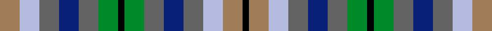

This page is one **sett** — a single exact thread-count. It belongs to the [tartan](/setts/o3lb3n3db3n3g3k1g3n3db3n3lb3o3k1/)
(the same proportion at any scale), whose colour order is pattern [KRWBBBGKGBBBWR](/stripes/krwbbbgkgbbbwr/).

Sourced from register-of-tartans.  It is a [14 stripe tartan](/stripes/stripes14/).

Original link https://www.tartanregister.gov.uk/tartanDetails.aspx?ref=3961

## Register references

External register numbers recorded for this tartan.

- Scottish Register of Tartans: [3961](https://www.tartanregister.gov.uk/tartanDetails.aspx?ref=3961)
- Scottish Tartans Authority (ITI): 2367
- Scottish Tartans World Register: 2367

## Thread count
O/12 LB12 N12 DB12 N12 G12 K4 G12 N12 DB12 N12 LB12 O12 K/4

One full sett is **288 threads**.

## Palette
<table><thead><tr><th>Colour</th><th>Shade</th><th>OKLCh</th></tr></thead><tbody><tr><td>DB</td><td><code style="background-color:#082077;">#082077</code> <small style="color:#888">#082077</small></td><td><small style="color:#888">oklch(30.0% 0.149 265.1)</small></td></tr><tr><td>O</td><td><code style="background-color:#B84C00;">#B84C00</code> <small style="color:#888">#B84C00</small></td><td><small style="color:#888">oklch(55.1% 0.156 45.5)</small></td></tr><tr><td>LO</td><td><code style="background-color:#FF9C34;">#FF9C34</code> <small style="color:#888">#FF9C34</small></td><td><small style="color:#888">oklch(77.9% 0.161 61.8)</small></td></tr><tr><td>G</td><td><code style="background-color:#008B2A;">#008B2A</code> <small style="color:#888">#008B2A</small></td><td><small style="color:#888">oklch(55.4% 0.170 145.9)</small></td></tr><tr><td>K</td><td><code style="background-color:#000000;">#000000</code> <small style="color:#888">#000000</small></td><td><small style="color:#888">oklch(0.0% 0.000 0.0)</small></td></tr><tr><td>LY</td><td><code style="background-color:#DCBC32;">#DCBC32</code> <small style="color:#888">#DCBC32</small></td><td><small style="color:#888">oklch(80.0% 0.150 95.2)</small></td></tr><tr><td>W</td><td><code style="background-color:#F7F7F7;">#F7F7F7</code> <small style="color:#888">#F7F7F7</small></td><td><small style="color:#888">oklch(97.6% 0.000 89.9)</small></td></tr><tr><td>O</td><td><code style="background-color:#A07C58;">#A07C58</code> <small style="color:#888">#A07C58</small></td><td><small style="color:#888">oklch(61.2% 0.067 66.0)</small></td></tr><tr><td>N</td><td><code style="background-color:#636363;">#636363</code> <small style="color:#888">#636363</small></td><td><small style="color:#888">oklch(50.0% 0.000 89.9)</small></td></tr><tr><td>LB</td><td><code style="background-color:#B5BBDE;">#B5BBDE</code> <small style="color:#888">#B5BBDE</small></td><td><small style="color:#888">oklch(79.9% 0.050 277.6)</small></td></tr></tbody></table>

# Sample pattern

## Nearest tartan variants

The nearest existing variants by ΔTartan distance, with this cloth at the top so the swatches line up against it.

ΔTartan

Threads

Variant

Sett

—

288

<a href="/variants/s14/o3lb3n3db3n3g3k1g3n3db3n3lb3o3k1~x4~o2403057/">Stewarton (Personal)</a>

<a href="/ttd/edit/#slug=k1o3lb3n3db3n3g3k1~x4&amp;base=o3lb3n3db3n3g3k1g3n3db3n3lb3o3k1~x4~o2403057" title="compare in the TTD">3.12</a>

152

<a href="/variants/s8/k1o3lb3n3db3n3g3k1~x4/">Stewarton (Fashion)</a>

<a href="/ttd/edit/#slug=dt3k1dt3n3g4r1g4n3dt3k1dt3db2~x8~dt1204274-db1406275&amp;base=o3lb3n3db3n3g3k1g3n3db3n3lb3o3k1~x4~o2403057" title="compare in the TTD">3.64</a>

456

<a href="/variants/s12/db3k1db3n3g4r1g4n3db3k1db3dbi2~x8~db1204274-dbi1406275/">New York City American District Tartan</a>

<a href="/ttd/edit/#slug=db4t8k2t5ly2t5dg8dr7dg2dr7dg3~x2~t2704230-ly3402083&amp;base=o3lb3n3db3n3g3k1g3n3db3n3lb3o3k1~x4~o2403057" title="compare in the TTD">3.83</a>

198

<a href="/variants/s11/db4t8k2t5w2t5dg8dr7dg2dr7dg3~x2~t2704230-w3402083/">DunBroch</a>

## Neighbour map

Every grey dot is one of 13620 variants placed by the first two principal components of the ΔTartan feature space (42% of its variance). Red is this tartan; blue dots are its nearest — click one to open its page.

<svg viewBox="0 0 640 380" role="img" style="max-width:100%;height:auto;border:1px solid #e0e0e0;border-radius:4px;display:block" xmlns="http://www.w3.org/2000/svg"><image href="/nn/cloud.v1.png" width="640" height="380"/><a href="/variants/s8/k1o3lb3n3db3n3g3k1~x4/"><circle cx="14.0" cy="264.7" r="4" fill="#3465a4"><title>Stewarton (Fashion)</title></circle></a><a href="/variants/s12/db3k1db3n3g4r1g4n3db3k1db3dbi2~x8~db1204274-dbi1406275/"><circle cx="91.3" cy="244.7" r="4" fill="#3465a4"><title>New York City American District Tartan</title></circle></a><a href="/variants/s11/db4t8k2t5w2t5dg8dr7dg2dr7dg3~x2~t2704230-w3402083/"><circle cx="60.6" cy="229.8" r="4" fill="#3465a4"><title>DunBroch</title></circle></a><circle cx="14.0" cy="268.6" r="5" fill="#c00000"/><text x="320" y="376" text-anchor="middle" font-size="11" fill="#999">ground</text><text x="11" y="190" text-anchor="middle" font-size="11" fill="#999" transform="rotate(-90 11 190)">complexity</text></svg>

ID: /variants/s14/o3lb3n3db3n3g3k1g3n3db3n3lb3o3k1~x4~o2403057/
