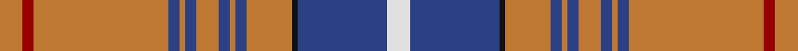

This page is one **sett** — a single exact thread-count. It belongs to the [tartan](/setts/o4r2o24db2o1db2o4db2o1db2o8k1db16w4/)
(the same proportion at any scale), whose colour order is pattern [RRRBRBRBRBRKBW](/stripes/rrrbrbrbrbrkbw/).

Sourced from register-of-tartans.  It is a [14 stripe tartan](/stripes/stripes14/).

Original link https://www.tartanregister.gov.uk/tartanDetails.aspx?ref=5938

## Register references

External register numbers recorded for this tartan.

- Scottish Register of Tartans: [5938](https://www.tartanregister.gov.uk/tartanDetails.aspx?ref=5938)
- Scottish Tartans World Register: 3217

## Thread count
DO/8 DR4 DO48 B4 DO2 B4 DO8 B4 DO2 B4 DO16 K2 B32 LN/8

One full sett is **276 threads**.

## Palette

Palette: <strong>Tartan Register</strong>
<table><thead><tr><th>Colour</th><th>Threads</th><th>Shade</th><th>Base</th><th>OKLCh</th></tr></thead><tbody><tr><td>DO/</td><td style="text-align:right;font-variant-numeric:tabular-nums">8</td><td><code style="background-color:#BE7832;">#BE7832</code> <small style="color:#888">#BE7832</small></td><td>R <code style="background-color:#CC0000;">#CC0000</code></td><td><small style="color:#888">oklch(63.5% 0.121 62.2)</small></td></tr><tr><td>DR</td><td style="text-align:right;font-variant-numeric:tabular-nums">4</td><td><code style="background-color:#960000;">#960000</code> <small style="color:#888">#960000</small></td><td>R <code style="background-color:#CC0000;">#CC0000</code></td><td><small style="color:#888">oklch(42.3% 0.173 29.2)</small></td></tr><tr><td>DO</td><td style="text-align:right;font-variant-numeric:tabular-nums">48</td><td><code style="background-color:#BE7832;">#BE7832</code> <small style="color:#888">#BE7832</small></td><td>R <code style="background-color:#CC0000;">#CC0000</code></td><td><small style="color:#888">oklch(63.5% 0.121 62.2)</small></td></tr><tr><td>B</td><td style="text-align:right;font-variant-numeric:tabular-nums">4</td><td><code style="background-color:#2C4084;">#2C4084</code> <small style="color:#888">#2C4084</small></td><td>B <code style="background-color:#2A418A;">#2A418A</code></td><td><small style="color:#888">oklch(39.4% 0.117 268.3)</small></td></tr><tr><td>DO</td><td style="text-align:right;font-variant-numeric:tabular-nums">2</td><td><code style="background-color:#BE7832;">#BE7832</code> <small style="color:#888">#BE7832</small></td><td>R <code style="background-color:#CC0000;">#CC0000</code></td><td><small style="color:#888">oklch(63.5% 0.121 62.2)</small></td></tr><tr><td>B</td><td style="text-align:right;font-variant-numeric:tabular-nums">4</td><td><code style="background-color:#2C4084;">#2C4084</code> <small style="color:#888">#2C4084</small></td><td>B <code style="background-color:#2A418A;">#2A418A</code></td><td><small style="color:#888">oklch(39.4% 0.117 268.3)</small></td></tr><tr><td>DO</td><td style="text-align:right;font-variant-numeric:tabular-nums">8</td><td><code style="background-color:#BE7832;">#BE7832</code> <small style="color:#888">#BE7832</small></td><td>R <code style="background-color:#CC0000;">#CC0000</code></td><td><small style="color:#888">oklch(63.5% 0.121 62.2)</small></td></tr><tr><td>B</td><td style="text-align:right;font-variant-numeric:tabular-nums">4</td><td><code style="background-color:#2C4084;">#2C4084</code> <small style="color:#888">#2C4084</small></td><td>B <code style="background-color:#2A418A;">#2A418A</code></td><td><small style="color:#888">oklch(39.4% 0.117 268.3)</small></td></tr><tr><td>DO</td><td style="text-align:right;font-variant-numeric:tabular-nums">2</td><td><code style="background-color:#BE7832;">#BE7832</code> <small style="color:#888">#BE7832</small></td><td>R <code style="background-color:#CC0000;">#CC0000</code></td><td><small style="color:#888">oklch(63.5% 0.121 62.2)</small></td></tr><tr><td>B</td><td style="text-align:right;font-variant-numeric:tabular-nums">4</td><td><code style="background-color:#2C4084;">#2C4084</code> <small style="color:#888">#2C4084</small></td><td>B <code style="background-color:#2A418A;">#2A418A</code></td><td><small style="color:#888">oklch(39.4% 0.117 268.3)</small></td></tr><tr><td>DO</td><td style="text-align:right;font-variant-numeric:tabular-nums">16</td><td><code style="background-color:#BE7832;">#BE7832</code> <small style="color:#888">#BE7832</small></td><td>R <code style="background-color:#CC0000;">#CC0000</code></td><td><small style="color:#888">oklch(63.5% 0.121 62.2)</small></td></tr><tr><td>K</td><td style="text-align:right;font-variant-numeric:tabular-nums">2</td><td><code style="background-color:#101010;">#101010</code> <small style="color:#888">#101010</small></td><td>K <code style="background-color:#000000;">#000000</code></td><td><small style="color:#888">oklch(17.3% 0.000 89.9)</small></td></tr><tr><td>B</td><td style="text-align:right;font-variant-numeric:tabular-nums">32</td><td><code style="background-color:#2C4084;">#2C4084</code> <small style="color:#888">#2C4084</small></td><td>B <code style="background-color:#2A418A;">#2A418A</code></td><td><small style="color:#888">oklch(39.4% 0.117 268.3)</small></td></tr><tr><td>LN/</td><td style="text-align:right;font-variant-numeric:tabular-nums">8</td><td><code style="background-color:#E0E0E0;">#E0E0E0</code> <small style="color:#888">#E0E0E0</small></td><td>W <code style="background-color:#F7F7F7;">#F7F7F7</code></td><td><small style="color:#888">oklch(90.7% 0.000 89.9)</small></td></tr></tbody></table>

## Nearest tartans

The nearest existing variants by ΔTartan distance, with this tartan at the top so the swatches line up against it.

ΔTartan

Tartan

Sett

—

<a href="/ttd/edit/#slug=o4r2o24db2o1db2o4db2o1db2o8k1db16w4~x2">New Jersey</a> <a class="nn-out" href="/variants/s14/o4r2o24db2o1db2o4db2o1db2o8k1db16w4~x2/" title="open its dictionary page">↗</a>

0.89

<a href="/ttd/edit/#slug=o40dt10y2dt2w2dt3r8o6dt2o4w2~x2&amp;base=o4r2o24db2o1db2o4db2o1db2o8k1db16w4~x2">Cavalier, Red</a> <a class="nn-out" href="/variants/s11/o40dt10y2dt2w2dt3r8o6dt2o4w2~x2/" title="open its dictionary page">↗</a>

1.06

<a href="/ttd/edit/#slug=o40dt10yi2dt2w2dt3y8o6dt2o4w2~x2&amp;base=o4r2o24db2o1db2o4db2o1db2o8k1db16w4~x2">Cavalier, Brown</a> <a class="nn-out" href="/variants/s11/o40dt10yi2dt2w2dt3y8o6dt2o4w2~x2/" title="open its dictionary page">↗</a>

1.20

<a href="/ttd/edit/#slug=o19dy2do3w1do1w1do1dy6o3do1o3w1~x4&amp;base=o4r2o24db2o1db2o4db2o1db2o8k1db16w4~x2">Glen Moy #2</a> <a class="nn-out" href="/variants/s12/o19dy2do3w1do1w1do1dy6o3do1o3w1~x4/" title="open its dictionary page">↗</a>

1.27

<a href="/ttd/edit/#slug=o34dg10o5r2k8t2w3t2k8r2o5dg10o28k3~x2&amp;base=o4r2o24db2o1db2o4db2o1db2o8k1db16w4~x2">Lambert (Front Royal) Hunting</a> <a class="nn-out" href="/variants/s14/o34dg10o5r2k8t2w3t2k8r2o5dg10o28k3~x2/" title="open its dictionary page">↗</a>

1.41

<a href="/variants/s20/o40k10oi2k2lr2k3r8o6k2o8lr2~x2/">Islay</a>

1.41

<a href="/ttd/edit/#slug=lb6r5lb9db2b3db2o36r2o4r2~x2&amp;base=o4r2o24db2o1db2o4db2o1db2o8k1db16w4~x2">Outpost Club</a> <a class="nn-out" href="/variants/s10/lb6r5lb9db2b3db2o36r2o4r2~x2/" title="open its dictionary page">↗</a>

1.44

<a href="/ttd/edit/#slug=r25k1ly2k1ly2k1r10b18w2b12~x2&amp;base=o4r2o24db2o1db2o4db2o1db2o8k1db16w4~x2">Richardson (Personal?)</a> <a class="nn-out" href="/variants/s10/r25k1ly2k1ly2k1r10b18w2b12~x2/" title="open its dictionary page">↗</a>

1.46

<a href="/ttd/edit/#slug=db19r2g3r2db2r20g1ly1r1g2r2db18r2g2r22g3w1r3~x2&amp;base=o4r2o24db2o1db2o4db2o1db2o8k1db16w4~x2">Hebridean, South Uist</a> <a class="nn-out" href="/variants/s18/db19r2g3r2db2r20g1ly1r1g2r2db18r2g2r22g3w1r3~x2/" title="open its dictionary page">↗</a>

1.46

<a href="/ttd/edit/#slug=r13w1t2r2g14r2w1t2r2db4r2t2w1r16g1r2g3~x2&amp;base=o4r2o24db2o1db2o4db2o1db2o8k1db16w4~x2">MacDonald of Lochmaddy</a> <a class="nn-out" href="/variants/s17/r13w1t2r2g14r2w1t2r2db4r2t2w1r16g1r2g3~x2/" title="open its dictionary page">↗</a>

1.46

<a href="/ttd/edit/#slug=lb4ri2lb7n30lb8n7r5k1w2~x2&amp;base=o4r2o24db2o1db2o4db2o1db2o8k1db16w4~x2">Hebridean Fire</a> <a class="nn-out" href="/variants/s9/lb4ri2lb7n30lb8n7r5k1w2~x2/" title="open its dictionary page">↗</a>

## Neighbour map

Every grey dot is one of 14360 variants placed by the first two principal components of the ΔTartan feature space (44% of its variance). Red is this tartan; blue dots are its nearest — click one to open its page.

<svg viewBox="0 0 640 380" role="img" style="max-width:100%;height:auto;border:1px solid #e0e0e0;border-radius:4px;display:block" xmlns="http://www.w3.org/2000/svg"><image href="/nn/cloud.v1.png" width="640" height="380"/><a href="/variants/s11/o40dt10y2dt2w2dt3r8o6dt2o4w2~x2/"><circle cx="369.7" cy="104.0" r="4" fill="#3465a4"><title>Cavalier, Red</title></circle></a><a href="/variants/s11/o40dt10yi2dt2w2dt3y8o6dt2o4w2~x2/"><circle cx="371.9" cy="108.3" r="4" fill="#3465a4"><title>Cavalier, Brown</title></circle></a><a href="/variants/s12/o19dy2do3w1do1w1do1dy6o3do1o3w1~x4/"><circle cx="362.3" cy="121.0" r="4" fill="#3465a4"><title>Glen Moy #2</title></circle></a><a href="/variants/s14/o34dg10o5r2k8t2w3t2k8r2o5dg10o28k3~x2/"><circle cx="299.0" cy="104.3" r="4" fill="#3465a4"><title>Lambert (Front Royal) Hunting</title></circle></a><a href="/variants/s20/o40k10oi2k2lr2k3r8o6k2o8lr2~x2/"><circle cx="287.9" cy="81.9" r="4" fill="#3465a4"><title>Islay</title></circle></a><a href="/variants/s10/lb6r5lb9db2b3db2o36r2o4r2~x2/"><circle cx="328.6" cy="104.9" r="4" fill="#3465a4"><title>Outpost Club</title></circle></a><a href="/variants/s10/r25k1ly2k1ly2k1r10b18w2b12~x2/"><circle cx="293.4" cy="109.4" r="4" fill="#3465a4"><title>Richardson (Personal?)</title></circle></a><a href="/variants/s18/db19r2g3r2db2r20g1ly1r1g2r2db18r2g2r22g3w1r3~x2/"><circle cx="325.9" cy="91.2" r="4" fill="#3465a4"><title>Hebridean, South Uist</title></circle></a><a href="/variants/s17/r13w1t2r2g14r2w1t2r2db4r2t2w1r16g1r2g3~x2/"><circle cx="309.2" cy="103.4" r="4" fill="#3465a4"><title>MacDonald of Lochmaddy</title></circle></a><a href="/variants/s9/lb4ri2lb7n30lb8n7r5k1w2~x2/"><circle cx="325.1" cy="100.1" r="4" fill="#3465a4"><title>Hebridean Fire</title></circle></a><circle cx="349.3" cy="96.3" r="5" fill="#c00000"/></svg>

ID: /variants/s14/o4r2o24db2o1db2o4db2o1db2o8k1db16w4~x2/
