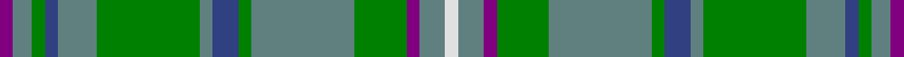

This page is one **sett** — a single exact thread-count. It belongs to the [tartan](/setts/p2y3g2db2y6g16y2db4g2y16g8p2y4w2/)
(the same proportion at any scale), whose colour order is pattern [BGGBGGGBGGGBGW](/stripes/bggbgggbgggbgw/).

Sourced from weddslist.  It is a [14 stripe tartan](/stripes/stripes14/).

Original link http://www.weddslist.com/cgi-bin/tartans/pg.pl?source=sts

## Thread count
P/4 B6 G4 Ba4 B12 G32 B4 Ba8 G4 B32 G16 P4 B8 LN/4

One full sett is **276 threads**.

## Palette

Palette: <strong>Tartan Dictionary</strong> <small style="color:#888">(1 of 5 colours)</small>
<table><thead><tr><th>Colour</th><th>Threads</th><th>Shade</th><th>Base</th><th>OKLCh</th></tr></thead><tbody><tr><td>P/</td><td style="text-align:right;font-variant-numeric:tabular-nums">4</td><td><code style="background-color:#800080;">#800080</code> <small style="color:#888">#800080</small></td><td>B <code style="background-color:#2A418A;">#2A418A</code></td><td><small style="color:#888">oklch(42.1% 0.193 328.4)</small></td></tr><tr><td>B</td><td style="text-align:right;font-variant-numeric:tabular-nums">6</td><td><code style="background-color:#608080;">#608080</code> <small style="color:#888">#608080</small></td><td>G <code style="background-color:#006100;">#006100</code></td><td><small style="color:#888">oklch(57.5% 0.036 196.2)</small></td></tr><tr><td>G</td><td style="text-align:right;font-variant-numeric:tabular-nums">4</td><td><code style="background-color:#008000;">#008000</code> <small style="color:#888">#008000</small></td><td>G <code style="background-color:#006100;">#006100</code></td><td><small style="color:#888">oklch(52.0% 0.177 142.5)</small></td></tr><tr><td>Ba</td><td style="text-align:right;font-variant-numeric:tabular-nums">4</td><td><code style="background-color:#304080;">#304080</code> <small style="color:#888">#304080</small></td><td>B <code style="background-color:#2A418A;">#2A418A</code></td><td><small style="color:#888">oklch(39.4% 0.109 270.2)</small></td></tr><tr><td>B</td><td style="text-align:right;font-variant-numeric:tabular-nums">12</td><td><code style="background-color:#608080;">#608080</code> <small style="color:#888">#608080</small></td><td>G <code style="background-color:#006100;">#006100</code></td><td><small style="color:#888">oklch(57.5% 0.036 196.2)</small></td></tr><tr><td>G</td><td style="text-align:right;font-variant-numeric:tabular-nums">32</td><td><code style="background-color:#008000;">#008000</code> <small style="color:#888">#008000</small></td><td>G <code style="background-color:#006100;">#006100</code></td><td><small style="color:#888">oklch(52.0% 0.177 142.5)</small></td></tr><tr><td>B</td><td style="text-align:right;font-variant-numeric:tabular-nums">4</td><td><code style="background-color:#608080;">#608080</code> <small style="color:#888">#608080</small></td><td>G <code style="background-color:#006100;">#006100</code></td><td><small style="color:#888">oklch(57.5% 0.036 196.2)</small></td></tr><tr><td>Ba</td><td style="text-align:right;font-variant-numeric:tabular-nums">8</td><td><code style="background-color:#304080;">#304080</code> <small style="color:#888">#304080</small></td><td>B <code style="background-color:#2A418A;">#2A418A</code></td><td><small style="color:#888">oklch(39.4% 0.109 270.2)</small></td></tr><tr><td>G</td><td style="text-align:right;font-variant-numeric:tabular-nums">4</td><td><code style="background-color:#008000;">#008000</code> <small style="color:#888">#008000</small></td><td>G <code style="background-color:#006100;">#006100</code></td><td><small style="color:#888">oklch(52.0% 0.177 142.5)</small></td></tr><tr><td>B</td><td style="text-align:right;font-variant-numeric:tabular-nums">32</td><td><code style="background-color:#608080;">#608080</code> <small style="color:#888">#608080</small></td><td>G <code style="background-color:#006100;">#006100</code></td><td><small style="color:#888">oklch(57.5% 0.036 196.2)</small></td></tr><tr><td>G</td><td style="text-align:right;font-variant-numeric:tabular-nums">16</td><td><code style="background-color:#008000;">#008000</code> <small style="color:#888">#008000</small></td><td>G <code style="background-color:#006100;">#006100</code></td><td><small style="color:#888">oklch(52.0% 0.177 142.5)</small></td></tr><tr><td>P</td><td style="text-align:right;font-variant-numeric:tabular-nums">4</td><td><code style="background-color:#800080;">#800080</code> <small style="color:#888">#800080</small></td><td>B <code style="background-color:#2A418A;">#2A418A</code></td><td><small style="color:#888">oklch(42.1% 0.193 328.4)</small></td></tr><tr><td>B</td><td style="text-align:right;font-variant-numeric:tabular-nums">8</td><td><code style="background-color:#608080;">#608080</code> <small style="color:#888">#608080</small></td><td>G <code style="background-color:#006100;">#006100</code></td><td><small style="color:#888">oklch(57.5% 0.036 196.2)</small></td></tr><tr><td>LN/</td><td style="text-align:right;font-variant-numeric:tabular-nums">4</td><td><code style="background-color:#E0E0E0;">#E0E0E0</code> <small style="color:#888">#E0E0E0</small></td><td>W <code style="background-color:#F7F7F7;">#F7F7F7</code></td><td><small style="color:#888">oklch(90.7% 0.000 89.9)</small></td></tr></tbody></table>

## Nearest tartans

The nearest existing variants by ΔTartan distance, with this tartan at the top so the swatches line up against it.

ΔTartan

Tartan

Sett

—

<a href="/ttd/edit/#slug=p2y3g2db2y6g16y2db4g2y16g8p2y4w2~x2">MacKinnon 4</a> <a class="nn-out" href="/variants/s14/p2y3g2db2y6g16y2db4g2y16g8p2y4w2~x2/" title="open its dictionary page">↗</a>

0.94

<a href="/variants/s18/g10n2w2n16g6ly2g4r2g3n6~x4/">Harkness Hunting #2</a>

1.24

<a href="/ttd/edit/#slug=g8b8ly1r1k1g2b2ly1r1k1g8b8~x4&amp;base=p2y3g2db2y6g16y2db4g2y16g8p2y4w2~x2">Chieftain's</a> <a class="nn-out" href="/variants/s12/g8b8ly1r1k1g2b2ly1r1k1g8b8~x4/" title="open its dictionary page">↗</a>

1.28

<a href="/ttd/edit/#slug=g10n2w2n16g6ly2g4r2g3n6~x4&amp;base=p2y3g2db2y6g16y2db4g2y16g8p2y4w2~x2">Harkness Htg (Name)</a> <a class="nn-out" href="/variants/s10/g10n2w2n16g6ly2g4r2g3n6~x4/" title="open its dictionary page">↗</a>

1.34

<a href="/ttd/edit/#slug=g11lr2g12k3t15r3t15g19lr2t3k2t3lo3~x2&amp;base=p2y3g2db2y6g16y2db4g2y16g8p2y4w2~x2">Greylock</a> <a class="nn-out" href="/variants/s13/g11lr2g12k3t15r3t15g19lr2t3k2t3lo3~x2/" title="open its dictionary page">↗</a>

1.42

<a href="/ttd/edit/#slug=dg8r3dg8k10dp5g32dg5g32dp5k10dg8r3dg8dp3~x2&amp;base=p2y3g2db2y6g16y2db4g2y16g8p2y4w2~x2">Scottish Power Corporate Tartan</a> <a class="nn-out" href="/variants/s14/dg8r3dg8k10dp5g32dg5g32dp5k10dg8r3dg8dp3~x2/" title="open its dictionary page">↗</a>

1.44

<a href="/variants/s14/t4r1ly1t12do4y10ly1r3~x4/">Hawaiian</a>

1.47

<a href="/ttd/edit/#slug=t29do8g21r3g8t16w3do3w3g8~x2&amp;base=p2y3g2db2y6g16y2db4g2y16g8p2y4w2~x2">Morneau (Quebec), Richard (Personal)</a> <a class="nn-out" href="/variants/s10/t29do8g21r3g8t16w3do3w3g8~x2/" title="open its dictionary page">↗</a>

1.52

<a href="/ttd/edit/#slug=g11r4g4r7g41o11t4db41r4db8&amp;base=p2y3g2db2y6g16y2db4g2y16g8p2y4w2~x2">Stewart of Appin, Ancient hunting</a> <a class="nn-out" href="/variants/s10/g11r4g4r7g41o11t4db41r4db8/" title="open its dictionary page">↗</a>

1.53

<a href="/ttd/edit/#slug=r3o18g10o2db10o2db10o2g10o18w3~x2&amp;base=p2y3g2db2y6g16y2db4g2y16g8p2y4w2~x2">Fraser hunting</a> <a class="nn-out" href="/variants/s11/r3o18g10o2db10o2db10o2g10o18w3~x2/" title="open its dictionary page">↗</a>

1.56

<a href="/ttd/edit/#slug=b17g16k2g24lo3k4r2k2r2k4lo3g24k2g16b17r2~x2&amp;base=p2y3g2db2y6g16y2db4g2y16g8p2y4w2~x2">Shanahan</a> <a class="nn-out" href="/variants/s16/b17g16k2g24lo3k4r2k2r2k4lo3g24k2g16b17r2~x2/" title="open its dictionary page">↗</a>

## Neighbour map

Every grey dot is one of 14360 variants placed by the first two principal components of the ΔTartan feature space (44% of its variance). Red is this tartan; blue dots are its nearest — click one to open its page.

<svg viewBox="0 0 640 380" role="img" style="max-width:100%;height:auto;border:1px solid #e0e0e0;border-radius:4px;display:block" xmlns="http://www.w3.org/2000/svg"><image href="/nn/cloud.v1.png" width="640" height="380"/><a href="/variants/s18/g10n2w2n16g6ly2g4r2g3n6~x4/"><circle cx="265.5" cy="194.4" r="4" fill="#3465a4"><title>Harkness Hunting #2</title></circle></a><a href="/variants/s12/g8b8ly1r1k1g2b2ly1r1k1g8b8~x4/"><circle cx="231.2" cy="187.1" r="4" fill="#3465a4"><title>Chieftain's</title></circle></a><a href="/variants/s10/g10n2w2n16g6ly2g4r2g3n6~x4/"><circle cx="283.7" cy="231.7" r="4" fill="#3465a4"><title>Harkness Htg (Name)</title></circle></a><a href="/variants/s13/g11lr2g12k3t15r3t15g19lr2t3k2t3lo3~x2/"><circle cx="217.6" cy="170.7" r="4" fill="#3465a4"><title>Greylock</title></circle></a><a href="/variants/s14/dg8r3dg8k10dp5g32dg5g32dp5k10dg8r3dg8dp3~x2/"><circle cx="239.6" cy="176.5" r="4" fill="#3465a4"><title>Scottish Power Corporate Tartan</title></circle></a><a href="/variants/s14/t4r1ly1t12do4y10ly1r3~x4/"><circle cx="238.5" cy="168.6" r="4" fill="#3465a4"><title>Hawaiian</title></circle></a><a href="/variants/s10/t29do8g21r3g8t16w3do3w3g8~x2/"><circle cx="231.8" cy="189.3" r="4" fill="#3465a4"><title>Morneau (Quebec), Richard (Personal)</title></circle></a><a href="/variants/s10/g11r4g4r7g41o11t4db41r4db8/"><circle cx="235.5" cy="177.2" r="4" fill="#3465a4"><title>Stewart of Appin, Ancient hunting</title></circle></a><a href="/variants/s11/r3o18g10o2db10o2db10o2g10o18w3~x2/"><circle cx="249.3" cy="208.3" r="4" fill="#3465a4"><title>Fraser hunting</title></circle></a><a href="/variants/s16/b17g16k2g24lo3k4r2k2r2k4lo3g24k2g16b17r2~x2/"><circle cx="321.1" cy="176.9" r="4" fill="#3465a4"><title>Shanahan</title></circle></a><circle cx="252.0" cy="192.4" r="5" fill="#c00000"/></svg>

ID: /variants/s14/p2y3g2db2y6g16y2db4g2y16g8p2y4w2~x2/
