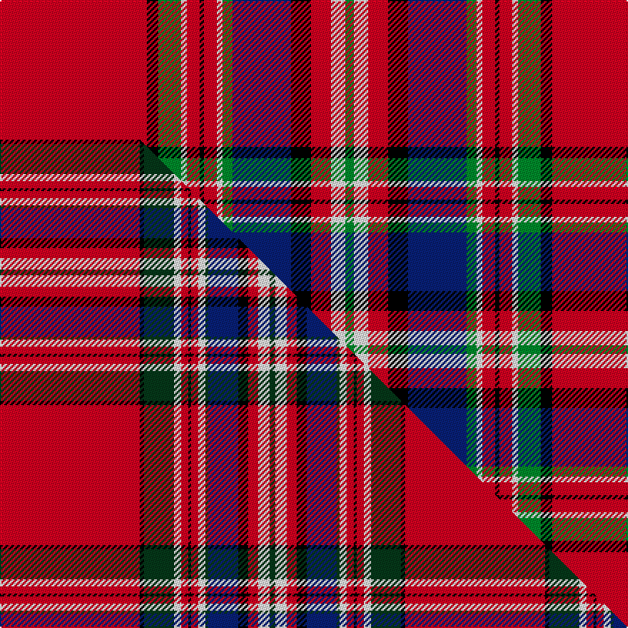

This is one **variant** — a specific cloth: this exact thread count and colourway, with its own
provenance below. It is one weaving of the [sett](/setts/r103k8g16w4r9k3r9w4g7db41k14r14w10g6/) (the scale-free proportion — the
same cloth at any scale or shade), whose colour order is pattern [GWRKBGWRKRWGKR](/stripes/gwrkbgwrkrwgkr/).

Part of the [MacFarlane](/tartans/macfarlane/) tartan — the named design grouping this sett with its other cloths.

Sourced from house-of-tartan.  It is a [14 stripe tartan](/stripes/stripes14/).

Original link [http://www.house-of-tartan.scotland.net/house/TartanViewjs.asp?colr=Def&tnam=947](http://www.house-of-tartan.scotland.net/house/TartanViewjs.asp?colr=Def&tnam=947)

## Provenance

Earliest known date: 1822 The threadcount is taken from a silk, satin-weave sash, (1822) in the collection of the Scottish Tartans Museum in Comrie, Perthshire. (Reproduced at 50% actual count.) The sett varies slightly from the one registered with Lord Lyon but is often the manufacturers choice. MacFarlanes, 'sons of Parlan', were proscribed and their lands forfeited, in the same way as the MacGregors. Many emigrated and some changed their name: Bartholomew is a Southern form of the name. The chiefship is vacant.

2 attestations — the source records this cloth was collapsed from (oldest owns this page)

<ul>
<li>1822 — MacFarlane Red Artifact Tartan (house-of-tartan, <a href="http://www.house-of-tartan.scotland.net/house/TartanViewjs.asp?colr=Def&tnam=947">record</a>) </li>
<li>undated — MacFarlane, Red (weddslist, <a href="http://www.weddslist.com/cgi-bin/tartans/pg.pl?source=sts">record</a>) </li>
</ul>

Dataset <small>— provenance for this record, inherited from the source manifest</small>

<dl class="dataset-prov">
<dt>source</dt><dd><a href="/sources/house-of-tartan/">House of Tartan</a></dd>
<dt>data captured from</dt><dd><a href="https://github.com/thetartan/tartan-database/blob/master/data/house-of-tartan/data.csv">https://github.com/thetartan/tartan-database/blob/master/data/house-of-tartan/data.csv</a></dd>
<dt>data date</dt><dd>1822 <small>(this record)</small></dd>
<dt>licence</dt><dd><a href="https://creativecommons.org/licenses/by-nc-nd/4.0/">CC BY-NC-ND 4.0</a></dd>
</dl>

Capture chain <small>— the hands this data passed through, oldest first; each capture carries its own licence</small>

<ol class="capture-chain">
<li><a href="http://www.house-of-tartan.scotland.net/">House of Tartan</a> <small>the weaver/retailer's database — the site is now offline; the URL is kept as the ultimate source's identity</small></li>
<li><a href="https://github.com/thetartan/tartan-database">thetartan/tartan-database</a> <small>2016-2017</small> · <a href="https://creativecommons.org/licenses/by-nc-nd/4.0/">CC BY-NC-ND 4.0</a> <small>Levko Kravets's frozen compilation — the capture we vendored, and where its CC licence text came from</small></li>
<li>this dictionary <small>captured 2026-06-10 · commit 5bf86c7566</small> <small>each re-capture is a git commit to data/sources</small></li>
</ol>

## Thread count
R/103 K8 G16 W4 R9 K3 R9 W4 G7 DB41 K14 R14 W10 G/6

One full sett is **387 threads**.

## Palette
<table><thead><tr><th>Colour</th><th>Shade</th><th>OKLCh</th></tr></thead><tbody><tr><td>DB</td><td><code style="background-color:#082077;">#082077</code> <small style="color:#888">#082077</small></td><td><small style="color:#888">oklch(30.0% 0.149 265.1)</small></td></tr><tr><td>G</td><td><code style="background-color:#008B2A;">#008B2A</code> <small style="color:#888">#008B2A</small></td><td><small style="color:#888">oklch(55.4% 0.170 145.9)</small></td></tr><tr><td>K</td><td><code style="background-color:#000000;">#000000</code> <small style="color:#888">#000000</small></td><td><small style="color:#888">oklch(0.0% 0.000 0.0)</small></td></tr><tr><td>W</td><td><code style="background-color:#F7F7F7;">#F7F7F7</code> <small style="color:#888">#F7F7F7</small></td><td><small style="color:#888">oklch(97.6% 0.000 89.9)</small></td></tr><tr><td>R</td><td><code style="background-color:#D60020;">#D60020</code> <small style="color:#888">#D60020</small></td><td><small style="color:#888">oklch(55.2% 0.224 25.5)</small></td></tr></tbody></table>

# Sample pattern

## Compared to the master

This cloth is one sett of its design; the master sett (the exemplar the design is anchored on) is below for comparison.

Its **ΔTartan distance** from the master is **0.53** — the same measure the nearest-tartans table ranks by (0 is identical; a re-scale of the same cloth is near 0, a recolour or a different proportion further).

<figure class="master-compare" style="margin:0">

this sett
master sett ★

<figcaption style="color:#888;font-size:smaller">One weave of this sett against the <a href="/setts/r98k3dg21w5r5k2r5w5dg2db21k7r7w8dg4/">master sett ★</a>, split on the diagonal: a shared proportion runs seamlessly across it with only the shades shifting; a different proportion breaks on it.</figcaption>
</figure>

## Nearest tartan variants

The nearest existing variants by ΔTartan distance, with this cloth at the top so the swatches line up against it.

ΔTartan

Threads

Variant

Sett

—

387

<a href="/variants/s14/r103k8g16w4r9k3r9w4g7db41k14r14w10g6/">MacFarlane Red Artifact Tartan</a>

<a href="/ttd/edit/#slug=r42k1g12w2r3k1r3w2g2db12k4r3w4g3&amp;base=r103k8g16w4r9k3r9w4g7db41k14r14w10g6" title="compare in the TTD">0.47</a>

143

<a href="/variants/s14/r42k1g12w2r3k1r3w2g2db12k4r3w4g3/">MacFarlane</a>

<a href="/ttd/edit/#slug=r98k3dg21w5r5k2r5w5dg2db21k7r7w8dg4&amp;base=r103k8g16w4r9k3r9w4g7db41k14r14w10g6" title="compare in the TTD">0.52</a>

284

<a href="/variants/s14/r98k3dg21w5r5k2r5w5dg2db21k7r7w8dg4/">MacFarlane Red (Clan)</a>

<a href="/ttd/edit/#slug=r98k3dg21w5r5k2r5w5dg2dt21k7r7w8dg4~dt1204274&amp;base=r103k8g16w4r9k3r9w4g7db41k14r14w10g6" title="compare in the TTD">0.53</a>

284

<a href="/variants/s14/r98k3dg21w5r5k2r5w5dg2db21k7r7w8dg4~db1204274/">MacFarlane Red</a>

<a href="/ttd/edit/#slug=r42k1dg12w2r3k1r3w2dg2dp12k4r3w4dg3~x2&amp;base=r103k8g16w4r9k3r9w4g7db41k14r14w10g6" title="compare in the TTD">1.62</a>

286

<a href="/variants/s14/r42k1dg12w2r3k1r3w2dg2dp12k4r3w4dg3~x2/">MacFarlane (Lord Lyon sett)</a>

<a href="/ttd/edit/#slug=r42k1g12w2r3k1r3w2g2dp12k4r3w4g3~x2&amp;base=r103k8g16w4r9k3r9w4g7db41k14r14w10g6" title="compare in the TTD">1.62</a>

286

<a href="/variants/s14/r42k1g12w2r3k1r3w2g2dp12k4r3w4g3~x2/">Lendrum (Clan)</a>

<a href="/ttd/edit/#slug=r120k4w2g32w4k7r7k2r7k7w4lb32k8r8k12w4&amp;base=r103k8g16w4r9k3r9w4g7db41k14r14w10g6" title="compare in the TTD">1.70</a>

396

<a href="/variants/s16/r120k4w2g32w4k7r7k2r7k7w4lb32k8r8k12w4/">Chattan, Clan</a>

<a href="/ttd/edit/#slug=r42k1g12w2r3k1r3w2g2dr12k4r3w4g3~x2&amp;base=r103k8g16w4r9k3r9w4g7db41k14r14w10g6" title="compare in the TTD">1.98</a>

286

<a href="/variants/s14/r42k1g12w2r3k1r3w2g2dr12k4r3w4g3~x2/">MacFarlane</a>

<a href="/ttd/edit/#slug=r42k1g12w2r3k1r3w2g2dr12k4r3w4g3&amp;base=r103k8g16w4r9k3r9w4g7db41k14r14w10g6" title="compare in the TTD">1.98</a>

143

<a href="/variants/s14/r42k1g12w2r3k1r3w2g2dr12k4r3w4g3/">MacFarlane</a>

<a href="/ttd/edit/#slug=w8r100k42g42r5k3r5lb42r100w8&amp;base=r103k8g16w4r9k3r9w4g7db41k14r14w10g6" title="compare in the TTD">2.05</a>

694

<a href="/variants/s10/w8r100k42g42r5k3r5lb42r100w8/">Unidentified Plaid #7</a>

<a href="/ttd/edit/#slug=dg2r36dg11k5w1dg1y1k1w1k1dg16r5w1~x2&amp;base=r103k8g16w4r9k3r9w4g7db41k14r14w10g6" title="compare in the TTD">2.11</a>

322

<a href="/variants/s13/dg2r36dg11k5w1dg1y1k1w1k1dg16r5w1~x2/">Campagna Center (Corporate)</a>

## Neighbour map

Every grey dot is one of 13621 variants placed by the first two principal components of the ΔTartan feature space (42% of its variance). Red is this tartan; blue dots are its nearest — click one to open its page.

<svg viewBox="0 0 640 380" role="img" style="max-width:100%;height:auto;border:1px solid #e0e0e0;border-radius:4px;display:block" xmlns="http://www.w3.org/2000/svg"><image href="/nn/cloud.v1.png" width="640" height="380"/><a href="/variants/s14/r42k1g12w2r3k1r3w2g2db12k4r3w4g3/"><circle cx="281.6" cy="39.1" r="4" fill="#3465a4"><title>MacFarlane</title></circle></a><a href="/variants/s14/r98k3dg21w5r5k2r5w5dg2db21k7r7w8dg4/"><circle cx="326.9" cy="21.0" r="4" fill="#3465a4"><title>MacFarlane Red (Clan)</title></circle></a><a href="/variants/s14/r98k3dg21w5r5k2r5w5dg2db21k7r7w8dg4~db1204274/"><circle cx="328.5" cy="21.1" r="4" fill="#3465a4"><title>MacFarlane Red</title></circle></a><a href="/variants/s14/r42k1dg12w2r3k1r3w2dg2dp12k4r3w4dg3~x2/"><circle cx="288.3" cy="37.4" r="4" fill="#3465a4"><title>MacFarlane (Lord Lyon sett)</title></circle></a><a href="/variants/s14/r42k1g12w2r3k1r3w2g2dp12k4r3w4g3~x2/"><circle cx="287.1" cy="39.1" r="4" fill="#3465a4"><title>Lendrum (Clan)</title></circle></a><a href="/variants/s16/r120k4w2g32w4k7r7k2r7k7w4lb32k8r8k12w4/"><circle cx="262.3" cy="14.0" r="4" fill="#3465a4"><title>Chattan, Clan</title></circle></a><a href="/variants/s14/r42k1g12w2r3k1r3w2g2dr12k4r3w4g3~x2/"><circle cx="289.3" cy="40.0" r="4" fill="#3465a4"><title>MacFarlane</title></circle></a><a href="/variants/s14/r42k1g12w2r3k1r3w2g2dr12k4r3w4g3/"><circle cx="289.3" cy="40.0" r="4" fill="#3465a4"><title>MacFarlane</title></circle></a><a href="/variants/s10/w8r100k42g42r5k3r5lb42r100w8/"><circle cx="285.6" cy="86.6" r="4" fill="#3465a4"><title>Unidentified Plaid #7</title></circle></a><a href="/variants/s13/dg2r36dg11k5w1dg1y1k1w1k1dg16r5w1~x2/"><circle cx="289.9" cy="53.2" r="4" fill="#3465a4"><title>Campagna Center (Corporate)</title></circle></a><circle cx="267.6" cy="49.2" r="5" fill="#c00000"/><text x="320" y="376" text-anchor="middle" font-size="11" fill="#999">ground</text><text x="11" y="190" text-anchor="middle" font-size="11" fill="#999" transform="rotate(-90 11 190)">complexity</text></svg>

ID: /variants/s14/r103k8g16w4r9k3r9w4g7db41k14r14w10g6/
