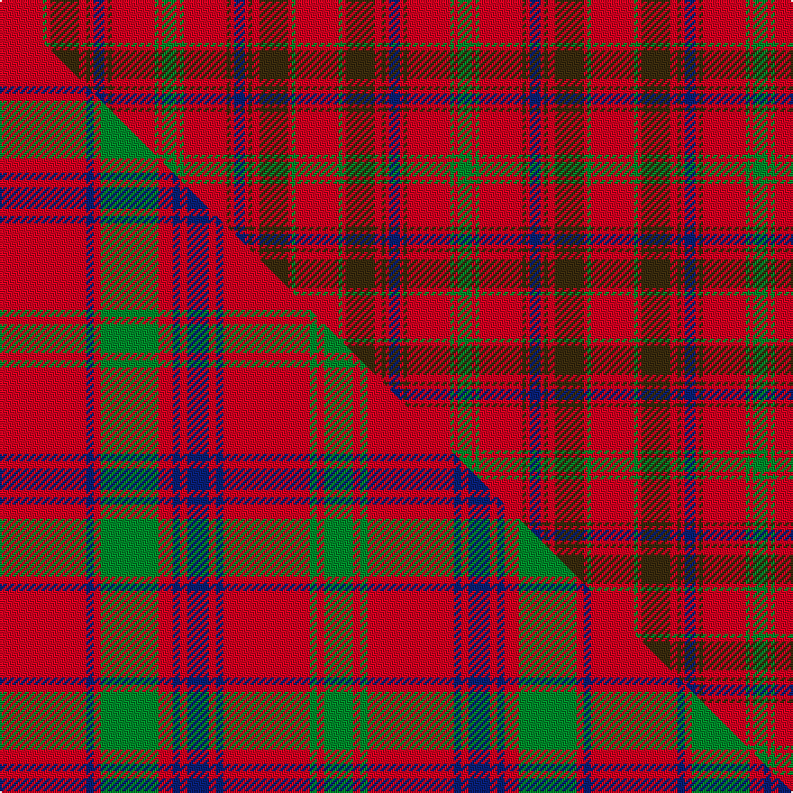

This page is one **sett** — a single exact thread-count. It belongs to the [tartan](/setts/r12g1r1dy8r2dy1r1db3r1dy1r12g1r1g4/)
(the same proportion at any scale), whose colour order is pattern [GRGRGRBRGRGRGR](/stripes/grgrgrbrgrgrgr/).

Part of the [MacColl](/tartans/maccoll/) tartan — the named design grouping this sett with its other cloths.

Sourced from register-of-tartans.  It is a [14 stripe tartan](/stripes/stripes14/).

Original link https://www.tartanregister.gov.uk/tartanDetails.aspx?ref=2316

## Register references

External register numbers recorded for this tartan.

- Scottish Register of Tartans: [2316](https://www.tartanregister.gov.uk/tartanDetails.aspx?ref=2316)
- Scottish Tartans World Register: 899

## Thread count
R/24 G2 R2 DY16 R4 DY2 R2 DB6 R2 DY2 R24 G2 R2 G/8

One full sett is **164 threads**.

## Palette
<table><thead><tr><th>Colour</th><th>Shade</th><th>OKLCh</th></tr></thead><tbody><tr><td>DB</td><td><code style="background-color:#082077;">#082077</code> <small style="color:#888">#082077</small></td><td><small style="color:#888">oklch(30.0% 0.149 265.1)</small></td></tr><tr><td>G</td><td><code style="background-color:#008B2A;">#008B2A</code> <small style="color:#888">#008B2A</small></td><td><small style="color:#888">oklch(55.4% 0.170 145.9)</small></td></tr><tr><td>R</td><td><code style="background-color:#D60020;">#D60020</code> <small style="color:#888">#D60020</small></td><td><small style="color:#888">oklch(55.2% 0.224 25.5)</small></td></tr><tr><td>DY</td><td><code style="background-color:#3A2B0D;">#3A2B0D</code> <small style="color:#888">#3A2B0D</small></td><td><small style="color:#888">oklch(30.0% 0.049 82.0)</small></td></tr></tbody></table>

# Sample pattern

## Compared to the master

This cloth is one sett of its design; the master sett (the exemplar the design is anchored on) is below for comparison.

Its **ΔTartan distance** from the master is **1.09** — the same measure the nearest-tartans table ranks by (0 is identical; a re-scale of the same cloth is near 0, a recolour or a different proportion further).

<figure class="master-compare" style="margin:0">

this sett
master sett ★

<figcaption style="color:#888;font-size:smaller">One weave of this sett against the <a href="/setts/r12db1r1g8r2db1r1db3r1db1r12g1r1g4/">master sett ★</a>, split on the diagonal: a shared proportion runs seamlessly across it with only the shades shifting; a different proportion breaks on it.</figcaption>
</figure>

## Nearest variants

The nearest existing variants by ΔTartan distance, with this cloth at the top so the swatches line up against it.

ΔTartan

Threads

Variant

Sett

—

164

<a href="/variants/s14/r12g1r1dy8r2dy1r1db3r1dy1r12g1r1g4~x2/">MacColl #2</a>

<a href="/ttd/edit/#slug=r12dy1r1g8r2dy1r1db3r1dy1r12g1r1g4~x2&amp;base=r12g1r1dy8r2dy1r1db3r1dy1r12g1r1g4~x2" title="compare in the TTD">1.70</a>

164

<a href="/variants/s14/r12dy1r1g8r2dy1r1db3r1dy1r12g1r1g4~x2/">MacColl #3</a>

<a href="/ttd/edit/#slug=r2g2r2g8r2g2r2db2r11y1r4y1~x4&amp;base=r12g1r1dy8r2dy1r1db3r1dy1r12g1r1g4~x2" title="compare in the TTD">2.99</a>

300

<a href="/variants/s12/r2g2r2g8r2g2r2db2r11y1r4y1~x4/">Burns 1930</a>

<a href="/ttd/edit/#slug=r3g3r3g14r3g3r3db5r18y2r8y2~x2&amp;base=r12g1r1dy8r2dy1r1db3r1dy1r12g1r1g4~x2" title="compare in the TTD">2.99</a>

258

<a href="/variants/s12/r3g3r3g14r3g3r3db5r18y2r8y2~x2/">Burns</a>

## Neighbour map

Every grey dot is one of 13620 variants placed by the first two principal components of the ΔTartan feature space (42% of its variance). Red is this tartan; blue dots are its nearest — click one to open its page.

<svg viewBox="0 0 640 380" role="img" style="max-width:100%;height:auto;border:1px solid #e0e0e0;border-radius:4px;display:block" xmlns="http://www.w3.org/2000/svg"><image href="/nn/cloud.v1.png" width="640" height="380"/><a href="/variants/s14/r12dy1r1g8r2dy1r1db3r1dy1r12g1r1g4~x2/"><circle cx="365.9" cy="148.7" r="4" fill="#3465a4"><title>MacColl #3</title></circle></a><a href="/variants/s12/r2g2r2g8r2g2r2db2r11y1r4y1~x4/"><circle cx="353.8" cy="178.3" r="4" fill="#3465a4"><title>Burns 1930</title></circle></a><a href="/variants/s12/r3g3r3g14r3g3r3db5r18y2r8y2~x2/"><circle cx="325.7" cy="186.5" r="4" fill="#3465a4"><title>Burns</title></circle></a><circle cx="366.3" cy="148.0" r="5" fill="#c00000"/><text x="320" y="376" text-anchor="middle" font-size="11" fill="#999">ground</text><text x="11" y="190" text-anchor="middle" font-size="11" fill="#999" transform="rotate(-90 11 190)">complexity</text></svg>

ID: /variants/s14/r12g1r1dy8r2dy1r1db3r1dy1r12g1r1g4~x2/
