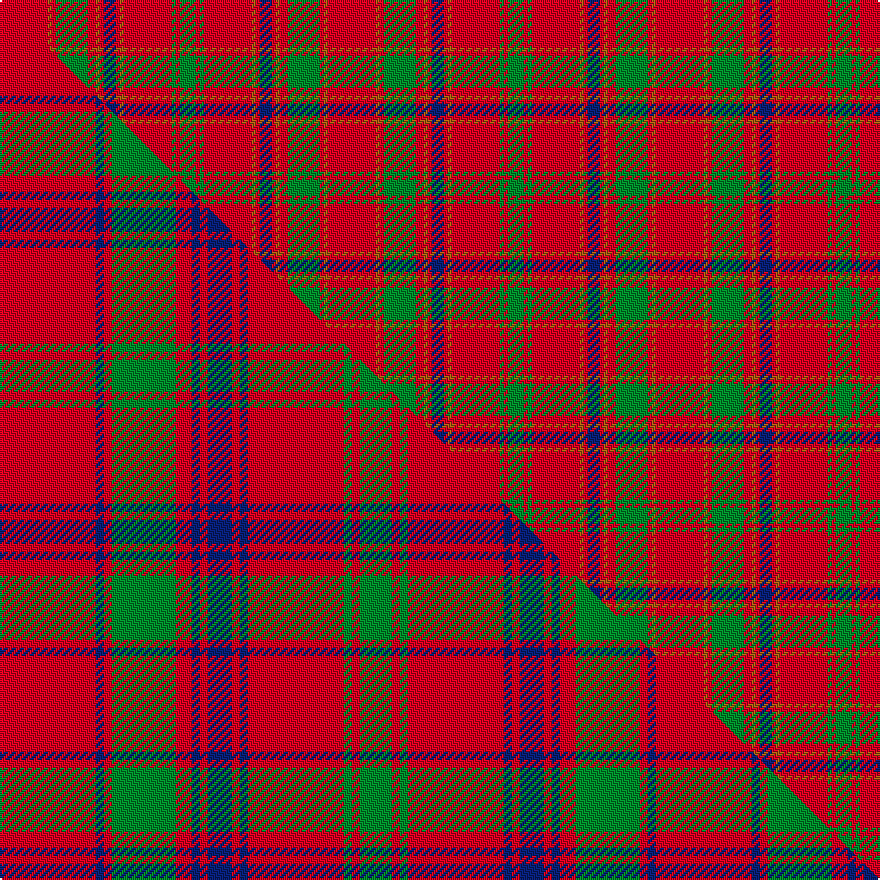

This is one **variant** — a specific cloth: this exact thread count and colourway, with its own
provenance below. It is one weaving of the [sett](/tartans/m/ma/maccoll/) (the scale-free proportion — the
same cloth at any scale or shade), whose colour order is pattern [GRGRRRBRRRGRRR](/stripes/grgrrrbrrrgrrr/).

Part of the [MacColl](/tartans/m/ma/maccoll/) tartan — the named design grouping this sett with its other cloths.

Sourced from weddslist.  It is a [14 stripe tartan](/stripes/stripes14/).

Original link [http://www.weddslist.com/cgi-bin/tartans/pg.pl?source=sts](http://www.weddslist.com/cgi-bin/tartans/pg.pl?source=sts)

Dataset <small>— provenance for this record, inherited from the source manifest</small>

<dl class="dataset-prov">
<dt>source</dt><dd><a href="/sources/weddslist/">Weddslist</a></dd>
<dt>data captured from</dt><dd><a href="https://github.com/thetartan/tartan-database/blob/master/data/weddslist/data.csv">https://github.com/thetartan/tartan-database/blob/master/data/weddslist/data.csv</a></dd>
<dt>data date</dt><dd>2016-11-17 <small>(dataset default)</small></dd>
<dt>licence</dt><dd><a href="https://creativecommons.org/licenses/by-nc-nd/4.0/">CC BY-NC-ND 4.0</a></dd>
</dl>

Capture chain <small>— the hands this data passed through, oldest first; each capture carries its own licence</small>

<ol class="capture-chain">
<li><a href="https://www.weddslist.com/tartans/">Weddslist</a> <small>the living privately compiled reference</small></li>
<li><a href="https://github.com/thetartan/tartan-database">thetartan/tartan-database</a> <small>2016-2017</small> · <a href="https://creativecommons.org/licenses/by-nc-nd/4.0/">CC BY-NC-ND 4.0</a> <small>Levko Kravets's frozen compilation — the capture we vendored, and where its CC licence text came from</small></li>
<li>this dictionary <small>captured 2026-06-10 · commit 5bf86c7566</small> <small>each re-capture is a git commit to data/sources</small></li>
</ol>

## Thread count
R/24 O2 R2 G16 R4 O2 R2 DB6 R2 O2 R24 G2 R2 G/8

One full sett is **164 threads**.

## Palette
<table><thead><tr><th>Colour</th><th>Shade</th><th>OKLCh</th></tr></thead><tbody><tr><td>DB</td><td><code style="background-color:#082077;">#082077</code> <small style="color:#888">#082077</small></td><td><small style="color:#888">oklch(30.0% 0.149 265.1)</small></td></tr><tr><td>G</td><td><code style="background-color:#008B2A;">#008B2A</code> <small style="color:#888">#008B2A</small></td><td><small style="color:#888">oklch(55.4% 0.170 145.9)</small></td></tr><tr><td>O</td><td><code style="background-color:#A65C11;">#A65C11</code> <small style="color:#888">#A65C11</small></td><td><small style="color:#888">oklch(55.0% 0.125 58.3)</small></td></tr><tr><td>R</td><td><code style="background-color:#D60020;">#D60020</code> <small style="color:#888">#D60020</small></td><td><small style="color:#888">oklch(55.2% 0.224 25.5)</small></td></tr></tbody></table>

# Sample pattern

[Sample sheet (PDF)](swatch.pdf) — the woven sample, thread count and palette on one printable A4, rendered on demand (the same sheet the TTD print page downloads).

## Compared to the master

This cloth is one sett of its design; the master sett (the exemplar the design is anchored on) is below for comparison.

Its **ΔTartan distance** from the master is **0.90** — the same measure the nearest-tartans table ranks by (0 is identical; a re-scale of the same cloth is near 0, a recolour or a different proportion further).

<figure class="master-compare" style="margin:0">

this sett
master sett ★

<figcaption style="color:#888;font-size:smaller">One weave of this sett against the <a href="/setts/r12db1r1g8r2db1r1db3r1db1r12g1r1g4/">master sett ★</a>, split on the diagonal: a shared proportion runs seamlessly across it with only the shades shifting; a different proportion breaks on it.</figcaption>
</figure>

## Nearest tartan variants

The nearest existing variants by ΔTartan distance, with this cloth at the top so the swatches line up against it.

ΔTartan

Threads

Variant

Sett

—

164

<a href="/variants/s14/r12o1r1g8r2o1r1db3r1o1r12g1r1g4~x2/">MacColl</a>

<a href="/ttd/edit/#slug=r12dy1r1g8r2dy1r1db3r1dy1r12g1r1g4~x2&amp;base=r12o1r1g8r2o1r1db3r1o1r12g1r1g4~x2" title="compare in the TTD">0.90</a>

164

<a href="/variants/s14/r12dy1r1g8r2dy1r1db3r1dy1r12g1r1g4~x2/">MacColl #3</a>

<a href="/ttd/edit/#slug=r12db1r1g8r2db1r1db3r1db1r12g1r1g4~x4&amp;base=r12o1r1g8r2o1r1db3r1o1r12g1r1g4~x2" title="compare in the TTD">0.90</a>

328

<a href="/variants/s14/r12db1r1g8r2db1r1db3r1db1r12g1r1g4~x4/">MacColl</a>

<a href="/ttd/edit/#slug=r12db1r1g8r2db1r1db3r1db1r12g1r1g4~x2&amp;base=r12o1r1g8r2o1r1db3r1o1r12g1r1g4~x2" title="compare in the TTD">0.90</a>

164

<a href="/variants/s14/r12db1r1g8r2db1r1db3r1db1r12g1r1g4~x2/">MacColl Clan Tartan</a>

<a href="/ttd/edit/#slug=r9dp2r21y2r2dp8r2g2r2g17r2dp2r8~x2&amp;base=r12o1r1g8r2o1r1db3r1o1r12g1r1g4~x2" title="compare in the TTD">1.44</a>

282

<a href="/variants/s13/r9dp2r21y2r2dp8r2g2r2g17r2dp2r8~x2/">London Caledonian Games Association</a>

<a href="/ttd/edit/#slug=r12g1r1dy8r2dy1r1db3r1dy1r12g1r1g4~x2&amp;base=r12o1r1g8r2o1r1db3r1o1r12g1r1g4~x2" title="compare in the TTD">1.54</a>

164

<a href="/variants/s14/r12g1r1dy8r2dy1r1db3r1dy1r12g1r1g4~x2/">MacColl #2</a>

<a href="/ttd/edit/#slug=r12g1r1o8r2o1r1db3r1o1r12g1r1g4~x2&amp;base=r12o1r1g8r2o1r1db3r1o1r12g1r1g4~x2" title="compare in the TTD">1.69</a>

164

<a href="/variants/s14/r12g1r1o8r2o1r1db3r1o1r12g1r1g4~x2/">MacColl</a>

<a href="/ttd/edit/#slug=r45dp4r4g48r4dp4r4dp15r4dp4r40g4r4g30&amp;base=r12o1r1g8r2o1r1db3r1o1r12g1r1g4~x2" title="compare in the TTD">1.78</a>

353

<a href="/variants/s14/r45dp4r4g48r4dp4r4dp15r4dp4r40g4r4g30/">Bruce Old Clan Tartan</a>

<a href="/ttd/edit/#slug=r13w1lb2r2g14r2w1lb2r2db4r2lb2w1r16g1r2g3~x2&amp;base=r12o1r1g8r2o1r1db3r1o1r12g1r1g4~x2" title="compare in the TTD">2.19</a>

248

<a href="/variants/s17/r13w1lb2r2g14r2w1lb2r2db4r2lb2w1r16g1r2g3~x2/">MacDonald of Lochmaddy</a>

<a href="/ttd/edit/#slug=r13w1lt2r2g14r2w1lt2r2db4r2lt2w1r16g1r2g3~x2&amp;base=r12o1r1g8r2o1r1db3r1o1r12g1r1g4~x2" title="compare in the TTD">2.19</a>

248

<a href="/variants/s17/r13w1lt2r2g14r2w1lt2r2db4r2lt2w1r16g1r2g3~x2/">MacDonald of Lochmaddy</a>

<a href="/ttd/edit/#slug=g19r7g7r7g7r14db3r3g19r3db3r66db7r14~x2&amp;base=r12o1r1g8r2o1r1db3r1o1r12g1r1g4~x2" title="compare in the TTD">2.22</a>

650

<a href="/variants/s14/g19r7g7r7g7r14db3r3g19r3db3r66db7r14~x2/">MacGillivray Hunting Clan Tartan</a>

## Neighbour map

Every grey dot is one of 13662 variants placed by the first two principal components of the ΔTartan feature space (42% of its variance). Red is this tartan; blue dots are its nearest — click one to open its page. The map is a flat projection of a many-dimensional space — [how to read it](/posts/neighbourhood-maps/).

<svg viewBox="0 0 640 380" role="img" style="max-width:100%;height:auto;border:1px solid #e0e0e0;border-radius:4px;display:block" xmlns="http://www.w3.org/2000/svg"><image href="/nn/cloud.v1.png" width="640" height="380"/><a href="/variants/s14/r12dy1r1g8r2dy1r1db3r1dy1r12g1r1g4~x2/"><circle cx="366.2" cy="148.2" r="4" fill="#3465a4"><title>MacColl #3</title></circle></a><a href="/variants/s14/r12db1r1g8r2db1r1db3r1db1r12g1r1g4~x4/"><circle cx="377.2" cy="159.0" r="4" fill="#3465a4"><title>MacColl</title></circle></a><a href="/variants/s14/r12db1r1g8r2db1r1db3r1db1r12g1r1g4~x2/"><circle cx="377.2" cy="159.0" r="4" fill="#3465a4"><title>MacColl Clan Tartan</title></circle></a><a href="/variants/s13/r9dp2r21y2r2dp8r2g2r2g17r2dp2r8~x2/"><circle cx="341.7" cy="163.5" r="4" fill="#3465a4"><title>London Caledonian Games Association</title></circle></a><a href="/variants/s14/r12g1r1dy8r2dy1r1db3r1dy1r12g1r1g4~x2/"><circle cx="366.7" cy="147.5" r="4" fill="#3465a4"><title>MacColl #2</title></circle></a><a href="/variants/s14/r12g1r1o8r2o1r1db3r1o1r12g1r1g4~x2/"><circle cx="414.0" cy="162.8" r="4" fill="#3465a4"><title>MacColl</title></circle></a><a href="/variants/s14/r45dp4r4g48r4dp4r4dp15r4dp4r40g4r4g30/"><circle cx="321.5" cy="168.0" r="4" fill="#3465a4"><title>Bruce Old Clan Tartan</title></circle></a><a href="/variants/s17/r13w1lb2r2g14r2w1lb2r2db4r2lb2w1r16g1r2g3~x2/"><circle cx="299.0" cy="111.3" r="4" fill="#3465a4"><title>MacDonald of Lochmaddy</title></circle></a><a href="/variants/s17/r13w1lt2r2g14r2w1lt2r2db4r2lt2w1r16g1r2g3~x2/"><circle cx="295.1" cy="111.1" r="4" fill="#3465a4"><title>MacDonald of Lochmaddy</title></circle></a><a href="/variants/s14/g19r7g7r7g7r14db3r3g19r3db3r66db7r14~x2/"><circle cx="428.2" cy="132.2" r="4" fill="#3465a4"><title>MacGillivray Hunting Clan Tartan</title></circle></a><circle cx="375.4" cy="150.1" r="5" fill="#c00000"/><text x="320" y="376" text-anchor="middle" font-size="11" fill="#999">ground</text><text x="11" y="190" text-anchor="middle" font-size="11" fill="#999" transform="rotate(-90 11 190)">complexity</text></svg>

ID: /variants/s14/r12o1r1g8r2o1r1db3r1o1r12g1r1g4~x2/
