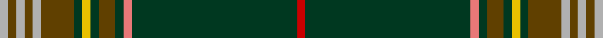

This page is one **sett** — a single exact thread-count. It belongs to the [tartan](/setts/r1dg20ri1dg1dy2dg1ly1dg1dy4lr1dy1lr1dy1lr1/)
(the same proportion at any scale), whose colour order is pattern [RGRGGGYGGYGYGY](/stripes/rgrgggyggygygy/).

Sourced from tartans-authority.  It is a [14 stripe tartan](/stripes/stripes14/).

Original link http://www.tartansauthority.com/tartan-ferret/display/8506/

## Register references

External register numbers recorded for this tartan.

- Scottish Register of Tartans: [8506](https://www.tartanregister.gov.uk/tartanDetails?ref=8506)
- Scottish Tartans Authority (ITI): 8506

## Thread count
N/4 T4 N4 T4 N4 T16 DG4 Y4 DG4 T8 DG4 LR4 DG80 R/4

One full sett is **288 threads**.

## Palette

Palette: <strong>Tartan Register</strong>
<table><thead><tr><th>Colour</th><th>Threads</th><th>Shade</th><th>Base</th><th>OKLCh</th></tr></thead><tbody><tr><td>N/</td><td style="text-align:right;font-variant-numeric:tabular-nums">4</td><td><code style="background-color:#B0B0B0;">#B0B0B0</code> <small style="color:#888">#B0B0B0</small></td><td>Y <code style="background-color:#F2BF00;">#F2BF00</code></td><td><small style="color:#888">oklch(75.7% 0.000 89.9)</small></td></tr><tr><td>T</td><td style="text-align:right;font-variant-numeric:tabular-nums">4</td><td><code style="background-color:#604000;">#604000</code> <small style="color:#888">#604000</small></td><td>G <code style="background-color:#006100;">#006100</code></td><td><small style="color:#888">oklch(39.8% 0.083 76.8)</small></td></tr><tr><td>N</td><td style="text-align:right;font-variant-numeric:tabular-nums">4</td><td><code style="background-color:#B0B0B0;">#B0B0B0</code> <small style="color:#888">#B0B0B0</small></td><td>Y <code style="background-color:#F2BF00;">#F2BF00</code></td><td><small style="color:#888">oklch(75.7% 0.000 89.9)</small></td></tr><tr><td>T</td><td style="text-align:right;font-variant-numeric:tabular-nums">4</td><td><code style="background-color:#604000;">#604000</code> <small style="color:#888">#604000</small></td><td>G <code style="background-color:#006100;">#006100</code></td><td><small style="color:#888">oklch(39.8% 0.083 76.8)</small></td></tr><tr><td>N</td><td style="text-align:right;font-variant-numeric:tabular-nums">4</td><td><code style="background-color:#B0B0B0;">#B0B0B0</code> <small style="color:#888">#B0B0B0</small></td><td>Y <code style="background-color:#F2BF00;">#F2BF00</code></td><td><small style="color:#888">oklch(75.7% 0.000 89.9)</small></td></tr><tr><td>T</td><td style="text-align:right;font-variant-numeric:tabular-nums">16</td><td><code style="background-color:#604000;">#604000</code> <small style="color:#888">#604000</small></td><td>G <code style="background-color:#006100;">#006100</code></td><td><small style="color:#888">oklch(39.8% 0.083 76.8)</small></td></tr><tr><td>DG</td><td style="text-align:right;font-variant-numeric:tabular-nums">4</td><td><code style="background-color:#003820;">#003820</code> <small style="color:#888">#003820</small></td><td>G <code style="background-color:#006100;">#006100</code></td><td><small style="color:#888">oklch(30.0% 0.070 158.3)</small></td></tr><tr><td>Y</td><td style="text-align:right;font-variant-numeric:tabular-nums">4</td><td><code style="background-color:#E8C000;">#E8C000</code> <small style="color:#888">#E8C000</small></td><td>Y <code style="background-color:#F2BF00;">#F2BF00</code></td><td><small style="color:#888">oklch(81.9% 0.168 93.7)</small></td></tr><tr><td>DG</td><td style="text-align:right;font-variant-numeric:tabular-nums">4</td><td><code style="background-color:#003820;">#003820</code> <small style="color:#888">#003820</small></td><td>G <code style="background-color:#006100;">#006100</code></td><td><small style="color:#888">oklch(30.0% 0.070 158.3)</small></td></tr><tr><td>T</td><td style="text-align:right;font-variant-numeric:tabular-nums">8</td><td><code style="background-color:#604000;">#604000</code> <small style="color:#888">#604000</small></td><td>G <code style="background-color:#006100;">#006100</code></td><td><small style="color:#888">oklch(39.8% 0.083 76.8)</small></td></tr><tr><td>DG</td><td style="text-align:right;font-variant-numeric:tabular-nums">4</td><td><code style="background-color:#003820;">#003820</code> <small style="color:#888">#003820</small></td><td>G <code style="background-color:#006100;">#006100</code></td><td><small style="color:#888">oklch(30.0% 0.070 158.3)</small></td></tr><tr><td>LR</td><td style="text-align:right;font-variant-numeric:tabular-nums">4</td><td><code style="background-color:#E87878;">#E87878</code> <small style="color:#888">#E87878</small></td><td>R <code style="background-color:#CC0000;">#CC0000</code></td><td><small style="color:#888">oklch(70.0% 0.139 21.2)</small></td></tr><tr><td>DG</td><td style="text-align:right;font-variant-numeric:tabular-nums">80</td><td><code style="background-color:#003820;">#003820</code> <small style="color:#888">#003820</small></td><td>G <code style="background-color:#006100;">#006100</code></td><td><small style="color:#888">oklch(30.0% 0.070 158.3)</small></td></tr><tr><td>R/</td><td style="text-align:right;font-variant-numeric:tabular-nums">4</td><td><code style="background-color:#C80000;">#C80000</code> <small style="color:#888">#C80000</small></td><td>R <code style="background-color:#CC0000;">#CC0000</code></td><td><small style="color:#888">oklch(52.3% 0.215 29.2)</small></td></tr></tbody></table>

## Nearest tartans

The nearest existing variants by ΔTartan distance, with this tartan at the top so the swatches line up against it.

ΔTartan

Tartan

Sett

—

<a href="/ttd/edit/#slug=r1dg20ri1dg1dy2dg1ly1dg1dy4lr1dy1lr1dy1lr1~x4">Forster (Personal)</a> <a class="nn-out" href="/variants/s14/r1dg20ri1dg1dy2dg1ly1dg1dy4lr1dy1lr1dy1lr1~x4/" title="open its dictionary page">↗</a>

0.86

<a href="/ttd/edit/#slug=dy46b3dy7dg2r2dg2w2dg11b6db2b3r2~x2&amp;base=r1dg20ri1dg1dy2dg1ly1dg1dy4lr1dy1lr1dy1lr1~x4">Diana Hunting Plaid</a> <a class="nn-out" href="/variants/s12/dy46b3dy7dg2r2dg2w2dg11b6db2b3r2~x2/" title="open its dictionary page">↗</a>

0.93

<a href="/ttd/edit/#slug=dg44db3k8ly2k2w2k2dg9r5k2r2w2~x2&amp;base=r1dg20ri1dg1dy2dg1ly1dg1dy4lr1dy1lr1dy1lr1~x4">Princess Mary</a> <a class="nn-out" href="/variants/s12/dg44db3k8ly2k2w2k2dg9r5k2r2w2~x2/" title="open its dictionary page">↗</a>

1.03

<a href="/ttd/edit/#slug=dg28b1dg4r1k1lr1k1g4r4k2r4lr2~x2&amp;base=r1dg20ri1dg1dy2dg1ly1dg1dy4lr1dy1lr1dy1lr1~x4">Carroll O'Reed</a> <a class="nn-out" href="/variants/s12/dg28b1dg4r1k1lr1k1g4r4k2r4lr2~x2/" title="open its dictionary page">↗</a>

1.10

<a href="/ttd/edit/#slug=dg32t2k7ly1k1w1k2r7dg5k1dg3w1~x2&amp;base=r1dg20ri1dg1dy2dg1ly1dg1dy4lr1dy1lr1dy1lr1~x4">Stuart/Stewart (Variant)</a> <a class="nn-out" href="/variants/s12/dg32t2k7ly1k1w1k2r7dg5k1dg3w1~x2/" title="open its dictionary page">↗</a>

1.18

<a href="/ttd/edit/#slug=g24g2b2k3lo1k1lr1k1g4r2k1r2lr1~x4&amp;base=r1dg20ri1dg1dy2dg1ly1dg1dy4lr1dy1lr1dy1lr1~x4">Princess Mary #2</a> <a class="nn-out" href="/variants/s13/g24g2b2k3lo1k1lr1k1g4r2k1r2lr1~x4/" title="open its dictionary page">↗</a>

1.20

<a href="/ttd/edit/#slug=g70db3k9w4k4dp4k3db12g9k4g4ly4~x2&amp;base=r1dg20ri1dg1dy2dg1ly1dg1dy4lr1dy1lr1dy1lr1~x4">Canmore Highland Games (Corporate)</a> <a class="nn-out" href="/variants/s12/g70db3k9w4k4dp4k3db12g9k4g4ly4~x2/" title="open its dictionary page">↗</a>

1.27

<a href="/ttd/edit/#slug=dg3g2dg40dy2dg4dy8w1g4dg2o4ly4w2~x2&amp;base=r1dg20ri1dg1dy2dg1ly1dg1dy4lr1dy1lr1dy1lr1~x4">Springbok</a> <a class="nn-out" href="/variants/s12/dg3g2dg40dy2dg4dy8w1g4dg2o4ly4w2~x2/" title="open its dictionary page">↗</a>

1.27

<a href="/ttd/edit/#slug=dg115k15r8k4b8k4ly8k4g8~x2&amp;base=r1dg20ri1dg1dy2dg1ly1dg1dy4lr1dy1lr1dy1lr1~x4">Granvert</a> <a class="nn-out" href="/variants/s9/dg115k15r8k4b8k4ly8k4g8~x2/" title="open its dictionary page">↗</a>

1.31

<a href="/ttd/edit/#slug=g64k4db9ly2db4ly2db4g11r8db2r4w3~x2&amp;base=r1dg20ri1dg1dy2dg1ly1dg1dy4lr1dy1lr1dy1lr1~x4">Sillars (Name)</a> <a class="nn-out" href="/variants/s12/g64k4db9ly2db4ly2db4g11r8db2r4w3~x2/" title="open its dictionary page">↗</a>

1.34

<a href="/ttd/edit/#slug=dy46t3dy7g2r2g2w2g11t6db2t3r2~x2&amp;base=r1dg20ri1dg1dy2dg1ly1dg1dy4lr1dy1lr1dy1lr1~x4">Diana Hunting Plaid Tartan</a> <a class="nn-out" href="/variants/s12/dy46t3dy7g2r2g2w2g11t6db2t3r2~x2/" title="open its dictionary page">↗</a>

## Neighbour map

Every grey dot is one of 14360 variants placed by the first two principal components of the ΔTartan feature space (44% of its variance). Red is this tartan; blue dots are its nearest — click one to open its page.

<svg viewBox="0 0 640 380" role="img" style="max-width:100%;height:auto;border:1px solid #e0e0e0;border-radius:4px;display:block" xmlns="http://www.w3.org/2000/svg"><image href="/nn/cloud.v1.png" width="640" height="380"/><a href="/variants/s12/dy46b3dy7dg2r2dg2w2dg11b6db2b3r2~x2/"><circle cx="367.9" cy="94.1" r="4" fill="#3465a4"><title>Diana Hunting Plaid</title></circle></a><a href="/variants/s12/dg44db3k8ly2k2w2k2dg9r5k2r2w2~x2/"><circle cx="365.8" cy="88.4" r="4" fill="#3465a4"><title>Princess Mary</title></circle></a><a href="/variants/s12/dg28b1dg4r1k1lr1k1g4r4k2r4lr2~x2/"><circle cx="358.3" cy="85.0" r="4" fill="#3465a4"><title>Carroll O'Reed</title></circle></a><a href="/variants/s12/dg32t2k7ly1k1w1k2r7dg5k1dg3w1~x2/"><circle cx="381.0" cy="79.2" r="4" fill="#3465a4"><title>Stuart/Stewart (Variant)</title></circle></a><a href="/variants/s13/g24g2b2k3lo1k1lr1k1g4r2k1r2lr1~x4/"><circle cx="402.3" cy="88.2" r="4" fill="#3465a4"><title>Princess Mary #2</title></circle></a><a href="/variants/s12/g70db3k9w4k4dp4k3db12g9k4g4ly4~x2/"><circle cx="368.6" cy="89.8" r="4" fill="#3465a4"><title>Canmore Highland Games (Corporate)</title></circle></a><a href="/variants/s12/dg3g2dg40dy2dg4dy8w1g4dg2o4ly4w2~x2/"><circle cx="397.1" cy="75.2" r="4" fill="#3465a4"><title>Springbok</title></circle></a><a href="/variants/s9/dg115k15r8k4b8k4ly8k4g8~x2/"><circle cx="420.5" cy="101.3" r="4" fill="#3465a4"><title>Granvert</title></circle></a><a href="/variants/s12/g64k4db9ly2db4ly2db4g11r8db2r4w3~x2/"><circle cx="383.8" cy="72.6" r="4" fill="#3465a4"><title>Sillars (Name)</title></circle></a><a href="/variants/s12/dy46t3dy7g2r2g2w2g11t6db2t3r2~x2/"><circle cx="392.3" cy="104.2" r="4" fill="#3465a4"><title>Diana Hunting Plaid Tartan</title></circle></a><circle cx="380.8" cy="87.7" r="5" fill="#c00000"/></svg>

ID: /variants/s14/r1dg20ri1dg1dy2dg1ly1dg1dy4lr1dy1lr1dy1lr1~x4/
