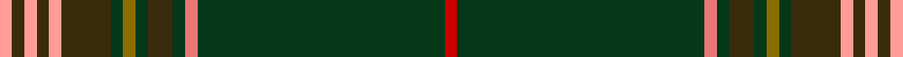

This is one **variant** — a specific cloth: this exact thread count and colourway, with its own
provenance below. It is one weaving of the [sett](/setts/r1dg20ri1dg1dy2dg1y1dg1dy4lr1dy1lr1dy1lr1/) (the scale-free proportion — the
same cloth at any scale or shade), whose colour order is pattern [RGRGGGGGGYGYGY](/stripes/rgrggggggygygy/).

Sourced from tartans-authority.  It is a [14 stripe tartan](/stripes/stripes14/).

Original link [https://www.tartanregister.gov.uk/tartanDetails.aspx?ref=8506](https://www.tartanregister.gov.uk/tartanDetails.aspx?ref=8506)

Dataset <small>— provenance for this record, inherited from the source manifest</small>

<dl class="dataset-prov">
<dt>source</dt><dd><a href="/sources/tartans-authority/">Scottish Tartans Authority</a></dd>
<dt>data captured from</dt><dd><a href="https://github.com/thetartan/tartan-database/blob/master/data/tartans-authority/data.csv">https://github.com/thetartan/tartan-database/blob/master/data/tartans-authority/data.csv</a></dd>
<dt>data date</dt><dd>23rd July 2010 <small>(this record)</small></dd>
<dt>licence</dt><dd><a href="https://creativecommons.org/licenses/by-nc-nd/4.0/">CC BY-NC-ND 4.0</a></dd>
</dl>

Capture chain <small>— the hands this data passed through, oldest first; each capture carries its own licence</small>

<ol class="capture-chain">
<li><a href="https://www.tartansauthority.com/">Scottish Tartans Authority</a> <small>the heritage body's archive — its tartan-ferret record browser is retired (links repaired to the SRT, above)</small></li>
<li><a href="https://github.com/thetartan/tartan-database">thetartan/tartan-database</a> <small>2016-2017</small> · <a href="https://creativecommons.org/licenses/by-nc-nd/4.0/">CC BY-NC-ND 4.0</a> <small>Levko Kravets's frozen compilation — the capture we vendored, and where its CC licence text came from</small></li>
<li>this dictionary <small>captured 2026-06-10 · commit 5bf86c7566</small> <small>each re-capture is a git commit to data/sources</small></li>
</ol>

## Register references

External register numbers recorded for this tartan.

- Scottish Register of Tartans: [8506](https://www.tartanregister.gov.uk/tartanDetails?ref=8506)
- Scottish Tartans Authority (ITI): 8506

## Thread count
LR/4 DY4 LR4 DY4 LR4 DY16 DG4 Y4 DG4 DY8 DG4 Ri4 DG80 R/4

One full sett is **288 threads**.

## Palette
<table><thead><tr><th>Colour</th><th>Shade</th><th>OKLCh</th></tr></thead><tbody><tr><td>DG</td><td><code style="background-color:#053819;">#053819</code> <small style="color:#888">#053819</small></td><td><small style="color:#888">oklch(30.0% 0.075 151.3)</small></td></tr><tr><td>R</td><td><code style="background-color:#E87878;">#E87878</code> <small style="color:#888">#E87878</small></td><td><small style="color:#888">oklch(70.0% 0.139 21.2)</small></td></tr><tr><td>LR</td><td><code style="background-color:#FF9C97;">#FF9C97</code> <small style="color:#888">#FF9C97</small></td><td><small style="color:#888">oklch(79.3% 0.119 23.2)</small></td></tr><tr><td>R</td><td><code style="background-color:#C80000;">#C80000</code> <small style="color:#888">#C80000</small></td><td><small style="color:#888">oklch(52.3% 0.215 29.2)</small></td></tr><tr><td>DY</td><td><code style="background-color:#3A2B0D;">#3A2B0D</code> <small style="color:#888">#3A2B0D</small></td><td><small style="color:#888">oklch(30.0% 0.049 82.0)</small></td></tr><tr><td>Y</td><td><code style="background-color:#8B6E00;">#8B6E00</code> <small style="color:#888">#8B6E00</small></td><td><small style="color:#888">oklch(55.1% 0.113 90.4)</small></td></tr></tbody></table>

# Sample pattern

## Nearest tartan variants

The nearest existing variants by ΔTartan distance, with this cloth at the top so the swatches line up against it.

ΔTartan

Threads

Variant

Sett

—

288

<a href="/variants/s14/r1dg20ri1dg1dy2dg1y1dg1dy4lr1dy1lr1dy1lr1~x4~r2109032-ri2806019/">Forster (Personal)</a>

<a href="/ttd/edit/#slug=w3dr11db4dr6dg48o2dg3o2~x2&amp;base=r1dg20ri1dg1dy2dg1y1dg1dy4lr1dy1lr1dy1lr1~x4~r2109032-ri2806019" title="compare in the TTD">3.48</a>

306

<a href="/variants/s8/w3dr11db4dr6dg48o2dg3o2~x2/">Hall, from Springbrook and Newtown (Personal)</a>

<a href="/ttd/edit/#slug=g8ly2dy4dp4g3dp4dy42g4r3g4dy4dp5r3~ly3307090-dy1603076&amp;base=r1dg20ri1dg1dy2dg1y1dg1dy4lr1dy1lr1dy1lr1~x4~r2109032-ri2806019" title="compare in the TTD">3.58</a>

169

<a href="/variants/s13/g8ly2dy4dp4g3dp4dy42g4r3g4dy4dp5r3~ly3307090-dy1603076/">Sarna (District)</a>

<a href="/ttd/edit/#slug=dg28lb1dg4dr1k1lr1k1g4dr4k2dr4lr2~x2&amp;base=r1dg20ri1dg1dy2dg1y1dg1dy4lr1dy1lr1dy1lr1~x4~r2109032-ri2806019" title="compare in the TTD">3.66</a>

152

<a href="/variants/s12/dg28lb1dg4dr1k1lr1k1g4dr4k2dr4lr2~x2/">Carroll O'Reed</a>

<a href="/ttd/edit/#slug=dg16r3n1db2dg4r2db4dg2r1lo1dy1lo1db6dg12~x4&amp;base=r1dg20ri1dg1dy2dg1y1dg1dy4lr1dy1lr1dy1lr1~x4~r2109032-ri2806019" title="compare in the TTD">3.80</a>

336

<a href="/variants/s14/dg16r3n1db2dg4r2db4dg2r1lo1dy1lo1db6dg12~x4/">Heneghan (Personal)</a>

<a href="/ttd/edit/#slug=y40dt10o2dt2w2dt3g8y6dt2y4w2~x2&amp;base=r1dg20ri1dg1dy2dg1y1dg1dy4lr1dy1lr1dy1lr1~x4~r2109032-ri2806019" title="compare in the TTD">3.98</a>

240

<a href="/variants/s11/y40dt10o2dt2w2dt3g8y6dt2y4w2~x2/">Cavalier, Blue</a>

<a href="/ttd/edit/#slug=r2y2dg24lt10dy6lt2dy6lt1dy71dg2g2~x2~dg1806142-lt3305186-g2504187&amp;base=r1dg20ri1dg1dy2dg1y1dg1dy4lr1dy1lr1dy1lr1~x4~r2109032-ri2806019" title="compare in the TTD">4.00</a>

504

<a href="/variants/s11/r2y2dg24lt10dy6lt2dy6lt1dy71dg2g2~x2~dg1806142-lt3305186-g2504187/">Original Tartan Ltd (Corporate)</a>

## Neighbour map

Every grey dot is one of 13621 variants placed by the first two principal components of the ΔTartan feature space (42% of its variance). Red is this tartan; blue dots are its nearest — click one to open its page.

<svg viewBox="0 0 640 380" role="img" style="max-width:100%;height:auto;border:1px solid #e0e0e0;border-radius:4px;display:block" xmlns="http://www.w3.org/2000/svg"><image href="/nn/cloud.v1.png" width="640" height="380"/><a href="/variants/s8/w3dr11db4dr6dg48o2dg3o2~x2/"><circle cx="447.5" cy="135.1" r="4" fill="#3465a4"><title>Hall, from Springbrook and Newtown (Personal)</title></circle></a><a href="/variants/s13/g8ly2dy4dp4g3dp4dy42g4r3g4dy4dp5r3~ly3307090-dy1603076/"><circle cx="383.1" cy="123.6" r="4" fill="#3465a4"><title>Sarna (District)</title></circle></a><a href="/variants/s12/dg28lb1dg4dr1k1lr1k1g4dr4k2dr4lr2~x2/"><circle cx="341.4" cy="69.2" r="4" fill="#3465a4"><title>Carroll O'Reed</title></circle></a><a href="/variants/s14/dg16r3n1db2dg4r2db4dg2r1lo1dy1lo1db6dg12~x4/"><circle cx="347.2" cy="131.3" r="4" fill="#3465a4"><title>Heneghan (Personal)</title></circle></a><a href="/variants/s11/y40dt10o2dt2w2dt3g8y6dt2y4w2~x2/"><circle cx="406.4" cy="131.9" r="4" fill="#3465a4"><title>Cavalier, Blue</title></circle></a><a href="/variants/s11/r2y2dg24lt10dy6lt2dy6lt1dy71dg2g2~x2~dg1806142-lt3305186-g2504187/"><circle cx="422.8" cy="62.4" r="4" fill="#3465a4"><title>Original Tartan Ltd (Corporate)</title></circle></a><circle cx="401.4" cy="91.1" r="5" fill="#c00000"/><text x="320" y="376" text-anchor="middle" font-size="11" fill="#999">ground</text><text x="11" y="190" text-anchor="middle" font-size="11" fill="#999" transform="rotate(-90 11 190)">complexity</text></svg>

ID: /variants/s14/r1dg20ri1dg1dy2dg1y1dg1dy4lr1dy1lr1dy1lr1~x4~r2109032-ri2806019/
