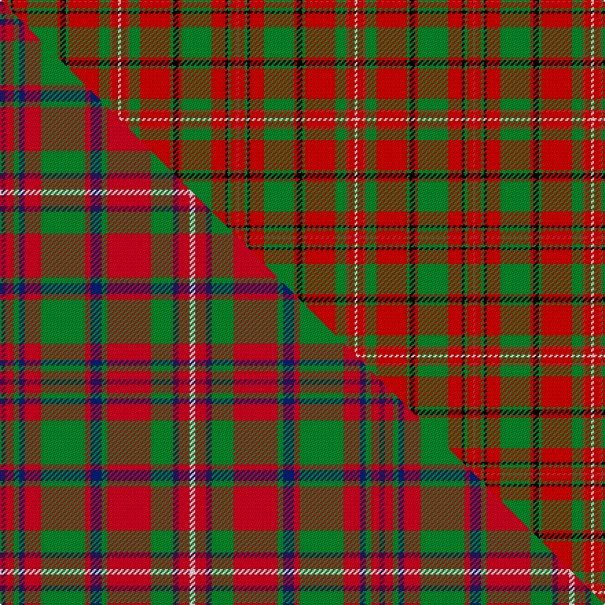

This page is one **sett** — a single exact thread-count. It belongs to the [tartan](/setts/r1ri2g1k1ri5g11ri1k2g1ri11g4r1ri2w1/)
(the same proportion at any scale), whose colour order is pattern [RRGKRGRKGRGRRW](/stripes/rrgkrgrkgrgrrw/).

Part of the [MacKinnon](/tartans/mackinnon/) tartan — the named design grouping this sett with its other cloths.

Sourced from register-of-tartans.  It is a [14 stripe tartan](/stripes/stripes14/).

Original link https://www.tartanregister.gov.uk/tartanDetails.aspx?ref=2553

## Register references

External register numbers recorded for this tartan.

- Scottish Register of Tartans: [2553](https://www.tartanregister.gov.uk/tartanDetails.aspx?ref=2553)
- Scottish Tartans World Register: 1642

## Thread count
R/2 Ri4 G2 K2 Ri10 G22 Ri2 K4 G2 Ri22 G8 R2 Ri4 W/2

One full sett is **172 threads**.

## Palette
<table><thead><tr><th>Colour</th><th>Shade</th><th>OKLCh</th></tr></thead><tbody><tr><td>G</td><td><code style="background-color:#008B2A;">#008B2A</code> <small style="color:#888">#008B2A</small></td><td><small style="color:#888">oklch(55.4% 0.170 145.9)</small></td></tr><tr><td>K</td><td><code style="background-color:#000000;">#000000</code> <small style="color:#888">#000000</small></td><td><small style="color:#888">oklch(0.0% 0.000 0.0)</small></td></tr><tr><td>W</td><td><code style="background-color:#F7F7F7;">#F7F7F7</code> <small style="color:#888">#F7F7F7</small></td><td><small style="color:#888">oklch(97.6% 0.000 89.9)</small></td></tr><tr><td>R</td><td><code style="background-color:#C82828;">#C82828</code> <small style="color:#888">#C82828</small></td><td><small style="color:#888">oklch(54.2% 0.196 26.8)</small></td></tr><tr><td>R</td><td><code style="background-color:#DC0000;">#DC0000</code> <small style="color:#888">#DC0000</small></td><td><small style="color:#888">oklch(56.2% 0.230 29.2)</small></td></tr></tbody></table>

# Sample pattern

## Compared to the master

This cloth is one sett of its design; the master sett (the exemplar the design is anchored on) is below for comparison.

Its **ΔTartan distance** from the master is **3.63** — the same measure the nearest-tartans table ranks by (0 is identical; a re-scale of the same cloth is near 0, a recolour or a different proportion further).

<figure class="master-compare" style="margin:0">

this sett
master sett ★

<figcaption style="color:#888;font-size:smaller">One weave of this sett against the <a href="/setts/dp2r3g2db2r6g16r2db4g2r16g8dp2r4w2/">master sett ★</a>, split on the diagonal: a shared proportion runs seamlessly across it with only the shades shifting; a different proportion breaks on it.</figcaption>
</figure>

## Nearest tartan variants

The nearest existing variants by ΔTartan distance, with this cloth at the top so the swatches line up against it.

ΔTartan

Threads

Variant

Sett

—

172

<a href="/variants/s14/r1ri2g1k1ri5g11ri1k2g1ri11g4r1ri2w1~x2~r2208029-ri2209032/">MacKinnon #9</a>

<a href="/ttd/edit/#slug=b1r2g1k1r5g11r1k2g1r11g4b1r2w1~x2&amp;base=r1ri2g1k1ri5g11ri1k2g1ri11g4r1ri2w1~x2~r2208029-ri2209032" title="compare in the TTD">1.00</a>

172

<a href="/variants/s14/b1r2g1k1r5g11r1k2g1r11g4b1r2w1~x2/">MacKinnon 2</a>

<a href="/ttd/edit/#slug=r6g4y2g17r2g2r2g8r26g6r4k2r4w6~x2&amp;base=r1ri2g1k1ri5g11ri1k2g1ri11g4r1ri2w1~x2~r2208029-ri2209032" title="compare in the TTD">1.20</a>

340

<a href="/variants/s14/r6g4y2g17r2g2r2g8r26g6r4k2r4w6~x2/">Hay</a>

<a href="/ttd/edit/#slug=dr2r3g2db2r6g16r2db4g2r16g8dr2r4w2~x2&amp;base=r1ri2g1k1ri5g11ri1k2g1ri11g4r1ri2w1~x2~r2208029-ri2209032" title="compare in the TTD">1.22</a>

276

<a href="/variants/s14/dr2r3g2db2r6g16r2db4g2r16g8dr2r4w2~x2/">MacKinnon</a>

<a href="/ttd/edit/#slug=dr2r3g2db2r6g16r2db4g2r16g8dr2r4w2&amp;base=r1ri2g1k1ri5g11ri1k2g1ri11g4r1ri2w1~x2~r2208029-ri2209032" title="compare in the TTD">1.22</a>

138

<a href="/variants/s14/dr2r3g2db2r6g16r2db4g2r16g8dr2r4w2/">MacKinnon</a>

<a href="/ttd/edit/#slug=dr2r4g2db2r6g14r2db2g2r12g7dr2r5w1~x2&amp;base=r1ri2g1k1ri5g11ri1k2g1ri11g4r1ri2w1~x2~r2208029-ri2209032" title="compare in the TTD">1.29</a>

246

<a href="/variants/s14/dr2r4g2db2r6g14r2db2g2r12g7dr2r5w1~x2/">MacDonald of Staffa #5</a>

<a href="/ttd/edit/#slug=r2ri4g2db2ri6g14ri2db2g2ri12g7r2ri5w1~x2~r1506028-ri2008029&amp;base=r1ri2g1k1ri5g11ri1k2g1ri11g4r1ri2w1~x2~r2208029-ri2209032" title="compare in the TTD">1.29</a>

246

<a href="/variants/s14/r2ri4g2db2ri6g14ri2db2g2ri12g7r2ri5w1~x2~r1506028-ri2008029/">MacDonald of Staffa 4</a>

<a href="/ttd/edit/#slug=w3ri5r3g14ri36g3dp8ri3g36ri14dp3g3ri5w3~x2~ri2209032-r2208029&amp;base=r1ri2g1k1ri5g11ri1k2g1ri11g4r1ri2w1~x2~r2208029-ri2209032" title="compare in the TTD">1.37</a>

544

<a href="/variants/s14/w3ri5r3g14ri36g3dp8ri3g36ri14dp3g3ri5w3~x2~ri2209032-r2208029/">MacKinnon #11</a>

<a href="/ttd/edit/#slug=r3k2lb2r2g19r3g2r2db6r2g2r21k2lb2r2g2~x2&amp;base=r1ri2g1k1ri5g11ri1k2g1ri11g4r1ri2w1~x2~r2208029-ri2209032" title="compare in the TTD">1.92</a>

286

<a href="/variants/s16/r3k2lb2r2g19r3g2r2db6r2g2r21k2lb2r2g2~x2/">Stuart/Stewart of Appin #3</a>

<a href="/ttd/edit/#slug=g3w1g6r2dp2r1k2r10g1r2~x8~w4000000-dp1607327&amp;base=r1ri2g1k1ri5g11ri1k2g1ri11g4r1ri2w1~x2~r2208029-ri2209032" title="compare in the TTD">2.14</a>

440

<a href="/variants/s10/g3w1g6r2dp2r1k2r10g1r2~x8~w4000000-dp1607327/">Seton</a>

<a href="/ttd/edit/#slug=g3w1g6r2dp2r1k2r10g1r2~x8&amp;base=r1ri2g1k1ri5g11ri1k2g1ri11g4r1ri2w1~x2~r2208029-ri2209032" title="compare in the TTD">2.19</a>

440

<a href="/variants/s10/g3w1g6r2dp2r1k2r10g1r2~x8/">Seton (Clan)</a>

## Neighbour map

Every grey dot is one of 13620 variants placed by the first two principal components of the ΔTartan feature space (42% of its variance). Red is this tartan; blue dots are its nearest — click one to open its page.

<svg viewBox="0 0 640 380" role="img" style="max-width:100%;height:auto;border:1px solid #e0e0e0;border-radius:4px;display:block" xmlns="http://www.w3.org/2000/svg"><image href="/nn/cloud.v1.png" width="640" height="380"/><a href="/variants/s14/b1r2g1k1r5g11r1k2g1r11g4b1r2w1~x2/"><circle cx="222.4" cy="122.9" r="4" fill="#3465a4"><title>MacKinnon 2</title></circle></a><a href="/variants/s14/r6g4y2g17r2g2r2g8r26g6r4k2r4w6~x2/"><circle cx="242.4" cy="125.2" r="4" fill="#3465a4"><title>Hay</title></circle></a><a href="/variants/s14/dr2r3g2db2r6g16r2db4g2r16g8dr2r4w2~x2/"><circle cx="220.4" cy="166.5" r="4" fill="#3465a4"><title>MacKinnon</title></circle></a><a href="/variants/s14/dr2r3g2db2r6g16r2db4g2r16g8dr2r4w2/"><circle cx="220.4" cy="166.5" r="4" fill="#3465a4"><title>MacKinnon</title></circle></a><a href="/variants/s14/dr2r4g2db2r6g14r2db2g2r12g7dr2r5w1~x2/"><circle cx="253.2" cy="153.4" r="4" fill="#3465a4"><title>MacDonald of Staffa #5</title></circle></a><a href="/variants/s14/r2ri4g2db2ri6g14ri2db2g2ri12g7r2ri5w1~x2~r1506028-ri2008029/"><circle cx="261.2" cy="155.8" r="4" fill="#3465a4"><title>MacDonald of Staffa 4</title></circle></a><a href="/variants/s14/w3ri5r3g14ri36g3dp8ri3g36ri14dp3g3ri5w3~x2~ri2209032-r2208029/"><circle cx="256.3" cy="136.4" r="4" fill="#3465a4"><title>MacKinnon #11</title></circle></a><a href="/variants/s16/r3k2lb2r2g19r3g2r2db6r2g2r21k2lb2r2g2~x2/"><circle cx="214.8" cy="107.6" r="4" fill="#3465a4"><title>Stuart/Stewart of Appin #3</title></circle></a><a href="/variants/s10/g3w1g6r2dp2r1k2r10g1r2~x8~w4000000-dp1607327/"><circle cx="207.0" cy="122.9" r="4" fill="#3465a4"><title>Seton</title></circle></a><a href="/variants/s10/g3w1g6r2dp2r1k2r10g1r2~x8/"><circle cx="218.0" cy="149.2" r="4" fill="#3465a4"><title>Seton (Clan)</title></circle></a><circle cx="226.1" cy="123.2" r="5" fill="#c00000"/><text x="320" y="376" text-anchor="middle" font-size="11" fill="#999">ground</text><text x="11" y="190" text-anchor="middle" font-size="11" fill="#999" transform="rotate(-90 11 190)">complexity</text></svg>

ID: /variants/s14/r1ri2g1k1ri5g11ri1k2g1ri11g4r1ri2w1~x2~r2208029-ri2209032/
